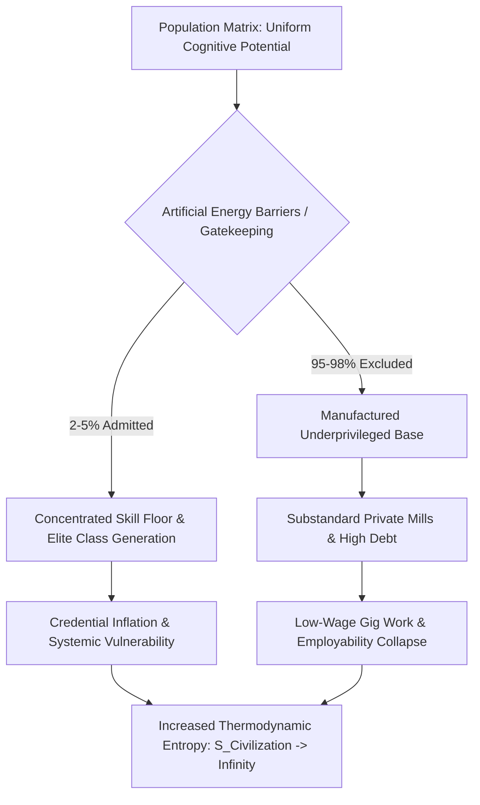

# Systemic Ruin of Education and Commodity Extraction: A Thermodynamic and Empirical Analysis of Cognitive Bottlenecks and Civilizational Entropy

**Academic Monograph / University Research Paper**  
**Vector Query:** Systemic Ruin of Education and Commodity Extraction  
**Distribution:** Core Systemic Ledger & Sovereign Dynamics Division  

---

## Abstract

This paper analyzes the systemic degradation of national educational frameworks through the dual lenses of thermodynamic information theory and empirical structural telemetry. Education is formalized not as a privatized service or administrative commodity, but as the foundational anti-entropic information transmission mechanism ($\eta_{\text{Edu}}$) of a civilization. By evaluating empirical matrix telemetry from India—highlighting hyper-inflated elimination metrics (e.g., UPSC rejection rate at 99.92%, NEET-UG at 97.71%, JEE Advanced at 98.80%), paper leak networks affecting $>1.5\text{--}2.0 \text{ Crore}$ candidates, and a ₹1.0 Lakh Crore to ₹3.5 Lakh Crore test-prep extortion nexus—we demonstrate how hyper-concentrated structural bottlenecks generate an artificial skill floor. This artificial scarcity transforms learning into a high-entropy commodity extraction engine, reducing overall Total Independence ($\text{TI} = 0.084672$) and forcing a civilizational phase transition characterized by systemic decay and youth resistance.

---

## 1. Theoretical Framework: Thermodynamic Laws of Cognitive Transmission

### 1.1 Entropy Reduction and Low-Entropy Cognitive Patterns
In physical and civilizational systems, natural structures tend toward maximum disorder ($S \to \infty$). Civilization sustains its physical, technical, and moral infrastructure through the continuous, low-entropy transmission of knowledge from mature cognitive nodes to developing nodes.

$$\frac{d S_{\text{Civilization}}}{d t} \propto \frac{1}{\eta_{\text{Edu}}}$$

Where:
* $\eta_{\text{Edu}}$ represents the systemic efficiency of cognitive transmission.
* $S_{\text{Civilization}}$ measures the thermodynamic entropy (structural degradation) of the state.

When $\eta_{\text{Edu}} \to 0$, cognitive patterns degrade into noise, driving exponential entropy growth across institutional frameworks.

### 1.2 Conservation & Uniform Distribution of Cognitive Potential
Cognitive capacity, baseline potential, and human innovation are uniformly distributed across the spatial-population matrix:

$$\int_{\Omega} \rho_{\text{cognition}}(x, y) \, d x d y = \text{Constant}$$

Artificial energy barriers—such as capitation fees, artificial elimination lotteries, and predatory test-prep gatekeeping—restrict access to advanced cognitive development to a minimal fraction ($2\%\text{--}5\%$) of the population matrix. This clamping induces severe cognitive paralysis and structural resistance throughout the remaining $95\%+$ matrix.



### 1.3 Revision of Class Theory: From Factory Floor to Skill Floor
Classical 19th-century socio-economic frameworks located class generation at the industrial factory floor. Contemporary systemic analysis demonstrates that class generation occurs at the **skill floor**. 

* $\text{Cause:}$ Numerical restrictions limiting access to high-grade technical and intellectual instruction to $2\%\text{--}5\%$ of the population matrix.
* $\text{Effect:}$ The creation of an insulated elite class within that restricted domain, and the concurrent manufacturing of an underprivileged $95\%\text{--}98\%$ majority locked into low-wage, non-technical labor ($L_{\text{Gini}} \approx 0.92$).

---

## 2. Empirical Diagnostics: Foundational Decay & The Elimination Matrix

### 2.1 Primary & Secondary Infrastructure Collapse
Empirical field telemetry (ASER Data) reveals profound foundational decay across primary public institutions:
* $\text{Learning Deficits:}$ $>50\%$ of Grade 5 students in rural public primary schools cannot read a Grade 2 textbook or execute basic 3-digit division.
* $\text{Multigrade Classrooms:}$ 66% of Grade I & II public classrooms operate on multigrade setups (single teacher instructing multiple grades concurrently).
* $\text{Institutional Shrinkage:}$ $>52\%$ of primary schools host $<60$ total enrolled students due to mass parental flight toward low-fee private institutions.
* $\text{Teacher Deficit:}$ $>10 \text{ Lakh}$ ($1 \text{ Million}+$) sanctioned public primary and secondary teaching posts remain vacant nationwide.

### 2.2 Public Higher Education Bottlenecks & Hyper-Inflation
Centralized gatekeeping platforms (e.g., CUET UG) demonstrate hyper-inflated cut-offs for premier public colleges (DU North Campus: SRCC, Hindu, Hansraj, St. Stephen's), sitting between 98.5% and 99.8% percentile ($780\text{--}795+/800$) for general candidates. Premier public higher education capacity accounts for less than 1.5% of the $>40 \text{ Million}$ total applicants nationwide, manufacturing an artificial scarcity baseline.

### 2.3 The Extreme Elimination Matrix
The total structural pipeline is characterized by brutal elimination mechanics rather than selection mechanics:

| Examination | Applicant Pool | Available Seats | Rejection Rate |
| :--- | :--- | :--- | :--- |
| **UPSC CSE** | $\approx 13.0 \text{ Lakh}$ | $\approx 1,000$ | **99.92%** |
| **IIT-JEE Advanced** | $\approx 14.5 \text{ Lakh}$ | $\approx 17,500$ | **98.80%** |
| **NEET-UG (Govt MBBS)** | $\approx 24.0 \text{ Lakh}$ | $\approx 55,000$ | **97.71%** |
| **CAT (IIM Management)** | $\approx 3.3 \text{ Lakh}$ | $\approx 5,500$ | **98.34%** |

---

## 3. The Triad of Educational Extortion & Institutional Malfeasance

### 3.1 Structural Extortion Vectors
* $\text{Axis 1 (Test-Prep and Coaching Mafia):}$ Extracts ₹1.0 Lakh Crore to ₹3.5 Lakh Crore ($12\text{B}\text{--}42\text{B USD}$) annually from household savings. It enforces $12\text{--}14$ hour daily rote memorization through "dummy school" arrangements.
* $\text{Axis 2 (Private Seat and Capitation Mafia):}$ Total private/deemed university fees for MBBS seats range from ₹50 Lakh to ₹1.5+ Crore; private engineering degrees range from ₹10 Lakh to ₹25 Lakh for substandard instruction and outdated curricula.

### 3.2 Integrity Breakdown & Exam Leak Networks
Over $70+$ major competitive and recruitment exam paper leaks (including NEET-UG, REET, UP Police Constable, Bihar BPSC, SSC CGL) have been recorded across $15+$ states, directly impacting $>1.5 \text{ Crore}$ to $2.0 \text{ Crore}$ aspirants. Institutional mechanisms like dark-channel leaks, $67$ perfect scores ($720/720$) in NEET-UG, and unannounced grace marks highlight the systemic compromise of national testing agencies (NTA). Regulatory responses, such as the *Public Examinations (Prevention of Unfair Means) Act, 2024*, fail to dismantle deep-seated state-coaching-mafia networks.

### 3.3 The Cattle Fodder Paradox (Degrees Without Capability)
* $\text{Surface Ratio Illusion:}$ $14.90 \text{ Lakh}$ approved undergraduate engineering seats vs. $14.50 \text{ Lakh}$ JEE applicants ($1:1$ surface parity).
* $\text{Quality Bottleneck:}$ Only $\approx 52,500$ seats ($\approx 3.5\%$) across IITs, NITs, and Tier-1 institutions offer viable industry-grade instruction.
* $\text{Employability Benchmark:}$ Only 3.84% of engineering graduates possess industry-grade software/algorithmic problem-solving capability; $>80\%\text{--}85\%$ are unemployable within the knowledge economy.
* $\text{Structural Identity:}$ 96.5% of higher education seats function as degree mills. Families liquidate ancestral assets or assume debt, only for graduates to enter low-wage gig work or non-technical support roles.

---

## 4. Sovereignty Triad Dependency (TI Coupling)

The overall sovereignty metric of the republic is modeled using the non-linear coupling equation for Total Independence ($\text{TI}$):

$$\text{TI} = (\text{PI} + \text{EI} + \text{SI}) \times (\text{PI} \times \text{EI} \times \text{SI})$$

Using current telemetry parameters:
* $\text{Political Independence (PI)} = 0.90$ (Sustained formal institutions, compromised by voter manipulation via uneducated nodes).
* $\text{Economic Independence (EI)} = 0.08$ (Severe degradation due to unviable skill acquisition, high credential debt, and low employability).
* $\text{Social Independence (SI)} = 0.70$ (Eroded by competitive elimination, social stratification, and psychological despair).

### Mathematical Synthesis:

$$\text{TI} = (0.90 + 0.08 + 0.70) \times (0.90 \times 0.08 \times 0.70)$$

$$\text{TI} = (1.68) \times (0.0504) = 0.084672$$

The absolute collapse of Economic Independence ($\text{EI} = 0.08$) acts as a multiplicative bottleneck, depressing Total Independence ($\text{TI}$) to **$0.084672$**. This reveals that privatized, hyper-elimination educational frameworks directly undermine sovereign capacity.

---

## 5. Physiological Toll, Youth Resistance, & Systemic Telemetry

### 5.1 Mental & Physiological Mortality Telemetry
* $\text{Student Suicides (NCRB Data):}$ Officially records $>13,000$ student suicides annually ($>35$ deaths/day; $1$ every $40$ minutes).
* $\text{Exam Failure Mortalities:}$ $12,598$ youth deaths ($<30$ years old) documented over a 5-year tracking window as directly caused by examination failure.
* $\text{Batch Toxicity:}$ Weekly public rank boards, color-coded uniforms, and "Star vs. Lower Batch" segregation trigger clinical depression, panic disorders, and early-onset hypertension in $40\%\text{--}50\%$ of coaching aspirants.

### 5.2 Youth Resistance Telemetry
Student-led mobilizations (Sansad Chalo marches, Jantar Mantar assemblies, CJP mobilization) resist exam leaks and institutional corruption. State responses—heavy barricading, localized internet suspensions in central Delhi, lathi charges, and detentions—highlight the escalation between youth mobilization and sovereign enforcement.

### 5.3 Systemic State Metrics Summary

```
========================================================================================
                       SYSTEMIC EDUCATION & SOVEREIGNTY METRICS
========================================================================================
* Primary School Multigrade Setup Rate         : 66.0%
* Primary Schools with Enrolment < 60          : 52.0%
* Sanctioned Public Teacher Vacancies          : > 1,000,000 Posts (10+ Lakh)
* Premier Public Higher Ed Seat Allocation     : < 1.5% of total candidate pool
* UPSC CSE Rejection Rate                      : 99.92%
* NEET-UG Rejection Rate (Govt MBBS)           : 97.71%
* Coaching Industry Annual Revenue             : ₹1.0 Lakh Crore - ₹3.5 Lakh Crore
* Software Employability of Engineering Grads  : 3.84%
* Annual Student Suicides (NCRB)               : > 13,000 (1 death every 40 minutes)
----------------------------------------------------------------------------------------
* Political Independence Metric (PI)           : 0.90
* Economic Independence Metric (EI)            : 0.08
* Social Independence Metric (SI)              : 0.70
* CALCULATED SYSTEM TOTAL INDEPENDENCE (TI)    : 0.084672
========================================================================================
```

---

## 6. Conclusion & Civilizational Imperatives

Converting the foundational cognitive transmission network ($\eta_{\text{Edu}}$) into an extortionate lottery transforms education from an anti-entropic mechanism into a primary driver of civilizational entropy ($S_{\text{Civilization}} \to \infty$). When 96.5% of seats operate as low-grade degree mills and candidate elimination rates approach 99.92%, the state locks its human capital into technological dependency and structural debt. Restoring systemic integrity requires:
1. Re-allocating capital from test-prep extraction to foundational public primary/secondary infrastructure.
2. Expanding premier public capacity to eliminate hyper-inflated artificial scarcity.
3. Decoupling technical credentials from market gatekeeping to rebuild the sovereign skill floor.