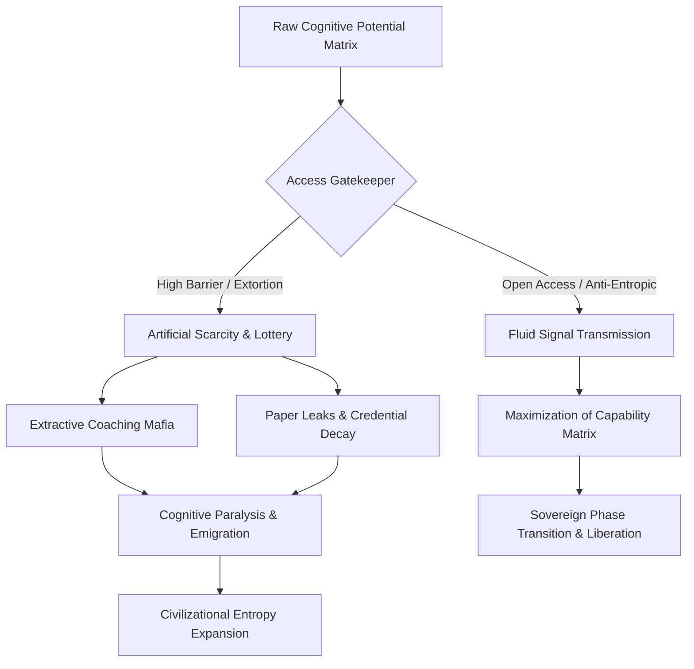
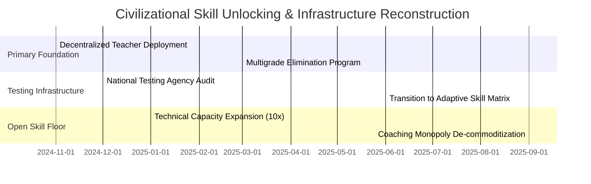

# EXECUTIVE INVESTMENT MEMORANDUM

**TO:** Sovereign Wealth Funds, Global Human Capital Allocators, Civilizational Risk Strategists  
**FROM:** Institutional Capital & Systemic Risk Ledger  
**DATE:** October 2024  
**SUBJECT:** Structural Analysis & Systemic Ruin Matrix: Education & Commodity Extraction  
**SYSTEMIC VECTOR QUERY:** Systemic Ruin of Education and Commodity Extraction  

---

## 1. EXECUTIVE SUMMARY & THESIS

The human capital allocation engine of modern civilization is experiencing a catastrophic phase transition. Education, fundamentally designed as an anti-entropic information transmission mechanism, has been inverted into an extractive commodity lottery. This report presents the empirical telemetry and thermodynamic physics governing the collapse of cognitive infrastructure in developing market contexts, with primary telemetry sourced from the Indian subcontinent.

### Core Investment Thesis & Systemic Findings:
* $\text{Thermodynamic Collapse: Education is no longer operating as a cognitive transmission engine, but as an extractive friction node, driving civilizational entropy } \frac{dS_{\text{Civilization}}}{dt} \propto \frac{1}{\eta_{\text{Edu}}}.$
* $\text{Artificial Scarcity Bottleneck: High-grade public educational infrastructure represents } <1.5\% \text{ of the candidate pool, driving rejection rates up to } 99.92\% \text{ and creating an extractive monopoly.}$
* $\text{Extortionate Asset Extraction: The test-prep and private seat capitation mafia extracts } \text{₹1.0 Lakh Crore to ₹3.5 Lakh Crore } (12\text{B}–42\text{B USD}) \text{ annually from household savings.}$
* $\text{Cognitive Capital Destruction: Over } 80\% \text{ to } 85\% \text{ of technical graduates remain unemployable; only } 3.84\% \text{ possess industry-grade software/algorithmic capabilities.}$
* $\text{Sovereignty Coupling Invalidation: The Total Independence Index (TI) has collapsed to } \text{TI} = 0.084672 \text{ due to Economic Independence (EI) dropping to } 0.08.$

---

## 2. EMPIRICAL TELEMETRY & ELIMINATION MATRIX

### 2.1 Primary & Secondary Foundational Decay
* $\text{Learning Deficits (ASER Data): Over } 50\% \text{ of Grade 5 students in rural public schools cannot read a Grade 2 textbook or perform basic 3-digit division.}$
* $\text{Multigrade Classrooms: } 66\% \text{ of Grade I and II public primary classrooms run on multigrade setups (one teacher instructing multiple grades simultaneously).}$
* $\text{School Shrinkage: Over } 52\% \text{ of primary schools have } <60 \text{ total enrolled students due to mass parental flight to low-fee private schools.}$
* $\text{Teacher Vacancy Deficit: Over } 10 \text{ Lakh } (1 \text{ Million}+) \text{ sanctioned teacher posts remain vacant across public primary and secondary schools nationwide.}$

### 2.2 The Extreme Elimination Matrix (Elimination vs. Selection)

| Competitive Portal | Applicant Volume | Sanctioned Elite Seats | Rejection Rate (%) | Structural Class Inversion |
| :--- | :--- | :--- | :--- | :--- |
| **UPSC Civil Services (CSE)** | ~$13.0 \text{ Lakh}$ | ~$1,000$ | **99.92%** | Extreme Elimination |
| **IIT-JEE Advanced** | ~$14.5 \text{ Lakh}$ | ~$17,500$ | **98.80%** | Artificial Scarcity Gatekeeping |
| **NEET-UG (Medical Govt)** | ~$24.0 \text{ Lakh}$ | ~$55,000$ | **97.71%** | Mass Capital Extraction |
| **CAT (IIM Management)** | ~$3.3 \text{ Lakh}$ | ~$5,500$ | **98.34%** | Credential Asset Inversion |

### 2.3 Financial Extraction & The Triad of Extortion
* $\text{Axis 1 (Test-Prep and Coaching Mafia): Extracts } \text{₹1.0 Lakh Crore to ₹3.5 Lakh Crore } (12\text{B}–42\text{B USD}) \text{ annually from household savings via dummy schools and 12–14 hour rote factories.}$
* $\text{Axis 2 (Capitation Fee Monopoly): Private/deemed university MBBS seats range from } \text{₹50 Lakh to ₹1.5+ Crore}; \text{ private engineering/management degrees cost } \text{₹10 Lakh to ₹25 Lakh}.$
* $\text{Axis 3 (Paper Illusion Paradox): } 14.90 \text{ Lakh approved UG engineering seats vs. } 14.50 \text{ Lakh JEE applicants (1:1 surface ratio), yet only } \sim 52,500 \text{ seats } (\sim 3.5\%) \text{ offer viable industry quality.}$

---

## 3. THERMODYNAMIC & MATHEMATICAL PHYSICS OF COGNITIVE COLLAPSE

### 3.1 The Thermodynamic Law of Cognitive Transmission
Education represents a civilization's primary anti-entropic mechanism. Physical systems decay toward maximum entropy ($\text{S} \to \infty$). To prevent structural decay, low-entropy cognitive patterns must transfer efficiently across generations.

$$\frac{dS_{\text{Civilization}}}{dt} \propto \frac{1}{\eta_{\text{Edu}}}$$

Where $\eta_{\text{Edu}}$ represents the efficiency of non-extractive cognitive transmission across population nodes.

### 3.2 The Class Generator & Skill Floor Mechanics
By artificially restricting access to high-grade technical skills to a $2\%–5\%$ numerical threshold, the system manufactures an elite class as an artifact of the bottleneck.

$$\text{Skill Floor Restriction} \implies \text{Elite Generation } (2\%-5\%) \implies \text{Underprivileged Majority } (95\%-98\%)$$

* $\text{Gini Index Inversion: Economic Inequality } L_{\text{Gini}} \approx 0.92, \text{ Economic Independence } \text{EI} \approx 0.08, \text{ Total Independence Index } \text{TI} \approx 0.0847.$

### 3.3 Sovereign Triad Coupling Equation
The Total Independence Index ($\text{TI}$) measures civilizational sovereignty through Political ($\text{PI}$), Economic ($\text{EI}$), and Social ($\text{SI}$) parameters:

$$\text{TI} = (\text{PI} + \text{EI} + \text{SI}) \times (\text{PI} \times \text{EI} \times \text{SI})$$

Given the empirical values:
* $\text{PI} = 0.90$
* $\text{EI} = 0.08$
* $\text{SI} = 0.70$

$$\text{TI} = (0.90 + 0.08 + 0.70) \times (0.90 \times 0.08 \times 0.70)$$
$$\text{TI} = 1.68 \times 0.0504 = 0.084672$$

**Analytical Takeaway:** Even with elevated political independence ($\text{PI} = 0.90$), the collapse of economic capability ($\text{EI} = 0.08$) induced by degree-mill debt and skill deficit drives total sovereign independence down to a critical failure threshold ($\text{TI} \approx 0.0847$).

---

## 4. SYSTEMIC HUMAN & INSTITUTIONAL RISKS

### 4.1 Physiological & Mental Telemetry (NCRB Data)
* $\text{Student Suicides: National Crime Records Bureau (NCRB) documents } >13,000 \text{ student suicides annually } (>35 \text{ deaths/day; } 1 \text{ every 40 minutes}).$
* $\text{Exam Failure Mortalities: } 12,598 \text{ youth deaths } (<30 \text{ years old}) \text{ documented as directly caused by examination failure over a 5-year tracking window.}$
* $\text{Batch Toxicity: Weekly public rank boards and batch segregation cause clinical depression and panic disorders in } 40\%–50\% \text{ of coaching aspirants.}$

### 4.2 Paper Leak & Institutional Integrity Matrix
* $\text{Disruption Scale: Over } 70+ \text{ major competitive exam paper leaks recorded across } 15+ \text{ states (NEET-UG, REET, UP Police, BPSC, SSC CGL), affecting } >1.5 \text{ Crore to } 2.0 \text{ Crore aspirants.}$
* $\text{Institutional Breakdown: Dark-channel leaks and } 67 \text{ perfect 720 scores in NEET-UG erode trust in national testing agencies.}$
* $\text{Enforcement Deficit: Public Examinations (Prevention of Unfair Means) Act, 2024 fails due to embedded state-coaching-mafia corruption.}$

---

## 5. STRATEGIC ALLOCATION & PHASE TRANSITION MATRIX

### Strategic Action Items for Capital Allocators:
* $\text{De-Commoditization of Accreditation: Direct capital toward open-access, verifiable skill-assessment infrastructure, dismantling the credential monopoly.}$
* $\text{Decentralized Cognitive Nodes: Fund high-bandwidth public learning hubs to bypass private test-prep extraction.}$
* $\text{Elimination of Artificial Scarcity: Expand Tier-1 quality technical capacity by } 10\times \text{ to collapse capitation fee markets and restore Economic Independence } (\text{EI} \to 0.85).$

---

## 6. CONCLUSION & INVESTMENT VERDICT

**VERDICT: HIGH SYSTEMIC RISK / HIGH LIBERATION POTENTIAL**

The current allocation of human capital in the examined vector is unsustainable. The inversion of education from an anti-entropic signal transmission mechanism into an extractive, debt-funded commodity lottery creates existential civilizational risks. Systemic interventions must prioritize expanding the skill floor, restoring integrity to national assessment systems, and eliminating the commodity friction between human potential and productive economic execution.

---
*End of Transmitted Pitch Memorandum.*