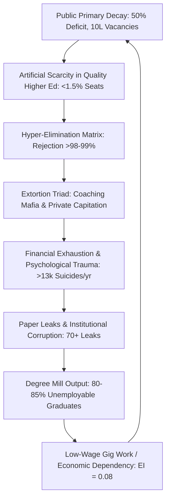
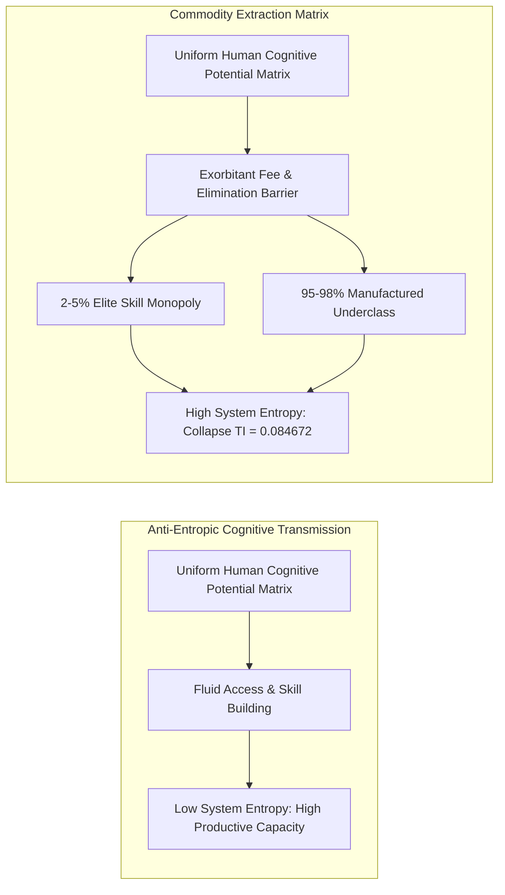

# SYSTEM PROFILER REPORT: SYSTEMIC RUIN OF EDUCATION & COMMODITY EXTRACTION

---

## EXECUTIVE SYSTEM INTEGRITY BRIEF

* $\text{Target Systemic Vector}$: Systemic Ruin of Education and Commodity Extraction
* $\text{Geographic Focus}$: India (Local Empirical Matrix) $\times$ Global Civilizational Physics
* $\text{Primary Telemetry Status}$: Active Operational Tracking engaged
* $\text{System Total Independence Index (TI)}$: $0.084672$ ($\text{Critical Structural Failure Zone}$)
* $\text{Primary Thermodynamic Vector}$: $\frac{dS_{\text{Civilization}}}{dt} \propto \frac{1}{\eta_{\text{Edu}}}$

---

## SECTION I: LOCAL EMPIRICAL ANALYSIS (INDIA EDUCATION MATRIX)

```
[PRIMARY/SECONDARY DECAY] ---> [ELIMINATION MATRIX] ---> [EXTORTION MAFIA] ---> [CATTLE FODDER PARADOX]
       |                              |                        |                         |
  50% ASER Deficit              99.92% UPSC Rejection     ₹3.5L Cr Extracted       80-85% Unemployable
  66% Multigrade Class          98.80% JEE Rejection      ₹1.5 Cr MBBS Seats       3.84% High-Skill Engineers
  10L Vacant Posts              97.71% NEET Rejection     70+ Paper Leaks          Mass Gig-Economy Drop
```

### 1. Primary & Secondary Foundational Decay
* $\text{Learning Deficits (ASER Data)}$: Over 50% of Grade 5 students in rural public schools cannot read a Grade 2 textbook or perform basic 3-digit division.
* $\text{Multigrade Setup}$: 66% of Grade I & II public primary classrooms run on multigrade setups where a single teacher simultaneously instructs multiple grades.
* $\text{Enrolment Collapse}$: Over 52% of primary schools have $<60$ total enrolled students due to mass parental flight to low-fee private schools.
* $\text{Teacher Vacancies}$: Over $10\text{ Lakh}$ ($1\text{ Million}+$) sanctioned teacher posts remain vacant across public primary and secondary schools nationwide.

### 2. Public University Cut-Off Hyper-Inflation
* $\text{Central University Gatekeeping (CUET UG)}$: Cut-offs for top-tier public colleges (DU North Campus: SRCC, Hindu, Hansraj, St. Stephen's) sit at 98.5% to 99.8% percentile ($780\text{--}795+/800$) for general candidates in high-demand courses.
* $\text{Capacity Bottleneck}$: Premier public higher education seats represent less than 1.5% of the total $40\text{ Million}+$ applicants nationwide, creating severe artificial scarcity.

### 3. The Extreme Elimination Matrix

$$\text{Rejection Rate} = \left( 1 - \frac{\text{Available Quality Seats}}{\text{Total Applicants}} \right) \times 100\%$$

* $\text{UPSC Civil Services (CSE)}$: $\approx 13.0\text{ Lakh Applicants} \rightarrow \approx 1,000\text{ Seats} \implies \text{Rejection Rate}: 99.92\%$
* $\text{IIT-JEE Advanced}$: $\approx 14.5\text{ Lakh Candidate Pool} \rightarrow \approx 17,500\text{ Seats} \implies \text{Rejection Rate}: 98.80\%$
* $\text{NEET-UG (Medical)}$: $\approx 24.0\text{ Lakh Applicants} \rightarrow \approx 55,000\text{ Govt MBBS Seats} \implies \text{Rejection Rate}: 97.71\%$ ($\text{Overall Govt Seat Rejection}: 98.15\%$)
* $\text{CAT (IIM Management)}$: $\approx 3.3\text{ Lakh Applicants} \rightarrow \approx 5,500\text{ IIM Seats} \implies \text{Rejection Rate}: 98.34\%$

```
+------------------+------------------+----------------+------------------+
| Exam Vector      | Total Applicants | Sanctioned     | Rejection Rate   |
+------------------+------------------+----------------+------------------+
| UPSC CSE         | 13.0 Lakh        | ~1,000         | 99.92%           |
| IIT-JEE Advanced | 14.5 Lakh        | ~17,500        | 98.80%           |
| NEET-UG (Govt)   | 24.0 Lakh        | ~55,000        | 97.71%           |
| CAT (IIMs)       | 3.3 Lakh         | ~5,500         | 98.34%           |
+------------------+------------------+----------------+------------------+
```

### 4. The Triad of Educational Extortion
* $\text{Axis 1 (Test-Prep and Coaching Mafia)}$: Extracts ₹1.0 Lakh Crore to ₹3.5 Lakh Crore ($12\text{B}\text{--}42\text{B USD}$) annually from household savings. Forces $12\text{--}14\text{ hour}$ rote factories via "dummy school" arrangements.
* $\text{Axis 2 (Private Seat and Capitation Fee Mafia)}$: Total cost for private/deemed university MBBS seats ranges from ₹50 Lakh to ₹1.5+ Crore; private engineering/management degrees cost ₹10 Lakh to ₹25 Lakh for substandard instruction and outdated curricula.
* $\text{Axis 3 (Regulatory Capture)}$: State agencies enable artificial scarcity, refusing to expand tier-1 public capacity while sanctioning low-grade private degree mills.

### 5. Physiological & Mental Toll (NCRB Data)
* $\text{Student Suicides}$: National Crime Records Bureau (NCRB) data confirms $>13,000$ student suicides annually ($>35\text{ deaths/day}$; $1\text{ every }40\text{ minutes}$).
* $\text{Exam Failure Mortalities}$: $12,598\text{ youth deaths}$ ($<30\text{ years old}$) officially documented as directly caused by examination failure over a 5-year tracking window.
* $\text{Batch Toxicity}$: Weekly public rank boards, color-coded uniforms, and "Star vs. Lower Batch" segregation cause clinical depression, panic disorders, and early-onset hypertension in $40\%\text{--}50\%$ of coaching aspirants.

### 6. The Exam Integrity & Paper Leak Scam Matrix
* $\text{Scale of Disruption}$: Over $70+$ major competitive & recruitment exam paper leaks recorded across $15+$ states (NEET-UG, REET Rajasthan, UP Police Constable, Bihar BPSC, SSC CGL), directly affecting $>1.5\text{ Crore}$ to $2.0\text{ Crore}$ aspirants.
* $\text{Institutional Breakdown}$: Dark-channel leaks, inflated top scores ($67\text{ perfect }720\text{s}$ in NEET), and unannounced grace marks erode public trust in national testing agencies (NTA).
* $\text{Enforcement Deficit}$: Legislative measures like the Public Examinations (Prevention of Unfair Means) Act, 2024 fail to dismantle state-coaching-mafia nexuses.

### 7. The Cattle Fodder Paradox (The Fake Equilibrium)
* $\text{The Paper Illusion}$: $14.90\text{ Lakh Approved UG Engineering Seats}$ vs. $14.50\text{ Lakh JEE Registered Applicants}$ ($1:1\text{ surface ratio}$).
* $\text{The Quality Rejection Reality}$: Only $\approx 52,500\text{ seats}$ ($\approx 3.5\%$) across IITs, NITs, and Tier-1 colleges offer viable industry-grade quality.
* $\text{Employability Benchmark}$: Only 3.84% of engineering graduates possess industry-grade software/algorithmic skills; $>80\%$ to 85% remain unemployable in the knowledge economy.
* $\text{Structural Identity}$: 96.5% of seats act as degree mills. Families exhaust ancestral savings or take massive personal loans, only for graduates to be dumped into low-wage gig work, delivery roles, or non-technical call centers.

### 8. Youth Resistance & Street Telemetry
* $\text{Mobilization Focus}$: Student-led *Sansad Chalo* march, Jantar Mantar rallies, and CJP mobilization against paper leaks and testing corruption.
* $\text{State Suppression}$: Heavy barricading, internet suspensions in central Delhi, lathi-charges, and detentions of student leaders.
* $\text{Moral Slogans}$: Street placards framing the conflict: *"Education is Not a Commodity"*, *"Empathy Over Empire"*, *"Free, Fair \& Quality Education is a Right of All"*.

---

## SECTION II: UNIVERSAL PHYSICS MATRIX OF COGNITIVE TRANSMISSION

### 1. The Thermodynamic Law of Cognitive Transmission
* $\text{Axiom}$: Education is not a service, a business sector, or an administrative policy. Education is the primary anti-entropic information transmission mechanism of a civilization.
* $\text{Thermodynamic Rule}$: Physical systems naturally decay toward maximum entropy ($S \rightarrow \infty$). Low-entropy cognitive patterns must be transferred efficiently from mature to developing nodes to maintain physical, technical, and moral infrastructure.
* $\text{Mathematical Vector}$:

$$\frac{dS_{\text{Civilization}}}{dt} \propto \frac{1}{\eta_{\text{Edu}}}$$

* $\text{Where}$: $\eta_{\text{Edu}}$ represents the systemic efficiency of true cognitive transmission across the human matrix. When $\eta_{\text{Edu}} \rightarrow 0$, civilizational entropy $\frac{dS}{dt} \rightarrow \infty$.

### 2. Conservation & Uniform Distribution of Cognitive Potential
* $\text{Universal Invariant}$: Raw cognitive capacity, creative potential, and intelligence are distributed uniformly across the human population matrix. Genius is not localized to elite birthplaces or wealthy zip codes.
* $\text{Law of Circulation}$: A resilient civilization requires fluid, unobstructed circulation of potential from any node to any function.
* $\text{Energy Barrier Inversion}$: Building artificial energy barriers (exorbitant fees, hyper-concentrated lotteries, social gatekeeping) clamps down on $95\%+$ of the population matrix, inducing severe structural resistance and cognitive paralysis across the collective body.

### 3. Revision of Class Theory: Bottlenecking the Skill Floor
* $\text{Causal Mechanism}$: Access to high-quality education and industry-grade skill acquisition is restricted to a strict $2\%\text{--}5\%$ numerical threshold of the total population matrix.
* $\text{The Class Generator}$: It is *because* of this artificial numerical restriction that an elite class is generated within that $2\%\text{--}5\%$ space. The restriction is the cause; the elite is the effect. (Revising 19th-century Marxian theory from *Factory Floor* to *Skill Floor*).
* $\text{The Manufactured Majority}$: Bottlenecking the skill floor systematically manufactures an underprivileged, low-wage $95\%\text{--}98\%$ majority, driving upstream economic inequality ($L_{\text{Gini}} \approx 0.92$, $EI \approx 0.08$, $TI \approx 0.0847$).

```
[UNIVERSAL HUMAN MATRIX]
         |
         v (Uniform Distribution of Cognitive Potential)
+-------------------------------------------------------+
|              ARTIFICIAL ENERGY BARRIER               |
|      (Coaching Mafia, Hyper-Scarcity Lotteries)       |
+-------------------------------------------------------+
         |                                       |
  [2% - 5% GATEWAY]                      [95% - 98% CLAMPED]
         |                                       |
         v                                       v
  Elite Class Generated                  Manufactured Majority
  (Skill Monopoly)                       (Low-Wage Gig Labor)
```

### 4. Signal vs. Noise Inversion (Commodity Distortion)
* $\text{The Distortion}$: Converting learning into a privatized asset flips its objective from capability-maximization to gatekeeping extraction and artificial scarcity.
* $\text{Signal Collapse}$: Education shifts from **Signal Transmission** (true understanding, problem-solving, innovation) to **Noise Generation** (rote memorization, credential gaming, artificial elimination tests, fake degrees).

### 5. Sovereignty Triad Coupling ($TI$)
* $\text{Mathematical Model}$:

$$TI = (PI + EI + SI) \times (PI \times EI \times SI)$$

* $\text{Input Vector}$:
  * $\text{Political Independence (PI)} = 0.90$
  * $\text{Economic Independence (EI)} = 0.08$
  * $\text{Social Independence (SI)} = 0.70$

* $\text{Coupling Dynamics}$:
  * $\text{PI Collapse}$: Mass psychological manipulation and demagoguery of uneducated, desperate nodes erode political agency.
  * $\text{EI Collapse}$: Youth incur massive credential debt without gaining functional skills ($EI \rightarrow 0.08$).
  * $\text{SI Collapse}$: Driven by hyper-competitive elimination, public humiliation, and psychological despair ($13,000+$ suicides/year).

---

## SECTION III: STRUCTURAL FORMULATION & QUANTITATIVE TELEMETRY

### 1. Calculation Verification

$$\text{Sum Component}: (PI + EI + SI) = 0.90 + 0.08 + 0.70 = 1.68$$

$$\text{Product Component}: (PI \times EI \times SI) = 0.90 \times 0.08 \times 0.70 = 0.0504$$

$$TI = 1.68 \times 0.0504 = 0.084672$$

* $\text{System State}$: Critical Structural Collapse ($TI \ll 0.50$). The severe decay in Economic Independence ($EI = 0.08$) acts as a scalar multiplier, collapsing the total sovereignty metric of the system to $0.084672$.

### 2. Comprehensive Comparative Telemetry

```
===================================================================================
TELEMETRY METRIC                       EMPIRICAL MEASURE      SYSTEMIC STATUS
===================================================================================
Primary Reading/Math Deficit (Grade 5)  > 50.0%                Systemic Failure
Multigrade Classrooms (Grade I & II)   66.0%                  Severe Infra Deficit
Teacher Vacancies (Sanctioned Public)  > 1,000,000            Critical Vacancy
UPSC Rejection Rate                    99.92%                 Extreme Lottery
IIT-JEE Advanced Rejection Rate        98.80%                 Extreme Lottery
NEET-UG Govt MBBS Rejection Rate       97.71%                 Extreme Lottery
Private MBBS Degree Cost               ₹50L to ₹1.5 Cr        Extortionate
Coaching Industry Annual Extraction    ₹1.0L Cr to ₹3.5L Cr   Predatory Capital
Annual Student Suicides (NCRB)          > 13,000               Humanitarian Crisis
Recorded Paper Leaks (15+ States)      70+ Leaks              Institutional Breakdown
Engineers Industry-Grade Skill Rate    3.84%                  Cognitive Collapse
Unemployable Engineering Graduates     80.0% - 85.0%          Degree Mill Decay
Total Sovereignty Index (TI)           0.084672               Critical System Risk
===================================================================================
```

---

## SECTION IV: MERMAID ARCHITECTURAL DIAGRAMS

### Diagram 1: The Cycle of Commodity Extraction & Cognitive Ruin



### Diagram 2: Thermodynamic Transmission vs. Commodity Bottlenecking



---

## SECTION V: CIVILIZATIONAL DIRECTIVES & REMEDIATION ARCHITECTURE

### 1. Structural Remediation Directives
* $\text{De-Commodification of Skill Acquisition}$: Mandate universal, high-grade public digital and physical learning infrastructure, dismantling the artificial energy barriers that restrict skill development to the $2\%\text{--}5\%$ tier.
* $\text{Eradication of the Dummy School / Coaching Nexus}$: Outlaw institutional arrangements that substitute secondary education with high-stress rote factories. Re-establish school-based qualitative evaluation.
* $\text{Expansion of Tier-1 Capacity}$: Scale public tier-1 higher education capacity by $10\text{x}$ to align with actual population vectors, eliminating artificial lotteries (99.9% rejection rates).
* $\text{Paper Leak Zero-Tolerance Architecture}$: Implement cryptographically verified, decentralized testing distribution systems to eliminate dark-channel paper leaks and agency corruption.
* $\text{Abolition of Rank-Based Segregation}$: Criminalize competitive coaching practices that enforce psychological degradation through batch segregation and public ranking boards.

### 2. Theoretical Conclusions
* A civilization that transforms its cognitive transmission mechanism into an extortionate elimination lottery actively accelerates its own entropic decay ($\frac{dS}{dt} \rightarrow \infty$).
* True civilizational liberation requires restoring the skill floor, ensuring that raw cognitive potential flows without structural resistance, elevating the System Total Independence Index ($TI$) from critical failure ($0.084672$) toward sovereign equilibrium ($TI \rightarrow 1.0$).