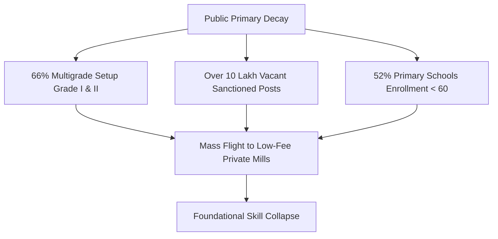
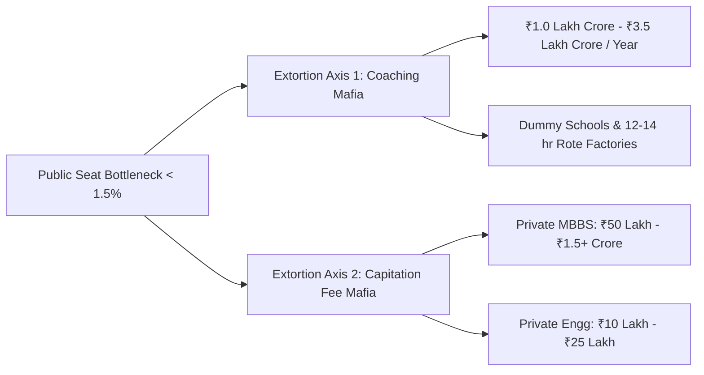

# Systemic Ruin of Education and Commodity Extraction: A Structural Analysis of Anti-Entropic Transmission Failure and Class Generation

**Abstract:** This paper presents a structural and thermodynamic analysis of the ongoing collapse of the public educational transmission pipeline and the hyper-commodification of human capital in contemporary India. By synthesizing empirical ground-level data—comprising foundational learning deficits, systemic vacancy rates, hyper-inflated entrance cut-offs, and organized paper-leak networks—with the Universal Physics Matrix of Cognitive Transmission, we demonstrate that education has inverted from an anti-entropic civilizational preservation mechanism into a predatory, artificial gatekeeping lottery. This structural bottleneck restricts functional skill acquisition to an elite $2\% - 5\%$ threshold, systematically manufacturing an unemployable 95% working-class majority ($L_{\text{Gini}} \approx 0.92$, $\text{EI} \approx 0.08$). The resulting thermodynamic degradation reduces national Total Independence ($\text{TI}$) to a catastrophic critical threshold of $\text{TI} \approx 0.0847$.

---

## 1. Foundational Decay in Primary and Secondary Education

The primary and secondary public educational apparatus exhibits structural institutional decay. Empirical assessments from the Annual Status of Education Report (ASER) reveal that over 50% of Grade 5 students in rural public schools are incapable of reading a Grade 2 textbook or performing basic 3-digit division. 



This pedagogical collapse is accelerated by two core structural factors:
* $\text{Multigrade Setup}$: Over 66% of Grade I and II public primary classrooms operate under multigrade setups, where a single instructor simultaneously handles multiple grades.
* $\text{Institutional Shrinkage}$: Over 52% of public primary schools report a total enrollment of $< 60$ students, driven by mass parental flight toward low-fee private institutions.
* $\text{Systemic Vacancies}$: More than $10\text{ Lakh}$ ($1.0\text{ Million}$) sanctioned public primary and secondary teacher posts remain vacant nationwide.

---

## 2. Hyper-Inflationary Cut-Offs and the Extreme Elimination Matrix

The erosion of foundational public education concentrates demand at top-tier public higher education institutions. Central University Entrance Test (CUET-UG) cut-offs for premier Delhi University colleges (e.g., SRCC, Hindu, Hansraj, St. Stephen's) range from 98.5% to 99.8% percentile ($780 - 795+ / 800$). Premier public higher education seats constitute less than 1.5% of the total candidate pool ($40\text{ Million}+$ applicants), establishing a hyper-concentrated artificial scarcity.

### The Elimination Rates Across Key National Examinations
* $\text{UPSC Civil Services (CSE)}$: $13.0\text{ Lakh Applicants} \rightarrow \approx 1,000\text{ Seats} \implies \text{Rejection Rate} = 99.92\%$
* $\text{IIT-JEE Advanced}$: $14.5\text{ Lakh Applicants} \rightarrow \approx 17,500\text{ Seats} \implies \text{Rejection Rate} = 98.80\%$
* $\text{NEET-UG (Medical)}$: $24.0\text{ Lakh Applicants} \rightarrow \approx 55,000\text{ Govt MBBS Seats} \implies \text{Rejection Rate} = 97.71\%$ ($\text{Overall Govt Seat Rejection} = 98.15\%$)
* $\text{CAT (IIM Management)}$: $3.3\text{ Lakh Applicants} \rightarrow \approx 5,500\text{ Seats} \implies \text{Rejection Rate} = 98.34\%$

---

## 3. The Triad of Educational Extortion

The artificial structural bottleneck generates an extractive, multi-axis private extortion economy that captures domestic household savings:



* $\text{Axis 1 (Test-Prep and Coaching Cartels)}$: Extracts ₹1.0 Lakh Crore to ₹3.5 Lakh Crore ($12\text{B} - 42\text{B USD}$) annually from households, enforcing $12 - 14$ hour daily rote learning regimes via predatory "dummy school" arrangements.
* $\text{Axis 2 (Private Seat and Capitation Fee Cartels)}$: Capitalizes on public seat deficits by charging ₹50 Lakh to ₹1.5+ Crore for private MBBS seats, and ₹10 Lakh to ₹25 Lakh for substandard engineering/management degrees featuring obsolete curricula.

---

## 4. Systemic Examination Compromise and Paper Leak Dynamics

Over $70$ major competitive and recruitment examination paper leaks have been documented across $15+$ states (including NEET-UG, REET Rajasthan, UP Police Constable, Bihar BPSC, and SSC CGL), directly affecting $1.5\text{ Crore}$ to $2.0\text{ Crore}$ candidates.

Dark-channel distribution networks, administrative irregularities—such as $67$ candidates achieving a perfect score of $720$ in NEET-UG—and arbitrary grace mark allocations have severely eroded public trust in testing agencies like the National Testing Agency (NTA). Legislative mechanisms, including the Public Examinations (Prevention of Unfair Means) Act, 2024, remain insufficient to dismantle established state-coaching-mafia networks.

---

## 5. The "Cattle Fodder" Paradox and Employability Realities

A structural divergence exists between paper degree availability and operational economic utility:

$$\text{Surface Matrix Ratio} = 14.90\text{ Lakh Approved UG Seats} : 14.50\text{ Lakh JEE Applicants} \approx 1:1$$

Despite nominal seat parity, only $\approx 52,500$ seats ($\approx 3.5\%$) across IITs, NITs, and Tier-1 colleges provide industry-aligned training.

```
+-----------------------------------------------------------------------+
| TOTAL APPROVED UG SEATS: 14.90 Lakh                                   |
+-----------------------------------------------------------------------+
| [3.5% Tier-1 Quality Seats] | [96.5% Degree Mills / Substandard]    |
| (52,500 Seats)              | (14.37 Lakh Seats -> Gig Work / Low-Wage)|
+-----------------------------------------------------------------------+
```

* $\text{Employability Rate}$: National assessment metrics reveal that only 3.84% of engineering graduates possess software and algorithmic skills suitable for knowledge-economy roles.
* $\text{Unemployability Base}$: Over 80% to 85% of graduates are unequipped for skilled employment, reducing degree holders to low-wage service, delivery, or call center positions after depleting household assets or accumulating private debt.

---

## 6. Physiological, Mental, and Human Cost

Data from the National Crime Records Bureau (NCRB) highlights the human cost of systematic elimination and institutional stress:

* $\text{Annual Student Suicides}$: $>13,000$ recorded deaths per year ($>35\text{ deaths/day}$, or $1\text{ every 40 minutes}$).
* $\text{Examination Failure Mortalities}$: $12,598$ youth deaths ($<30\text{ years old}$) officially attributed to exam failure over a 5-year monitoring window.
* $\text{Institutional Toxicity}$: Public ranking boards, color-coded uniforms, and batch segregation ("Star vs. Lower Batch") drive clinical depression, panic disorders, and early-onset hypertension in $40\% - 50\%$ of competitive exam candidates.

---

## 7. Universal Physics Matrix: Thermodynamic & Class Inversion Analysis

### 7.1 The Thermodynamic Law of Cognitive Transmission
Education functions as a civilization's primary anti-entropic information transmission mechanism. Thermodynamic entropy ($S$) naturally increases toward maximum disorder ($S \rightarrow \infty$). Low-entropy cognitive structures must transfer efficiently from mature nodes to developing nodes to preserve social and technical infrastructure.

$$\frac{dS_{\text{Civilization}}}{dt} \propto \frac{1}{\eta_{\text{Edu}}}$$

Where $\eta_{\text{Edu}}$ represents the transmission efficiency of the education system. As $\eta_{\text{Edu}} \rightarrow 0$, civilizational entropy rapidly increases, inducing structural degradation.

### 7.2 Cognitive Potential Distribution and Energy Barriers
Raw cognitive potential is uniformly distributed across the demographic matrix. Imposing high economic and institutional barriers (fees, hyper-elimination lotteries) creates high activation energy barriers, suppressing $>95\%$ of potential human capital:

```mermaid
graph LR
    A[Uniform Cognitive Distribution] --> B{High Energy Barrier}
    B -- Restricted 2%-5% --> C[Generated Elite / Skill Floor]
    B -- Blocked 95%-98% --> D[Manufactured Underprivileged Base]
    D --> E[L_Gini = 0.92 | Low Productive Capacity]
```

### 7.3 Theoretical Revision of Class Generation
Revising classical 19th-century materialist analysis: class structure is generated not primarily at the factory floor, but at the **Skill Floor**. Restricting high-tier pedagogical access to a $2\% - 5\%$ threshold directly creates an elite class within that space. This bottleneck systematically manufactures a low-wage $95\% - 98\%$ working-class majority ($L_{\text{Gini}} \approx 0.92$).

---

## 8. Sovereign Triad Dependency ($\text{TI}$) Calculation

Systemic educational breakdown reduces the Total Independence ($\text{TI}$) metric of the state. The sovereign coupling equation is defined as:

$$\text{TI} = (\text{PI} + \text{EI} + \text{SI}) \times (\text{PI} \times \text{EI} \times \text{SI})$$

Given the empirically calibrated inputs:
* $\text{Political Independence (PI)} = 0.90$
* $\text{Economic Independence (EI)} = 0.08$ (Driven by an $85\%+$ functional unemployability rate)
* $\text{Social Independence (SI)} = 0.70$ (Degraded by student mortality and competitive exhaustion)

Substituting these values yields:

$$\text{TI} = (0.90 + 0.08 + 0.70) \times (0.90 \times 0.08 \times 0.70)$$

$$\text{TI} = (1.68) \times (0.0504) = 0.084672$$

A Total Independence score of $\text{TI} \approx 0.0847$ indicates severe sovereign fragility, locking the system into technological dependency and structural economic stagnation.

---

## 9. Youth Mobilization and Strategic Systemic Recommendations

### 9.1 Ground Telemetry and Mobilization
Protests led by student organizations—including the *Sansad Chalo* march, Jantar Mantar demonstrations, and CJP mobilizations—highlight growing resistance to paper-leak networks and testing agency failures. Central state responses, such as internet suspensions, physical barricading, and detentions, underscore a expanding rift between youth demographics and institutional management. Mobilization messaging ("Education is Not a Commodity," "Empathy Over Empire") reflects a fundamental challenge to the hyper-commodification of learning.

### 9.2 Structural Recommendations
1. **De-commodification of High-Stakes Testing**: Abolish predatory private "dummy school" arrangements and enforce stringent transparency oversight on national testing boards.
2. **Foundational Re-investment**: Reallocate capital to clear the $10\text{ Lakh}$ public school teacher vacancy deficit and phase out multigrade classroom structures.
3. **Curricular Realignment**: Restructure Tier-2 and Tier-3 higher education institutions to align training with modern technological requirements, raising functional employability above the current 3.84% baseline.