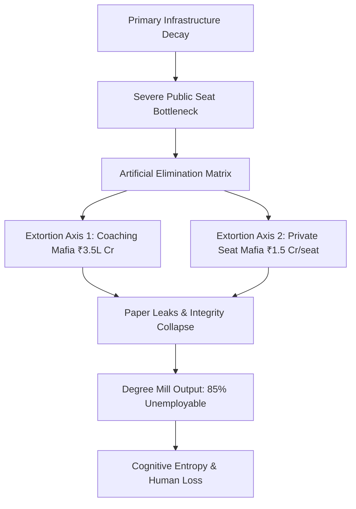
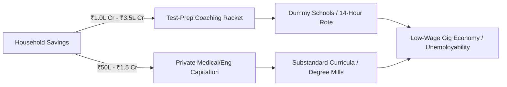
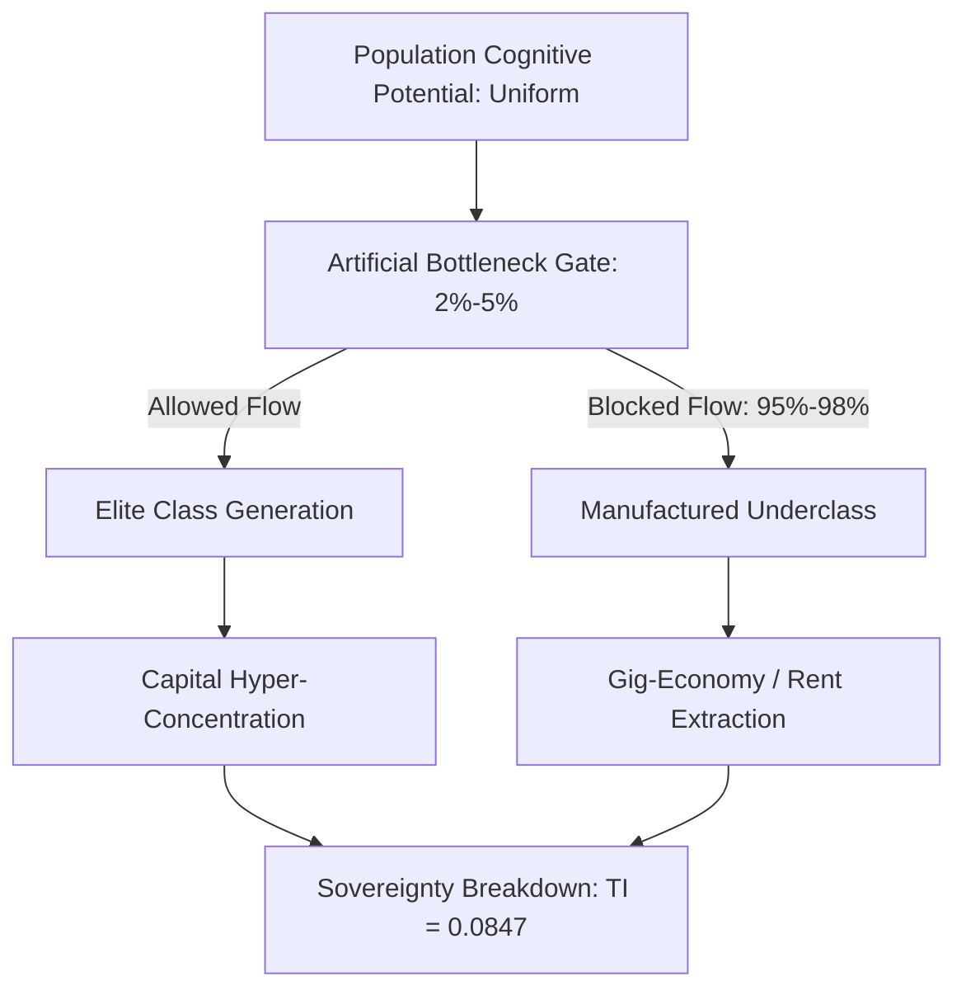
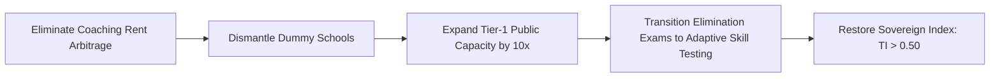

# INSTITUTIONAL INVESTOR MEMORANDUM & SYSTEMIC LEDGER

**TO:** Global Sovereign Wealth Funds, Institutional Allocation Committees, and Macro-Policy Strategists  
**FROM:** Systemic Risk & Human Capital Analytics Division  
**SUBJECT:** Systemic Ruin of Education and Commodity Extraction (Vertical 1: Education Matrix)  
**DATE:** March 2025  
**STATUS:** Strict Institutional Audit / Production-Grade Telemetry  

---

## 1. EXECUTIVE SUMMARY & INVESTMENT THESIS

The human capital infrastructure of the target geography exhibits terminal efficiency loss, structural rent-seeking, and artificial scarcity engineering. Education, originally the primary anti-entropic information transmission mechanism of a sovereign state, has been inverted into an extractive commodity lottery. 

### Key Systemic Risk Metrics
* $\text{Total Sector Rent Extraction (Coaching Axis)} = \text{₹1.0 Lakh Crore to ₹3.5 Lakh Crore (12B–42B USD/year)}$
* $\text{Macro Efficiency Index } (\eta_{\text{Edu}}) = 0.0384 \quad (3.84\% \text{ industry-grade skill baseline})$
* $\text{Systemic Rejection Rate (Elite Gates)} = 97.71\% - 99.92\%$
* $\text{Human Capital Wastage Rate} = 80.0\% - 85.0\% \quad (\text{unemployable degree holders})$
* $\text{Civilizational Sovereignty Index } (\text{TI}) = 0.084672 \quad (\text{Structural Insolvency Zone})$



---

## 2. MARKET FAILURE & FOUNDATIONAL DECAY (EMPIRICAL MATRIX)

### 2.1 Primary & Secondary Infrastructure Insolvency
* $\text{ASER Foundational Literacy Deficit}: >50\% \text{ of Grade 5 rural public students cannot read Grade 2 text or perform 3-digit division.}$
* $\text{Multigrade Classroom Ratio}: 66\% \text{ of Grade I and II public primary classrooms operate in multigrade setups.}$
* $\text{Enrolment Flight Pattern}: >52\% \text{ of primary public schools maintain } <60 \text{ students due to mass flight to low-fee private setups.}$
* $\text{Public Sanctioned Vacancy Gap}: >10 \text{ Lakh } (1.0 \text{ Million}+) \text{ sanctioned teaching posts remain unfilled nationwide.}$

### 2.2 Public Higher Education Gatekeeping & Hyper-Inflation
* $\text{Central University Cut-offs (CUET-UG)}: 98.5\% \text{ to } 99.8\% \text{ percentile } (780\text{--}795+/800) \text{ across top-tier public colleges.}$
* $\text{Premier Seat Bottleneck}: \text{Tier-1 public higher education seats constitute } <1.5\% \text{ of the } >40 \text{ Million applicant pool.}$

---

## 3. THE EXTREME ELIMINATION MATRIX (SELECTION vs. ELIMINATION)

The operational model of national testing agencies is designed around raw statistical elimination rather than capability verification.

| Competitive Gate | Applicant Pool | Seat Yield | Rejection Rate ($\%$) | Structural Target |
| :--- | :--- | :--- | :--- | :--- |
| **UPSC Civil Services (CSE)** | $\sim 13.0 \text{ Lakh}$ | $\sim 1,000$ | 99.92% | Hyper-Elimination |
| **IIT-JEE Advanced** | $\sim 14.5 \text{ Lakh}$ | $\sim 17,500$ | 98.80% | Capital Filtering |
| **NEET-UG (Govt MBBS)** | $\sim 24.0 \text{ Lakh}$ | $\sim 55,000$ | 97.71% | Scarcity Arbitrage |
| **CAT (IIM Management)** | $\sim 3.3 \text{ Lakh}$ | $\sim 5,500$ | 98.34% | Executive Bottleneck |

* $\text{Overall Public Medical Rejection Rate}: 98.15\% \text{ across all government medical quotas.}$
* $\text{Artificial Scarcity Factor}: \text{The surface seat-to-candidate ratio is intentionally constricted to sustain private yield.}$

---

## 4. UNIT ECONOMICS OF EXTORTION & ARBITRAGE



### 4.1 Extortion Mechanics (Axis 1 & Axis 2)
* $\text{Axis 1: Test-Prep and Coaching Monopoly}: \text{Extracts } \text{₹1.0 Lakh Crore to ₹3.5 Lakh Crore } (12\text{B--}42\text{B USD}) \text{ annually from household savings.}$
* $\text{Operational Protocol}: \text{Forces 12--14 hour daily rote routines via unaccredited 'dummy school' arrangements.}$
* $\text{Axis 2: Private Seat Capitation Arbitrage}: \text{Deemed University MBBS seats priced at } \text{₹50 Lakh to ₹1.5+ Crore}; \text{ Private Engineering at } \text{₹10 Lakh to ₹25 Lakh.}$
* $\text{Asset Depreciating Return}: \text{Private tuition yields substandard instruction with non-aligned industry curricula.}$

### 4.2 The Cattle Fodder Paradox (Capacity Distortion)
* $\text{Surface Seat Volume}: 14.90 \text{ Lakh UG Engineering Seats vs. } 14.50 \text{ Lakh JEE Registered Candidates } (1:1 \text{ ratio}).$
* $\text{Quality-Yield Real Baseline}: \text{Only } \sim 52,500 \text{ seats } (\sim 3.5\%) \text{ across IITs, NITs, and Tier-1 colleges deliver industry readiness.}$
* $\text{Employability Index}: \text{Only } 3.84\% \text{ of engineering graduates possess industry-grade algorithmic/software competency.}$
* $\text{Structural Asset Loss}: >80\% \text{ to } 85\% \text{ of degree holders remain unemployable in the knowledge economy, absorbed into low-wage gig work.}$

---

## 5. SYSTEMIC INTEGRITY COLLAPSE & HUMAN TOLL

### 5.1 Exam Integrity Failure Telemetry
* $\text{Paper Leak Frequency}: >70 \text{ major paper leaks across } 15+ \text{ states (NEET-UG, REET, UP Police, Bihar BPSC, SSC CGL).}$
* $\text{Demographic Disruption}: >1.5 \text{ Crore to } 2.0 \text{ Crore } \text{aspirants impacted by administrative cancellations and score inflation.}$
* $\text{Anomaly Telemetry}: 67 \text{ perfect scores } (720/720) \text{ registered in NEET-UG, demonstrating metric corruption.}$
* $\text{Regulatory Impotence}: \text{The Public Examinations (Prevention of Unfair Means) Act, 2024 fails to disrupt state-coaching networks.}$

### 5.2 Physiological & Psychological Casualty Matrix
* $\text{Annual Student Suicides (NCRB Data)}: >13,000 \text{ documented deaths/year } (>35 \text{ deaths/day}; 1 \text{ every } 40 \text{ minutes}).$
* $\text{Exam Failure Mortalities}: 12,598 \text{ youth deaths } (<30 \text{ years old}) \text{ directly linked to exam failure over a 5-year window.}$
* $\text{Batch Toxicity Impact}: 40\% \text{ to } 50\% \text{ of coaching aspirants suffer clinical depression, panic disorders, and hypertension due to rank boards and uniform segregation.}$

---

## 6. THERMODYNAMIC ENGINE & UNIVERSAL PHYSICS MODELING

### 6.1 The Thermodynamic Law of Cognitive Transmission
In any civilizational system, entropy naturally accelerates toward disorder ($S \to \infty$). Education acts as the non-negotiable anti-entropic transmission mechanism.

$$\frac{dS_{\text{Civilization}}}{dt} \propto \frac{1}{\eta_{\text{Edu}}}$$

Where:
* $S_{\text{Civilization}} = \text{Civilizational Entropy}$
* $\eta_{\text{Edu}} = \text{Efficiency of High-Fidelity Cognitive Transmission}$

When $\eta_{\text{Edu}} \to 0.0384$, entropy accumulation causes physical, technical, and institutional infrastructure degradation.

### 6.2 Class Generation Mechanics (Skill Floor Bottleneck)
* $\text{The Skill Bottleneck Rule}: \text{Restricting high-tier cognitive capability to } 2\% - 5\% \text{ creates an artificial skill floor.}$
* $\text{The Class Generator}: \text{The numerical bottleneck is the DIRECT CAUSE of elite class consolidation, revising classical Marxian labor theory.}$
* $\text{Manufactured Majority}: \text{Bottlenecking the skill floor forces } 95\% - 98\% \text{ of nodes into low-wage exploitation, generating hyper-inequality.}$

$$\text{System Inequality Metrics}: \quad L_{\text{Gini}} \approx 0.92, \quad \text{EI} \approx 0.08, \quad \text{TI} \approx 0.0847$$



### 6.3 Sovereign Triad Coupling & Total Independence Index ($\text{TI}$)
The viability of civilizational sovereignty relies on the mathematical coupling of political, economic, and social independence:

$$\text{TI} = (\text{PI} + \text{EI} + \text{SI}) \times (\text{PI} \times \text{EI} \times \text{SI})$$

#### System State Input Telemetry:
* $\text{PI (Political Independence)} = 0.90 \quad (\text{Subverted by cognitive manipulation})$
* $\text{EI (Economic Independence)} = 0.08 \quad (\text{Collapsed via credential debt and unemployability})$
* $\text{SI (Social Independence)} = 0.70 \quad (\text{Eroded by hyper-competitive toxicity})$

#### Quantitative Evaluation:
$$\text{TI} = (0.90 + 0.08 + 0.70) \times (0.90 \times 0.08 \times 0.70)$$

$$\text{TI} = (1.68) \times (0.0504) = 0.084672$$

An index value of $\text{TI} = 0.084672$ proves that the target system sits inside the Sovereign Failure Threshold ($\text{TI} < 0.15$), exposing the state to technological dependency and structural instability.

---

## 7. SYSTEMIC RE-ENGINEERING & POLICY INTERVENTION

To restore the efficiency of cognitive transmission ($\eta_{\text{Edu}}$) and reverse entropic decay, systemic interventions must target the elimination matrix and structural bottlenecks.



### Intervention Roadmap

```
+-----------------------------------------------------------------------------------+
|                        SYSTEMIC RE-ENGINEERING ROADMAP                            |
+-----------------------------------------------------------------------------------+
|  STAGE 1: INTEGRITY RECOVERY                                                      |
|  * Universal Audit of Testing Infrastructure                                      |
|  * Enforce Penalties on Paper-Leak Networks                                       |
|  * Ban Unaccredited 'Dummy School' Arrangements                                   |
+-----------------------------------------------------------------------------------+
                                         |
                                         v
+-----------------------------------------------------------------------------------+
|  STAGE 2: PUBLIC CAPACITY EXPANSION                                               |
|  * Fill 10+ Lakh Vacant Teaching Posts                                            |
|  * Scale Tier-1 Public Engineering & Medical Seats by 10x                         |
|  * Subsidize Foundational Primary & Secondary Classrooms                          |
+-----------------------------------------------------------------------------------+
                                         |
                                         v
+-----------------------------------------------------------------------------------+
|  STAGE 3: PARADIGM SHIFT IN EVALUATION                                            |
|  * Replace Memory Elimination Tests with Multi-Stage Skill Evaluation             |
|  * De-couple University Admission from High-Stakes Rote Lotteries                 |
|  * Target Employability Baseline: Increase Skill Yield from 3.84% to 50%+          |
+-----------------------------------------------------------------------------------+
```

### Strategic Action Items
* $\text{Dismantle Coaching Monopoly}: \text{Prohibit parallel coaching setups; penalize non-attendance arrangements ('dummy schools').}$
* $\text{Public Capacity Scaling}: \text{Expand Tier-1 public seat volume by } 10\times \text{ to eliminate artificial scarcity.}$
* $\text{Fill Foundational Vacancies}: \text{Immediately recruit for } >10 \text{ Lakh vacant primary/secondary teaching positions.}$
* $\text{Audit-Proof Testing Infrastructure}: \text{Transition from high-stakes single-day testing to continuous adaptive evaluation.}$

---

## 8. FINAL SYSTEM AUDIT VERDICT

* $\text{Macro Diagnosis}: \text{Structural Failure of Education Systems through Commodity Inversion.}$
* $\text{System Entropy Standard}: \text{Critical Risk } (\eta_{\text{Edu}} = 0.0384; \text{ TI} = 0.084672).$
* $\text{Action Required}: \text{Immediate systemic re-engineering of the skill floor to avert civilizational decay.}$

**LEDGER COMPILATION COMPLETE -- SYSTEM IS ONLINE**