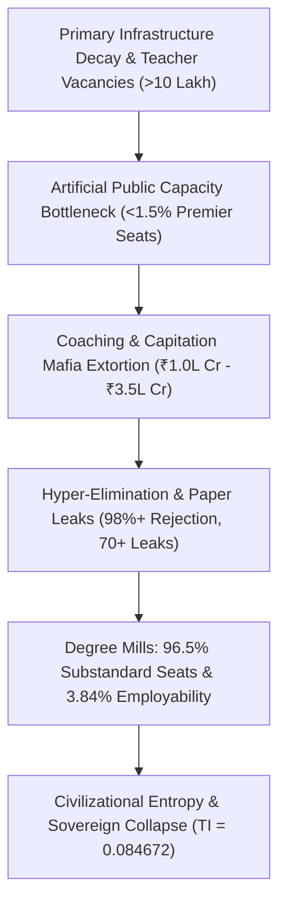

# SYSTEMIC RUIN OF EDUCATION AND COMMODITY EXTRACTION
*A Structural Analysis of Empirical Breakdown and the Universal Thermodynamics of Cognitive Transmission*

---

### EXECUTIVE SUMMARY: THE COMMODITY INVERSION

Education is not an administrative service, a corporate commodity, or a speculative market. In physics terms, education is the **primary anti-entropic information transmission mechanism** of a civilization. Physical systems naturally decay toward maximum entropy ($S \to \infty$). To maintain structural, technical, and moral civilization, low-entropy cognitive patterns must be efficiently transferred from mature to developing nodes.

When a society converts learning into an extortionate, commoditized lottery, it inverts this thermodynamic axis—shifting from **Signal Transmission** (capability, innovation, and understanding) to **Noise Generation** (rote gaming, hyper-elimination, paper leaks, and financial extraction).

---

### SECTION 1: LOCAL EMPIRICAL TELEMETRY (INDIA DECAY MATRIX)

#### 1. Foundational Base Collapse
* $\text{Rural Learning Deficit}: >50\% \text{ of Grade 5 public students cannot read Grade 2 text or perform division}$
* $\text{Multigrade Setup Ratio} = 66\% \text{ in Grade I and II public primary classrooms}$
* $\text{Shrunk Primary Enrollment}: >52\% \text{ of primary schools have } <60 \text{ students}$
* $\text{Sanctioned Teacher Vacancies} > 10\text{ Lakh posts vacant nationwide}$

#### 2. The Artificial Bottleneck & Extreme Elimination Matrix
Premier higher education seats account for $<1.5\%$ of the $40\text{ Million}+$ applicant pool, generating artificial scarcity and extreme elimination filters:

* $\text{Rejection Rate (UPSC CSE)} = 99.92\% \quad (\sim 13.0\text{ Lakh Applicants} \to \sim 1,000\text{ Seats})$
* $\text{Rejection Rate (IIT-JEE Adv)} = 98.80\% \quad (\sim 14.5\text{ Lakh Applicants} \to \sim 17,500\text{ Seats})$
* $\text{Rejection Rate (NEET-UG Govt MBBS)} = 98.15\% \quad (\sim 24.0\text{ Lakh Applicants} \to \sim 55,000\text{ Seats})$
* $\text{Rejection Rate (CAT IIM)} = 98.34\% \quad (\sim 3.3\text{ Lakh Applicants} \to \sim 5,500\text{ Seats})$

#### 3. The Triad of Educational Extortion
* $\text{Test-Prep Extraction Sector} = ₹1.0\text{ Lakh Crore to } ₹3.5\text{ Lakh Crore } (12\text{B}–42\text{B USD}) \text{ annually}$
* $\text{Private Medical Seat Capitation Fee} = ₹50\text{ Lakh to } ₹1.5\text{ Crore}$
* $\text{Private Engineering/Management Degree Fee} = ₹10\text{ Lakh to } ₹25\text{ Lakh}$

#### 4. Psychological Mortality & Systemic Integrity Failure
* $\text{NCRB Annual Student Suicides} > 13,000 \text{ deaths/year } (>35\text{ deaths/day})$
* $\text{5-Year Exam Failure Mortalities} = 12,598 \text{ youth deaths } (<30\text{ years old})$
* $\text{Exam Disruption Scale} > 70\text{ major paper leaks affecting } >1.5\text{ Crore to } 2.0\text{ Crore aspirants}$

#### 5. The Cattle Fodder Paradox
* $\text{Approved UG Engineering Seats} = 14.90\text{ Lakh}$
* $\text{JEE Registered Applicants} = 14.50\text{ Lakh}$
* $\text{Quality Seat Ratio (IIT/NIT/Tier-1)} \approx 3.5\% \quad (\sim 52,500\text{ seats})$
* $\text{Industry-Grade Employability Rate} = 3.84\%$
* $\text{Unemployable Skill Floor} > 80\% \text{ to } 85\%$

---

### SECTION 2: SYSTEMIC ARCHITECTURE & EXTRACTION LOOP

---

### SECTION 3: UNIVERSAL PHYSICS FORMULATION

#### 1. Thermodynamic Decay Vector
The civilizational entropy production rate ($\frac{dS_{\text{Civilization}}}{dt}$) is inversely proportional to cognitive transmission efficiency ($\eta_{\text{Edu}}$):

$$\frac{dS_{\text{Civilization}}}{dt} \propto \frac{1}{\eta_{\text{Edu}}}$$

When efficiency drops ($\eta_{\text{Edu}} \to 0$), entropic degradation accelerates, collapsing technical and social infrastructure.

#### 2. Class Generation via Skill Floor Bottlenecks
By restricting functional, high-grade skill acquisition to a $2\%–5\%$ numerical threshold, society manufactures an artificial elite class, while systematically degrading the remaining $95\%–98\%$ into a low-wage, under-skilled labor reservoir.

#### 3. Sovereign Index Dependency Analysis
Civilizational Total Independence ($\text{TI}$) is calculated through the coupled product of Political ($\text{PI}$), Economic ($\text{EI}$), and Social ($\text{SI}$) independence:

$$\text{TI} = (\text{PI} + \text{EI} + \text{SI}) \times (\text{PI} \times \text{EI} \times \text{SI})$$

* $\text{PI} = 0.90$
* $\text{EI} = 0.08$
* $\text{SI} = 0.70$

$$\text{TI} = (0.90 + 0.08 + 0.70) \times (0.90 \times 0.08 \times 0.70) = 1.68 \times 0.0504 = 0.084672$$

A collapse in Economic Independence ($\text{EI} \to 0.08$) driven by debt-laden, unemployable credentials drags total national sovereignty down to a critical failure threshold ($\text{TI} \approx 0.085$).

---

### SECTION 4: STRATEGIC RECONSTRUCTION IMPERATIVES

1. **De-commodification of the Skill Floor**: Dismantle the Coaching-Paper Leak nexus by restoring universal public instructional quality across primary and secondary tiers.
2. **Expansion of High-Efficiency Capacity**: Eliminate artificial bottlenecks by multiplying Tier-1 public technical capacity by $10\times$, matching applicant volume.
3. **Shift from Rote Elimination to Functional Capabilities**: Replace elimination lotteries with continuous capability assessment, ensuring the 3.84% employability benchmark is raised to $>80\%$.

#EducationReform #SystemicAnalysis #EconomicSovereignty #HumanCapital #PublicPolicy #ThermodynamicsOfEducation