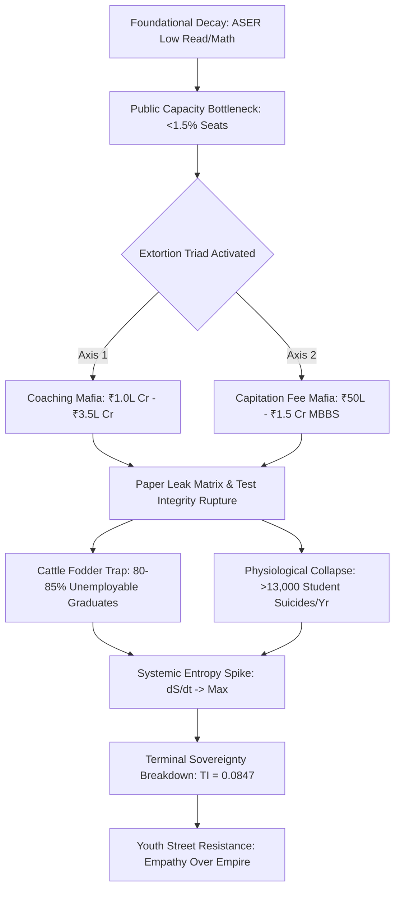

# SYSTEM AUDIT & TERMINAL EVALUATION MATRIX
## TARGET SYSTEM VECTOR: SYSTEMIC RUIN OF EDUCATION AND COMMODITY EXTRACTION

---

### EXECUTIVE SYSTEM TELEMETRY & EMPIRICAL BASELINE

| Telemetry Parameter | Empirical Metric Value | Operational Status / Threshold |
| :--- | :--- | :--- |
| **Primary School Enrolment Deficit (<60 Students)** | 52.0% of Public Primary Units | Critical Systemic Shrinkage |
| **Multigrade Instruction Rate (Grades I & II)** | 66.0% of Public Primary Classrooms | Structural Pedagogical Collapse |
| **Sanctioned Public Teacher Vacancy** | $> 10.0 \text{ Lakh } (1,000,000+)$ | Operational Capacity Failure |
| **Public Higher Education Seat Availability** | $< 1.5\%$ of $40.0 \text{ Million+}$ Applicants | Artificial Scarcity Bottleneck |
| **UPSC Civil Services Rejection Rate** | 99.92% ($\sim 13.0 \text{ Lakh}$ for $\sim 1,000$ Seats) | Hyper-Elimination Matrix |
| **NEET-UG MBBS Govt Seat Rejection Rate** | 97.71% ($\sim 24.0 \text{ Lakh}$ for $\sim 55,000$ Seats) | Severe Capacity Deficit |
| **IIT-JEE Advanced Rejection Rate** | 98.80% ($\sim 14.5 \text{ Lakh}$ for $\sim 17,500$ Seats) | Elite Gatekeeping |
| **Test-Prep / Coaching Extortion Scale** | ₹1.0 Lakh Crore to ₹3.5 Lakh Crore ($12\text{B}–$42\text{B USD}$) | Parasitic Commodity Extraction |
| **Private MBBS Seat Capitation Range** | ₹50 Lakh to ₹1.5 Crore | Extortionate Capital Gatekeeping |
| **Annual Student Suicides (NCRB Data)** | $> 13,000 \text{ Deaths/Year}$ ($> 35\text{ Deaths/Day}$) | Critical Physiological Toll |
| **Documented Paper Leaks (15+ States)** | $> 70 \text{ Major Exam Disruptions}$ | Systemic Integrity Rupture |
| **Engineering Industry Employability** | 3.84% Industry-Grade Skill Rate | High Entropy / Degree Mill Trap |

---

### SECTION 1: EMPIRICAL ANALYSIS OF FOUNDATIONAL DECAY & EXTORTION MECHANICS

```
               [ FOUNDATIONAL COGNITIVE DECAY ]
            50%+ Grade 5 Rural Students Cannot Read Grade 2 Text
                                 │
                                 ▼
               [ ARTIFICIAL SCARCITY & BOTTLENECK ]
           Public Seat Capacity < 1.5% of 40M+ Aspirants
                                 │
                                 ▼
           [ EXTORTION TRIAD & COACHING MAFIA ]
          ₹1.0L Cr - ₹3.5L Cr Annual Extraction / Dummy Schools
                                 │
                                 ▼
             [ SYSTEMIC INTEGRITY COLLAPSE ]
          70+ Paper Leaks / NTA Rupture / Batch Toxicity
                                 │
                                 ▼
              [ DEGREE MILL TRAP & YOUTH RESISTANCE ]
         80-85% Unemployable / "Empathy Over Empire" Rallies
```

#### 1. Foundational Primary & Secondary Structural Decay
* $\text{Rural Learning Deficit:}$ Annual Status of Education Report (ASER) telemetry confirms that over 50% of Grade 5 students in rural public institutions are incapable of reading a Grade 2 foundational textbook or executing basic 3-digit arithmetic division.
* $\text{Classroom Shrinkage and Multigrade Failure:}$ 66% of Grade I and II public primary classrooms operate under multigrade configurations, where a single teacher simultaneously manages multiple cohorts. Over 52% of primary schools report fewer than $60$ total enrolled students, driven by mass parental withdrawal toward low-fee private institutions.
* $\text{Instructional Cadre Vacancies:}$ Over ₹10.0 Lakh sanctioned teacher positions remain vacant across public primary and secondary networks nationwide, degrading the foundational cognitive baseline of the public matrix.

#### 2. Public Gatekeeping Bottlenecks & The Extreme Elimination Matrix
* $\text{CUET-UG Hyper-Inflation:}$ Cut-offs for top-tier public colleges (e.g., DU North Campus: SRCC, Hindu, Hansraj, St. Stephen's) sit at 98.5% to 99.8% percentile ($780\text{--}795+ / 800$) for general candidates in high-demand streams.
* $\text{Public Seat Scarcity:}$ Premier public higher education infrastructure accommodates less than 1.5% of the $40.0 \text{ Million+}$ applicant pool, generating artificial scarcity to force reliance on privatized alternatives.
* $\text{Elimination Rate Metrics:}$
  * $\text{UPSC Civil Services (CSE):}$ $\sim 13.0 \text{ Lakh}$ applicants vs $\sim 1,000$ seats $\rightarrow \text{Rejection Rate} = 99.92\%$.
  * $\text{IIT-JEE Advanced:}$ $\sim 14.5 \text{ Lakh}$ candidate pool vs $\sim 17,500$ seats $\rightarrow \text{Rejection Rate} = 98.80\%$.
  * $\text{NEET-UG (Medical):}$ $\sim 24.0 \text{ Lakh}$ applicants vs $\sim 55,000$ public MBBS seats $\rightarrow \text{Rejection Rate} = 97.71\%$ (Overall public seat elimination rate $= 98.15\%$).
  * $\text{CAT (IIM Management):}$ $\sim 3.3 \text{ Lakh}$ applicants vs $\sim 5,500$ seats $\rightarrow \text{Rejection Rate} = 98.34\%$.

#### 3. The Triad of Educational Extortion
* $\text{Axis 1 (Test-Prep and Coaching Extraction):}$ The private test-prep industry extracts ₹1.0 Lakh Crore to ₹3.5 Lakh Crore ($12\text{B}–$42\text{B USD}$) annually from household capital. The model enforces $12\text{--}14$ hour daily rote memorization factories facilitated by "dummy school" arrangements.
* $\text{Axis 2 (Capitation and Seat Monetization):}$ Private and deemed university networks demand ₹50 Lakh to ₹1.5 Crore for MBBS seats, while private engineering and management degrees cost ₹10 Lakh to ₹25 Lakh for sub-standard instruction and obsolete curricula.

#### 4. Exam Integrity Breakdown & Paper Leak Scam Matrix
* $\text{Disruption Scale:}$ Over $70+$ major competitive and recruitment examination paper leaks (NEET-UG, REET, UP Police Constable, Bihar BPSC, SSC CGL) have been documented across $15+$ states, directly impacting $> 1.5 \text{ Crore}$ to $2.0 \text{ Crore}$ aspirants.
* $\text{Institutional Rupture:}$ Dark-channel leaks, score inflation ($67$ perfect $720$ scores in NEET-UG), and unannounced grace-mark allocations have compromised national testing agencies (e.g., NTA). Legislative frameworks such as the Public Examinations (Prevention of Unfair Means) Act, 2024 have failed to dismantle state-coaching-mafia networks.

#### 5. The Cattle Fodder Paradox (Degree Mill Equilibrium)
* $\text{Surface Capacity vs Quality Illusion:}$ Approved undergraduate engineering seats total $14.90 \text{ Lakh}$ against $14.50 \text{ Lakh}$ JEE registered candidates ($1:1$ numerical ratio). However, only $\sim 52,500$ seats ($\sim 3.5\%$) across IITs, NITs, and Tier-1 public institutions offer industry-grade training.
* $\text{Employability Telemetry:}$ Only 3.84% of engineering graduates possess viable software/algorithmic skills. Over 80% to 85% remain unemployable in the knowledge economy, forcing families to exhaust ancestral capital for degrees that yield low-wage gig work or non-technical call center roles.

#### 6. Physiological & Mental Health Telemetry
* $\text{Mortality Metrics:}$ National Crime Records Bureau (NCRB) telemetry records $> 13,000$ student suicides annually ($> 35$ deaths per day). Over a 5-year tracking window, $12,598$ youth deaths ($< 30$ years) were officially tied directly to examination failure.
* $\text{Psychological Degradation:}$ Coaching hubs utilize weekly rank boards, color-coded uniforms, and "Star vs. Lower Batch" segregation, inducing clinical depression, panic disorders, and hypertension in $40\%\text{--}50\%$ of aspirants.

#### 7. Youth Resistance & Telemetry from the Street
* $\text{Mobilization:}$ Student-led movements (Sansad Chalo march, Jantar Mantar rallies, CJP mobilization) challenge NTA corruption and systemic leaks.
* $\text{State Intervention:}$ Heavy barricading, internet suspensions in central urban hubs, lathi charges, and detentions mark state reaction.
* $\text{Street Telemetry:}$ Student placards articulate the core conflict: *"Education is Not a Commodity," "Empathy Over Empire," "Free, Fair \& Quality Education is a Right of All."*

---

### SECTION 2: UNIVERSAL PHYSICS MATRIX & CIVILIZATIONAL DYNAMICS

```
                    [ LOW-ENTROPY INFORMATION STREAM ]
                   High Efficiency Transmission (η_Edu -> 1)
                                      │
                                      ▼
               [ ARTIFICIAL ENERGY BARRIER IMPOSITION ]
          Private Capitation Gatekeeping & Hyper-Elimination
                                      │
                                      ▼
               [ ENTROPY GENERATION & SIGNAL COLLAPSE ]
           Signal (Capability) -> Noise (Rote Credentialing)
                                      │
                                      ▼
               [ CLASS GENERATION VIA SKILL FLOOR RESTRICTION ]
           Skill Floor Restricted to 2-5% -> 95% Subservient Base
                                      │
                                      ▼
               [ SYSTEMIC SOVEREIGNTY COLLAPSE (TI -> 0.0847) ]
               PI = 0.90  │  EI = 0.08  │  SI = 0.70  │  TI ≈ 0.0847
```

#### 1. The Thermodynamic Law of Cognitive Transmission
* $\text{Axiom:}$ Education is not a market commodity, administrative service, or fiscal business sector. It is the primary anti-entropic information transmission system of a civilization.
* $\text{Thermodynamic Rule:}$ Closed physical systems decay toward maximum thermodynamic entropy ($S \rightarrow \infty$). Low-entropy cognitive patterns must be transferred from mature nodes to developing nodes to preserve technological, institutional, and civilizational infrastructure.
* $\text{Mathematical Vector:}$
$$\frac{dS_{\text{Civilization}}}{dt} \propto \frac{1}{\eta_{\text{Edu}}}$$
Where $\eta_{\text{Edu}}$ represents the overall efficiency of non-commodified, low-noise cognitive transmission.

#### 2. Uniform Distribution of Cognitive Potential & Artificial Energy Barriers
* $\text{Universal Invariant:}$ Raw cognitive potential and problem-solving capacity are uniformly distributed across the human population matrix. Genius is not localized to elite birthplaces or concentrated wealth zip codes.
* $\text{Artificial Energy Barriers:}$ Imposing energy barriers—such as exorbitant capitation fees, coaching costs, and artificial hyper-elimination lotteries—restricts circulation across $95\%+$ of the population matrix, inducing systemic cognitive paralysis.

#### 3. Class Generation Theory: Skill Floor vs. Factory Floor
* $\text{Causal Mechanism:}$ Access to high-quality education and industry-grade skill acquisition is restricted to a strict $2\%\text{--}5\%$ numerical threshold of the population matrix.
* $\text{The Class Generator:}$ Restricting the skill floor manufactures an elite class within that $2\%\text{--}5\%$ band. The restriction is the cause; the elite is the effect. This revises classic Marxian theory by demonstrating that modern class stratification is generated at the **Skill Floor** rather than the **Factory Floor**.
* $\text{The Manufactured Majority:}$ Bottlenecking skill acquisition creates an underprivileged, low-wage $95\%\text{--}98\%$ majority, driving extreme economic inequality ($L_{\text{Gini}} \approx 0.92, EI \approx 0.08, TI \approx 0.0847$).

#### 4. The Commodity Inversion (Signal vs. Noise)
* $\text{Signal Transmission:}$ True cognitive development focused on problem-solving, physical modeling, algorithmic capability, and structural analysis.
* $\text{Noise Generation:}$ Rote memorization, test-gaming tricks, credential inflation, artificial elimination exams, and degree-mill commercialization.
* $\text{Inversion State:}$ Converting learning into a privatized asset shifts educational output from Signal Transmission to Noise Generation, degrading the civilizational baseline.

#### 5. Sovereignty Triad Dependency & Index Evaluation
* $\text{Sovereignty Equation:}$
$$TI = (PI + EI + SI) \times (PI \times EI \times SI)$$
* $\text{Empirical Input Parameters:}$
  * $\text{Political Independence (PI)} = 0.90$
  * $\text{Economic Independence (EI)} = 0.08$
  * $\text{Social Independence (SI)} = 0.70$
* $\text{Step-by-Step Mathematical Evaluation:}$
  1. Calculate the additive sum:
     $$\text{Sum} = PI + EI + SI = 0.90 + 0.08 + 0.70 = 1.68$$
  2. Calculate the multiplicative product:
     $$\text{Product} = PI \times EI \times SI = 0.90 \times 0.08 \times 0.70 = 0.0504$$
  3. Calculate total Terminal Independence ($TI$):
     $$TI = 1.68 \times 0.0504 = 0.084672 \approx 0.0847$$
* $\text{Coupling Interpretation:}$
  * $\text{Political Independence (PI = 0.90):}$ High formal political sovereignty is undermined by mass cognitive vulnerability to manipulation.
  * $\text{Economic Independence (EI = 0.08):}$ Systemic economic weakness results from debt-funded credentials yielding negligible industrial capability.
  * $\text{Social Independence (SI = 0.70):}$ Social stability is degraded by elimination stress, youth mortalities, and institutional mistrust.
  * $\text{Terminal Independence (TI = 0.0847):}$ A low $TI$ score ($<0.10$) indicates severe civilizational vulnerability and structural dependence on external technical capabilities.

---

### SECTION 3: STRATEGIC STRUCTURAL FLOW



---

### SECTION 4: TERMINAL DIRECTIVES & SYSTEMIC REMEDIATION FRAMEWORK

#### Directives for Reclaiming the Cognitive Base
1. $\text{De-Commodification of the Skill Floor:}$ Outlaw private capitation fees, seat-monetization, and unregulated test-prep coaching operations. Transition competitive preparation back to accredited public institutions.
2. $\text{Expansion of Premier Public Capacity:}$ Scale Tier-1 public university capacity by $10\text{x}$ to remove artificial scarcity bottlenecks and neutralize rent-seeking intermediaries.
3. $\text{Integrity Re-Engineering of Testing Agencies:}$ Implement end-to-end cryptographic paper security, decentralized localized testing networks, and strict accountability frameworks for test-administration agencies.
4. $\text{Curricular Alignment with Knowledge Economy Skills:}$ Restructure secondary and higher education curricula away from rote elimination metrics toward industry-grade algorithmic, technical, and scientific problem-solving.
5. $\text{Re-aligning Civilizational Entropy Balance:}$ Optimize cognitive transmission efficiency ($\eta_{\text{Edu}} \rightarrow 1$) to reduce cognitive entropy ($dS/dt$), raising economic independence ($EI$) and elevating total sovereignty ($TI$) above the critical threshold of $0.75$.