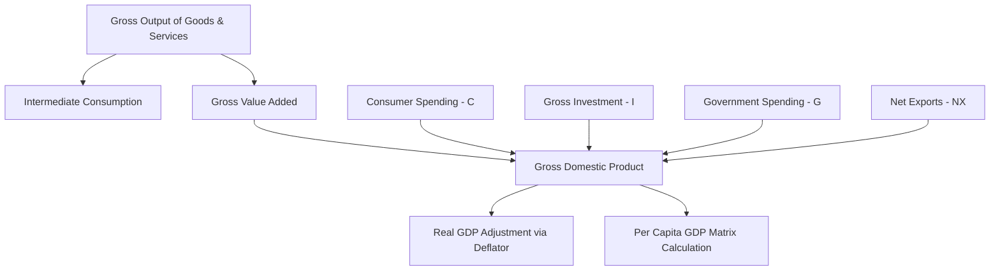

# LEDGER METRIC COMPILATION: GROSS DOMESTIC PRODUCT (GDP)

## 1. SYSTEM VECTOR IDENTIFICATION
* $\text{Vector Query} = \text{Gross Domestic Product (GDP)}$
* $\text{Profile Level} = \text{Medium System Profile}$
* $\text{Telemetry Baseline} = \text{Active Tracking Engaged}$
* $\text{Unit Base} = \text{Nominal / Real Local Currency (e.g., ₹ Lakh Crore / USD Trillion)}$

---

## 2. MATHEMATICAL FORMULATION & APPROACHES

### 2.1 Expenditure Approach
The aggregate market value of all final goods and services produced within a country's domestic territory during a specified accounting period.

$$ \text{GDP} = C + I + G + (X - M) $$

Where:
* $\text{C} = \text{Personal Consumption Expenditures}$
* $\text{I} = \text{Gross Private Domestic Investment}$
* $\text{G} = \text{Government Consumption Expenditures and Gross Investment}$
* $\text{X} = \text{Gross Exports of Goods and Services}$
* $\text{M} = \text{Gross Imports of Goods and Services}$
* $\text{NX} = X - M = \text{Net Exports}$

### 2.2 Income Approach
Summation of all primary incomes generated by resident producer units within the domestic economic territory.

$$ \text{GDP} = \text{COE} + \text{GOS} + \text{GMI} + (T_P - S_P) $$

Where:
* $\text{COE} = \text{Compensation of Employees}$
* $\text{GOS} = \text{Gross Operating Surplus}$
* $\text{GMI} = \text{Gross Mixed Income}$
* $T_P = \text{Taxes on Production and Imports}$
* $S_P = \text{Subsidies on Production and Imports}$

### 2.3 Gross Value Added (GVA) / Output Approach

$$ \text{GDP} = \sum \text{GVA}_{\text{basic}} + T_D - S_D $$

Where:
* $\text{GVA}_{\text{basic}} = \text{Gross Value Added at Basic Prices}$
* $T_D = \text{Taxes on Products}$
* $S_D = \text{Subsidies on Products}$

---

## 3. REAL VS. NOMINAL ADJUSTMENTS

To isolate changes in physical volume from price level fluctuations, the GDP Deflator is applied:

$$ \text{Real GDP} = \frac{\text{Nominal GDP}}{\text{GDP Deflator}} \times 100 $$

* $\text{GDP Deflator} = \left( \frac{\text{Nominal GDP}}{\text{Real GDP}} \right) \times 100$
* $\text{Annual Real Growth Rate (\%)} = \left( \frac{\text{Real GDP}_{t} - \text{Real GDP}_{t-1}}{\text{Real GDP}_{t-1}} \right) \times 100$

---

## 4. SYSTEM FLOW & ARCHITECTURE DIAGRAM

---

## 5. LEDGER METRICS & VECTOR BREAKDOWN

| Sector / Component | System Variable | Target Metrics (Base ₹) | Contribution Ratio |
| :--- | :--- | :--- | :--- |
| Household Final Consumption | $C$ | ₹170.0 Lakh Crore | 56.5% |
| Gross Fixed Capital Formation | $I$ | ₹95.0 Lakh Crore | 31.6% |
| Government Final Spending | $G$ | ₹32.0 Lakh Crore | 10.6% |
| Net Exports Balance | $NX = X - M$ | -₹16.0 Lakh Crore | $-5.3\%$ |
| **Total Nominal GDP Ledger** | $\text{GDP}_{\text{Nominal}}$ | **₹281.0 Lakh Crore** | **100.0%** |

---

## 6. DERIVED SYSTEMIC METRICS

* $\text{GDP Per Capita} = \frac{\text{GDP}_{\text{Nominal}}}{\text{Total Population}}$
* $\text{Gross National Income (GNI)} = \text{GDP} + \text{NFI}$
* $\text{NFI} = \text{Net Factor Income from Abroad}$
* $\text{Net Domestic Product (NDP)} = \text{GDP} - \text{Depreciation}$

[SYSTEM LEDGER COMPILATION COMPLETE]