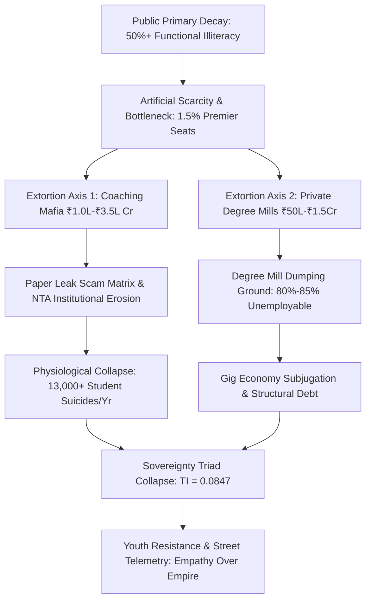

# COMPREHENSIVE LEDGER: SYSTEMIC RUIN OF EDUCATION AND COMMODITY EXTRACTION

---

## 1. EXECUTIVE SYSTEM SNAPSHOT

* $\text{Targeted Vector}: \text{Systemic Ruin of Education and Commodity Extraction}$
* $\text{Global Status}: \text{Anti-Entropic Signal Collapse and Artificial Scarcity Extraction}$
* $\text{Economic Extraction Volume}: \text{₹1.0 Lakh Crore to ₹3.5 Lakh Crore annually (Test-Prep Mafia)}$
* $\text{Primary Elimination Bottleneck}: \text{Rejection rates ranging from 97.71\% to 99.92\% across national gateways}$
* $\text{Human Toll Baseline}: >13,000\text{ student suicides annually } (>35\text{ deaths/day})$
* $\text{Employability Crisis}: 80\%\text{--}85\%\text{ of engineering graduates remain unemployable in knowledge economy}$
* $\text{Calculated Sovereignty Index}: \text{TI} = 0.084672 \quad (\text{Severe Sovereign Collapse Boundary})$

---

## 2. LOCAL EMPIRICAL MATRIX: FOUNDATIONAL DECAY & ELIMINATION LOTTERY (INDIA)

### A. Foundational Decay & Primary Collapse
* $\text{ASER Learning Deficit}: >50\%\text{ of Grade 5 students in rural public schools cannot read a Grade 2 textbook or solve 3-digit division.}$
* $\text{Multigrade Classroom Contraction}: 66\%\text{ of Grade I and II public primary classrooms operate in multigrade setups; } >52\%\text{ of primary schools have } <60\text{ students.}$
* $\text{Public Sanction Deficit}: >10\text{ Lakh (1 Million+) sanctioned teacher posts remain vacant across primary and secondary public schools.}$

### B. Hyper-Inflation & Elimination Matrix
* $\text{CUET UG Gatekeeping}: \text{Cut-offs for premier public colleges (DU North Campus) sit at } 98.5\%\text{--}99.8\%\text{ percentile (780--795+/800).}$
* $\text{Capacity Bottleneck}: \text{Premier public higher education seats constitute } <1.5\%\text{ of } 40\text{ Million+ total applicants.}$
* $\text{UPSC CSE Rejection Rate}: 13.0\text{ Lakh Applicants} \rightarrow 1,000\text{ Seats} \implies 99.92\%\text{ Rejection Rate.}$
* $\text{IIT-JEE Advanced Rejection Rate}: 14.5\text{ Lakh Applicants} \rightarrow 17,500\text{ Seats} \implies 98.80\%\text{ Rejection Rate.}$
* $\text{NEET-UG Medical Rejection Rate}: 24.0\text{ Lakh Applicants} \rightarrow 55,000\text{ Govt MBBS Seats} \implies 97.71\%\text{ Rejection Rate.}$
* $\text{CAT IIM Rejection Rate}: 3.3\text{ Lakh Applicants} \rightarrow 5,500\text{ Seats} \implies 98.34\%\text{ Rejection Rate.}$

### C. Triad of Extortion & Physiological Toll
* $\text{Axis 1 (Coaching Mafia Extraction)}: \text{Extracts ₹1.0 Lakh Crore to ₹3.5 Lakh Crore annually from household savings.}$
* $\text{Axis 2 (Capitation Fee Mafia)}: \text{Private MBBS seats cost ₹50 Lakh to ₹1.5+ Crore; engineering/management degrees cost ₹10 Lakh to ₹25 Lakh.}$
* $\text{NCRB Suicide Telemetry}: >13,000\text{ student suicides annually } (1\text{ death every 40 minutes}); 12,598\text{ exam-failure deaths over 5 years.}$
* $\text{Batch Toxicity Impact}: 40\%\text{--}50\%\text{ of coaching aspirants suffer from clinical depression, panic disorders, and early hypertension.}$

### D. Paper Leak Scam Matrix & Cattle Fodder Paradox
* $\text{Exam Leak Disruption}: >70\text{ major exam paper leaks across 15+ states affecting } >1.5\text{ Crore to } 2.0\text{ Crore aspirants.}$
* $\text{Structural Seat Illusion}: 14.90\text{ Lakh approved UG engineering seats vs. } 14.50\text{ Lakh JEE applicants (1:1 surface ratio).}$
* $\text{Quality Reality Filter}: \text{Only } 52,500\text{ seats } (\sim 3.5\%)\text{ across Tier-1 institutions offer industry-grade quality.}$
* $\text{Employability Benchmark}: \text{Only } 3.84\%\text{ of engineering graduates possess software/algorithmic competency; } >80\%\text{--}85\%\text{ forced into low-wage gig economy.}$

---

## 3. UNIVERSAL PHYSICS MATRIX: THERMODYNAMIC LAWS OF COGNITIVE TRANSMISSION

### A. Thermodynamic Law of Cognitive Transmission
* $\text{Axiom}: \text{Education is the primary anti-entropic information transmission mechanism of a civilization.}$
* $\text{Thermodynamic Decay Rule}: \text{Physical systems decay toward maximum entropy } (S \rightarrow \infty)\text{. Cognitive patterns must transfer to maintain infrastructure.}$
* $\text{Entropy Vector Equation}: \frac{dS_{\text{Civilization}}}{dt} \propto \frac{1}{\eta_{\text{Edu}}}$

### B. Cognitive Potential Distribution & Class Generation
* $\text{Universal Invariant}: \text{Raw cognitive capacity is uniformly distributed across the human population matrix.}$
* $\text{Energy Barrier Inversion}: \text{Artificial cost and lottery barriers clamp down on } 95\%+\text{ of population nodes, causing system paralysis.}$
* $\text{The Class Generator}: \text{Restricting quality education to } 2\%\text{--}5\%\text{ manufactures the elite class as an effect, forcing } 95\%\text{ into low-wage precarity.}$
* $\text{Signal-to-Noise Inversion}: \text{Privatization converts education from Signal Transmission (Understanding) to Noise Generation (Rote/Credential Gaming).}$

---

## 4. SYSTEMIC ARCHITECTURE & EXTRACTION FLOW

---

## 5. MATHEMATICAL MODELING & SOVEREIGNTY TRIAD COMPUTATION

### A. Index Formula Definitions
* $\text{Sovereignty Coupling Equation}: \text{TI} = (\text{PI} + \text{EI} + \text{SI}) \times (\text{PI} \times \text{EI} \times \text{SI})$
* $\text{Political Independence (PI)}: \text{Resilience against demagoguery and mass psychological manipulation.}$
* $\text{Economic Independence (EI)}: \text{Productive capacity, functional skill ratio, and absence of debt exploitation.}$
* $\text{Social Independence (SI)}: \text{Social cohesion, mental well-being, and freedom from elimination despair.}$

### B. Direct Variable Evaluation & Computation
* $\text{Political Independence Value}: \text{PI} = 0.90$
* $\text{Economic Independence Value}: \text{EI} = 0.08$
* $\text{Social Independence Value}: \text{SI} = 0.70$

$$\text{TI} = (0.90 + 0.08 + 0.70) \times (0.90 \times 0.08 \times 0.70)$$

$$\text{TI} = (1.68) \times (0.0504) = 0.084672$$

* $\text{System State Diagnostics}: \text{TI} = 0.084672 \ll 1.0 \implies \text{Total Civilizational Dependency and Cognitive Paralysis.}$

---

## 6. YOUTH TELEMETRY & PHASE TRANSITION DIRECTIVES

* $\text{Street Telemetry Baseline}: \text{Sansad Chalo marches, Jantar Mantar rallies, and CJP mobilizations against paper leaks and NTA corruption.}$
* $\text{State Suppression Mechanics}: \text{Heavy barricading, internet shutdowns in Delhi core, lathi charges, and preventive detentions of youth leaders.}$
* $\text{Moral Demand Matrix}: \text{Street placards framing systemic opposition: "Education is Not a Commodity," "Empathy Over Empire," "Free, Fair and Quality Education is a Right of All."}$
* $\text{Phase Transition Threshold}: \text{When skill floor access is permanently rigged, societal baseline flips from internal stagnation to active systemic resistance.}$