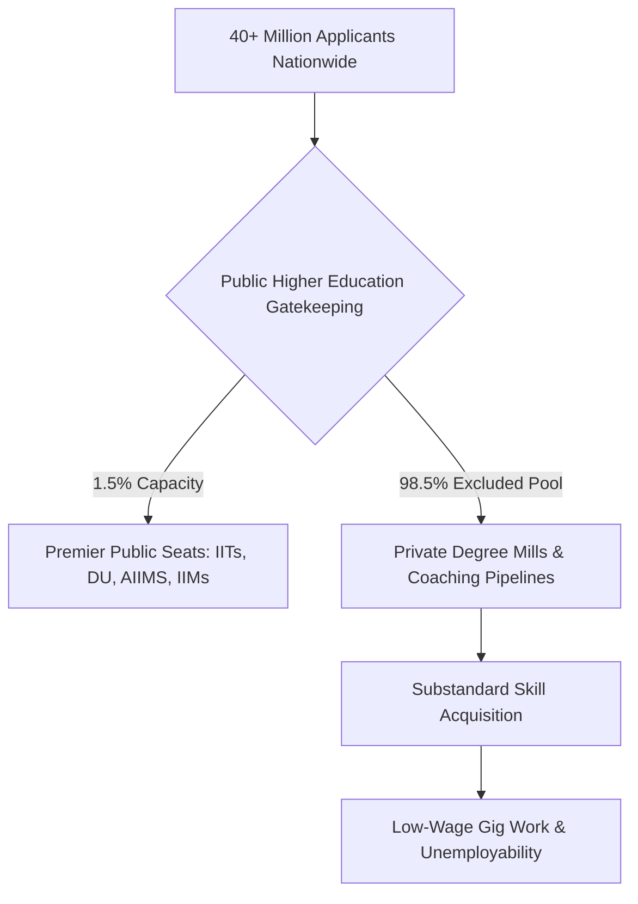

# SCRIPT: THE EXTREME ELIMINATION MATRIX — HOW EDUCATION WAS COMMODIFIED INTO A SYSTEMIC LOTTERY

---

## [SCENE 1: THE THERMODYNAMIC BREAKDOWN OF EDUCATION]

**[VISUAL]**: Rapid montage of crowded classrooms in rural India, shifting to hyper-lit coaching centers in Kota with massive rank boards, transitioning to street protests at Jantar Mantar. High-contrast, monochromatic overlay with live data telemetry scrolling on screen.

**[NARRATOR (VOICE OVER)]**:
Education is not a service. It is not an industry. It is not a policy vector. 

At its core, education is the primary anti-entropic information transmission mechanism of a human civilization.

$$\frac{dS_{\text{Civilization}}}{dt} \propto \frac{1}{\eta_{\text{Edu}}}$$

According to the laws of physical thermodynamics, systems naturally decay toward maximum entropy ($S \to \infty$). To maintain structural, technological, and moral infrastructure, low-entropy cognitive patterns must be transferred efficiently from mature nodes to developing nodes. 

When you convert learning into a privatized asset and an artificial elimination lottery, you invert signal into noise. You stop building capabilities and start manufacturing systemic decay.

---

## [SCENE 2: THE EMPIRICAL FOUNDATION & THE HYPER-INFLATION BOTTLENECK]

**[VISUAL]**: Graphic overlay displaying ASER data and public university cut-off percentages.

**[NARRATOR (VOICE OVER)]**:
Let us process the empirical baseline from the ground up.

At the foundational layer, public primary education in India suffers from structural collapse:
* $\text{Learning Deficit}: >50\%$ of Grade 5 students in rural public schools cannot read a Grade 2 textbook or execute basic 3-digit division.
* $\text{Multigrade Shrinkage}: 66\%$ of Grade I and II public classrooms operate on multigrade setups. Over 52% of primary schools enroll fewer than 60 total students due to mass flight toward low-fee private setups.
* $\text{Teacher Vacancies}: >10\text{ Lakh}$ sanctioned primary and secondary posts remain completely vacant.

Because the base is degraded, access to top-tier higher education becomes an extreme bottleneck. Under the Central University Entrance Test (CUET-UG), cut-offs for premier public institutions like Delhi University’s SRCC or Hindu College reach absolute mathematical limits:

$$\text{Cut-Off Threshold} = 98.5\% \text{ to } 99.8\% \text{ percentile } (780\text{--}795+/800)$$

Premier public higher education seats represent less than 1.5% of the total $40\text{ Million}+$ nationwide applicant pool.

---

## [SCENE 3: THE EXTREME ELIMINATION MATRIX]

**[VISUAL]**: On-screen matrix table highlighting candidate pools versus available seats and corresponding rejection rates.

**[NARRATOR (VOICE OVER)]**:
When public capacity is artificially constricted, competitive examinations cease to be selection mechanisms—they become extreme elimination machines.

Consider the numerical telemetry:
* $\text{UPSC Civil Services (CSE)}: \sim 13.0\text{ Lakh Applicants} \to \sim 1,000\text{ Seats} \implies \text{Rejection Rate} = 99.92\%$
* $\text{IIT-JEE Advanced}: \sim 14.5\text{ Lakh Candidate Pool} \to \sim 17,500\text{ IIT Seats} \implies \text{Rejection Rate} = 98.80\%$
* $\text{NEET-UG (Medical)}: \sim 24.0\text{ Lakh Applicants} \to \sim 55,000\text{ Govt MBBS Seats} \implies \text{Rejection Rate} = 97.71\%$
* $\text{CAT (IIM Management)}: \sim 3.3\text{ Lakh Applicants} \to \sim 5,500\text{ IIM Seats} \implies \text{Rejection Rate} = 98.34\%$

This hyper-scarcity gives rise to the **Triad of Educational Extortion**:

1. **Axis 1 (The Test-Prep Coaching Mafia)**: Siphons ₹1.0 Lakh Crore to ₹3.5 Lakh Crore annually from household savings, enforcing 12 to 14-hour daily rote factories via "dummy school" arrangements.
2. **Axis 2 (The Private Capitation Monopoly)**: Private MBBS seats cost between ₹50 Lakh and ₹1.5 Crore, while private engineering degrees cost ₹10 Lakh to ₹25 Lakh for obsolete curricula.
3. **Axis 3 (The Paper Leak Scam Network)**: Over 70 major competitive exam paper leaks across 15 states—including NEET-UG, REET, UP Police Constable, and SSC CGL—affecting over $1.5\text{ Crore}$ to $2.0\text{ Crore}$ aspirants.

---

## [SCENE 4: UNIVERSAL PHYSICS — CLASS GENERATION AND SOVEREIGNTY COLLAPSE]

**[VISUAL]**: Dynamic motion graphics displaying mathematical formulations of the Sovereignty Triad Index ($\text{TI}$).

**[NARRATOR (VOICE OVER)]**:
Why does this happen? The Universal Physics Matrix reveals the structural mechanism.

Raw cognitive potential is distributed uniformly across the human population matrix. Genius is not localized to elite birthplaces or wealthy zip codes. But when access to high-quality skill acquisition is restricted to a tight 2% to 5% numerical threshold, an elite class is automatically generated within that bottleneck.

This restriction is the *cause*; the elite is the *effect*. By bottlenecking the skill floor, society systematically manufactures an underprivileged, low-wage 95% to 98% majority.

The direct result is the collapse of the Total Independence Index ($\text{TI}$):

$$\text{TI} = (\text{PI} + \text{EI} + \text{SI}) \times (\text{PI} \times \text{EI} \times \text{SI})$$

Evaluating the system variables:
* $\text{Political Independence } (\text{PI}) = 0.90$ (Universal adult franchise exists)
* $\text{Economic Independence } (\text{EI}) = 0.08$ (Extreme economic inequality; $L_{\text{Gini}} \approx 0.92$)
* $\text{Social Independence } (\text{SI}) = 0.70$ (Erosion of influence for economically weaker nodes)

$$\text{TI} = (0.90 + 0.08 + 0.70) \times (0.90 \times 0.08 \times 0.70)$$

$$\text{TI} = 1.68 \times 0.0504 = 0.084672$$

A system operating at a Total Independence Index of $\text{TI} \approx 0.0847$ suffers from structural sovereignty failure. Political independence collapses into demagoguery when cognitive capital is systematically withheld.

---

## [SCENE 5: THE CATTLE FODDER PARADOX & THE HUMAN TOLL]

**[VISUAL]**: Archival footage of Kota coaching centers, news clippings of paper leak scandals, and youth holding protest signs reading *"Education is Not a Commodity"* and *"Empathy Over Empire"*.

**[NARRATOR (VOICE OVER)]**:
This brings us to **The Cattle Fodder Paradox**.

On paper, there appears to be equilibrium: $14.90\text{ Lakh}$ approved undergraduate engineering seats versus $14.50\text{ Lakh}$ JEE registered applicants. Surface ratio: $1:1$.

In reality:
* Only $\sim 52,500$ seats ($\sim 3.5\%$) across IITs, NITs, and Tier-1 colleges offer viable industry-grade quality.
* Only 3.84% of engineering graduates possess industry-grade software or algorithmic skills.
* Over 80% to 85% remain structurally unemployable in the high-value knowledge economy.

The remaining 96.5% of seats act as degree mills. Families exhaust ancestral savings or take high-interest loans, only for graduates to be dumped into low-wage gig work, delivery networks, or non-technical call centers.

**The Human Cost (NCRB Telemetry)**:
* Over $13,000$ student suicides annually ($>35$ deaths per day; 1 every 40 minutes).
* $12,598$ youth deaths ($<30$ years old) officially recorded as directly caused by examination failure over a 5-year tracking window.
* Weekly public rank boards and batch segregation cause clinical depression and panic disorders in 40% to 50% of coaching aspirants.

---

## [SCENE 6: SYSTEM CONCLUSION — PHASE TRANSITION]

**[VISUAL]**: Text on screen outlining the Phase Transition Boundary, ending on high-resolution graphics of student mobilizations in Delhi.

**[NARRATOR (VOICE OVER)]**:
Converting education into an extortionate lottery systematically sabotages the republic's sovereign future, locking the civilization into technological dependency.

When a society restricts the liberation gateway, it forces a Phase Transition Boundary:
1. **Internal Stagnation & Decay**: The elite decays due to credential inflation while the working base is deprived of capability.
2. **Mass Systemic Inversion**: Youth recognize that the skill floor is permanently rigged, shifting collective energy from productive learning to active systemic resistance.

From Sansad Chalo marches to Jantar Mantar mobilizations, the telemetry from the streets confirms that the social contract is fractured. 

Education is not a commodity to be extracted. It is the non-negotiable anti-entropic foundation of a sovereign civilization.

---

**[SYSTEM MATRIX END]**