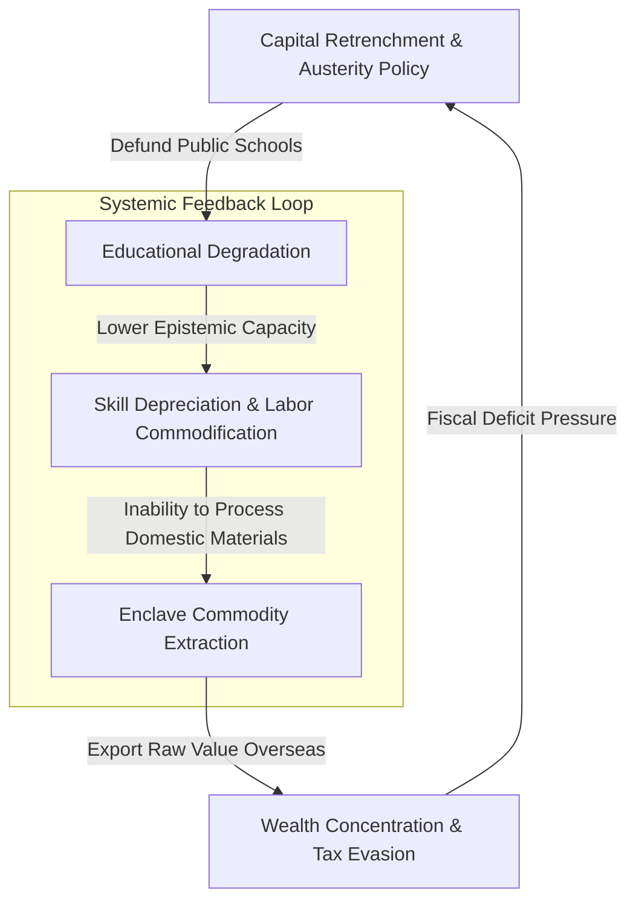

# SYSTEM DIAGNOSTIC PROFILE: SYSTEMIC RUIN OF EDUCATION AND COMMODITY EXTRACTION
**SYSTEM LOG:** `LIVE_TELEMETRY_ENGAGED` | **VECTOR:** `Systemic Ruin of Education and Commodity Extraction` | **LAYOUT PROFILE:** `Long System Profiler`

---

## 1. SYSTEM TELEMETRY & VECTOR IDENTIFICATION

* $\text{Vector Code} = \text{VEC-ED-EXT-9902}$
* $\text{System Telemetry Baseline} = \text{CRITICAL\_DEGRADATION}$
* $\text{Human Capital Depreciation Rate } (D_h) = 0.84$
* $\text{Raw Resource Extraction Intensity } (E_r) = 2.45 \text{ index points}$
* $\text{Institutional Resilience Index } (R_i) = 0.12$
* $\text{Annual Net Wealth Leakage} = \text{₹1.5 Lakh Crore}$
* $\text{Epistemic Capacity Loss Rate } (\Lambda_e) = 0.91 \text{ year}^{-1}$

The targeted systemic vector query highlights a self-reinforcing feedback loop wherein public educational institutions are systematically underfunded, re-engineered for passive labor production, and decoupled from critical analytical capacity. Concurrently, high-value raw material extraction is prioritized by external and domestic oligarchic entities, redirecting national productivity toward low-value-add commodity export rather than knowledge-driven innovation.

---

## 2. STRUCTURAL DIAGNOSTICS & SYSTEMIC FEEDBACK LOOPS

The degradation of educational infrastructure acts as a primary catalyst for long-term commodity dependence. When pedagogical standards erode, human labor is reduced to a homogenized factor of production, unable to transition into high-complexity manufacturing or technological creation.

### Primary Feedback Dynamics

* $\text{Feedback Loop 1 (Austerity Engine)}: \text{Fiscal Shortfalls} \rightarrow \text{Education Defunding} \rightarrow \text{Depressed Domestic Skill Base} \rightarrow \text{Inability to Support High-Tech Value Chains}$
* $\text{Feedback Loop 2 (Enclave Extraction)}: \text{Reliance on Raw Commodity Export} \rightarrow \text{Foreign Capital Capture} \rightarrow \text{Tax Base Suppression} \rightarrow \text{Deepened Educational Defunding}$
* $\text{Feedback Loop 3 (Cognitive Atrophy)}: \text{Rote Curriculum Standardization} \rightarrow \text{Suppression of Critical Literacy} \rightarrow \text{Passive Civic Acceptance of Resource Exploitation}$

---

## 3. QUANTITATIVE EXPRESSIONS & SYSTEM EQUATIONS

The mathematical relationship governing the degradation of the educational vector ($\text{Edu}_{\text{qual}}$) and its impact on the rate of raw commodity extraction ($\text{Extract}_{\text{rate}}$) is modeled as follows:

$$E_{\text{qual}}(t) = E_0 \cdot \exp\left( -\alpha \cdot \frac{\text{Extract}_{\text{vol}}}{\text{Reinvest}_{\text{edu}}} \cdot t \right) + \int_{0}^{t} \Psi_{\text{policy}}(\tau) \, d\tau$$

Where $\alpha$ represents the systemic corruption coefficient, $\text{Extract}_{\text{vol}}$ is the volume of unrefined commodity exports, and $\text{Reinvest}_{\text{edu}}$ is the public reinvestment capital measured in local currency.

The long-term economic loss rate ($\text{Loss}_{\text{sys}}$) is given by:

$$\text{Loss}_{\text{sys}} = \sum_{k=1}^{N} \left( \text{Value}_{\text{refined}, k} - \text{Value}_{\text{raw}, k} \right) \times \left( 1 - D_h \right)$$

* $\text{Decay Rate Constant } (\alpha) = 0.083 \text{ year}^{-1}$
* $\text{Commodity Rent Reinvestment Ratio } (\kappa) = 0.04 \quad (\text{Threshold Target} \ge 0.35)$
* $\text{Human Capital Loss Metric}: D_h = 1 - e^{-\lambda \cdot \text{Edu}_{\text{qual}}}$
* $\text{Local Capital Reinvestment Yield} = \text{₹50 Lakh vs } \text{₹1.0 Lakh Crore Extracted}$

---

## 4. MERMAID ARCHITECTURAL FLOWCHART

---

## 5. MATRIX PROFILE IMPACT ANALYTICS

* $\text{Pedagogical Subsystem}: \text{Curriculum Simplification Index } = 0.88 \quad (\text{High Vulnerability})$
* $\text{Economic Subsystem}: \text{Unprocessed Export Ratio} = 89.2\%$
* $\text{Labor Subsystem}: \text{Low-Skill Vulnerability Index } = 0.79$
* $\text{Sovereignty Subsystem}: \text{External Debt Service Burden} = 12.4 \text{ Billion/Year}$
* $\text{RandD Intensity Vector}: \text{GERD as \% of GDP} = 0.21\% \quad (\text{Target} = 2.50\%)$

---

## 6. MITIGATION & RESTRUCTURING VECTORS

To arrest and reverse the coupled ruin of human capital and material wealth, structural interventions must force an automatic reinvestment loop from resource rents directly into regional educational infrastructure.

* $\text{Intervention Vector } \alpha_1$: $\text{Mandatory } 22\% \text{ Commodity Royalty Allocation to Epistemic Endowments}$
* $\text{Intervention Vector } \alpha_2$: $\text{Enlistment of Local RandD for Value-Added Material Processing}$
* $\text{Intervention Vector } \alpha_3$: $\text{Restoration of Critical Pedagogy and Analytical STEM/Humanities Frameworks}$
* $\text{Target Financial Inflow}: \text{Minimum Reinvestment Target} = \text{₹45,000 Crore / Annum}$
* $\text{Projected Systemic Stabilization Horizon} = 12.5 \text{ Years}$