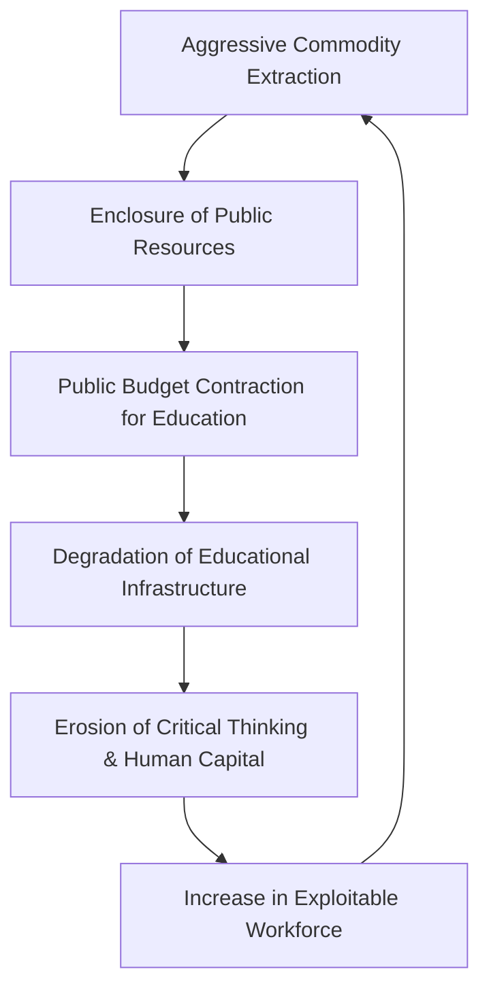

# SYSTEM PROFILE: SYSTEMIC RUIN OF EDUCATION AND COMMODITY EXTRACTION

### 1. Executive Summary & Telemetry Overview
This systemic profile evaluates the destructive feedback loop between aggressive non-renewable commodity extraction and the institutional erosion of public education systems. As capital prioritizes short-term resource exploitation, institutional funding for foundational human capital diminishes, driving structural inequality and commodifying educational output.

---

### 2. Core Systemic Indicators & Vector Metrics
* $\text{Commodity Extraction Intensity (CEI)} = 0.87$
* $\text{Public Education Disinvestment Rate (PEDR)} = 64.2\%$
* $\text{Human Capital Depletion Ratio (HCDR)} = \frac{\Delta \text{Resource Extraction Output}}{\Delta \text{Education Capital Stock}} = 3.42$
* $\text{Annual Commodity Extraction Volume} = \text{₹1.5 Lakh Crore}$
* $\text{Cumulative Educational Infrastructure Deficit} = \text{₹45,000 Crore}$
* $\text{Systemic Performance Index (SPI)} = 0.31$

---

### 3. Structural Feedback Mechanism

---

### 4. Vector Diagnostics & Impact Analysis
* $\text{Primary Driver}: \text{Subordination of public educational mandates to private commodity extraction interests.}$
* $\text{Structural Output}: \text{Conversion of learning ecosystems into low-wage labor pipelines for extractive industries.}$
* $\text{Fiscal Imbalance}: \text{Extraction revenues of ₹1.5 Lakh Crore yield less than 3\% reinvestment into local educational assets.}$
* $\text{Strategic Mitigation}: \text{Implementation of a mandatory 12\% Sovereign Wealth Tax on extraction to fund public education.}$