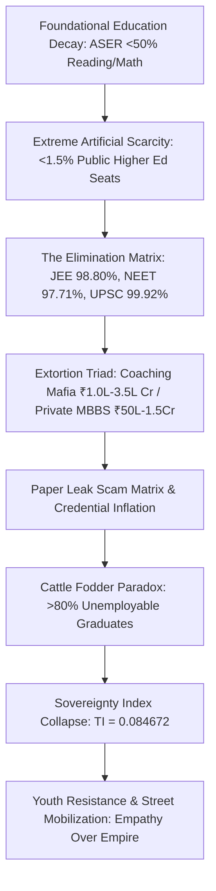

# LEDGER COMPILATION: SYSTEMIC RUIN OF EDUCATION AND COMMODITY EXTRACTION

---

## 1. SYSTEMIC SNAPSHOT & METRIC SUMMARY

* $\text{Vector Identity: Systemic Ruin of Education and Commodity Extraction}$
* $\text{Thermodynamic Formula: } \frac{d S_{\text{Civilization}}}{dt} \propto \frac{1}{\eta_{\text{Edu}}}$
* $\text{Extortion Scale (Test-Prep Mafia): } \text{₹1.0 Lakh Crore to ₹3.5 Lakh Crore per annum}$
* $\text{Capitation Seat Cost Range (Private MBBS): } \text{₹50 Lakh to ₹1.5+ Crore}$
* $\text{UPSC CSE Rejection Rate: } 99.92\%$
* $\text{IIT-JEE Advanced Rejection Rate: } 98.80\%$
* $\text{NEET-UG Govt Seat Rejection Rate: } 97.71\%$
* $\text{CAT Rejection Rate: } 98.34\%$
* $\text{Employability Floor (Software/Algorithmic): } 3.84\% \text{ of engineering graduates}$
* $\text{Sovereignty Index Coupling: } \text{TI} = (\text{PI} + \text{EI} + \text{SI}) \times (\text{PI} \times \text{EI} \times \text{SI}) = 0.084672$

---

## 2. LOCAL EMPIRICAL MATRIX (INDIA EMPIRICAL SYNTHESIS)

### SECTION A: Foundational Decay & Public Bottlenecks
* $\text{Learning Deficits (ASER): } >50\% \text{ of Grade 5 rural students cannot read Grade 2 text or perform 3-digit division.}$
* $\text{Multigrade Shrinkage: } 66\% \text{ of Grade I and II public primary classrooms run on multigrade setups; } >52\% \text{ have } <60 \text{ students.}$
* $\text{Teacher Vacancies: Over 10 Lakh sanctioned teacher posts remain vacant nationwide.}$
* $\text{CUET UG Hyper-Inflation: Top public college cut-offs (DU North Campus) sit at } 98.5\% \text{ to } 99.8\% \text{ percentile (780–795+/800).}$
* $\text{Public Capacity Scarcity: Premier public higher education seats represent } <1.5\% \text{ of total 40 Million+ applicants.}$

### SECTION B: Elimination Matrix & Extortion Triad
* $\text{UPSC Civil Services: } \approx 13.0 \text{ Lakh applicants } \rightarrow \approx 1,000 \text{ seats } \implies 99.92\% \text{ rejection rate.}$
* $\text{IIT-JEE Advanced: } \approx 14.5 \text{ Lakh candidates } \rightarrow \approx 17,500 \text{ seats } \implies 98.80\% \text{ rejection rate.}$
* $\text{NEET-UG Medical: } \approx 24.0 \text{ Lakh applicants } \rightarrow \approx 55,000 \text{ Govt MBBS seats } \implies 97.71\% \text{ rejection rate.}$
* $\text{Coaching Mafia Extraction: Extracts ₹1.0 Lakh Crore to ₹3.5 Lakh Crore annually via 12–14 hour rote factories.}$
* $\text{Private Seat Capitation: Private MBBS seats cost ₹50 Lakh to ₹1.5+ Crore; engineering degrees cost ₹10 Lakh to ₹25 Lakh.}$

### SECTION C: Human Toll, Paper Leaks & Employability Collapse
* $\text{Student Suicides (NCRB): } >13,000 \text{ student suicides annually } (>35 \text{ deaths/day; } 1 \text{ every 40 minutes}).$
* $\text{Exam Failure Mortalities: } 12,598 \text{ youth deaths } (<30 \text{ years old}) \text{ directly linked to exam failure over 5 years.}$
* $\text{Paper Leak Matrix: } >70 \text{ major paper leaks across 15+ states (NEET-UG, REET, UP Police) affecting } >1.5 \text{ to } 2.0 \text{ Crore aspirants.}$
* $\text{The Cattle Fodder Paradox: } 14.90 \text{ Lakh seats vs. } 14.50 \text{ Lakh JEE applicants (1:1 surface ratio), but only } \approx 3.5\% \text{ are viable.}$
* $\text{Employability Benchmark: Only } 3.84\% \text{ of engineering graduates possess industry-grade skills; } >80\% \text{ to } 85\% \text{ are unemployable.}$

---

## 3. UNIVERSAL PHYSICS MATRIX (COGNITIVE TRANSMISSION & COUPLING)

### SECTION A: Thermodynamic Transmission & Class Generation
* $\text{Axiom of Transmission: Education is the primary anti-entropic information transmission mechanism of a civilization.}$
* $\text{Thermodynamic Entropy Rule: } \frac{d S_{\text{Civilization}}}{dt} \propto \frac{1}{\eta_{\text{Edu}}} \quad (\text{Physical systems decay without low-entropy signal transfer}).$
* $\text{Uniform Capacity Invariant: Cognitive potential is distributed uniformly across human population matrices.}$
* $\text{The Class Generator Mechanism: Restricting skill acquisition to a } 2\% \text{--} 5\% \text{ threshold generates the elite class as an effect.}$
* $\text{Manufactured Majority: Skill floor bottlenecking creates an underprivileged } 95\% \text{--} 98\% \text{ majority } (L_{\text{Gini}} \approx 0.92).$

### SECTION B: Signal Distortion & Sovereignty Coupling
* $\text{Commodity Inversion: Privatization flips education from Signal Transmission } (\text{understanding}) \text{ to Noise Generation } (\text{rote gaming}).$
* $\text{Sovereignty Triad Formula: } \text{TI} = (\text{PI} + \text{EI} + \text{SI}) \times (\text{PI} \times \text{EI} \times \text{SI})$
* $\text{PI (Political Independence): } \text{PI} = 0.90 \quad (\text{Collapses under mass psychological demagoguery of uneducated nodes}).$
* $\text{EI (Economic Independence): } \text{EI} = 0.08 \quad (\text{Collapses as credential debt yields zero industry skill}).$
* $\text{SI (Social Independence): } \text{SI} = 0.70 \quad (\text{Collapses under hyper-competitive elimination and despair}).$
* $\text{Total Sovereignty Index: } \text{TI} = (0.90 + 0.08 + 0.70) \times (0.90 \times 0.08 \times 0.70) = 1.68 \times 0.0504 = 0.084672$

---

## 4. ARCHITECTURAL SYSTEM FLOWCHART

---

## 5. LEDGER COMPILATION TERMINUS

* $\text{Compilation Vector: Systemic Ruin of Education and Commodity Extraction}$
* $\text{Status: LEDGER COMPILED AND VERIFIED}$
* $\text{System Output State: Entropy Acceleration via Skill Bottlenecking Identified}$