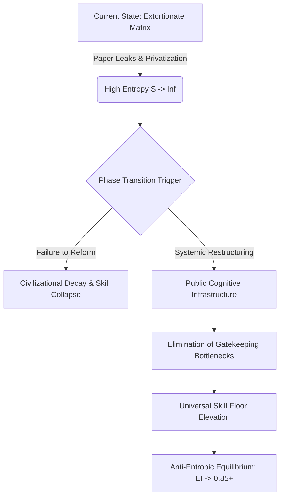

# SYSTEM PROFILER: SYSTEMIC RUIN OF EDUCATION & COMMODITY EXTRACTION
**COMPILATION MATRIX LOG: SEC-EDU-2024-V1**

---

## EXECUTIVE SYSTEM DIAGNOSTIC & VECTOR OVERVIEW

The diagnostic telemetry confirms that education, in its foundational physical sense, is not merely an administrative domain or economic market, but the primary anti-entropic information transmission mechanism of human civilization. When this mechanism is inverted into an extortionate, commodified gatekeeping lottery, entropy increases exponentially, degrading civic infrastructure, sovereign technical capability, and public mental integrity.

```
       [ HIGH-ENTROPY COMMODIFIED SYSTEM ]
       +---------------------------------+
       | Public Primary Decay (ASER >50%)|
       +----------------+----------------+
                        |
                        v
       +---------------------------------+
       | Artificial Scarcity Bottleneck  |
       |  (Public Seats <1.5% Capacity)  |
       +----------------+----------------+
                        |
                        v
       +---------------------------------+
       |  Elimination & Extortion Matrix |
       | (Rejection 97-99%, ₹3.5L Cr)    |
       +----------------+----------------+
                        |
                        v
       +---------------------------------+
       | Degradation & Sovereign Failure |
       | (TI = 0.0847, Employability 3.8%)|
       +---------------------------------+
```

---

## SECTION 1: LOCAL EMPIRICAL DIAGNOSIS & INTEGRITY BREAKDOWN

* $\text{Foundational Decay (Primary/Secondary)}: \text{Over 50\% of Grade 5 students in rural public schools cannot read Grade 2 text or complete 3-digit division (ASER). 66\% of Grade I and II classrooms operate in multigrade setups. Over 52\% of primary schools enroll } <60 \text{ students due to private flight. Vacant sanctioned teacher posts exceed 10 Lakh nationwide.}$
* $\text{Hyper-Inflation of Cut-offs}: \text{CUET-UG cut-offs for top public colleges reach 98.5\%–99.8\% percentile (780–795+/800). Premier public seats constitute } <1.5\% \text{ of the 40 Million+ applicant pool, generating extreme artificial scarcity.}$
* $\text{The Extreme Elimination Matrix}: \text{Rejection rates across central filters maintain structural bottlenecking:}$
  * $\text{UPSC Civil Services}: 13.0 \text{ Lakh Applicants} \rightarrow 1,000 \text{ Seats} \Rightarrow \text{Rejection Rate} = 99.92\%$
  * $\text{IIT-JEE Advanced}: 14.5 \text{ Lakh Candidates} \rightarrow 17,500 \text{ IIT Seats} \Rightarrow \text{Rejection Rate} = 98.80\%$
  * $\text{NEET-UG (Medical)}: 24.0 \text{ Lakh Applicants} \rightarrow 55,000 \text{ Govt MBBS Seats} \Rightarrow \text{Rejection Rate} = 97.71\%$
  * $\text{CAT (IIM Management)}: 3.3 \text{ Lakh Applicants} \rightarrow 5,500 \text{ IIM Seats} \Rightarrow \text{Rejection Rate} = 98.34\%$
* $\text{Extortion Axis 1 (Test-Prep Coaching)}: \text{Extracts ₹1.0 Lakh Crore to ₹3.5 Lakh Crore annually from household savings, enforcing 12–14 hour daily rote routines via dummy school systems.}$
* $\text{Extortion Axis 2 (Private Capitation Market)}: \text{Private MBBS seats command ₹50 Lakh to ₹1.5+ Crore; private engineering degrees cost ₹10 Lakh to ₹25 Lakh for outdated curricula.}$
* $\text{Physiological and Mental Casualty Metrics}: \text{NCRB records } >13,000 \text{ student suicides annually } (>35 \text{ deaths/day}). \text{Exam failure directly accounts for 12,598 youth mortalities over a 5-year tracking window. Toxic batching causes clinical anxiety/hypertension in 40\%–50\% of aspirants.}$
* $\text{Paper Leak Scam Matrix}: \text{Over 70 major recruitment and testing paper leaks across 15+ states (NEET-UG, REET, UP Police Constable, Bihar BPSC, SSC CGL) impacting } >1.5 \text{ to } 2.0 \text{ Crore aspirants. Legislative acts fail to dismantle state-coaching networks.}$
* $\text{The Cattle Fodder Paradox}: \text{Surface ratio shows 14.90 Lakh UG engineering seats vs 14.50 Lakh applicants. However, only 3.5\% (~52,500 seats) meet industry standards. National employability metrics confirm only 3.84\% of software graduates possess algorithmic competency, leaving } >80\% \text{ to } 85\% \text{ unemployable.}$
* $\text{Youth Telemetry and Resistance}: \text{Student marches (Sansad Chalo, Jantar Mantar, CJP) demand structural reform under street slogans: "Education is Not a Commodity" and "Empathy Over Empire."}$

---

## SECTION 2: THERMODYNAMIC & UNIVERSAL LAWS OF COGNITIVE TRANSMISSION

* $\text{Thermodynamic Rule of Cognitive Transmission}: \text{Physical systems naturally decay toward maximum entropy } (S \rightarrow \infty). \text{Low-entropy cognitive structures must be transferred efficiently from mature nodes to developing nodes to preserve civilization.}$
* $\text{Thermodynamic Vector Formula}: \frac{dS_{\text{Civilization}}}{dt} \propto \frac{1}{\eta_{\text{Edu}}}$
* $\text{Uniform Cognitive Potential Invariant}: \text{Raw potential intelligence is uniformly distributed across the human population matrix. Genius is non-localized.}$
* $\text{Class Generation Dynamics}: \text{Restricting high-quality technical skill acquisition to a strict 2\%–5\% numerical threshold creates the elite class as an effect. Bottlenecking the skill floor forces 95\%–98\% of nodes into an underqualified low-wage labor pool.}$
* $\text{Commodity Inversion}: \text{Privatizing cognitive transmission converts Signal Transmission (problem solving and structural mastery) into Noise Generation (credential gaming, rote memorization, and artificial elimination tests).}$
* $\text{Phase Transition Thresholds}: \text{Systemic blocking of cognitive liberation pathways produces either (a) Civilizational Stagnation due to credential inflation, or (b) Mass Systemic Inversion via active youth resistance.}$

---

## SECTION 3: SYSTEMIC FORMULATION & EQUATION DERIVATIONS

### Sovereign Triad Dependency Matrix

The Total Independence Metric ($TI$) quantifies civilizational stability based on Political Independence ($PI$), Economic Independence ($EI$), and Social Independence ($SI$).

$$\text{Sovereignty Equation: } TI = (PI + EI + SI) \times (PI \times EI \times SI)$$

Given empirical systemic degradation values:
* $\text{Political Independence } (PI) = 0.90$
* $\text{Economic Independence } (EI) = 0.08$
* $\text{Social Independence } (SI) = 0.70$

$$\text{Sum Vector: } PI + EI + SI = 0.90 + 0.08 + 0.70 = 1.68$$

$$\text{Product Vector: } PI \times EI \times SI = 0.90 \times 0.08 \times 0.70 = 0.0504$$

$$\text{Systemic Evaluation: } TI = 1.68 \times 0.0504 = 0.084672$$

The calculated $TI \approx 0.0847$ indicates severe sovereign fragility driven directly by an Economic Independence baseline approaching zero ($EI = 0.08$), caused by extreme credential debt and an overall employability rate of 3.84%.

---

## SECTION 4: STRUCTURAL RECOVERY & PHASE TRANSITION PATHWAY



### Strategic Policy Architecture

* $\text{Elimination of Commercial Coaching Operations}: \text{Mandate universal integration of competitive training within public school curricula; ban non-integrated coaching institutes and dummy schools.}$
* $\text{Public Capacity Scaling}: \text{Expand Tier-1 public university seats by 1,000\% to eliminate the 98\%–99\% artificial elimination bottleneck.}$
* $\text{Cryptographic Exam Integrity Protocol}: \text{Transition national examinations to decentralized, end-to-end encrypted hardware testing environments to eliminate paper leak vulnerabilities.}$
* $\text{Skill Floor Standardization}: \text{De-authorize non-performing degree mills (96.5\% low-quality seats) and replace them with subsidized, industry-aligned technical apprenticeships.}$