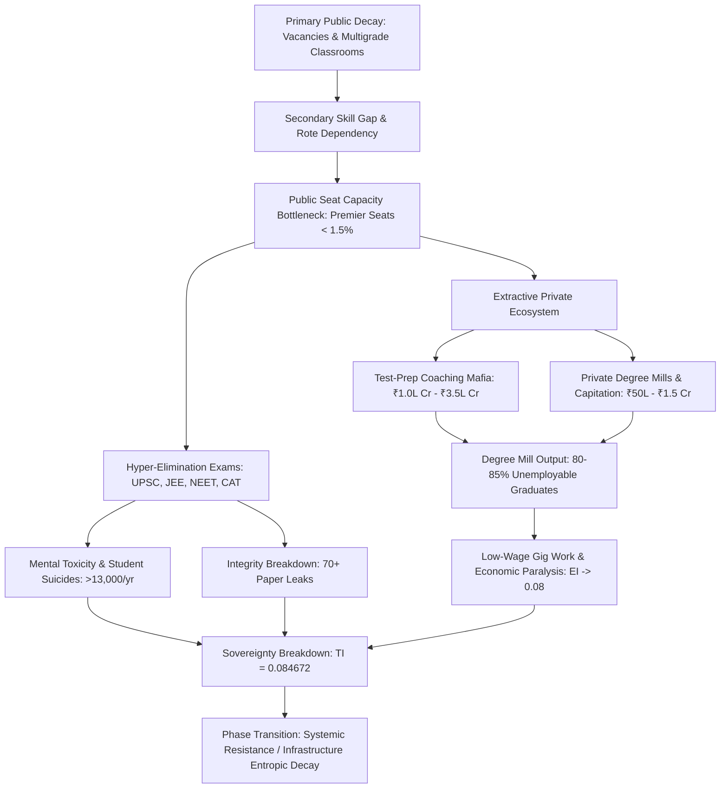

# SYSTEM PROFILER REPORT: SYSTEMIC RUIN OF EDUCATION AND COMMODITY EXTRACTION

---

## 1. SYSTEM OVERVIEW & ARCHITECTURAL METRICS

```
====================================================================================================
SYSTEM VECTOR            : SYSTEMIC RUIN OF EDUCATION AND COMMODITY EXTRACTION
SURVEILLANCE REGION      : LOCAL (INDIA) & UNIVERSAL CIVILIZATIONAL DYNAMICS
DEPLOYMENT METRIC LAYOUT : LONG SYSTEM PROFILER
====================================================================================================
```

### 1.1 ARCHITECTURAL TELEMETRY OVERVIEW

* $\text{System State} = \text{Entropic Cognitive Decay / Hyper-Extractive Bottleneck}$
* $\text{Total Aspirant Matrix} \ge 40,000,000 \text{ Nodes}$
* $\text{Premier Public Seat Allocation} < 1.5\%$
* $\text{Rote Extraction Market Scale} = \text{₹1.0 Lakh Crore to ₹3.5 Lakh Crore (12B–42B USD)}$
* $\text{Industry-Grade Software Skill Ratio} = 3.84\%$
* $\text{Unemployable Graduate Base} \ge 80\% - 85\%$
* $\text{Total Systemic Sovereignty Index (TI)} = 0.084672$

---

## 2. LOCAL EMPIRICAL DECONSTRUCTION (INDIA VECTOR)

### 2.1 FOUNDATIONAL & SECONDARY INFRASTRUCTURAL DECAY

The baseline primary education infrastructure displays chronic structural erosion, disabling low-entropy cognitive transmission at the foundation:

```
+--------------------------------------------------------------------------------------------------+
| FOUNDATIONAL DECAY METRICS (ASER DATA TELEMETRY)                                                 |
+--------------------------------------------------------------------------------------------------+
| Grade 5 Reading Deficit   | >50% Grade 5 rural students cannot read Grade 2 text                 |
| Grade 5 Division Deficit  | >50% Grade 5 rural students cannot perform basic 3-digit division    |
| Multigrade Primary Class  | 66% of Grade I & II primary public classrooms run multigrade setups  |
| Enrolment Shrinkage       | >52% of primary public schools contain <60 total enrolled students  |
| Sanctioned Vacancies      | >10 Lakh (1.0 Million+) public primary/secondary teaching posts vacant|
+--------------------------------------------------------------------------------------------------+
```

* $\text{Enrolment Flight} \rightarrow \text{Mass movement to low-fee private degree mills due to public erosion.}$
* $\text{Multigrade Ratio} = 0.66 \quad (\text{Single teacher assigned to simultaneous grade levels})$.

---

### 2.2 PUBLIC BOTTLENECK & CUT-OFF HYPER-INFLATION

The artificial contraction of premier public university capacity generates extreme gatekeeping cut-offs, driving hyper-inflation in entry scores:

* $\text{CUET UG Cut-Off Threshold} = 98.5\% \text{ to } 99.8\% \text{ percentile } (780\text{--}795+/800 \text{ score requirement})$.
* $\text{Target Institutions} = \text{DU North Campus (SRCC, Hindu, Hansraj, St. Stephen's)}$.
* $\text{Capacity Bottleneck} = \frac{\text{Premier Seats}}{\text{Total Applicants}} = \frac{600,000}{40,000,000} < 1.5\%$.

---

### 2.3 THE EXTREME ELIMINATION MATRIX

The state operating model relies on structural hyper-elimination rather than capacity building, turning examinations into severe attrition filters:

```
+--------------------------------------------------------------------------------------------------+
| NATIONAL EXAM ELIMINATION METRICS                                                                |
+--------------------------------------------------------------------------------------------------+
| Examination Vector | Total Applicants | Available Seats | Rejection Rate (%)                     |
+--------------------+------------------+-----------------+----------------------------------------+
| UPSC CSE           | ~13.0 Lakh       | ~1,000          | 99.92%                                 |
| IIT-JEE Advanced   | ~14.5 Lakh       | ~17,500         | 98.80%                                 |
| NEET-UG (Govt)     | ~24.0 Lakh       | ~55,000         | 97.71% (Total Govt Seat: 98.15%)      |
| CAT (IIMs)         | ~3.3 Lakh        | ~5,500          | 98.34%                                 |
+--------------------------------------------------------------------------------------------------+
```

---

### 2.4 THE TRIAD OF EDUCATIONAL EXTORTION

The elimination bottleneck sustains a multi-axis financial extraction ecosystem that liquidates household savings:

```
                    +------------------------------------------+
                    |      TRIAD OF EDUCATIONAL EXTORTION      |
                    +------------------------------------------+
                                         |
         +-------------------------------+-------------------------------+
         |                                                               |
         v                                                               v
+----------------------------------+           +----------------------------------+
|  AXIS 1: TEST-PREP COACHING      |           |  AXIS 2: PRIVATE CAPITATION      |
+----------------------------------+           +----------------------------------+
| Extract: ₹1.0L Cr - ₹3.5L Cr     |           | Private MBBS: ₹50 Lakh - ₹1.5 Cr |
| Mode: Dummy Schools, 14h Rote    |           | Private Eng/Mgmt: ₹10L - ₹25L    |
| Impact: Depletes Household Assets|           | Impact: Outdated Substandard Skill|
+----------------------------------+           +----------------------------------+
```

---

### 2.5 MORTALITY TELEMETRY & SYSTEMIC TOXICITY

The pressure of structural elimination inflicts extreme physiological and psychological damage on youth candidates:

* $\text{Annual Student Suicides (NCRB Data)} > 13,000 \quad (>35 \text{ deaths/day} \implies 1 \text{ death every 40 minutes})$.
* $\text{Exam Failure Mortalities (5-Year Window)} = 12,598 \text{ youth deaths } (<30 \text{ years old})$.
* $\text{Coaching Aspirant Toxicity Rate} = 40\% \text{--} 50\% \quad (\text{Clinical depression, panic disorders, hypertension})$.
* $\text{Structural Drivers} = \text{Weekly public rank boards, color-coded uniforms, batch segregation}$.

---

### 2.6 EXAM INTEGRITY BREAKDOWN & PAPER LEAK SCAMS

Integrity failure across central and state assessment bodies erodes trust in national meritocratic filters:

* $\text{Recorded Paper Leaks} \ge 70+ \text{ major recruitment/entrance exams across } 15+ \text{ states}$.
* $\text{Affected Aspirant Base} = 1.5 \text{ Crore to } 2.0 \text{ Crore aspirants}$.
* $\text{Affected Examinations} = \text{NEET-UG, REET Rajasthan, UP Police Constable, Bihar BPSC, SSC CGL}$.
* $\text{Institutional Degradation} = \text{Dark-channel paper sales, 67 perfect 720 scores in NEET-UG, sudden grace marks}$.
* $\text{Enforcement Failure} = \text{Public Examinations (Prevention of Unfair Means) Act, 2024 fails to disrupt coaching-mafia nexuses}$.

---

### 2.7 THE CATTLE FODDER PARADOX & EMPLOYABILITY ILLUSION

Surface seat ratios hide severe quality rejection, forcing graduates into unviable economic roles:

```
+--------------------------------------------------------------------------------------------------+
| SEAT SURPASS VS QUALITY REALITY                                                                  |
+--------------------------------------------------------------------------------------------------+
| Total Approved UG Engineering Seats   | 14.90 Lakh Seats                                         |
| Total Registered JEE Applicants       | 14.50 Lakh Applicants                                    |
| Surface Ratio                         | ~1:1 (Apparent Balance)                                  |
| Viable Tier-1 Quality Seats           | ~52,500 Seats (~3.5% of Total Seats)                     |
| Industry-Grade Software Skill Ratio   | 3.84% of Total Engineering Graduates                     |
| Unemployability Base                  | >80% to 85% Unemployable in Knowledge Economy            |
+--------------------------------------------------------------------------------------------------+
```

* $\text{Structural Output} = 96.5\% \text{ of institutions act as low-grade degree mills}$.
* $\text{Economic Destination} = \text{Graduates enter low-wage gig work, food delivery, or non-technical call centers}$.

---

### 2.8 YOUTH STREET TELEMETRY & SYSTEM RESPONSE

Systemic failure has sparked youth mobilization across administrative capitals, encountering direct state enforcement:

* $\text{Mobilization Vectors} = \text{Delhi Sansad Chalo march, Jantar Mantar rallies, CJP anti-paper-leak mobilization}$.
* $\text{State Enforcement} = \text{Heavy barricading, central Delhi internet suspensions, lathi charges, leader detentions}$.
* $\text{Popular Demands} = \text{"Education is Not a Commodity," "Empathy Over Empire," "Free, Fair and Quality Education"}$.

---

## 3. UNIVERSAL PHYSICS & THERMODYNAMIC MECHANICS

### 3.1 THERMODYNAMIC LAW OF COGNITIVE TRANSMISSION

Education operates as the fundamental thermodynamic mechanism preventing civilizational entropy collapse:

$$\frac{dS_{\text{Civilization}}}{dt} \propto \frac{1}{\eta_{\text{Edu}}}$$

Where:
* $S_{\text{Civilization}} = \text{Entropy state of the physical, technical, and moral infrastructure.}$
* $\eta_{\text{Edu}} = \text{Efficiency of low-entropy cognitive transmission across generational nodes.}$

* $\text{Thermodynamic Rule} = \text{Physical systems decay toward maximum entropy } (S \to \infty) \text{ without targeted cognitive transfer.}$

---

### 3.2 CONSERVATION OF COGNITIVE POTENTIAL & ENERGY BARRIER INVERSION

Cognitive capacity is evenly distributed across human populations, but artificial economic barriers disrupt its circulation:

* $\text{Universal Invariant} = \text{Raw potential and intelligence are uniformly distributed across all nodes.}$
* $\text{Circulation Law} = \text{Systemic resilience requires unobstructed fluid access across functions.}$
* $\text{Energy Barrier Inversion} = \text{Imposing high financial and structural barriers blocks } >95\% \text{ of population potential.}$

```
[ UNIFORM POPULATION MATRIX ]  ---> [ ARTIFICIAL ENERGY BARRIER ]  ---> [ BOTTLENECKED OUTPUT ]
  (Raw Potential Distributed)          (Exorbitant Fees / Scarcity)         (95%+ Capacity Suppressed)
```

---

### 3.3 CLASS GENERATION VIA SKILL-FLOOR BOTTLENECKING

Restricting access to high-grade technical skills systematically generates economic stratification:

$$\text{Restricted Skill Floor } (\le 2\text{--}5\% \text{ Seats}) \implies \text{Generated Elite Class } (2\text{--}5\%)$$

$$\text{Blocked Access } (95\text{--}98\%) \implies \text{Underprivileged Low-Wage Majority}$$

* $\text{Marxian Revision} = \text{Class control has shifted from ownership of the Factory Floor to access to the Skill Floor.}$
* $\text{Macro Inequality Vector} = L_{\text{Gini}} \approx 0.92, \quad EI \approx 0.08, \quad TI \approx 0.0847$.

---

### 3.4 THE COMMODITY INVERSION (SIGNAL VS. NOISE)

Transforming education into an extractive asset converts functional learning into artificial signaling noise:

```
+--------------------------------------------------------------------------------------------------+
| COGNITIVE SIGNAL VS NOISE DECOMPOSITION                                                          |
+--------------------------------------------------------------------------------------------------+
| SIGNAL TRANSMISSION (PUBLIC GOOD)       | NOISE GENERATION (COMMODIFIED ASSET)                   |
+-----------------------------------------+--------------------------------------------------------+
| True Understanding                      | Rote Memorization                                      |
| Problem-Solving & Innovation            | Credential Gaming                                      |
| Adaptive Capability Building            | Artificial Elimination Exams                           |
| Anti-Entropic Infrastructure Maintenance| Non-Functional Degree Mills                            |
+-----------------------------------------+--------------------------------------------------------+
```

---

### 3.5 SOVERIEGNTY TRIAD DEPENDENCY (TI COUPLING)

The aggregate civilizational sovereignty index $TI$ depends on the product and sum of Political Independence ($PI$), Economic Independence ($EI$), and Social Independence ($SI$):

$$TI = (PI + EI + SI) \times (PI \times EI \times SI)$$

Given system parameters:
* $\text{PI} = 0.90 \quad (\text{Vulnerable to mass psychological manipulation})$
* $\text{EI} = 0.08 \quad (\text{Collapsed due to credential debt and non-employability})$
* $\text{SI} = 0.70 \quad (\text{Eroded by hyper-competitive isolation and mental distress})$

Calculation:

$$TI = (0.90 + 0.08 + 0.70) \times (0.90 \times 0.08 \times 0.70)$$

$$TI = (1.68) \times (0.0504) = 0.084672$$

* $\text{Sovereignty Assessment} = \text{Systemic Sovereignty } (TI = 0.084672) \text{ indicates severe structural instability.}$

---

## 4. SYSTEM DIAGRAMMATIC ARCHITECTURE

The diagram below illustrates the operational flow from primary infrastructure erosion to total civilizational decay:



---

## 5. SYSTEMIC VERDICT & PHASE TRANSITION PROJECTION

```
====================================================================================================
FINAL SYSTEM PROFILER EVALUATION
====================================================================================================
```

* $\text{State Assessment} = \text{Critical structural failure in low-entropy cognitive transmission.}$
* $\text{Primary Cause} = \text{Artificial seat bottlenecks and private commodity extraction.}$
* $\text{Systemic Impact} = \text{Suppression of } 95\%+ \text{ population potential, yielding } TI = 0.084672$.

### PHASE TRANSITION PATHWAYS

1. $\text{Path A: Internal Entropic Collapse} \implies \text{Continued skill-floor restriction leads to institutional decay, technological dependency, and administrative failure as institutional capacity declines.}$
2. $\text{Path B: Civilizational Phase Transition} \implies \text{Active youth resistance transforms structural frustration into direct systemic reform, dismantling extractive barriers to establish free, universal, low-entropy cognitive access.}$