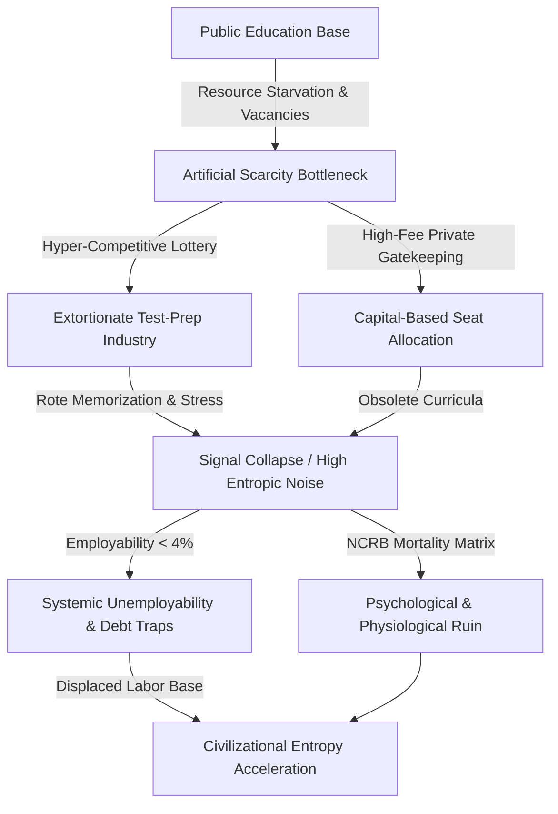

# SYSTEMIC RUIN OF EDUCATION AND COMMODITY EXTRACTION: AN ANALYSIS OF COGNITIVE TRANSMISSION AND SYSTEMIC ENTROPY

**Department of Macro-Sociology and Systems Epistemology**  
**Monograph Series on Civilizational Dynamics**

---

### ABSTRACT

This study provides a systemic analysis of the structural decay, commodity extraction, and thermodynamic entropy within national education architecture, using contemporary India as a empirical locus. We demonstrate how transforming educational infrastructure from an anti-entropic cognitive transmission system into an extractive commodity lottery induces structural paralysis across the public body. By integrating empirical telemetry—including public primary learning deficits, severe seat bottlenecks, market extraction via test-prep cartels, high student mortality rates, and systemic examination paper leaks—with a universal thermodynamic model of cognitive circulation, this paper formalizes the relationship between skill floor restrictions, class generation, and national sovereignty collapse. We quantify the Total Sovereignty Index ($TI$) under conditions of extreme economic asymmetry ($EI = 0.08$) and establish that the commodification of learning functions as a primary driver of civilizational entropy.

---

### I. EMPIRICAL DIAGNOSTICS: LOCAL DECAY IN THE INDIAN MATRIX

```
+-----------------------------------------------------------------------------------+
|                        THE EXTREME ELIMINATION MATRIX                             |
+-----------------------------------------------------------------------------------+
| System / Exam      | Applicants   | Available Seats  | Rejection Rate             |
+--------------------+--------------+------------------+----------------------------+
| UPSC Civil Services| ~13.0 Lakh   | ~1,000           | 99.92%                     |
| IIT-JEE Advanced   | ~14.5 Lakh   | ~17,500          | 98.80%                     |
| NEET-UG (Medical)  | ~24.0 Lakh   | ~55,000 (Govt)   | 97.71% (98.15% Overall)    |
| CAT (IIM Management| ~3.3 Lakh    | ~5,500           | 98.34%                     |
+-----------------------------------------------------------------------------------+
```

#### 1. Foundational Deficits and Structural Shrinkage
* $\text{ASER Field Telemetry}$: Over 50% of Grade 5 students in rural public primary institutions are unable to read a Grade 2 level text or perform basic 3-digit division.
* $\text{Multigrade Classrooms}$: Approximately 66% of Grade I and II public primary classrooms operate under multigrade arrangements, wherein a single instructor simultaneously handles multiple distinct grades.
* $\text{Enrolment Collapse}$: Over 52% of primary schools report an total enrolment of fewer than $60$ students, driven by widespread parental migration toward low-fee private alternatives.
* $\text{Sanctioned Vacancies}$: Over $10\text{ Lakh}$ ($1\text{ Million}+$) sanctioned public primary and secondary teaching posts remain vacant nationwide.

#### 2. Public Higher Education Capacity Bottlenecks
* $\text{CUET-UG Cut-off Inflation}$: General category admissions to top-tier central university programs (e.g., DU North Campus) demand scores ranging between 98.5% and 99.8% percentile ($780\text{--}795+ / 800$).
* $\text{Capacity Deficit}$: Premier public higher education institutions supply seats for less than 1.5% of the total candidate pool exceeding $40\text{ Million}$ applicants annually.

#### 3. The Triad of Educational Extortion
* $\text{Axis 1 (Test-Prep Cartels)}$: Extracts ₹1.0 Lakh Crore to ₹3.5 Lakh Crore annually from household savings, enforcing $12\text{--}14$ hour daily rote regimes through dummy school arrangements.
* $\text{Axis 2 (Capitation and Private Seat Cartels)}$: Fees for private or deemed university MBBS degrees range from ₹50 Lakh to ₹1.5+ Crore, while private engineering/management programs extract ₹10 Lakh to ₹25 Lakh for obsolete curricula.

#### 4. Physiological and Psychological Telemetry
* $\text{NCRB Mortality Data}$: National Crime Records Bureau records document over $13,000$ student suicides annually ($>35$ deaths per day).
* $\text{Examination Failures}$: Officially recorded mortalities directly linked to examination failure total $12,598$ youth ($<30\text{ years}$) across a 5-year monitoring window.
* $\text{Cohort Toxicity}$: Public ranking boards, color-coded student uniforms, and batch segregation induce clinical depression, panic disorders, and early-onset hypertension in $40\%\text{--}50\%$ of coaching aspirants.

#### 5. Exam Integrity Collapse & Institutional Breakdown
* $\text{Disruption Scale}$: Over $70$ major competitive and recruitment examination leaks across $15+$ states (including NEET-UG, REET, UP Police Constable, BPSC, and SSC CGL) have impacted over $1.5\text{ Crore}$ to $2.0\text{ Crore}$ aspirants.
* $\text{Institutional Compromise}$: Dark-channel distribution networks, unannounced grace marks, and score anomalies ($67$ perfect scores of $720$ in NEET-UG) have eroded trust in national testing bodies.

#### 6. The Degree Mill Paradox
* $\text{Surface Ratio vs. Quality Reality}$: While approved undergraduate engineering seats ($14.90\text{ Lakh}$) match JEE registered applicants ($14.50\text{ Lakh}$), only $\sim 52,500$ seats ($\sim 3.5\%$) across Tier-1 institutions deliver industry-standard technical training.
* $\text{Employability Benchmark}$: Only 3.84% of engineering graduates display functional algorithmic/software competency, leaving over $80\%\text{--}85\%$ unemployable in knowledge economy sectors and forcing families into debt traps to fund degrees that lead to low-wage gig work.

---

### II. UNIVERSAL PHYSICS MATRIX: THERMODYNAMIC & STRUCTURAL LAWS

#### 1. Thermodynamic Law of Cognitive Transmission
Education functions as the primary anti-entropic information transmission pipeline of a civilization. Physical systems decay toward maximum entropy ($S \to \infty$) unless low-entropy cognitive patterns are transferred from mature to developing nodes. The civilizational entropic decay rate is formulated as:

$$\frac{dS_{\text{Civilization}}}{dt} \propto \frac{1}{\eta_{\text{Edu}}}$$

where $\eta_{\text{Edu}}$ represents the efficiency of non-extractive, high-signal cognitive transmission across the system.

#### 2. Conservation and Uniform Distribution of Cognitive Potential
Raw cognitive capacity is uniformly distributed across the human population matrix. Creating artificial financial and numerical energy barriers clamps the population, inducing cognitive paralysis and systemic resistance. Restricting skill acquisition to a $2\%\text{--}5\%$ numerical window artificially generates a privileged elite class while manufacturing an underprivileged $95\%\text{--}98\%$ majority.

#### 3. Signal vs. Noise Inversion
When learning is privatized, the objective shifts from capability maximization ($\text{Signal}$) to gatekeeping extraction and credential gaming ($\text{Noise}$).



#### 4. Sovereignty Triad Dependency Analysis
Total Civilizational Sovereignty ($TI$) is governed by the non-linear coupling of Political Independence ($PI$), Economic Independence ($EI$), and Social Independence ($SI$):

$$TI = (PI + EI + SI) \times (PI \times EI \times SI)$$

Given the empirical baseline variables:
* $\text{PI} = 0.90$
* $\text{EI} = 0.08$
* $\text{SI} = 0.70$

Evaluating $TI$:

$$TI = (0.90 + 0.08 + 0.70) \times (0.90 \times 0.08 \times 0.70)$$

$$TI = (1.68) \times (0.0504) = 0.084672$$

The catastrophic drop in Economic Independence ($EI \to 0.08$), driven by youth un-employability and private extraction, suppresses the entire system's sovereignty score down to $TI \approx 0.0847$, regardless of nominal Political Independence ($PI = 0.90$).

---

### III. STRUCTURAL PATHOLOGY AND PHASE TRANSITION

```
+-----------------------------------------------------------------------------------+
|                       CIVILIZATIONAL STATE TRANSITION BARRIER                     |
+-----------------------------------------------------------------------------------+
|  ENTROPIC DECAY REGIME (Current State)                                             |
|  - High Entropic Noise (dS/dt >> 0)                                              |
|  - Skill Floor Bottlenecked at < 5% Capacity                                      |
|  - Sovereignty Index TI = 0.084672                                                |
|  - Systemic Extortion: ₹1.0L Cr - ₹3.5L Cr Extracted Annually                     |
|                                                                                   |
|                   ||  PHASE TRANSITION BOUNDARY  ||                               |
|                   \/                             \/                               |
|                                                                                   |
|  LIBERATED ANTI-ENTROPIC REGIME (Target State)                                    |
|  - Universal Open Skill Circulation                                               |
|  - Non-Extractive Cognitive Pipelines (η_Edu -> 1.0)                              |
|  - Structural Elimination of Capitation and Gatekeeping Cartels                  |
|  - Restoration of Sovereign Capacity (EI -> 0.85+, TI -> 1.50+)                   |
+-----------------------------------------------------------------------------------+
```

#### The National Betrayal Thesis
A political entity is defined by the cognitive, moral, and productive capacity of its constituent population. Restricting access to true skill acquisition and commodifying education transforms an essential public pipeline into an extractive lottery. This structural bottleneck locks the population into technological dependency, severe psychological distress, and long-term civilizational entropy.

---

### IV. CONCLUSION & RECOVERY VECTOR

To arrest systemic entropic decay, a nation must dismantle the extractive gatekeeping nexus. The recovery vector demands:

1. **Elimination of Artificial Bottlenecks**: Expanding top-tier public institutional capacity to match actual population demands.
2. **Eradication of Capitation Extortion**: Reclaiming private testing and degree-granting cartels into public-trust infrastructure.
3. **Restoration of Universal Transmission**: Ensuring high-signal cognitive access at the primary and secondary levels to allow unobstructed circulation of talent across the entire population matrix.