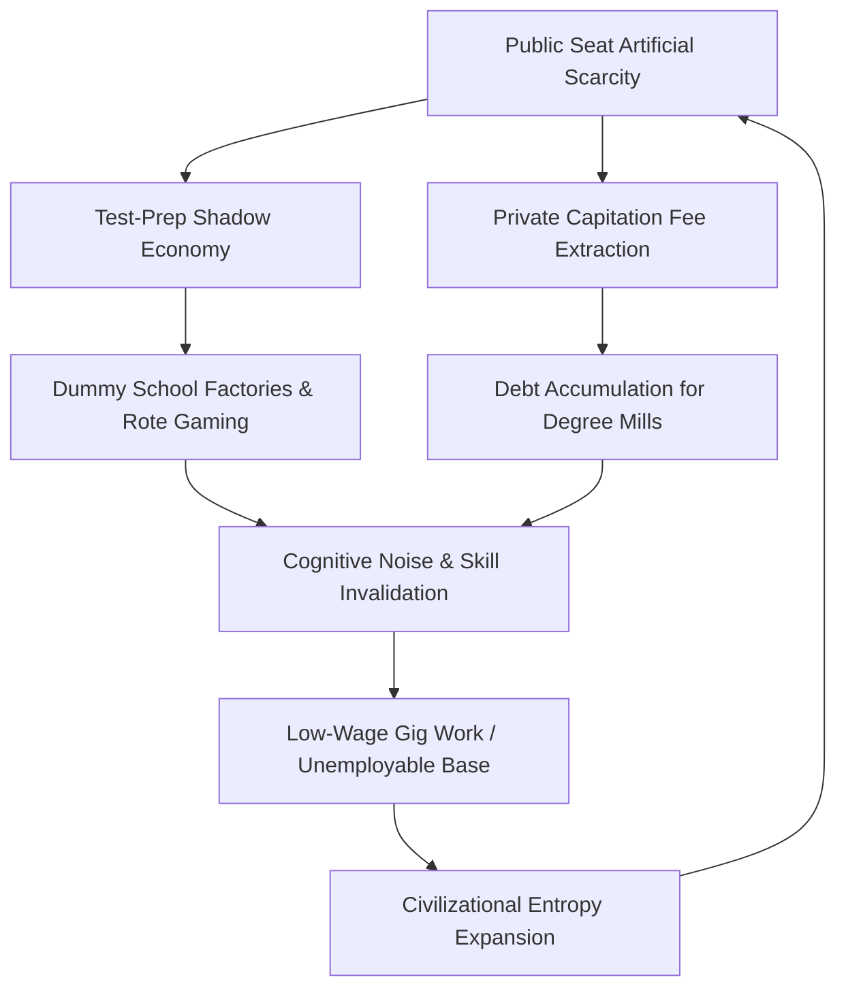

# Systemic Ruin of Education and Commodity Extraction: A Dual-Scale Analysis of Empirical Decay and Thermodynamic Entropy

$2\% -- 5\%$

$$
\text{Class Generation Causal Mechanics}: \quad 
\text{Bottleneck}_{\text{Skill Floor}} 
\Longrightarrow 
\text{Elite Creation}_{\text{Top 2-5\%}} 
+ 
\text{Underprivileged Base}_{\text{Bottom 95-98\%}}
$$

**Abstract**  
This paper formulates an integrated, structural, and thermodynamic critique of modern educational infrastructure, focusing on the systemic degradation of pedagogical access and its conversion into an extortionate commodity asset class. Utilizing empirical data from national surveys (ASER, NCRB) and competitive testing metrics alongside theoretical constructs from non-equilibrium thermodynamics, we demonstrate that the systematic restriction of the cognitive skill floor generates severe civilizational entropy ($dS_{\text{Civilization}} / dt \propto 1 / \eta_{\text{Edu}}$). The paper traces the empirical mechanics of foundational decay, public university hyper-inflation, paper leak networks, and psychological attrition, contextualized within a universal physical framework where educational bottlenecking manufactures class stratified inequality ($L_{\text{Gini}} \approx 0.92$, $EI \approx 0.08$). Ultimately, we evaluate youth resistance dynamics and outline non-negotiable structural interventions required to arrest systemic collapse.

---

## 1. Empirical Foundations of Primary, Secondary, and Higher Education Decay

The empirical collapse of the educational ecosystem operates across a continuous pipeline, beginning with foundational learning deficits in early childhood and culminating in hyper-inflated, artificially scarce higher education access points.

### 1.1 Primary & Secondary Foundational Decay
Data from the Annual Status of Education Report (ASER) indicates a structural failure in basic cognitive transmission:
* $\text{Learning Deficits (ASER)}: >50\%$ of Grade 5 students in rural public primary schools are incapable of reading a Grade 2 level text or executing basic 3-digit division.
* $\text{Multigrade Classrooms}: 66\%$ of Grade I & II public classrooms operate on multigrade arrangements, where a single instructor simultaneously manages multiple age and capability cohorts.
* $\text{Enrolment Shrinkage}: >52\%$ of public primary schools register total enrolments below 60 students due to systemic parental flight toward low-fee private institutions.
* $\text{Teacher Vacancies}: >10 \text{ Lakh } (1,000,000+)$ sanctioned primary and secondary public teaching positions remain unfilled across national jurisdictions.

### 1.2 Public University Bottlenecks and Hyper-Inflation
The severe shortage of quality public institutions transforms higher education selection into an extreme gatekeeping mechanism:
* $\text{CUET-UG Thresholds}: \text{Cut-offs for premier public colleges (e.g., DU North Campus) range from } 98.5\% \text{ to } 99.8\% \text{ percentile } (780\text{--}795+/800) \text{ for general category applicants.}$
* $\text{Public Capacity Scarcity}: \text{Top-tier public university seats account for } <1.5\% \text{ of the } >40 \text{ Million applicants nationwide.}$

### 1.3 The Extreme Elimination Matrix
The functional objective of national examination frameworks has inverted from skill verification to brutal demographic elimination:

$$\text{Rejection Rate } (\mathbb{R}) = \left( 1 - \frac{\text{Seats Available}}{\text{Total Applicants}} \right) \times 100$$

* $\text{UPSC Civil Services (CSE)}: 13.0 \text{ Lakh Applicants} \rightarrow 1,000 \text{ Seats} \implies \mathbb{R}_{\text{UPSC}} = 99.92\%$
* $\text{IIT-JEE Advanced}: 14.5 \text{ Lakh Applicants} \rightarrow 17,500 \text{ IIT Seats} \implies \mathbb{R}_{\text{JEE}} = 98.80\%$
* $\text{NEET-UG (Medical)}: 24.0 \text{ Lakh Applicants} \rightarrow 55,000 \text{ Govt MBBS Seats} \implies \mathbb{R}_{\text{NEET}} = 97.71\% \quad (\text{Overall Govt Seat Rejection} = 98.15\%)$
* $\text{CAT (IIM Management)}: 3.3 \text{ Lakh Applicants} \rightarrow 5,500 \text{ IIM Seats} \implies \mathbb{R}_{\text{CAT}} = 98.34\%$

---

## 2. The Triad of Educational Extortion and the Cattle Fodder Paradox

The artificial scarcity of high-quality public seats feeds an predatory shadow economy that monetizes human anxiety and structural desperation.

### 2.1 The Triad of Educational Extortion
* $\text{Axis 1 (Test-Prep and Coaching Mafia)}: \text{Extracts } \text{₹1.0 Lakh Crore} \text{ to } \text{₹3.5 Lakh Crore} \text{ (12B--42B USD) annually from household savings, forcing 12--14 hour daily rote routines via dummy school setups.}$
* $\text{Axis 2 (Private Seat and Capitation Fee Mafia)}: \text{Private/deemed university MBBS seats command } \text{₹50 Lakh} \text{ to } \text{₹1.5+ Crore}; \text{ substandard engineering/management programs extract } \text{₹10 Lakh} \text{ to } \text{₹25 Lakh} \text{ for obsolete curricula.}$
* $\text{Axis 3 (Institutional Degradation)}: \text{Universities operate as real estate and fee-extraction vehicles rather than centers of research and innovation.}$

### 2.2 The Cattle Fodder Paradox (The Fake Equilibrium)
A surface-level equilibrium hides systemic skill degradation across engineering and technical sectors:
* $\text{Surface Ratio}: 14.90 \text{ Lakh approved undergraduate engineering seats vs. } 14.50 \text{ Lakh JEE applicants } (1:1 \text{ ratio}).$
* $\text{Quality Benchmark}: \text{Only } \sim 52,500 \text{ seats } (\sim 3.5\%) \text{ across IITs, NITs, and Tier-1 colleges offer industry-grade training.}$
* $\text{Employability Crisis}: \text{Only } 3.84\% \text{ of technical graduates demonstrate baseline algorithmic/software competency; } >80\% \text{ to } 85\% \text{ remain fundamentally unemployable in the high-value knowledge economy.}$
* $\text{Degree Mill Mechanics}: 96.5\% \text{ of available seats function as credential factories, converting family assets into structural underemployment (gig economy, call centers, low-tier delivery operations)}.$

---

## 3. Psychological Attrition and Paper Leak Scams

The operationalization of hyper-elimination mechanisms creates severe psychological degradation and destabilizes national testing integrity.

### 3.1 Physiological & Mental Health Telemetry
National Crime Records Bureau (NCRB) telemetry reveals severe psychological strain on the student population:
* $\text{Annual Student Suicides}: >13,000 \text{ documented cases annually } (>35 \text{ deaths/day; } 1 \text{ every } 40 \text{ minutes}).$
* $\text{Examination Failure Mortalities}: 12,598 \text{ youth deaths } (<30 \text{ years old}) \text{ directly attributed to exam failure within a 5-year tracking window.}$
* $\text{Batch Toxicity Impact}: 40\% \text{ to } 50\% \text{ of coaching aspirants exhibit clinical depression, panic disorders, or early-onset hypertension induced by weekly public rank boards and uniform-color segregation.}$

### 3.2 Examination Integrity and Paper Leak Matrix
The testing apparatus suffers from persistent institutional breakdowns:
* $\text{Disruption Scale}: >70 \text{ major competitive and recruitment paper leaks documented across } 15+ \text{ states (NEET-UG, REET, UP Police Constable, Bihar BPSC, SSC CGL), impacting } 1.5 \text{ Crore to } 2.0 \text{ Crore aspirants.}$
* $\text{Institutional Compromise}: \text{Dark-channel paper distribution, inflated score clusters (67 perfect 720/720 scores in NEET-UG), and unannounced grace-mark allocations have eroded trust in testing agencies.}$
* $\text{Enforcement Deficit}: \text{Statutory frameworks such as the Public Examinations (Prevention of Unfair Means) Act, 2024 fail to disrupt the underlying political-coaching-mafia networks.}$

---

## 4. Universal Thermodynamic Theory of Cognitive Transmission

From a systemic perspective, education functions as a critical mechanism to counteract entropy within complex human societies.

### 4.1 Thermodynamic Law of Cognitive Transmission
Physical systems naturally decay toward maximum entropy ($S \rightarrow \infty$). High-order cognitive patterns must be efficiently transferred across generational cohorts to maintain complex social and physical infrastructure:

$$\frac{dS_{\text{Civilization}}}{dt} \propto \frac{1}{\eta_{\text{Edu}}}$$

Where $\eta_{\text{Edu}}$ represents the systemic efficiency of cognitive transmission. When $\eta_{\text{Edu}} \rightarrow 0$, civilizational entropy accelerates, causing structural degradation across technological, operational, and ethical domains.

### 4.2 Class Generation Model via Artificial Bottlenecks
Cognitive capability is distributed broadly across human populations. Restricting high-tier educational access to an artificial 2--5% window redefines class structure dynamics:

$$
\text{Class Generation Causal Mechanics}: \quad 
\text{Bottleneck}_{\text{Skill Floor}} 
\Longrightarrow 
\text{Elite Creation}_{\text{Top 2-5\%}} 
+ 
\text{Underprivileged Base}_{\text{Bottom 95-98\%}}
$$

This artificial restriction functions as a class generator, systematically producing a vast, low-wage majority while concentrating economic capital ($L_{\text{Gini}} \approx 0.92$).

### 4.3 Total Independence Index ($TI$) Coupling
The structural health of a republic depends on the interaction between political, economic, and social independence:

$$TI = (PI + EI + SI) \times (PI \times EI \times SI)$$

Given empirical baseline parameters:
* $\text{Political Independence } (PI) = 0.90$
* $\text{Economic Independence } (EI) = 0.08 \quad (\text{driven down by credential debt and low employability})$
* $\text{Social Independence } (SI) = 0.70 \quad (\text{suppressed by hyper-elimination strain})$

Evaluating the systemic coupled index:

$$TI = (0.90 + 0.08 + 0.70) \times (0.90 \times 0.08 \times 0.70)$$

$$TI = (1.68) \times (0.0504) = 0.084672$$

The systemic calculation shows that an Economic Independence metric of $EI = 0.08$ collapses the overall Total Independence Index to $TI \approx 0.0847$, demonstrating how educational extortion directly degrades broader societal autonomy.

---

## 5. Youth Resistance, Systemic Transitions, and Policy Directives

The breakdown of educational mobility triggers visible public counter-responses and mobilization.

### 5.1 Youth Resistance and Street Telemetry
* $\text{Mobilization Vectors}: \text{Student-led marches, including Sansad Chalo, Jantar Mantar rallies, and CJP mobilizations against NTA integrity failures.}$
* $\text{State Countermeasures}: \text{Heavy perimeter barricading, targeted internet suspensions in urban nodes, lathi charges, and preventative detentions of student representatives.}$
* $\text{Slogans and Demands}: \text{Public mobilization around core assertions: "Education is Not a Commodity," "Empathy Over Empire," and "Free, Fair and Quality Education is a Universal Right."}$

### 5.2 Systemic Phase Transitions
When access to skill acquisition is artificially restricted, public systems undergo a structural phase transition:
1. $\text{Internal Decay}: \text{Credential inflation weakens technical capacity while the working base remains under-skilled, reducing systemic problem-solving capabilities.}$
2. $\text{Institutional Inversion}: \text{As the skill floor remains restricted, collective youth energy shifts from traditional learning pathways toward active structural contestation.}$

### 5.3 Core Reform Directives
To re-establish educational integrity and lower civilizational entropy, structural interventions must be implemented:
* $\text{Expansion of Public Capacity}: \text{Increase premier public higher education seat availability by } 10\times \text{ to eliminate artificial scarcity.}$
* $\text{Dismantling Shadow Test-Prep Industry}: \text{Ban "dummy school" arrangements, enforce strict regulation on test-prep coaching entities, and align selection criteria with core secondary school curricula.}$
* $\text{Auditing and Integrity Measures}: \text{Establish independent paper-security protocols with mandatory open-source audits for all public examination bodies.}$
* $\text{Foundational Level Remediation}: \text{Redirect primary educational funding to eliminate multigrade setups, fill all } 10 \text{ Lakh+} \text{ public teaching vacancies, and guarantee functional literacy/numeracy benchmarks.}$
