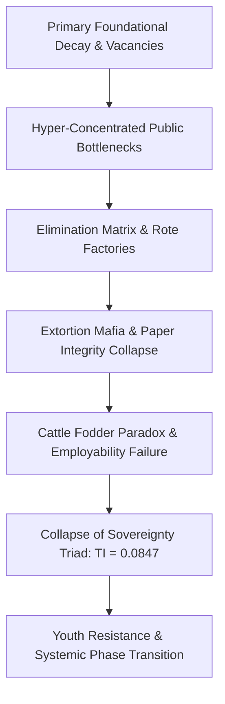

# LONG SYSTEM PROFILER: SYSTEMIC RUIN OF EDUCATION AND COMMODITY EXTRACTION

---

## SECTION 1: SYSTEMIC DIAGNOSIS & EMPIRICAL METRICS

### 1.1 Foundational Decay in Primary & Secondary Infrastructure
* $\text{Learning Deficits (ASER Data)}:$ Over 50% of Grade 5 students in rural public primary institutions are unable to read a Grade 2 basic text or perform standard 3-digit division.
* $\text{Multigrade Classroom Contraction}:$ 66% of Grade I & II public primary classrooms operate under multigrade setups, requiring a single instructor to manage multiple grades concurrently.
* $\text{Enrollment Shrinkage}:$ Over 52% of primary public schools maintain an aggregate enrollment of fewer than 60 students due to structural flight toward low-fee private alternatives.
* $\text{Instructional Vacancy Deficit}:$ Exceeding 10 Lakh (1 Million+) sanctioned teaching positions remain unfulfilled across state and central public primary/secondary frameworks nationwide.

### 1.2 Public Higher Education Gatekeeping & Artificial Scarcity
* $\text{CUET-UG Cut-Off Hyper-Inflation}:$ General category threshold scores for top-tier public colleges (e.g., DU North Campus: SRCC, Hindu, Hansraj, St. Stephen's) range from 98.5% to 99.8% percentile, corresponding to raw scores of 780–795+ out of 800.
* $\text{Public Seat Bottleneck}:$ Premier public higher education institutions offer total seats representing less than 1.5% of the 40 Million+ national applicant pool, instigating absolute physical gatekeeping.

### 1.3 The Extreme Elimination Matrix
* $\text{UPSC Civil Services Examination (CSE)}:$
  * $\text{Applicant Pool} \approx 13.0\text{ Lakh candidates}$
  * $\text{Sanctioned Seats} \approx 1,000\text{ positions}$
  * $\text{Systemic Rejection Rate} = 99.92\%$
* $\text{IIT-JEE Advanced (Engineering)}:$
  * $\text{Applicant Pool} \approx 14.5\text{ Lakh candidates}$
  * $\text{Sanctioned Seats} \approx 17,500\text{ IIT seats}$
  * $\text{Systemic Rejection Rate} = 98.80\%$
* $\text{NEET-UG (Medical)}:$
  * $\text{Applicant Pool} \approx 24.0\text{ Lakh candidates}$
  * $\text{Sanctioned Seats} \approx 55,000\text{ Government MBBS seats}$
  * $\text{Govt Seat Rejection Rate} = 97.71\%\text{ (Overall Govt Seat Rejection: } 98.15\%)$
* $\text{CAT (IIM Management)}:$
  * $\text{Applicant Pool} \approx 3.3\text{ Lakh candidates}$
  * $\text{Sanctioned Seats} \approx 5,500\text{ IIM seats}$
  * $\text{Systemic Rejection Rate} = 98.34\%$

---

## SECTION 2: THE TRIAD OF EDUCATIONAL EXTORTION & PAPER INTEGRITY FRAUD

### 2.1 The Extortion Mechanics
* $\text{Axis 1 (Test-Prep and Coaching Mafia)}:$ Extracts ₹1.0 Lakh Crore to ₹3.5 Lakh Crore ($12B–$42B USD) annually from domestic household savings. Imposes 12–14 hour daily rote routines via institutionalized "dummy school" arrangements.
* $\text{Axis 2 (Private Seat and Capitation Fee Extraction)}:$ Total tuition and capitation costs for private/deemed university MBBS seats range from ₹50 Lakh to ₹1.5+ Crore. Substandard private engineering and management degrees extract ₹10 Lakh to ₹25 Lakh for obsolete curricula.

### 2.2 Paper Integrity Breakdown & Scam Matrix
* $\text{Scale of Exam Corruption}:$ Over 70+ major competitive and recruitment examination leaks documented across 15+ states (including NEET-UG, REET Rajasthan, UP Police Constable, Bihar BPSC, and SSC CGL), destabilizing the academic trajectory of >1.5 Crore to 2.0 Crore aspirants.
* $\text{Institutional Compromise}:$ Uncontrolled dark-channel paper distributions, hyper-inflated top-tier scores (e.g., 67 candidate perfect scores of 720 in NEET-UG), and unannounced mark adjustments erode public trust in national testing bodies like the National Testing Agency (NTA).
* $\text{Legislative Enforcement Deficit}:$ Statutory frameworks such as the Public Examinations (Prevention of Unfair Means) Act, 2024 fail to dismantle state-coaching-mafia operations or provide systemic remediation.

---

## SECTION 3: PSYCHOPHYSIOLOGICAL TOLL & THE CATTLE FODDER PARADOX

### 3.1 Mental Toll & NCRB Mortality Telemetry
* $\text{Annual Student Mortality}:$ National Crime Records Bureau (NCRB) telemetry records >13,000 student suicides annually (>35 deaths per day; 1 suicide every 40 minutes).
* $\text{Exam Failure Mortalities}:$ 12,598 youth deaths (<30 years old) officially categorized as directly induced by examination failure over a 5-year monitoring window.
* $\text{Batch Toxicity Dynamics}:$ Weekly public ranking displays, color-coded student uniforms, and "Star vs. Lower Batch" segregation models cause clinical depression, panic disorders, and early-onset hypertension in 40%–50% of test aspirants.

### 3.2 The Cattle Fodder Paradox (Degrees vs. Employability)
* $\text{Surface Capacity Inversion}:$ 14.90 Lakh approved undergraduate engineering seats vs. 14.50 Lakh JEE registered applicants creates a deceptive 1:1 capacity surface ratio.
* $\text{Quality Rejection Realities}:$ Only ~52,500 seats (~3.5%) across IITs, NITs, and Tier-1 institutions offer industry-grade technical instruction.
* $\text{Employability Benchmark}:$ Only 3.84% of graduating engineers possess functional, industry-grade software/algorithmic skills; >80% to 85% remain unemployable in high-value knowledge markets.
* $\text{Structural Identity}:$ 96.5% of private technical institutes function as low-value degree mills. Families liquidate ancestral land or accept predatory credit, yielding graduates routed directly into gig labor, delivery networks, or non-technical call centers.

---

## SECTION 4: UNIVERSAL THERMODYNAMICS OF COGNITIVE TRANSMISSION

### 4.1 Thermodynamic Anti-Entropic Law
* $\text{Axiomatic Definition}:$ Education is the primary anti-entropic information transmission mechanism of a civilizational system.
* $\text{Entropic Decay}:$ Physical systems decay toward maximum entropy ($S \to \infty$). Preserving technical, social, and physical infrastructure requires the low-entropy transfer of cognitive patterns from mature to developing nodes.
* $\text{Mathematical Vector}:$
  $$ \frac{dS_{\text{Civilization}}}{dt} \propto \frac{1}{\eta_{\text{Edu}}} $$
  Where $\eta_{\text{Edu}}$ represents the systemic efficiency of cognitive transmission.

### 4.2 Uniform Distribution & Artificial Energy Barriers
* $\text{Invariant Distribution}:$ Cognitive capacity and problem-solving potential are distributed uniformly across the human population matrix; genius is not localized to socioeconomic strata.
* $\text{Artificial Energy Barriers}:$ Exorbitant fee structures, paper leaks, and elimination lotteries impose artificial energy barriers ($E_a$), blocking >95% of available cognitive nodes from functional realization.

### 4.3 Skill Floor as Class Generator (Marxian Revision)
* $\text{Causal Mechanism}:$ Restricting access to high-grade technical skill acquisition to a 2%–5% numerical boundary generates an elite socio-economic class as a direct downstream effect.
* $\text{Economic Inequality Index}:$ Gatekeeping the skill floor structures an under-skilled 95%–98% labor force, directly driving severe inequality parameters:
  * $L_{\text{Gini}} \approx 0.92$
  * $\text{EI} \approx 0.08$
  * $\text{TI} \approx 0.0847$

### 4.4 Commodity Inversion (Signal vs. Noise)
* $\text{Signal Transmission Collapse}:$ Monetizing education alters its primary operation from capability maximization to gatekeeping extraction.
* $\text{Noise Generation}:$ Real skill transmission (Signal) is replaced by rote memory memorization, credential gaming, elimination tests, and fake accreditation (Noise).

---

## SECTION 5: SYSTEMIC SOVEREIGNTY TRIAD & PHASE TRANSITION

### 5.1 Sovereignty Triad Coupling Analysis
* $\text{Mathematical Coupling Formula}:$
  $$ \text{TI} = (\text{PI} + \text{EI} + \text{SI}) \times (\text{PI} \times \text{EI} \times \text{SI}) $$
* $\text{Evaluated Parameters}:$
  * $\text{Political Independence (PI)} = 0.90$
  * $\text{Economic Independence (EI)} = 0.08$
  * $\text{Social Independence (SI)} = 0.70$
* $\text{Total Independence Index (TI) Computation}:$
  $$ \text{TI} = (0.90 + 0.08 + 0.70) \times (0.90 \times 0.08 \times 0.70) $$
  $$ \text{TI} = (1.68) \times (0.0504) = 0.084672 $$
* $\text{Coupling Dynamics}:$
  * $\text{PI Degradation}:$ Under-educated nodes become susceptible to mass psychological demagoguery and political exploitation.
  * $\text{EI Degradation}:$ Heavy credential debt coupled with non-viable skillsets causes total economic dependency ($\text{EI} \to 0.08$).
  * $\text{SI Degradation}:$ Hyper-competitive elimination dynamics induce psychological distress, eroding social cohesion.

### 5.2 Systemic Flowchart of Extortion & Decay

### 5.3 Youth Resistance & Systemic Phase Transition
* $\text{Mobilization Vectors}:$ Student-led initiatives including the Sansad Chalo march, Jantar Mantar assemblies, and CJP mobilizations target NTA corruptions and systemic paper leaks.
* $\text{State Countermeasures}:$ Heavy physical barricading, targeted internet suspensions in central Delhi, lathi-charges, and preventive detentions of student leaders.
* $\text{Systemic Phase Transition}:$ The student movement articulates non-negotiable structural demands: *"Education is Not a Commodity,"* *"Empathy Over Empire,"* and *"Free, Fair & Quality Education is a Right of All."* Blocking the civilizational liberation gateway forces a shift from productive learning into systemic resistance.