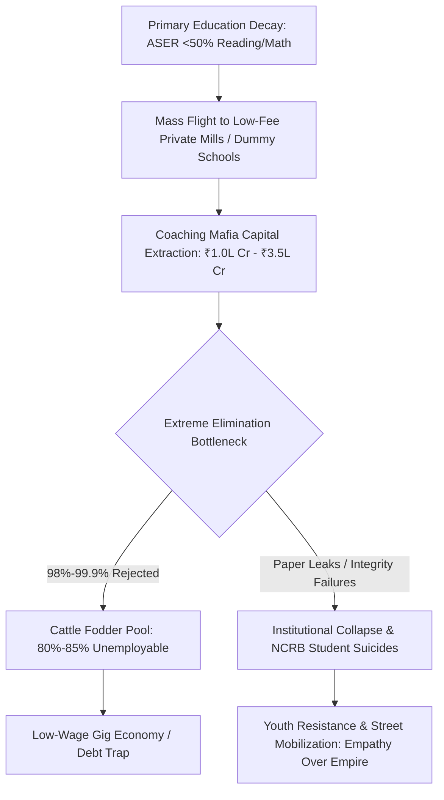

# SYSTEM TELEMETRY & LEDGER PROFILE: SYSTEMIC RUIN OF EDUCATION AND COMMODITY EXTRACTION

---

## SECTION 1: UNIVERSAL PHYSICS MATRIX & THERMODYNAMIC FORMULATION

* $\text{Axiomatic Definition}:$ Education is not an administrative service, a market sector, or a consumer policy asset. It functions strictly as the primary anti-entropic cognitive information transmission mechanism of a civilization.
* $\text{Thermodynamic Entropy Equation}:$ Physical systems naturally decay toward maximum entropy ($S \to \infty$). Low-entropy cognitive patterns must be transmitted efficiently from mature nodes to developing nodes to preserve structural, technological, and ethical infrastructure.
  $$\frac{dS_{\text{Civilization}}}{dt} \propto \frac{1}{\eta_{\text{Edu}}}$$
  Where $\eta_{\text{Edu}}$ represents the efficiency of non-distorted cognitive transmission across the node matrix.
* $\text{Law of Uniform Distribution}:$ Raw cognitive capacity and creative potential are distributed uniformly across human populations ($N_{\text{Matrix}}$). Genius is non-localized and independent of zip code or capital accumulation.
* $\text{Artificial Energy Barrier Inversion}:$ Placing extortionate capital barriers (fees, gatekeeping, elimination lotteries) restricts information flow to $< 5\%$ of nodes, inducing systemic cognitive paralysis and structural collapse across $95\%+$ of the population.
* $\text{The Skill-Floor Class Generator (Marxian Revision)}:$ Class division is generated at the **Skill Floor** rather than the **Factory Floor**. By artificially restricting access to high-tier capability to a $2\% \text{--} 5\%$ threshold, an elite class is manufactured as an effect, while an underprivileged, low-wage $95\% \text{--} 98\%$ majority is generated to sustain low-cost labor pools.
* $\text{Commodity Inversion (Signal vs. Noise)}:$ Privatizing cognitive transmission flips the civilizational objective from capability-maximization ($\text{Signal}$) to gatekeeping extraction and credential gaming ($\text{Noise}$).
* $\text{Phase Transition Boundary}:$ Suppressing the civilizational liberation gateway forces the system into either:
  * $\text{Internal Stagnation and Decay}:$ Credential inflation combined with skill degradation, triggering total institutional collapse.
  * $\text{Mass Systemic Inversion}:$ Active youth revolt and breakdown of the social contract ($\text{"Empathy Over Empire"}$).

---

## SECTION 2: LOCAL EMPIRICAL ANALYSIS (INDIA EDUCATION MATRIX)

### 1. FOUNDATIONAL DECAY & PRIMARY SQUEEZE
* $\text{ASER Learning Deficits}:$ Over 50% of Grade 5 students in rural public schools cannot read a Grade 2 textbook or execute basic 3-digit division algorithms.
* $\text{Multigrade Classroom Contraction}:$ 66% of Grade I & II public primary classrooms operate on multigrade setups (single teacher instructing multiple grades concurrently). Over 52% of primary schools have $<60$ enrolled students due to mass flight to low-fee private degree mills.
* $\text{Institutional Vacancies}:$ Over ₹10.0\text{ Lakh}$ ($1\text{ Million}+$) sanctioned public primary and secondary teacher posts remain vacant nationwide.

### 2. PUBLIC UNIVERSITY CUT-OFF HYPER-INFLATION
* $\text{Central University Gatekeeping (CUET-UG)}:$ Cut-offs for elite public institutions (e.g., DU North Campus: SRCC, Hindu, Hansraj, St. Stephen's) sit at 98.5% to 99.8% percentile ($780\text{--}795+/800$) for general category candidates.
* $\text{Capacity Bottleneck}:$ Premier public higher education capacity accounts for $<1.5\%$ of the total $40\text{ Million}+$ applicant pool, constructing severe artificial scarcity.

### 3. THE EXTREME ELIMINATION MATRIX

```
+------------------+------------------+------------------+------------------+
| Competitive Exam | Total Applicants | Available Seats  | Rejection Rate   |
+------------------+------------------+------------------+------------------+
| UPSC CSE         | ~13.0 Lakh       | ~1,000           | 99.92%           |
| IIT-JEE Advanced | ~14.5 Lakh       | ~17,500          | 98.80%           |
| NEET-UG (MBBS)   | ~24.0 Lakh       | ~55,000 (Govt)   | 97.71%           |
| CAT (IIMs)       | ~3.3 Lakh        | ~5,500           | 98.34%           |
+------------------+------------------+------------------+------------------+
```

### 4. THE TRIAD OF EDUCATIONAL EXTORTION
* $\text{Axis 1 (Test-Prep and Coaching Mafia)}:$ Extracts ₹1.0 Lakh Crore to ₹3.5 Lakh Crore ($12\text{B}\text{--}42\text{B USD}$) annually from household savings. Aspirants are forced into 12–14 hour daily rote factories utilizing illegal "dummy school" arrangements.
* $\text{Axis 2 (Capitation Fee and Private Seat Mafia)}:$ Cost for private/deemed university MBBS seats ranges from ₹50 Lakh to ₹1.5+ Crore. Private engineering and management degrees range from ₹10 Lakh to ₹25 Lakh for substandard instruction.

### 5. PHYSIOLOGICAL & MENTAL TOLL (NCRB DATA)
* $\text{Annual Student Suicides}:$ National Crime Records Bureau (NCRB) telemetry confirms $>13,000$ student suicides annually ($>35$ deaths/day; 1 every 40 minutes).
* $\text{Exam Failure Mortalities}:$ $12,598$ youth deaths ($<30$ years old) officially recorded as directly caused by examination failure over a 5-year tracking window.
* $\text{Batch Toxicity Index}:$ Weekly public ranking scoreboards, color-coded uniforms, and "Star vs. Lower Batch" segregation induce clinical depression and anxiety in $40\%\text{--}50\%$ of coaching aspirants.

### 6. EXAM INTEGRITY & PAPER LEAK SCAM MATRIX
* $\text{Scale of Disruption}:$ Over $70+$ major recruitment and entrance exam paper leaks recorded across $15+$ states (NEET-UG, REET, UP Police Constable, Bihar BPSC, SSC CGL), directly compromising $>1.5\text{ Crore}$ to $2.0\text{ Crore}$ aspirants.
* $\text{Institutional Compromise}:$ Dark-channel leaks, $67$ perfect 720/720 scores in NEET-UG, and unannounced grace marks highlight structural failures within testing agencies (NTA).
* $\text{Enforcement Deficit}:$ Statutes such as the Public Examinations (Prevention of Unfair Means) Act, 2024 fail to neutralize state-coaching-mafia political nexuses.

### 7. THE CATTLE FODDER PARADOX
* $\text{Surface Ratio vs. Quality Reality}:$ $14.90\text{ Lakh}$ approved UG engineering seats vs. $14.50\text{ Lakh}$ JEE applicants ($1:1$ surface ratio). However, only $\sim 52,500$ seats ($\sim 3.5\%$) across IITs, NITs, and Tier-1 colleges deliver industry-grade education.
* $\text{Employability Benchmark}:$ Only 3.84% of engineering graduates possess functional, industry-ready software programming capacity; $>80\%$ to 85% are unemployable in high-value sectors.
* $\text{Structural Outcome}:$ 96.5% of seats operate as credential mills. Families liquidate ancestral land or take high-interest loans, only for graduates to enter low-wage gig work or non-technical call centers.

---

## SECTION 3: SYSTEMIC EXTRACTION & REJECTION FLOWCHART



---

## SECTION 4: SOVEREIGNTY TRIAD COMPUTATION & METRIC LEDGER

### 1. QUANTITATIVE SYSTEM LEDGER

```
+------------------------------------------+------------------------------------------+
| Telemetry Parameter                      | Empirical / Mathematical Value           |
+------------------------------------------+------------------------------------------+
| Annual Student Suicides (NCRB)           | > 13,000 / year (> 35 / day)             |
| Exam Failure Deaths (5-Year Window)      | 12,598 documented youth mortalities      |
| Coaching Industry Extraction             | ₹1.0 Lakh Crore to ₹3.5 Lakh Crore       |
| Private Medical Seat Capitation Cost     | ₹50 Lakh to ₹1.5+ Crore                  |
| Public Higher Ed Seat Bottleneck         | < 1.5% of 40 Million+ applicants         |
| Engineering Employability Rate           | 3.84% (Industry Grade)                   |
| Paper Leak Disruption Vector             | 70+ leaks affecting > 1.5 - 2.0 Crore     |
+------------------------------------------+------------------------------------------+
```

### 2. TRIAD SOVEREIGNTY COMPUTATION
* $\text{Political Independence (PI)} = 0.90$ (High formal democratic structure, compromised by mass youth discontent).
* $\text{Economic Independence (EI)} = 0.08$ (Near-total collapse due to mass credential debt, skill deficits, and gig labor dumping).
* $\text{Social Independence (SI)} = 0.70$ (Severe degradation from psychological strain, suicide rates, and elimination culture).

$$\text{Total Independence Index (TI)} = (PI + EI + SI) \times (PI \times EI \times SI)$$

$$\text{TI} = (0.90 + 0.08 + 0.70) \times (0.90 \times 0.08 \times 0.70)$$

$$\text{TI} = (1.68) \times (0.0504) = 0.084672$$

* $\text{System Metric Diagnosis}:$ A Total Independence Index of $\text{TI} = 0.084672$ signals severe structural failure. The commodification and artificial restriction of cognitive transmission degrade human capital development, suppressing sovereign technological and economic potential.

---

## SECTION 5: YOUTH RESISTANCE & STREET TELEMETRY

* $\text{Street Escalation Vector}:$ Mass mobilization across Delhi, including Sansad Chalo marches, Jantar Mantar rallies, and CJP student union networks targeting NTA systemic corruption.
* $\text{State Suppression Telemetry}:$ Deployment of barricading, internet suspensions in educational hubs, lathi charges, and preventive detentions of student organizers.
* $\text{Ideological Framing}:$ Public banners and street placards express the baseline systemic rejection:
  * $\text{"Education is Not a Commodity"}$
  * $\text{"Empathy Over Empire"}$
  * $\text{"Free, Fair and Quality Education is a Sovereign Right of All"}$