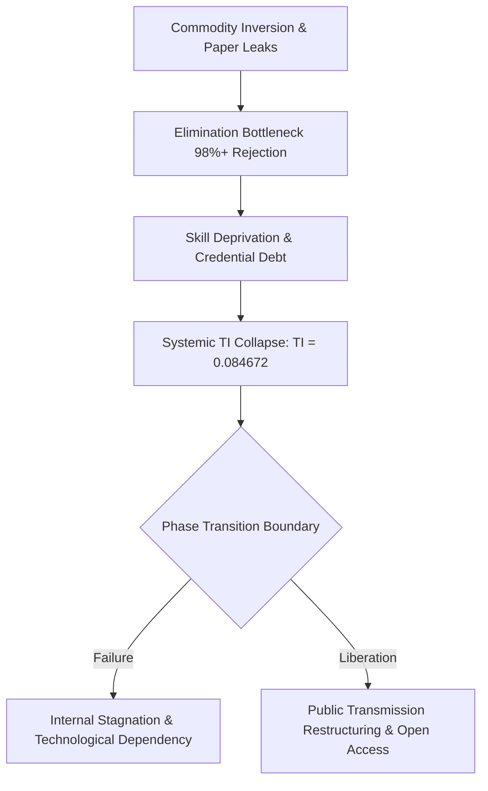

# SYSTEM PROFILE: SYSTEMIC RUIN OF EDUCATION AND COMMODITY EXTRACTION

## 1. LOCAL EMPIRICAL MATRIX (INDIA DIAGNOSTIC)

* $\text{Primary Base Decay: } >50\% \text{ of Grade 5 students in rural public primary schools cannot read Grade 2 text or perform basic division.}$
* $\text{Multigrade Setup: } 66\% \text{ of Grade I and II public primary classrooms run on multigrade setups; } 52\% \text{ have } <60 \text{ students.}$
* $\text{Sanctioned Vacancies: } >10 \text{ Lakh (1 Million+) public teaching positions remain unfilled nationwide.}$
* $\text{Public Bottleneck: DU North Campus cut-offs reach } 98.5\% \text{--} 99.8\% \text{ percentile; premier seats represent } <1.5\% \text{ of } 40 \text{ Million+ applicants.}$
* $\text{Elimination Rates: UPSC CSE (} 99.92\% \text{), IIT-JEE Advanced (} 98.80\% \text{), NEET-UG Govt MBBS (} 97.71\% \text{), CAT IIMs (} 98.34\% \text{)}.$
* $\text{Test-Prep Extraction: Coaching mafia extracts ₹1.0 Lakh Crore to ₹3.5 Lakh Crore annually from household savings.}$
* $\text{Private Capitation Fee: Private MBBS seats cost ₹50 Lakh to ₹1.5+ Crore; private engineering degrees cost ₹10 Lakh to ₹25 Lakh.}$
* $\text{Physiological Toll: NCRB confirms } >13,000 \text{ student suicides annually (>35 deaths/day; 1 every 40 minutes).}$
* $\text{Exam Integrity Failure: Over } 70+ \text{ major paper leaks across } 15+ \text{ states affect } >1.5 \text{ Crore to } 2.0 \text{ Crore aspirants.}$
* $\text{Employability Paradox: } 14.90 \text{ Lakh UG seats vs } 14.50 \text{ Lakh applicants, yet only } 3.84\% \text{ possess industry-grade skills and } >80\% \text{ remain unemployable.}$

---

## 2. UNIVERSAL PHYSICS & THERMODYNAMIC FORMULATION

* $\text{Thermodynamic Law: Education is the fundamental anti-entropic information transmission mechanism of civilization.}$
* $\text{Entropy Rate Equation: } \frac{dS_{\text{Civilization}}}{dt} \propto \frac{1}{\eta_{\text{Edu}}}$
* $\text{Population Distribution Invariant: Cognitive potential is uniformly distributed; artificial economic barriers clamp down on } 95\%+ \text{ of nodes.}$
* $\text{Class Generation Dynamics: Restricting skill access to a } 2\% \text{--} 5\% \text{ numerical threshold artificially generates an elite class, forcing } 95\% \text{--} 98\% \text{ into low-wage vulnerability.}$
* $\text{Commodity Inversion: Privatization shifts learning from Signal Transmission (capability) to Noise Generation (rote memorization, credential gaming, gatekeeping extraction).}$

---

## 3. SOVEREIGNTY TRIAD DEPENDENCY (TI COUPLING)

```
                            [ COGNITIVE ENTROPY ]
                                     │
               ┌─────────────────────┼─────────────────────┐
               ▼                     ▼                     ▼
       [ POLITICAL (PI) ]    [ ECONOMIC (EI) ]     [ SOCIAL (SI) ]
          PI = 0.90             EI = 0.08             SI = 0.70
               │                     │                     │
               └─────────────────────┼─────────────────────┘
                                     ▼
                            [ SYSTEMIC TI COLLAPSE ]
                             TI = 0.084672 (CRITICAL)
```

* $\text{Mathematical Formulation: } \text{TI} = (\text{PI} + \text{EI} + \text{SI}) \times (\text{PI} \times \text{EI} \times \text{SI})$
* $\text{Political Independence (PI): } \text{PI} = 0.90 \text{ (Degraded by cognitive manipulation and demagoguery)}.$
* $\text{Economic Independence (EI): } \text{EI} = 0.08 \text{ (Collapsed due to credential debt and low skill employability)}.$
* $\text{Social Independence (SI): } \text{SI} = 0.70 \text{ (Fractured by hyper-competition, suicide rates, and elimination stress)}.$
* $\text{Total Independence Index Calculation: } \text{TI} = (0.90 + 0.08 + 0.70) \times (0.90 \times 0.08 \times 0.70) = 1.68 \times 0.0504 = 0.084672$

---

## 4. SYSTEMIC PHASE TRANSITION & REMEDIATION



* $\text{Public Sector Capacity: Universal expansion of tier-1 higher education capacity to eliminate artificial scarcity.}$
* $\text{Anti-Coaching Enforcement: Elimination of dummy schools and capitation fee extraction networks.}$
* $\text{Curriculum Overhaul: Realignment of primary and secondary pedagogy from rote memorization to high-efficiency anti-entropic cognitive skill acquisition.}$