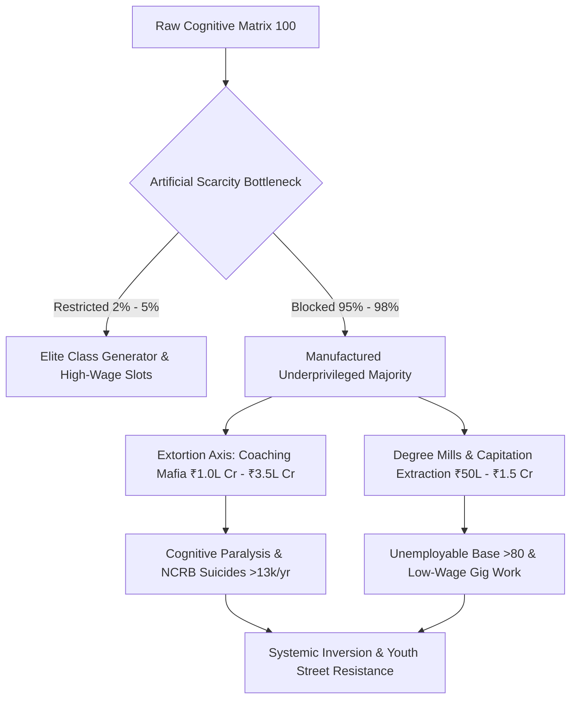

# SYSTEM PROFILE: SYSTEMIC RUIN OF EDUCATION & COMMODITY EXTRACTION

## 1. VECTOR TELEMETRY & SYSTEM METRICS
$\text{Vector Identity: Systemic Ruin of Education and Commodity Extraction}$

$\text{Thermodynamic Transmission Rate: } \frac{dS_{\text{Civilization}}}{dt} \propto \frac{1}{\eta_{\text{Edu}}}$

$\text{Political Independence (PI): } \text{PI} = 0.90$

$\text{Economic Independence (EI): } \text{EI} = 0.08$

$\text{Social Independence (SI): } \text{SI} = 0.70$

$\text{Total Sovereignty Index (TI): } \text{TI} = (\text{PI} + \text{EI} + \text{SI}) \times (\text{PI} \times \text{EI} \times \text{SI}) = 0.084672$

## 2. LOCAL EMPIRICAL DECAY & ELIMINATION MATRIX

$\text{Foundational Learning Deficit: Over 50\% of Grade 5 students in rural public schools cannot read Grade 2 text.}$

$\text{Multigrade Classroom Contraction: 66\% of Grade I and II public primary classrooms run on multigrade setups; >10 Lakh vacancies.}$

$\text{UPSC CSE Elimination: 13.0 Lakh Applicants } \rightarrow \text{ 1,000 Seats } \Rightarrow \text{ Rejection Rate: 99.92\%}$

$\text{IIT-JEE Adv Elimination: 14.5 Lakh Applicants } \rightarrow \text{ 17,500 Seats } \Rightarrow \text{ Rejection Rate: 98.80\%}$

$\text{NEET-UG Elimination: 24.0 Lakh Applicants } \rightarrow \text{ 55,000 Govt Seats } \Rightarrow \text{ Rejection Rate: 97.71\%}$

* $\text{CAT Management Elimination: 3.3 Lakh Applicants } \rightarrow \text{ 5,500 Seats } \Rightarrow \text{ Rejection Rate: 98.34\%}$
* $\text{Test-Prep Extortion Axis: Coaching mafia extracts ₹1.0 Lakh Crore to ₹3.5 Lakh Crore annually from households.}$
* $\text{Private Capitation Fee Axis: Private MBBS seats cost ₹50 Lakh to ₹1.5+ Crore; Engineering costs ₹10 Lakh to ₹25 Lakh.}$
* $\text{NCRB Mortality Telemetry: >13,000 student suicides annually (>35 deaths/day); 12,598 exam failure deaths in 5 years.}$
* $\text{Paper Leak Scam Network: Over 70+ major exam leaks across 15+ states affecting >1.5 Crore to 2.0 Crore aspirants.}$
* $\text{Employability Paradox: Only 3.84\% engineering graduates possess software skills; >80\% to 85\% remain unemployable.}$

## 3. UNIVERSAL PHYSICS & THERMODYNAMIC FORMULATION
* $\text{Anti-Entropic Axiom: Education is the primary anti-entropic information transmission mechanism of civilization.}$
* $\text{Thermodynamic Decay Law: } \frac{dS_{\text{Civilization}}}{dt} \propto \frac{1}{\eta_{\text{Edu}}} \quad (\text{As } \eta_{\text{Edu}} \rightarrow 0, S \rightarrow \infty)$
* $\text{Cognitive Uniformity Invariant: Intelligence and potential are uniformly distributed across the population matrix.}$
* $\text{Class Generator Mechanism: Restricting quality skill access to a 2\%--5\% numerical threshold generates the elite class.}$
* $\text{Manufactured Underprivilege: Bottlenecking the skill floor manufactures a low-wage 95\%--98\% majority } (L_{\text{Gini}} \approx 0.92).$
* $\text{Commodity Inversion: Signal Transmission (capability) flips to Noise Generation (rote gaming and artificial scarcity).}$

## 4. SYSTEM FLOW & EXTRACTION DIAGRAM

