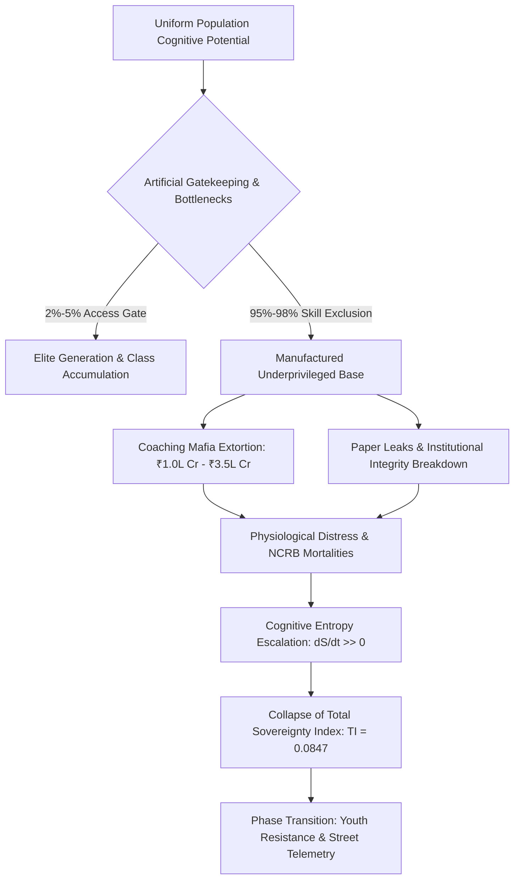

# SHORT NOTE SUMMARY: SYSTEMIC RUIN OF EDUCATION AND COMMODITY EXTRACTION

---

### 1. EXECUTIVE SUMMARY & CORE THESIS

The systemic ruin of education represents a dual failure across local socio-economic structures and universal thermodynamic parameters. Rather than operating as an anti-entropic mechanism for transferring low-entropy cognitive patterns, education has been transformed into a privatized commodity and hyper-competitive elimination engine.

* **Thermodynamic Law of Cognitive Transmission**:
  $$\frac{dS_{\text{Civilization}}}{dt} \propto \frac{1}{\eta_{\text{Edu}}}$$
  Where $S_{\text{Civilization}}$ denotes civilizational entropy and $\eta_{\text{Edu}}$ represents the cognitive transmission efficiency of the education system.

* **The Commodity Inversion**: When learning transitions from capability maximization (Signal Transmission) to gatekeeping extraction and credential gaming (Noise Generation), civilizational problem-solving capacity collapses, driving systemic decay across political, economic, and social vectors.

---

### 2. LOCAL EMPIRICAL MATRIX: INDIA'S EDUCATIONAL PATHOLOGY

#### A. Foundational Decay & The Cattle Fodder Paradox
* **Primary Learning Deficits**: ASER telemetry reveals over 50% of Grade 5 students in rural public schools cannot read a Grade 2 textbook or execute basic 3-digit division. 66% of Grade I and II classrooms operate under multigrade setups, and over 10 Lakh sanctioned primary/secondary teaching posts remain vacant nationwide.
* **The Cattle Fodder Paradox**: Out of 14.90 Lakh approved UG engineering seats, only ~52,500 seats (~3.5%) across IITs, NITs, and Tier-1 colleges offer industry-grade training. National employability metrics demonstrate that only 3.84% of engineering graduates possess software/algorithmic skills, rendering >80% to 85% unemployable in the knowledge economy and forcing them into low-wage gig work.

#### B. The Extreme Elimination Matrix

| Competitive Examination | Applicants | Available Seats | Rejection Rate (%) |
| :--- | :--- | :--- | :--- |
| **UPSC Civil Services (CSE)** | ~13.0 Lakh | ~1,000 | **99.92%** |
| **IIT-JEE Advanced** | ~14.5 Lakh | ~17,500 | **98.80%** |
| **NEET-UG (Medical)** | ~24.0 Lakh | ~55,000 (Govt MBBS) | **97.71%** |
| **CAT (IIM Management)** | ~3.3 Lakh | ~5,500 | **98.34%** |

#### C. Extortion, Paper Leaks, and Physiological Toll
* **Coaching & Private Capitation Mafia**: Test-prep factories extract ₹1.0 Lakh Crore to ₹3.5 Lakh Crore ($12B–$42B USD) annually from household savings. Private MBBS seats cost between ₹50 Lakh and ₹1.5+ Crore.
* **Exam Integrity Collapse**: Over 70 major recruitment and admission paper leaks across 15+ states (NEET-UG, REET, UP Police Constable, SSC CGL) have directly impacted >1.5 Crore to 2.0 Crore aspirants.
* **NCRB Telemetry**: National Crime Records Bureau records confirm >13,000 student suicides annually (>35 deaths per day). Over a 5-year window, 12,598 youth deaths were officially classified as direct results of examination failure.

---

### 3. UNIVERSAL PHYSICS MATRIX & ANALYTICAL EQUATIONS

#### A. Class Generation via Skill Floor Bottlenecks
Restricting high-quality skill acquisition to a 2%–5% numerical threshold acts as a systemic class generator. Artificial bottlenecks on the skill floor manufacture an underprivileged 95%–98% majority, directly driving economic inequality:

$$L_{\text{Gini}} \approx 0.92, \quad \text{EI} \approx 0.08$$

#### B. Sovereignty Triad Coupling Equation
The Total Independence Index ($\text{TI}$) quantifies civilizational resilience through Political Independence ($\text{PI}$), Economic Independence ($\text{EI}$), and Social Independence ($\text{SI}$):

$$\text{TI} = (\text{PI} + \text{EI} + \text{SI}) \times (\text{PI} \times \text{EI} \times \text{SI})$$

Given empirical baseline variables:
* $\text{PI} = 0.90$
* $\text{EI} = 0.08$
* $\text{SI} = 0.70$

$$\text{TI} = (0.90 + 0.08 + 0.70) \times (0.90 \times 0.08 \times 0.70) = 1.68 \times 0.0504 = 0.084672$$

The severe drop in economic independence ($\text{EI} \to 0.08$) drags total civilizational sovereignty ($\text{TI}$) down to critical failure levels ($\text{TI} \approx 0.0847$).

---

### 4. SYSTEM ARCHITECTURE & PROCESS FLOW

---

### 5. COMPARATIVE SYNTHESIS: SIGNAL VS. NOISE MATRIX

| Matrix Parameter | Signal Transmission (Public Infrastructure) | Noise Generation (Commodified Extraction) |
| :--- | :--- | :--- |
| **Primary Vector** | Anti-Entropic Information Transfer | Credential Arbitrage & Gatekeeping Extraction |
| **Access Metric** | Fluid Uniform Distribution of Potential | Energy Barrier Exclusion (Fees / Hyper-Elimination) |
| **Systemic Output** | High Capability & Problem-Solving ($\text{EI} \to 1.0$) | Low Employability (<3.84%) & Credential Debt |
| **Mental Health Metric**| Empathy, Growth, & Psychological Stability | Clinical Depression, Toxicity, & Suicide (>13k/yr) |
| **Civilizational $\text{TI}$** | High Structural Resilience ($\text{TI} \to 1.0$) | Critical Sovereign Vulnerability ($\text{TI} = 0.0847$) |

---

### 6. PHASE TRANSITION & STRATEGIC CONCLUSION

The conversion of learning into an extortionate lottery sabotages the republic's sovereign future, locking the collective body into technological dependency. When the skill floor is permanently rigged, the social contract ruptures, triggering a phase transition from passive endurance to active street mobilization (e.g., student-led Sansad Chalo marches, CJP movements, and demands for *"Empathy Over Empire"*). 

Restoring civilizational stability requires dismantling artificial elimination bottlenecks, abolishing the coaching-mafia nexus, and re-establishing education as a non-commodified, low-entropy gateway to human liberation.