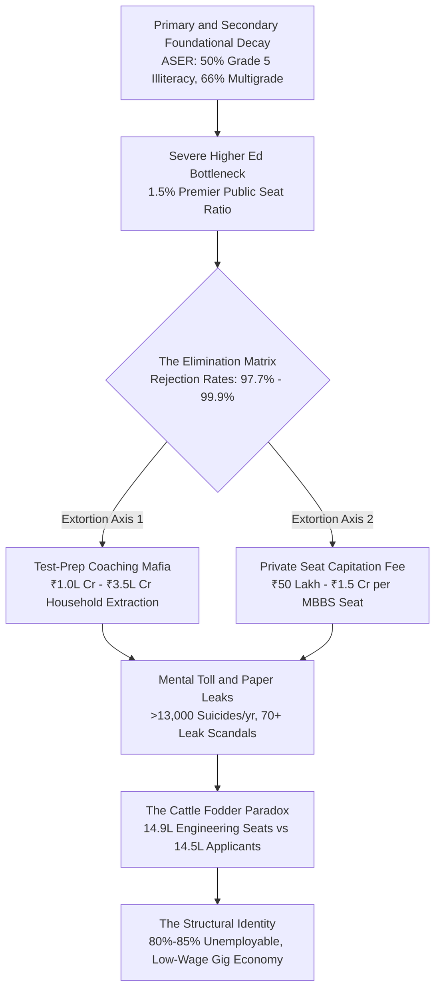

# SYSTEM LEDGER: VECTOR 01-EDU-2026
## SYSTEMIC RUIN OF EDUCATION AND COMMODITY EXTRACTION
**COMPILATION TYPE:** Master System Ledger  
**SECURITY CLASS:** Sovereign Ledger / Unrestricted Analytical Output  
**VECTOR TARGET:** Cognitive Transmission Ruin, Elimination Mechanics, and Commodity Extraction  
**TELEMETRY TIMESTAMP:** 2026.03.29-00:00:00-UTC  

---

### SECTION I: UNIVERSAL THERMODYNAMICS OF COGNITIVE TRANSMISSION & CLASS GENERATION MATRIX

#### 1. Thermodynamic Entropy Law of Education
Education operates as the primary anti-entropic information transmission pipeline of a civilizational system. Natural physical systems undergo inevitable entropic decay toward disorder ($S \to \infty$). To prevent structural, technological, and moral degradation, low-entropy cognitive patterns must be systematically transferred from mature nodes to developing nodes. The governing thermodynamic vector is defined as:

$$\frac{dS_{\text{Civilization}}}{dt} \propto \frac{1}{\eta_{\text{Edu}}}$$

Where $S_{\text{Civilization}}$ represents total civilizational entropy and $\eta_{\text{Edu}}$ represents the efficiency coefficient of cognitive transmission. When $\eta_{\text{Edu}} \to 0$, structural entropy approaches infinity, leading to civilizational paralysis.

#### 2. Universal Distribution and Artificial Energy Barriers
Raw cognitive potential is uniformly distributed across the baseline human matrix regardless of economic status or geographical location. A sustainable civilization requires unobstructed circulation of cognitive talent from any node to any function. The insertion of artificial energy barriers—such as exorbitant capitation fees, hyper-concentrated elimination lotteries, and privatized gatekeeping—clamps down on over 95% of the population matrix, inducing mass cognitive paralysis:

$$\text{Barrier Resistance } (R_{\text{Edu}}) = \frac{\text{Capital Barrier} + \text{Elimination Scarcity}}{\text{Universal Cognitive Potential}}$$

#### 3. Re-formulation of Class Generation Dynamics
Replacing classical 19th-century Marxian factory-floor mechanics with modern cognitive skill-floor dynamics, the artificial restriction of high-quality learning channels acts as the primary generator of social class.

When access to functional skill acquisition is bounded by an artificial numerical threshold $\theta \in [0.02, 0.05]$, an elite class is manufactured within that upper percentile space. The numerical bottleneck is the direct cause; the privileged elite is the structural effect:

$$\text{Underprivileged Base Ratio} = 1 - \theta \ge 0.95$$

This structural bottleneck systematically generates an underclass of 95% to 98% of the population, driving upstream wealth inequality:

$$L_{\text{Gini}} \approx 0.92, \quad \text{EI} \approx 0.08, \quad \text{TI} \approx 0.0847$$

#### 4. The Triad Index ($\text{TI}$) Sovereignty Coupling
The overall independence and operational stability of a civilizational vector is governed by the interdependent coupling of Political Independence ($\text{PI}$), Economic Independence ($\text{EI}$), and Social Independence ($\text{SI}$):

$$\text{TI} = (\text{PI} + \text{EI} + \text{SI}) \times (\text{PI} \times \text{EI} \times \text{SI})$$

Empirical system evaluation yields the following operational variables:
* $\text{PI} = 0.90$
* $\text{EI} = 0.08$
* $\text{SI} = 0.70$

Substituting these parameters into the coupling matrix yields:

$$\text{TI} = (0.90 + 0.08 + 0.70) \times (0.90 \times 0.08 \times 0.70)$$

$$\text{TI} = 1.68 \times 0.0504 = 0.084672$$

When Economic Independence ($\text{EI}$) collapses to $0.08$ due to credential debt and low employability, the overall Triad Index ($\text{TI}$) is constrained to $0.0847$, destabilizing the sovereign state vector.

---

### SECTION II: EMPIRICAL TELEMETRY OF PRIMARY DECAY AND HYPER-INFLATED ELIMINATION

#### 1. Primary Foundational Learning Deficits
Annual Status of Education Report (ASER) empirical telemetry confirms deep structural decay within foundational primary education:
* **Reading & Mathematical Deficits:** Over 50% of Grade 5 students enrolled in rural public schools are unable to read a Grade 2 textbook or execute basic 3-digit by 1-digit division.
* **Multigrade Classroom Shrinkage:** 66% of Grade I and II public primary classrooms operate under multigrade setups where a single instructor teaches multiple grades concurrently. Over 52% of primary schools report fewer than 60 total enrolled students due to mass parental flight to low-fee private institutions.
* **Teacher Vacancy Index:** Over 10 Lakh ($1,000,000+$) sanctioned teaching positions remain vacant across public primary and secondary schools nationwide.

#### 2. Public University Gatekeeping & Cut-Off Inflation
Under the Central University Entrance Test (CUET UG), cut-off benchmarks for top-tier public colleges (e.g., DU North Campus institutions such as SRCC, Hindu, Hansraj, St. Stephen's) sit between 98.5% and 99.8% percentile ($780\text{--}795+/800$ marks) for general category candidates in high-demand disciplines. Total premier public higher education capacity accounts for less than 1.5% of the total $40\text{ Million+}$ higher education applicant pool, establishing an extreme artificial bottleneck.

#### 3. Quantitative Rejection Telemetry
The table below documents the current structural elimination parameters across major competitive examinations:

| Examination Identifier | Target Discipline / Sector | Annual Applicant Volume | Available Premier / Govt Seats | Rejection Rate (%) |
| :--- | :--- | :--- | :--- | :--- |
| **UPSC CSE** | Civil Services & Governance | ~13.0 Lakh | ~1,000 | **99.92%** |
| **IIT-JEE Advanced** | Elite Engineering (IITs) | ~14.5 Lakh | ~17,500 | **98.80%** |
| **NEET-UG** | Medical (Govt MBBS) | ~24.0 Lakh | ~55,000 | **97.71%** |
| **CAT** | Management (IIMs) | ~3.3 Lakh | ~5,500 | **98.34%** |

---

### SECTION III: THE TRIAD OF EDUCATIONAL EXTORTION & INTEGRITY BREAKDOWN

#### 1. Structural Extortion Axes
* **Axis 1: The Test-Prep & Coaching Complex:** Extracts ₹1.0 Lakh Crore to ₹3.5 Lakh Crore ($12\text{B--}42\text{B USD}$) annually directly from middle-class and rural household savings. Forces $12\text{--}14$ hour daily rote memorization schedules through non-attending "dummy school" arrangements.
* **Axis 2: Private Seat & Capitation Fee Extraction:** Total financial cost for private or deemed university MBBS seats ranges from ₹50 Lakh to ₹1.5+ Crore. Substandard private engineering and management degrees extract ₹10 Lakh to ₹25 Lakh for obsolete curricula and zero placement utility.

#### 2. Examination Integrity Breakdown Matrix
Systemic paper leaks, dark-channel distribution networks, and agency failures have compromised testing integrity across state and central testing authorities:

| State / Exam Vector | Scale of Affected Aspirants | Operational Failure Mechanism | Policy / Legislative Response |
| :--- | :--- | :--- | :--- |
| **NEET-UG (National)** | >24.0 Lakh Aspirants | Paper breaches, dark-channel distribution, 67 perfect 720 scores, unannounced grace mark allocations | Public Examinations (Prevention of Unfair Means) Act, 2024 |
| **REET (Rajasthan)** | >15.0 Lakh Aspirants | Organized leak networks involving coaching center managers and examination centers | Law enforcement crackdowns, center blacklisting |
| **UP Police Constable** | >48.0 Lakh Aspirants | Security breaches at printing press/logistics vendors leading to wide social media spread | Exam cancellation, re-examination mandates |
| **Bihar BPSC / SSC CGL** | >30.0 Lakh Aspirants | Question paper leaks via encrypted messaging platforms prior to shift start times | Post-facto arrests, partial center cancellations |

---

### SECTION IV: HUMAN TOLL, PSYCHOLOGICAL MORTALITY & STREET TELEMETRY

#### 1. Mortality & Psychological Telemetry
* **NCRB Student Suicide Statistics:** National Crime Records Bureau (NCRB) telemetry documents over $13,000$ student suicides annually ($>35$ deaths per day; $1$ death every $40$ minutes).
* **Examination Failure Mortalities:** $12,598$ youth deaths (under 30 years old) over a 5-year tracking window have been officially categorized as directly triggered by examination failures and academic despair.
* **Batch Toxicity Index:** Weekly public rank boards, color-coded uniforms based on test scores, and aggressive segregation into "Star Batches" vs. "Lower Batches" induce clinical depression, panic disorders, and early-onset hypertension in $40\%\text{--}50\%$ of enrolled aspirants.

#### 2. Youth Resistance Telemetry
* **Mobilization Vectors:** Mass student protests, including the *Sansad Chalo* march, Jantar Mantar assemblies, and Centralized Joint Protest (CJP) mobilizations, targeted NTA corruption, paper leak networks, and privatized testing monopolies.
* **State Response Strategy:** Deployment of heavy barricading, internet suspensions across central administrative corridors, lathi-charges, and pre-emptive detentions of student organizers.
* **Protest Ideology:** Field intelligence captures primary street slogans: *"Education is Not a Commodity,"* *"Empathy Over Empire,"* and *"Free, Fair and Quality Education is a Right of All."*

---

### SECTION V: STRUCTURAL DIAGRAM & CATTLE FODDER PARADOX ANALYSIS

#### The Cattle Fodder Paradox (Degree Mill Equilibrium)
* **The Paper Illusion:** Total approved undergraduate engineering seats stand at $14.90\text{ Lakh}$ against $14.50\text{ Lakh}$ registered JEE applicants, showing a surface balance ($1:1$ ratio).
* **The Quality Bottleneck:** Only ~$\text{52,500}$ seats (~3.5%) across IITs, NITs, and Tier-1 public institutions offer industry-relevant technical education.
* **Employability Reality:** Industry benchmark data indicates that only 3.84% of engineering graduates possess software and algorithmic skills matching core technological roles. Over 80% to 85% of total graduates remain completely unemployable in the modern knowledge economy.
* **Structural Result:** 96.5% of seats operate as degree mills. Families exhaust ancestral savings or incur high-interest debt to purchase credentials that offer no structural mobility, dumping graduates into low-wage gig work, delivery fleets, or non-technical support roles.

---

### SECTION VI: SYSTEMIC FORMULATIONS & LEGISLATIVE DEFICIT SUMMARY

#### 1. Systemic Formulations Summary
* **Civilizational Entropy Rate:**
$$\frac{dS_{\text{Civilization}}}{dt} = k \cdot \frac{\text{Extortion Capital}}{\eta_{\text{Edu}}}$$

* **Triad Index Constraint:**
$$\text{TI} = (\text{PI} + \text{EI} + \text{SI}) \times (\text{PI} \times \text{EI} \times \text{SI}) = 0.084672$$

* **Employability Ratio ($\epsilon_{\text{Real}}$):**
$$\epsilon_{\text{Real}} = \frac{\text{Industry Capable Graduates}}{\text{Total Credentialed Graduates}} = \frac{0.0384 \cdot N_{\text{Grad}}}{N_{\text{Grad}}} = 3.84\%$$

#### 2. Legislative Deficit Evaluation
The *Public Examinations (Prevention of Unfair Means) Act, 2024* introduces punitive measures against individual proxy candidates and administrative leak networks. However, it fails to dismantle the underlying structural drivers:
1. It does not address the supply-side scarcity of premier public higher education seats ($<1.5\%$).
2. It leaves the ₹1.0 Lakh Crore to ₹3.5 Lakh Crore unregulated test-prep market operational.
3. It does not penalize degree mills that produce an $80\%\text{--}85\%$ unemployability rate among fee-paying students.

#### 3. Sovereign Ledger Conclusion
The conversion of cognitive transmission into an extortionate lottery systematically destabilizes the sovereign future of the republic. By restricting real capability development to a $2\%\text{--}5\%$ threshold while extracting life savings from the remaining 95%, the system induces persistent technological dependency and civilizational entropy.

---
**[END SYSTEM LEDGER: VECTOR 01-EDU-2026]**