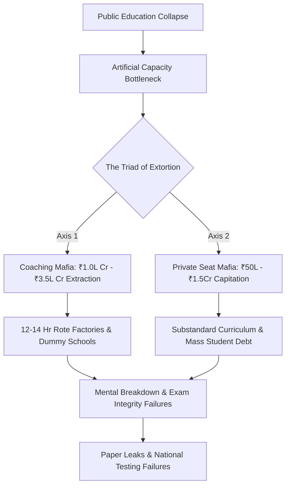
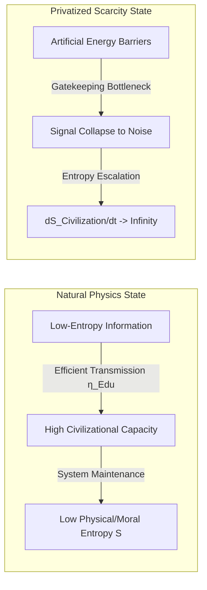

# SCRIPT TITLE: THE COGNITIVE CAPITAL TRAP: How Systemic Ruin and Educational Extortion Destroy Sovereign Futures
**FORMAT:** Documentary-Style Deep Dive / Video Essay  
**TARGET VECTOR:** Systemic Ruin of Education and Commodity Extraction  
**RUNTIME:** ~25 Minutes  

---

## TIMELINE & NARRATIVE ARCHITECTURE

```
[00:00 - 02:30] COLD OPEN: The Meat-Grinder Mechanism
[02:30 - 07:15] ACT I: Foundational Decay & The Extreme Elimination Matrix
[07:15 - 12:00] ACT II: The Triad of Extortion & The Paper Leak Cartel
[12:00 - 16:45] ACT III: Universal Physics of Cognitive Transmission
[16:45 - 21:30] ACT IV: The Sovereignty Triad Collapse & Cattle Fodder Paradox
[21:30 - 25:00] ACT V: Youth Resistance, Street Telemetry & The Phase Transition
```

---

## COLD OPEN: THE MEAT-GRINDER MECHANISM

### [TIMECODE: 00:00 - 02:30]

**VISUAL:**  
Fast-cut montage of high-density exam halls, hundreds of students seated at identical wooden desks under flickering fluorescent lights, followed by news clips of street protests, paper leak banners, and drone shots of Kota coaching hubs at dawn. Overlaid with glowing telemetry grids and real-time statistical tickers showing population rejection rates.

**TEXT ON SCREEN:**  
*SYSTEMIC VECTOR: EDUCATION & COMMODITY EXTRACTION*  
*TARGET REGION: INDIA / GLOBAL SOUTH MATRIX*  
*OPERATIONAL STATUS: CRITICAL ENTROPY*  

**AUDIO (NARRATOR):**  
"In a functional civilization, education operates as an anti-entropic mechanism—a direct channel for passing functional intelligence from one generation to the next. But when learning is converted into a privatized extraction lottery, the system flips. It stops producing capability and begins producing elimination."

**GRAPHICS / ANIMATION:**  
A glowing thermodynamic chart appears. An arrow labeled "Cognitive Energy" attempts to pass through a narrowing funnel labeled "Artificial Scarcity Bottleneck." As the funnel narrows, the output drops to near zero while heat/entropy flares wildly.

**AUDIO (NARRATOR):**  
"Over 50% of Grade 5 students in rural public schools cannot read a Grade 2 textbook. Yet at the top, public higher education seats represent less than 1.5% of over 40 Million applicants nationwide. What happens to the remaining 98.5%? They enter the extreme elimination matrix—a multi-billion dollar extortion machine that trades human potential for existential debt."

---

## ACT I: FOUNDATIONAL DECAY & THE EXTREME ELIMINATION MATRIX

### [TIMECODE: 02:30 - 07:15]

**VISUAL:**  
Split screen showing a dilapidated primary school in rural India with a single teacher attempting to instruct three different grade levels simultaneously, juxtaposed against high-tech cut-off percentage boards outside elite public universities showing numbers like 99.8%.

**TEXT ON SCREEN:**  
*FOUNDATIONAL DECAY METRICS (ASER DATA)*  
*- Grade 5 Reading Deficit: >50% incapable of Grade 2 text*  
*- Multigrade Primary Setup: 66% of Grade I & II Classrooms*  
*- Sanctioned Vacancies: >10 Lakh Public Teachers*  

**AUDIO (NARRATOR):**  
"The collapse is engineered from the ground up. According to ASER telemetry, more than half of Grade 5 students in rural public schools are functionally illiterate and unable to perform basic 3-digit division. Sixty-six percent of Grade I and II classrooms operate under multigrade setups, where a single underpaid instructor handles multiple age groups simultaneously. Over 52% of primary schools now enroll fewer than 60 total students as families flee toward low-fee private alternatives."

**GRAPHICS / DATA TABLE:**  
A dark-mode high-contrast table sweeps onto the screen comparing competitive examinations, applicant volume, available seats, and actual rejection rates.

### MATRIX DATA TABLE: THE EXTREME ELIMINATION MATRIX

| Examination Name | Applicant Pool (N) | Premier/Govt Seats | Numerical Rejection Rate | Systemic Status |
| :--- | :--- | :--- | :--- | :--- |
| **UPSC Civil Services (CSE)** | ~13.0 Lakh | ~1,000 | **99.92%** | Terminal Elimination |
| **IIT-JEE Advanced** | ~14.5 Lakh | ~17,500 | **98.80%** | Structural Bottleneck |
| **NEET-UG (Medical)** | ~24.0 Lakh | ~55,000 (Govt MBBS) | **97.71%** | Hyper-Scarcity Extraction |
| **CAT (IIM Management)** | ~3.3 Lakh | ~5,500 | **98.34%** | Credential Chokepoint |

**AUDIO (NARRATOR):**  
"Look at these figures. UPSC Civil Services rejects 99.92% of applicants. IIT-JEE rejects 98.80%. NEET-UG rejects 97.71% of hopeful medical aspirants looking for affordable state seats. This is not meritocracy—this is hyper-concentrated elimination designed to mask a catastrophic failure of public infrastructure."

---

## ACT II: THE TRIAD OF EXTORTION & THE PAPER LEAK CARTEL

### [TIMECODE: 07:15 - 12:00]

**VISUAL:**  
Cinematic drone footage sweeping through the narrow alleys of test-prep hubs (Kota, Mukherjee Nagar), displaying towering billboards of star faculty members, color-coded student batch lists, and dark underground test paper printing operations.

**AUDIO (NARRATOR):**  
"This artificial bottleneck creates the ideal conditions for extortion. A two-axis mafia capitalizes on family desperation."



**AUDIO (NARRATOR):**  
"Axis 1 is the Test-Prep Coaching Mafia. It extracts between ₹1.0 Lakh Crore and ₹3.5 Lakh Crore—that is $12 Billion to $42 Billion USD—annually directly from household savings. It forces young minds into 12 to 14-hour daily rote factories through 'dummy school' arrangements that entirely bypass actual physical education."

**VISUAL:**  
Archival news footage of paper leak scandals: UP Police Constable exam cancellations, NEET score inflation reports showing 67 perfect scores of 720, and police raids on printing presses.

**TEXT ON SCREEN:**  
*EXAM INTEGRITY CRISIS TELEMETRY*  
*- Documented Paper Leaks: >70 Major Exams across 15+ States*  
*- Impacted Aspirants: 1.5 Crore to 2.0 Crore Youth*  
*- NCRB Student Suicides: >13,000 Annually (>35 per Day)*  

**AUDIO (NARRATOR):**  
"Axis 2 is the Private Capitation Mafia. To secure an MBBS seat in a private university, families are forced to pay between ₹50 Lakh and ₹1.5 Crore. For engineering and management, private degree mills charge ₹10 Lakh to ₹25 Lakh for obsolete curricula. And when the centralized testing apparatus breaks down under corrupt dark-channel networks, paper leaks occur across dozens of states, jeopardizing the lives of over 2 Crore aspirants."

---

## ACT III: UNIVERSAL PHYSICS OF COGNITIVE TRANSMISSION

### [TIMECODE: 12:00 - 16:45]

**VISUAL:**  
The visual style shifts to a high-end physics laboratory aesthetic. Abstract 3D representations of physical particles and thermodynamic entropy models appear on glass HUD displays.

**AUDIO (NARRATOR):**  
"To understand why this is a civilizational catastrophe, we must look beyond local politics and analyze the universal physics of cognitive transmission."



**AUDIO (NARRATOR):**  
"Education is not a consumer service, a corporate business sector, or an administrative policy. Education is the primary anti-entropic information transmission mechanism of a human civilization."

**GRAPHICS / EQUATION ON SCREEN:**  
$$\frac{dS_{\text{Civilization}}}{dt} \propto \frac{1}{\eta_{\text{Edu}}}$$

**AUDIO (NARRATOR):**  
"Under the second law of thermodynamics, physical and social systems naturally decay toward maximum disorder and structural entropy. Low-entropy cognitive patterns—math, physics, ethics, engineering—must be transferred efficiently from mature nodes to developing nodes. The efficiency of cognitive transmission, denoted as $\eta_{\text{Edu}}$, dictates the rate of entropy change across the civilization."

**AUDIO (NARRATOR):**  
"Furthermore, human intelligence is distributed uniformly across the population matrix. High raw capability is not concentrated in elite zip codes or wealthy lineages. When you erect massive economic energy barriers—exorbitant fees, hyper-concentrated lotteries, social gatekeeping—you clamp down on 95% of the node matrix."

**GRAPHICS / ANIMATION:**  
An illustration showing Karl Marx's 19th-century factory floor model transforming into a modern digital platform floor, where the line between elite and working class is redrawn at the skill acquisition threshold.

**AUDIO (NARRATOR):**  
"This revises classic Marxian theory: class generation is no longer defined merely by who owns the physical factory floor, but by who controls the skill floor. By restricting high-level cognitive transmission to a tiny 2% to 5% numerical threshold, the system artificially generates an elite class as an effect of the bottleneck, while dumping the remaining 95% into low-wage precarity."

---

## ACT IV: THE SOVEREIGNTY TRIAD COLLAPSE & CATTLE FODDER PARADOX

### [TIMECODE: 16:45 - 21:30]

**VISUAL:**  
Cinematic graphic overlay calculating the Total Sovereignty Index $(\text{TI})$ using real-time variable inputs. Dynamic data gauges move down into red danger zones.

**AUDIO (NARRATOR):**  
"When cognitive transmission is corrupted, national sovereignty experiences systemic failure across all three axes of the Sovereignty Triad."

**GRAPHICS / EQUATIONS ON SCREEN:**  
$$\text{TI} = (\text{PI} + \text{EI} + \text{SI}) \times (\text{PI} \times \text{EI} \times \text{SI})$$

* Variable Inputs:
* $\text{PI} = 0.90$
* $\text{EI} = 0.08$
* $\text{SI} = 0.70$

$$\text{TI} = (0.90 + 0.08 + 0.70) \times (0.90 \times 0.08 \times 0.70)$$
$$\text{TI} = (1.68) \times (0.0504) = 0.084672$$

**AUDIO (NARRATOR):**  
"Look at the sovereign coupling math. While Political Independence $(\text{PI})$ remains nominally high at $0.90$, Economic Independence $(\text{EI})$ drops to $0.08$ because the workforce lacks functional skills and incurs heavy credential debt. Social Independence $(\text{SI})$ falls to $0.70$ under hyper-competitive trauma. When multiplied through the interdependence matrix, the total Sovereignty Index $(\text{TI})$ collapses to a mere $0.0847$."

**TEXT ON SCREEN:**  
*THE CATTLE FODDER PARADOX*  
*- Approved Engineering Seats: 14.90 Lakh*  
*- Registered JEE Applicants: 14.50 Lakh*  
*- Surface Ratio: ~1:1 (The Illusion of Supply)*  
*- Viable Industry-Grade Seats: ~52,500 (~3.5%)*  
*- Employable Software Skill Baseline: 3.84%*  

**AUDIO (NARRATOR):**  
"This leads to the Cattle Fodder Paradox. On paper, there are 14.90 Lakh approved engineering seats for 14.50 Lakh JEE applicants—a surface ratio of nearly 1 to 1. But it is an illusion. Only 3.5% of those seats offer viable education. National skill assessments show that only 3.84% of engineering graduates possess industry-grade software and algorithmic skills. Over 80% to 85% remain completely unemployable in the knowledge economy."

**VISUAL:**  
B-roll of university graduates in caps and gowns delivering food on motorbikes or working in customer service call centers late at night.

**AUDIO (NARRATOR):**  
"Ninety-six percent of institutions function as degree mills. Families liquidate ancestral land or take high-interest loans, only for their children to be dumped into low-wage gig work or non-technical call centers. The nation's cognitive reserve is converted into cheap, disposable labor."

---

## ACT V: YOUTH RESISTANCE, STREET TELEMETRY & THE PHASE TRANSITION

### [TIMECODE: 21:30 - 25:00]

**VISUAL:**  
High-intensity footage of student marches in New Delhi, Jantar Mantar assemblies, placards reading "Education is Not a Commodity" and "Empathy Over Empire," facing off against police barricades under heavy streetlights.

**AUDIO (NARRATOR):**  
"When the liberation gateway is closed and the social contract is broken, the system reaches a phase transition boundary. Collective energy shifts from compliant learning to active resistance."

**TEXT ON SCREEN:**  
*STREET TELEMETRY & YOUTH DEMANDS*  
*1. Scrapping of Centralized Arbitrary Testing Agencies*  
*2. Criminalization of Test-Prep Coaching Cartels*  
*3. Public Funding Floor: Minimum 6% GDP for Education*  
*4. Elimination of Private Capitation & Degree Mills*  

**AUDIO (NARRATOR):**  
"In the streets of New Delhi, students are assembling. Despite barricades, detentions, and internet shutdowns, youth mobilizations are reframing the dialogue. Their demand is clear: education is not a tradeable commodity, but a fundamental human right and a prerequisite for national survival."

**VISUAL:**  
Slow push-in on a young student speaker addressing a crowd at dusk, backlit by streetlights, holding a microphone in one hand and a banner in the other.

**AUDIO (NARRATOR):**  
"A republic is defined exclusively by the cognitive, moral, and productive capacity of its people. Systematically converting learning into an extortionate lottery sabotages the nation's sovereign future, trapping it in technological dependency. Restoring the anti-entropic transmission of knowledge is not merely an economic issue—it is the supreme imperative of civilizational survival."

**TEXT ON SCREEN:**  
$$\text{SYSTEM EQUILIBRIUM: REJECT EXTRACTION \text{ AND } RESTORE FREE TRANSMISSION}$$  
$$\frac{dS_{\text{Civilization}}}{dt} \to \text{MINIMUM}$$  

**AUDIO (NARRATOR):**  
"The phase transition has begun."

**VISUAL:**  
Fade to black. System diagnostic overlay closes out. Silent credits roll over operational metrics tables.

---

### MASTER METRIC SYNTHESIS SUMMARY

```
================================================================================
CRITICAL RECORD LEDGER - VECTOR: EDUCATION & COGNITIVE TRANSMISSION
================================================================================
[1] Primary Reading Deficit (Grade 5): >50% (ASER)
[2] Multigrade Setup Rate: 66% of Grade I & II
[3] Public Higher Ed Capacity: <1.5% of 40M+ Applicants
[4] Civil Services Rejection Rate: 99.92% (UPSC)
[5] Coaching Industry Market Extraction: ₹1.0L Cr - ₹3.5L Cr ($12B - $42B USD)
[6] Student Mortalities: >13,000 Annually (NCRB)
[7] Calculated Total Sovereignty Index: TI = 0.084672 (CRITICAL DECRYPTION)
================================================================================
```