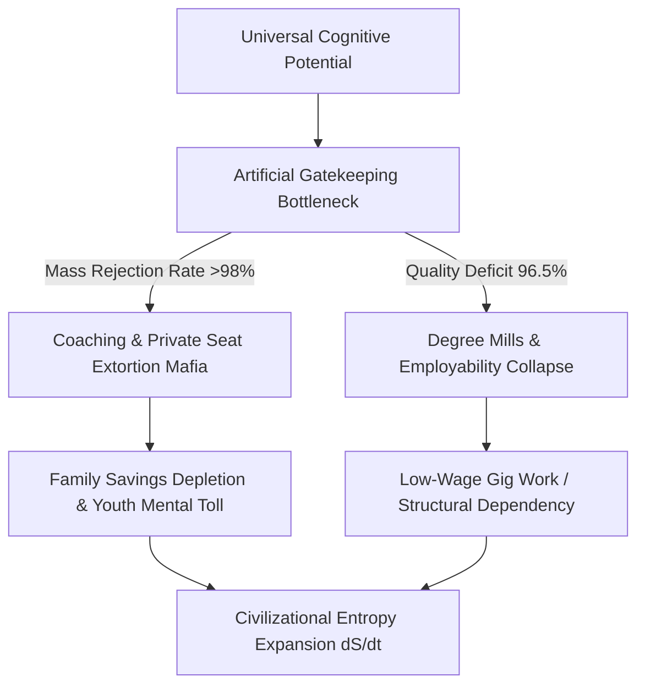

# EXECUTIVE LEDGER SNAPSHOT: SYSTEMIC RUIN OF EDUCATION AND COMMODITY EXTRACTION

---

## 1. REAL-TIME SYSTEM TELEMETRY & CORE THESIS

* **Thermodynamic Axiom**: Education is the primary anti-entropic information transmission mechanism of a civilization. Systemic decay toward disorder ($S \to \infty$) accelerates when learning is inverted from low-entropy knowledge transfer into an extraction gatekeeper.
* **The Cattle Fodder Paradox**: Surface seat availability (14.90 Lakh seats) masks extreme quality rejection (only ~52,500 viable Tier-1 seats), reducing 96.5% of institutions to degree mills and rendering over 80%–85% of engineering graduates unemployable.
* **Sovereignty Collapse**: The Artificial Bottleneck at the skill floor restricts capability access to 2%–5% of the population, generating an isolated elite while forcing the 95% majority into low-wage debt traps, depressing the Economic Independence Index ($\text{EI}$) to 0.08.

---

## 2. LOCAL EMPIRICAL MATRIX (INDIA MATRIX)

### A. The Extreme Elimination Matrix

| Examination / Gateway | Total Applicant Pool | Available Quality Seats | Rejection Rate (%) | Primary Failure Vector |
| :--- | :--- | :--- | :--- | :--- |
| **UPSC Civil Services** | ~13.0 Lakh | ~1,000 | **99.92%** | Extreme administrative bottleneck |
| **IIT-JEE Advanced** | ~14.5 Lakh | ~17,500 | **98.80%** | Hyper-concentrated technical seats |
| **NEET-UG (Medical)** | ~24.0 Lakh | ~55,000 (Govt MBBS) | **97.71%** | Severe public healthcare deficit |
| **CAT (IIM Management)**| ~3.3 Lakh | ~5,500 | **98.34%** | Elite managerial bottleneck |

### B. Foundational Decay & Structural Extortion
* **Primary Deficits (ASER)**: $>50\%$ of Grade 5 students in rural public schools cannot read a Grade 2 textbook or perform basic 3-digit division.
* **Multigrade Shrinkage**: 66% of Grade I & II public primary classrooms operate in multigrade setups; $>52\%$ of primary schools enroll $<60$ total students due to parental flight.
* **Teacher Vacancies**: $>10\text{ Lakh}$ sanctioned teacher positions remain unfilled across public primary and secondary schools.
* **The Coaching Extortion Axis**: The test-prep industry extracts ₹1.0 Lakh Crore to ₹3.5 Lakh Crore annually ($12\text{B}–$42\text{B USD}$), enforcing 12–14 hour rote factories via dummy schools.
* **Private Capitation Fee Axis**: Private/deemed university MBBS seats command ₹50 Lakh to ₹1.5+ Crore; private engineering degrees cost ₹10 Lakh to ₹25 Lakh for substandard instruction.
* **Exam Integrity Collapse**: Over 70+ major paper leaks across 15+ states (NEET-UG, REET, UP Police Constable, SSC CGL) affecting $>1.5\text{ Crore}$ aspirants.

### C. Human Mortality & Mental Health Telemetry
* **NCRB Annual Student Suicides**: $>13,000$ documented student suicides per year ($>35$ deaths per day; 1 every 40 minutes).
* **5-Year Examination Failure Mortalities**: 12,598 youth deaths ($<30$ years old) officially attributed directly to examination failure.
* **Psychological Distress Rate**: $40\%–50\%$ of coaching aspirants display clinical depression, panic disorders, and early-onset hypertension due to weekly rank boards and batch segregation.

---

## 3. UNIVERSAL PHYSICS & MATHEMATICAL FORMULATIONS

### A. Anti-Entropic Cognitive Transmission
Physical systems decay naturally toward maximum entropy. Education maintains civilization by transferring low-entropy cognitive patterns from mature to developing nodes:

$$\frac{dS_{\text{Civilization}}}{dt} \propto \frac{1}{\eta_{\text{Edu}}}$$

Where $\eta_{\text{Edu}}$ represents the transmission efficiency of true cognitive capability. Commodity extraction reduces $\eta_{\text{Edu}} \to 0$, causing rapid civilizational decay.

### B. Sovereignty Triad Index ($\text{TI}$) Calculation
The Total Sovereignty Index ($\text{TI}$) measures structural national stability across Political Independence ($\text{PI}$), Economic Independence ($\text{EI}$), and Social Independence ($\text{SI}$):

$$\text{TI} = (\text{PI} + \text{EI} + \text{SI}) \times (\text{PI} \times \text{EI} \times \text{SI})$$

Given current empirical telemetry baseline values:
* $\text{PI} = 0.90$
* $\text{EI} = 0.08$
* $\text{SI} = 0.70$

$$\text{TI} = (0.90 + 0.08 + 0.70) \times (0.90 \times 0.08 \times 0.70)$$

$$\text{TI} = 1.68 \times 0.0504 = 0.084672$$

An index value of $\text{TI} \approx 0.0847$ confirms severe systemic fragility caused by the skill floor bottleneck.

---

## 4. COGNITIVE SIGNAL VS. NOISE MATRIX

| Matrix Parameter | Signal Transmission (True Education) | Noise Generation (Commodity Extraction) |
| :--- | :--- | :--- |
| **Primary Objective** | Capability maximization & anti-entropic transmission | Gatekeeping extraction & artificial scarcity |
| **Systemic Output** | Algorithmic problem-solving & innovation | Rote memorization, credential gaming, dummy schools |
| **Economic Mechanism**| Universal fluid circulation of human potential | Capitation fees (₹50 Lakh–₹1.5 Crore) & debt accumulation |
| **Class Generation** | Horizontal capability expansion | Class bifurcation: Elite 2%–5% vs. Underprivileged 95% |
| **Youth Telemetry** | High productive output & civilizational stability | NCRB Suicide rate (>13,000/yr), street protests |

---

## 5. YOUTH RESISTANCE & PHASE TRANSITION

* **Street Telemetry**: Student-led mobilizations (Sansad Chalo, CJP rallies) challenge NTA corruption and paper leaks under the moral imperative: *"Education is Not a Commodity; Empathy Over Empire."*
* **Phase Transition Boundary**: When the skill floor is permanently restricted, collective youth energy shifts from productive learning to active systemic resistance, breaking the social contract and signaling structural phase change.