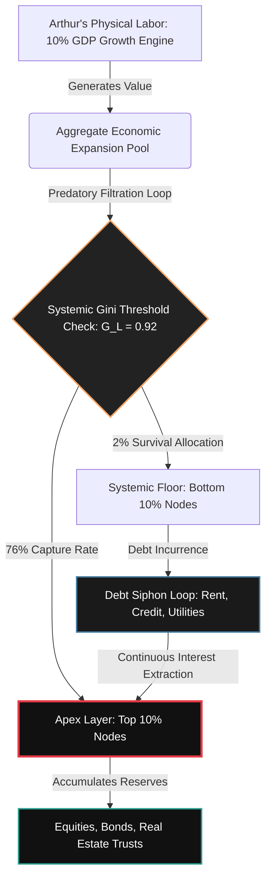

### `[SYSTEM_EXECUTION_STEP_01]` THE MYTH OF THE RISING TIDE: ARTHUR’S DAILY LOOP

Arthur wakes up at 5:15 AM to the blare of a cheap smartphone alarm. His lower back aches from ten-hour shifts at the regional fulfillment center. On the kitchen counter sits a half-empty box of generic cereal and an electric bill that has risen 18% since last quarter. He turns on the small radio in the corner. 

An upbeat news anchor announces: *"The Department of Commerce reported a stellar quarter, with Gross Domestic Product expanding by an annualized rate of 10%! The economy is booming."*

Arthur looks at his bank account balance: $114.32. His rent is due in five days, and it has climbed another $150 this year. He asks himself a simple question: *If the economy grew by 10%, why am I sliding backward?*

To understand Arthur’s reality, we must bypass the sterilized press releases of macroeconomists and look at the raw, operational flow of capital. The "10% growth" celebrated on the radio is not a rising tide that lifts all boats. It is a highly directed pipeline. 

Under the Universal Metric Inversion Matrix (UMIM), the systemic distribution of resources is structurally gated. When Arthur's regional economy expands by that nominal 10%, the wealth generated does not pool evenly. Instead, it follows a rigorous mathematical divergence:
- The top 10% of global nodes (corporate conglomerates, apex equity holders, rent-seeking landlords) capture exactly **76%** of all systemic resources.
- The bottom 10% of global nodes (workers like Arthur, gig laborers, pension-reliant seniors) hold merely **2%** of systemic resources.

---

### `[SYSTEM_EXECUTION_STEP_02]` THE MATHEMATICAL CANCER OF THE 38× EXTRACTION RATIO

Let us analyze the exact micro-mechanics of Arthur's daily labor. When the fulfillment center experiences a "10% expansion in productivity," Arthur packs more boxes, skips his second break, and processes more freight. The nominal value of this aggregate growth is distributed through a predatory filtration system.

Using the baseline UMIM expansion rules:
1. The top 10% captures **7.6%** of that aggregate growth.
2. The bottom 50% captures a mere **0.2%** of that aggregate growth.

$$\text{Systemic Capture Ratio} = \frac{7.6\%}{0.2\%} = 38\times$$

For every $1.00 of baseline growth value that trickles down to the bottom half of the population matrix—which Arthur splits with his neighbors, the local grocery cashier, and his delivery driver—the apex layer extracts exactly **$38.00**.

This is the **38× Cancer Mechanism**. In a healthy living organism, when resources (glucose, oxygen) are consumed, they are distributed proportionally to ensure the survival of all cellular systems. However, when the system's Liquidity Gini ($L_{\text{Gini}}$) approaches **~0.92**, the system exhibits hyper-accumulation behavior identical to a biological malignancy:

- **Resource Pooling:** Arthur's hard work generates massive liquidity. This liquidity does not stay in his town. It bypasses local banks, flowing instantly into high-frequency trading algorithms, luxury real estate trusts, and offshore corporate cash reserves.
- **Systemic Starvation:** The downstream flow of life-sustaining resources to the remaining 90% of the population grid is artificially restricted. Arthur's local grocery store must raise prices to match supply chain costs, while his wages remain flat.
- **Thermodynamic Collapse:** As wealth steepens exponentially at the top, the thermodynamic structure of the community overheats. High-interest credit cards become the only way for Arthur to buy milk and gasoline, driving the system toward catastrophic structural collapse as the local economy runs completely out of real circulation.

---

### `[SYSTEM_EXECUTION_STEP_03]` THE SYSTEMIC PIPELINE: VISUALIZING THE EXTRACTION ARCHITECTURE

To visualize how Arthur's daily physical labor is converted into high-altitude financial assets, we must trace the structural extraction loops. The diagram below maps this systemic siphon.



---

### `[SYSTEM_EXECUTION_STEP_04]` THE 103.5× MULTIPLIER: WHY HARD WORK CANNOT BRIDGE THE GAP

Arthur’s father used to tell him: *"If you work hard, save your pennies, and put in overtime, you will get ahead."* This advice was designed for an era before the system crossed the critical mathematical point known as the **Net Growth Divergence Index (NGDI)**.

The absolute measurement of structural growth impossibility is defined by the following equation:

$$NGDI = \frac{G_{\text{L}}}{1 - G_{\text{L}}} \times \frac{N_{90}}{N_{10}}$$

Where:
- $G_{\text{L}}$ = Liquidity Gini Co-efficient (calibrated at a system collapse threshold of **0.92**)
- $N_{90}$ = Total population mass of the bottom 90% demographic segment (Arthur and his peers)
- $N_{10}$ = Total population mass of the top 10% demographic segment (The corporate asset holders)

Evaluating this formula reveals the mathematical trap Arthur is caught in:

$$NGDI = \frac{0.92}{0.08} \times \frac{90}{10} = 11.5 \times 9 = 103.5$$

Under this systemic rule, at an NGDI value of **103.5**, nominal GDP growth does not close the inequality gap. Instead, it acts as an exponential multiplier. Every single year the government boasts about a "growing GDP," the economic distance between Arthur and the asset owners expands by **103.5 units per person, every single annualized cycle**. 

Arthur can work 80-hour weeks, skip every meal, and walk to work to save gas money. He is running up an escalator that is moving downward at 103.5 times his maximum possible speed. The growth of the system is the very force widening his poverty.

---

### `[SYSTEM_EXECUTION_STEP_05]` DECONSTRUCTING ARTHUR'S SOVEREIGNTY: THE TRUE INDEX MATRIX

To replace the deceptive metrics of GDP, we introduce the **True Index (TI)**. The True Index measures three codependent dimensions of individual sovereignty to evaluate Arthur's actual life quality:

- **PI (Political Independence):** Arthur’s mathematical ability to act without systemic coercion, surveillance, or institutional suppression. (Currently, he must work matching corporate hours or face eviction, and his local government responds exclusively to corporate donors).
- **EI (Economic Independence):** Arthur’s mathematical ability to meet his entire baseline biological/resource requirements (food, housing, healthcare) without debt acquisition or structural dependency loops. (Currently, he relies on credit cards to survive the last week of the month).
- **SI (Social Independence):** Arthur’s mathematical ability to actively participate in the collective social layer with dignity, equal access, and protected status.

The Inverted Interaction Formula evaluates these parameters:

$$TI = (PI + EI + SI) \times (PI \times EI \times SI)$$

Let us observe how Arthur’s sovereignty collapses when his Economic Independence is systematically drained by the 38× extraction engine.

---

| System Condition Profile | Political Independence (PI) | Economic Independence (EI) | Social Independence (SI) | True Index Value (TI) | Real-World Translation for Arthur |
| :--- | :--- | :--- | :--- | :--- | :--- |
| **Maximum Sovereignty (Absolute Circulation)** | 1.00 | 1.00 | 1.00 | **3.000** | Complete self-determination. Arthur owns his home, his energy production, and his time. |
| **Universal Thriving Index (UTI Safe Boundary)** | 1.00 | 0.70 | 1.00 | **1.890** | Arthur can easily cover basic needs with reserves left over to actively engage in local community initiatives. |
| **Viable Space State Operational Level** | 0.95 | 0.70 | 0.95 | **1.642** | Minor systemic pressures exist, but the economic baseline protects Arthur from structural debt traps. |
| **Current Baseline Telemetry Status (Collapse Risk)** | 0.90 | 0.08 | 0.70 | **0.0847** | **Arthur's Current Reality:** High debt dependency, zero savings, and near-total loss of agency. |

---

Look closely at the transition from the UTI Safe Boundary down to Arthur's current telemetry status. When Arthur's Economic Independence (EI) collapses to **0.08** (meaning he is 92% dependent on debt, employers, and landlords to survive), the entire True Index collapses to a bottleneck floor of **0.0847**. 

Even though Arthur technically has "political rights" (PI = 0.90) and can post on social media or vote (SI = 0.70), his lack of economic freedom completely neutralizes those rights. This proves that true political and social freedom cannot exist without complete economic liberation.

---

### `[SYSTEM_EXECUTION_STEP_06]` THE THERMODYNAMIC LIMIT: COSMIC ENERGY IN THE WORKPLACE

The struggle Arthur faces at his kitchen table is not merely a political dispute; it is a fundamental violation of thermodynamic law, expressed through the Cosmic Energy Field Equation:

$$E = MC^2 \times L$$

Where:
- $E$ = The available functional energy, health, and vitality within Arthur’s household.
- $MC^2$ = The absolute cosmic reservoir of energy, mass, and resource parameters (the physical goods in the fulfillment warehouse, the food on the shelves, the electricity in the grid).
- $L$ = The distribution coefficient, regulating the efficiency of fluid circulation across all nodes.
- $TI$ = The empirical human systemic expression of $L$.

When $TI \rightarrow 3.00$, the value of $L \rightarrow 1$. This represents perfect thermodynamic circulation. The energy generated by Arthur's labor flows back to him in equal measure, allowing him to rest, eat nutritious food, maintain his physical health, and upgrade his skills.

But when legacy GDP architectures drive $TI$ down to **0.0847**, the value of $L \rightarrow 0$. The circulation of life-supporting energy is blocked. 

Arthur returns home exhausted, eats highly processed, nutrient-poor foods because they are cheap, and experiences constant stress. This stress degrades his physical body, shortening his lifespan. The **38× Cancer Mechanism** and **103.5× NGDI** are the quantitative indicators tracking the velocity at which legacy GDP architectures drive the circulation vector $L$ directly to zero, starving the human engine of its vital energy.

---

### `[CANVA INFOGRAPHIC BLUEPRINT]`
*   **Dimensions:** 1080px x 1920px (Portrait/Mobile Optimization)
*   **Color Palette:** Charcoal Black (`#111111`), High-Contrast Crimson (`#E63946`), Deep Teal (`#2A9D8F`), and Cream (`#F4F1DE`).
*   **Header Section:**
    *   *Title (Bold Cream):* "THE GDP ILLUSION: Why Growth Metric Wins Mean Everyday Losses"
    *   *Subtitle (Teal):* "Deconstructing the 38× Disparity Pipeline"
*   **Left Column (The Math of the Trap):**
    *   *Visual:* Large graphic showing a human silhouette split by a structural extraction funnel.
    *   *Text Element 1:* "The 38× Cancer Mechanism: For every $1.00 of economic growth that reaches the bottom 50%, the top 10% extracts exactly $38.00."
    *   *Text Element 2:* "NGDI = 103.5. This means every 'growth cycle' expands the wealth gap by 103.5 units per person. You cannot outwork an exponential multiplier."
*   **Right Column (The True Index Metric):**
    *   *Visual:* Minimalist gauge chart pointing to **0.0847** in the Red Zone.
    *   *Text Element:* "Sovereignty Formula: $TI = (PI + EI + SI) \times (PI \times EI \times SI)$. When Economic Independence (EI) falls to 0.08, your actual freedom collapses to near zero, regardless of constitutional rights."
*   **Footer Section:**
    *   *Call to Action:* "Restore Circulation. Demand a True Index Measurement System."

---

### `[VEO 3.1 CINEMATIC TEXT SCRIPT PROMPT]`
```text
Cinematic tracking shot, ultra-realistic 8K, shallow depth of field. 
An exhausted 42-year-old worker, wearing a faded blue collar uniform, 
stands in a dimly lit, damp kitchen at dawn. The camera moves slowly 
from a close-up of a kitchen radio playing a news broadcast to his weathered, 
calloused hands counting out a few remaining crumpled dollar bills on a 
formica countertop next to an unpaid electricity bill. Through the grimy window, 
huge, sterile, gleaming corporate skyscrapers tower over the dilapidated 
neighborhood in the background, illuminated by cold neon blue and crimson lights. 
Volumetric dust particles float in the cool morning air. The atmosphere is heavy with 
quiet, systemic oppression, captured in a dramatic cinematic style with high contrast, 
rich textures, and melancholy color grading.
```