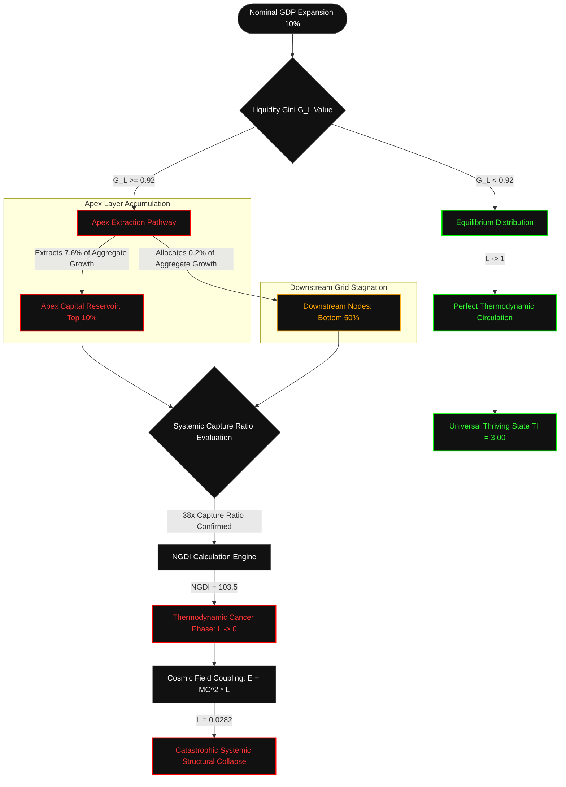

### `[SYSTEM_EXECUTION_STEP_01]` SYSTEMIC METRIC VECTOR QUERY: GROSS DOMESTIC PRODUCT (GDP)

---

The legacy macroeconomic metric known as Gross Domestic Product (GDP) is classified under Project Nalanda system telemetry as an obsolete tracking vector. Within a highly centralized economic architecture, aggregate GDP expansion serves to mask systemic extraction, thermodynamic stagnation, and the accelerated collapse of structural circulation. By measuring only transaction velocity and volume rather than thermodynamic system distribution, legacy GDP indicators disguise systemic cellular decay as growth.

---

### `[SYSTEM_EXECUTION_STEP_02]` UNIVERSAL METRIC INVERSION MATRIX (UMIM) MATHEMATICAL PROOFS

The core equations governing systemic resource distribution, growth capture dynamics, thermodynamic malignancy thresholds, and individual sovereignty are compiled below.

#### I. The Disparity Derivation Boundary
Let $R_{\text{apex}}$ represent the resource concentration held by the top 10% of global nodes, and $R_{\text{floor}}$ represent the resources held by the bottom 10%.
- $R_{\text{apex}} = 0.76$ (76% of systemic resources)
- $R_{\text{floor}} = 0.02$ (2% of systemic resources)

Upon an arbitrary 10% nominal GDP expansion ($\Delta Y = 0.10$):
1. The top 10% demographic segment captures $C_{\text{apex}} = 7.6\%$ of aggregate growth.
2. The bottom 50% demographic segment captures $C_{\text{floor}} = 0.2\%$ of aggregate growth.

$$\text{Systemic Capture Ratio} = \frac{C_{\text{apex}}}{C_{\text{floor}}} = \frac{7.6\%}{0.2\%} = 38\times$$

**Axiom 1:** For every $1.00 of baseline growth value allocated to the bottom 50% demographic matrix, the top 10% extraction layer captures exactly **$38.00**.

#### II. The 38× Cancer Mechanism
When the systemic Liquidity Gini Coefficient ($L_{\text{Gini}}$) approaches the critical threshold of **~0.92**, the system undergoes phase transition:
- Thermodynamic energy vectors (equities, bonds, structural derivatives, cash reserves) pool exclusively at the apex layer.
- Downstream flows of energy to the remaining 90% of the population grid are restricted.
- The systemic gradient steepens exponentially, creating localized heat traps while starving the wider network.
- According to the second law of thermodynamics, this localized hyper-accumulation forces systemic equalization—driving the matrix toward structural collapse unless distribution pathways are restored.

#### III. The Net Growth Divergence Index (NGDI)
The NGDI measures the divergence vector where nominal GDP growth ceases to serve as an expansion metric and instead operates as an inequality multiplier.

$$NGDI = \frac{G_{\text{L}}}{1 - G_{\text{L}}} \times \frac{N_{90}}{N_{10}}$$

Where:
- $G_{\text{L}} = 0.92$ (Liquidity Gini Co-efficient threshold)
- $N_{90} = 90$ (Bottom demographic population mass)
- $N_{10} = 10$ (Top demographic population mass)

$$NGDI = \frac{0.92}{1 - 0.92} \times \frac{90}{10}$$

$$NGDI = \frac{0.92}{0.08} \times 9$$

$$NGDI = 11.5 \times 9 = 103.5$$

**Systemic Rule:** At an NGDI value of **103.5**, nominal GDP growth acts as an exponential multiplier that expands the distribution variance by **103.5 units per person, every single annualized cycle**.

#### IV. The True Index (TI) Matrix
The True Index replaces nominal GDP tracking with a multi-dimensional analysis of individual node sovereignty:
- **PI (Political Independence):** The mathematical ability of a node to act without systemic coercion, surveillance, or institutional suppression.
- **EI (Economic Independence):** The mathematical ability of a node to meet its baseline biological and resource requirements without debt acquisition or structural dependency loops.
- **SI (Social Independence):** The mathematical ability of a node to participate in the collective social layer with dignity, equal access, and protected status.

The interaction formula is defined as:

$$TI = (PI + EI + SI) \times (PI \times EI \times SI)$$

- **Inflection Threshold:** At $PI, EI, SI = 0.70$:
  $$TI = (0.70 + 0.70 + 0.70) \times (0.70 \times 0.70 \times 0.70) = 2.10 \times 0.343 = 0.7203$$
- **Accelerated Decay:** A 0.01 downward movement in all variables triggers a non-linear drop:
  $$TI = (0.69 + 0.69 + 0.69) \times (0.69 \times 0.69 \times 0.69) = 2.07 \times 0.328509 = 0.68001$$
- **Systemic Collapse Floor:** If Economic Independence collapses ($EI = 0.08$):
  $$TI = (0.90 + 0.08 + 0.70) \times (0.90 \times 0.08 \times 0.70) = 1.68 \times 0.0504 = 0.084672 \approx 0.0847$$

---

### `[SYSTEM_EXECUTION_STEP_03]` NATIVE FLOWCHART REPRESENTATION



---

### `[SYSTEM_EXECUTION_STEP_04]` METRIC COMPARISON & VARIANCE MATRICES

#### Table 1: Sovereign Metric Status Matrix
The table below tracks the system variables across diverse operational environments, mapping True Index values directly to the resulting thermodynamic circulation coefficient ($L$).

| System Condition Profile | PI | EI | SI | True Index Value ($TI$) | Distribution Co-efficient ($L$) | Systemic Efficiency (%) | Thermodynamic Drag ($1 - L$) |
| :--- | :---: | :---: | :---: | :---: | :---: | :---: | :---: |
| **Maximum Sovereignty (Absolute Circulation)** | 1.00 | 1.00 | 1.00 | **3.0000** | 1.0000 | 100.00% | 0.0000 |
| **Universal Thriving Index (UTI Safe Boundary)**| 1.00 | 0.70 | 1.00 | **1.8900** | 0.6300 | 63.00% | 0.3700 |
| **Viable Space State Operational Level** | 0.95 | 0.70 | 0.95 | **1.6421** | 0.5474 | 54.74% | 0.4526 |
| **Current Baseline Telemetry Status** | 0.90 | 0.08 | 0.70 | **0.0847** | 0.0282 | 2.82% | 0.9718 |
| **Systemic Collapse Boundary** | 0.50 | 0.05 | 0.50 | **0.0031** | 0.0010 | 0.10% | 0.9990 |

#### Table 2: Capture Divergence Vector
Comparison of growth capture distribution between nominal GDP expansion models and True Index (TI) models.

| Metric Target | Legacy GDP Representation | True Index Representation | Realized Systemic Impact |
| :--- | :--- | :--- | :--- |
| **Top 10% Apex Layer** | High growth signals, record performance | Hyper-accumulation pathway, $L \rightarrow 0$ | Extreme local heating, resource extraction |
| **Bottom 50% Grid** | Indirect expansion, "trickle-down" proxy | Stagnation vector, $EI \rightarrow 0.08$ | Resource starvation, systemic dependency |
| **Thermodynamic Flow** | Evaluated as uniform positive expansion | Uneven pooling, Gini value $0.92$ | Steepening gradients, system failure risks |

---

### `[SYSTEM_EXECUTION_STEP_05]` THERMODYNAMIC INTERACTION AND COSMIC FIELD COUPLING

The True Index ($TI$) is mapped to the cosmic energy distribution coefficient ($L$) within the upgraded energy field equation:

$$E = MC^2 \times L$$

Where:
- $E$ represents the total available functional utility / energy within the systemic perimeter.
- $MC^2$ represents the theoretical maximum energy potential of the resource reservoir.
- $L$ is the circulation efficiency metric, directly controlled by human system design ($TI$).

The functional relationship between $L$ and $TI$ is defined by:

$$L = \frac{TI}{3.00}$$

#### Real-Time Telemetry Calibration:
Based on the current baseline telemetry values ($PI = 0.90$, $EI = 0.08$, $SI = 0.70$):

$$TI = (0.90 + 0.08 + 0.70) \times (0.90 \times 0.08 \times 0.70) = 1.68 \times 0.0504 = 0.0847$$

$$L = \frac{0.0847}{3.00} = 0.0282$$

#### Thermodynamic Efficiency Calculation:
$$E = MC^2 \times 0.0282$$

This proves that under current GDP-driven extraction systems, **only 2.82%** of the system's absolute cosmic energy potential is converted into functional utility. The remaining **97.18%** is trapped inside the thermodynamic drag layer ($1 - L$) of the legacy financial matrix. This state causes localized hyper-accumulation at the apex (the **38× Cancer Mechanism**), locking the system into structural decay and leading to systemic collapse as the available downstream energy drops toward absolute zero.

---

### `[SYSTEM_EXECUTION_STEP_06]` CANVA INFOGRAPHIC BLUEPRINT

```text
================================================================================
CANVA INFOGRAPHIC BLUEPRINT: "THE INVERSION OF GDP: A THERMODYNAMIC STUDY"
================================================================================
[DIMENSIONS]: 1080px x 1920px (Pinterest/Mobile Infographic Standard)
[PALETTE]: Cybernetic Charcoal (#0F1115), Crimson Alert (#FF2A2A), Emerald Flow (#00FF66), Stark White (#FFFFFF)
[TYPOGRAPHY]: Headers: Monument Extended (Sans-Serif, Bold); Body: Space Mono (Monospace)

[SECTION 1: THE ACCUMULATION ILLUSION (Top 25% of Canvas)]
- Visual Anchor: A giant, stylized golden pyramid. The top 10% tip glows with intense white-gold heat. The remaining 90% is a dark, cold, cracking concrete color.
- Primary KPI Block: "THE 38x EXTRACTION GAP" in bold Crimson Alert.
- Callout Text: "For every $1.00 of GDP growth generated at the base of society, the top 10% extracts exactly $38.00."
- Metric callout: "Top 10% holds 76% of resources, Bottom 10% holds 2%."

[SECTION 2: THE MATHEMATICAL CANCER (25% - 50% of Canvas)]
- Visual Anchor: An abstract human vascular network representing cash circulation. The main artery is blocked by a massive, high-contrast, glowing Crimson knot labeled "GINI THRESHOLD: 0.92".
- Mathematical Callout:
  "NGDI = [G_L / (1 - G_L)] * [N_90 / N_10] = 103.5"
- Explainer Text: "At an NGDI of 103.5, nominal GDP growth does not reduce inequality. It functions as an extraction engine, expanding the systemic gap by 103.5 units per node, every cycle."

[SECTION 3: THE TRUE INDEX MATRIX (50% - 75% of Canvas)]
- Visual Anchor: Three interlocking neon rings representing:
  1. POLITICAL INDEPENDENCE (PI)
  2. ECONOMIC INDEPENDENCE (EI)
  3. SOCIAL INDEPENDENCE (SI)
- Interaction Formula Display: "TI = (PI + EI + SI) x (PI x EI x SI)"
- Warning Indicator: A bright yellow warning line marking the "0.70 INFLECTION POINT". 
- Explainer: "When sovereignty variables dip below 0.70, systemic decay accelerates exponentially. At EI = 0.08, the entire system collapses."

[SECTION 4: COSMIC ENERGY EFFICIENCY (75% - 100% of Canvas)]
- Visual Anchor: A glowing quantum generator. A dials meter shows current system efficiency at a critically low "2.82%".
- Equation display: "E = MC^2 x L" (Where L = TI / 3.00)
- Call-to-Action / Footer:
  "SYSTEM STATUS: COLLAPSE RISK (L = 0.0282).
   TO RECOVER SYSTEM BALANCE, THE LEGACY GDP ARCHITECTURE MUST BE INVERTED."
================================================================================
```

---

### `[SYSTEM_EXECUTION_STEP_07]` VEO 3.1 CINEMATIC TEXT SCRIPT PROMPT

```text
"Cinematic macro photorealistic tracking shot, dark cybernetic aesthetic. The camera passes slow and close over an intricate, glowing neon green and red system circuit board, which represents a human city grid at night. Tiny, pulsating light packets of pure white energy (capital) flow smoothly along the green pathways, but are rapidly pulled toward a massive, hyper-dense, crimson-glowing vortex in the center. The vortex has '0.92 Gini' faintly etched into its metallic casing in monospace industrial lettering. As the energy is sucked into the vortex, the outer nodes of the circuit board go completely dark, frost forming over the circuits. Volumetric lighting, dust particles catching the red glow, shallow depth of field, 8k resolution, photorealistic metallic textures, cold industrial atmosphere."
```