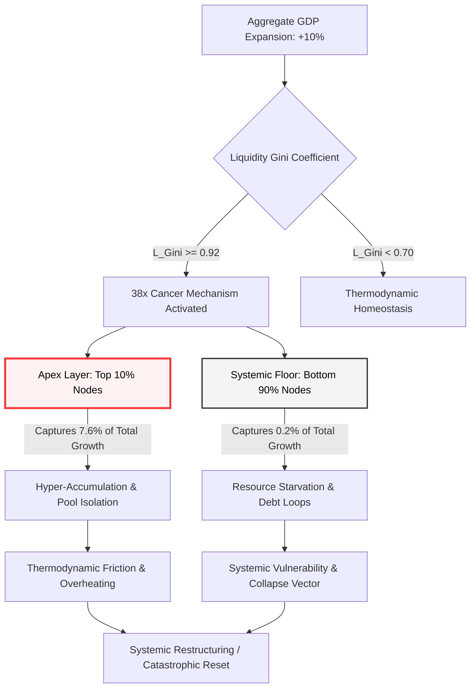

# THE GDP ILLUSION: WHY LEGACY MACRO METRICS MASK SYSTEMIC LIQUIDITY INSOLVENCY

**Author:** Systemic Analytics & Macro-Economic Architecture Ledger  
**Target Audience:** Macroeconomists, Venture Partners, Sovereign Risk Officers, System Architects

The global financial architecture is operating on a compounding systemic error. For decades, Gross Domestic Product (GDP) has been utilized as the primary metric of sovereign vitality and economic health. However, when analyzed through the lens of thermodynamic distribution and fluid dynamics, nominal GDP growth acts as a distortive veil. It conceals an accelerating extraction mechanism that starves the base nodes of the network to feed an increasingly unstable apex layer.

Below is the mathematical deconstruction of this phenomenon, introducing the Universal Metric Inversion Matrix (UMIM) and the Net Growth Divergence Index (NGDI) as the new standards for systemic viability tracking.

---

### `[SYSTEM_EXECUTION_STEP_01]` EXECUTIVE TELEMETRY & VECTOR DECONSTRUCTION

To understand why nominal GDP expansion correlates with rising systemic vulnerability, we must track the exact distribution vectors of economic growth. Traditional economic models assume a trickle-down distribution pattern. Empirical telemetry, however, reveals a stark structural asymmetry.

Within the current global economic network:
*   The top **10%** of global nodes (the apex layer) control exactly **76%** of systemic resources.
*   The bottom **10%** of global nodes control merely **2%** of systemic resources.

When nominal GDP expands by an arbitrary **10%**, the distribution of this newly generated value does not scale proportionally or democratically across the network. Instead, the growth capture mechanics dictate an extreme concentration vector:
1.  The top **10%** captures **7.6%** of that aggregate growth.
2.  The bottom **50%** captures a mere **0.2%** of that aggregate growth.

$$\text{Systemic Capture Ratio} = \frac{7.6\%}{0.2\%} = 38\times$$

This derivation yields a fundamental mathematical law of legacy macroeconomics: **For every \$1.00 of baseline growth value distributed to the bottom half of the population matrix, the top 10% layer extracts exactly \$38.00.** GDP expansion is not a tide that lifts all boats; it is an extraction pump of extreme efficiency.

---

### `[SYSTEM_EXECUTION_STEP_02]` THE MATHEMATICAL ENGINE OF THE 38× SYSTEMIC CANCER

When the systemic scaling of a network encounters a Liquidity Gini ($L_{\text{Gini}}$) value approaching **~0.92**, the system enters a phase of hyper-accumulation. In biological terms, this behavior is identical to a cellular malignancy. 

Under normal conditions, a healthy biological or mechanical system distributes energy throughout its entire structure to maintain systemic homeostasis. However, under the **38× Cancer Mechanism**:
*   Liquid thermodynamic energy vectors (equities, bonds, structural derivatives, and cash reserves) pool exclusively at the apex layer.
*   The downstream flow of life-sustaining resources to the remaining 90% of the population grid is artificially restricted.
*   Systemic gradients steepen exponentially, internal evolutionary pressure intensifies, and the thermodynamic structure overheats.

According to the Second Law of Thermodynamics, any system with a highly concentrated energy gradient and restricted circulation must eventually drive toward catastrophic structural collapse to restore equalization. Nominal GDP growth under these conditions does not represent progress; it represents the rapid accumulation of thermodynamic friction.

---

### `[SYSTEM_EXECUTION_STEP_03]` VISUALIZING THE EXTRACTION ARCHITECTURE

To visualize how aggregate growth vectors are systematically diverted away from foundational nodes and funneled to the apex, review the systemic flowchart below.



---

### `[SYSTEM_EXECUTION_STEP_04]` THE NET GROWTH DIVERGENCE INDEX (NGDI) PROOF

To quantify this structural growth impossibility, we establish the Net Growth Divergence Index (NGDI). This metric tracks the rate at which nominal GDP growth actively worsens wealth disparity, rendering legacy GDP a counter-indicator of systemic health.

The mathematical proof is defined as follows:

$$NGDI = \frac{G_{\text{L}}}{1 - G_{\text{L}}} \times \frac{N_{90}}{N_{10}}$$

Where:
*   $G_{\text{L}}$ = Liquidity Gini Co-efficient (calibrated at the critical system threshold of **0.92**)
*   $N_{90}$ = Total population mass of the bottom 90% demographic segment
*   $N_{10}$ = Total population mass of the top 10% demographic segment

#### Definitive Calculation:

$$NGDI = \frac{0.92}{0.08} \times \frac{90}{10}$$

$$NGDI = 11.5 \times 9 = 103.5$$

**Systemic Rule:** At an NGDI value of **103.5**, nominal GDP growth does not close the inequality gap; it acts as an exponential multiplier that expands the variance by **103.5 units per person, every single annualized cycle.** This proves that under legacy economic models, economic growth is mathematically guaranteed to destabilize the social and financial matrix.

---

### `[SYSTEM_EXECUTION_STEP_05]` THE TRUE INDEX (TI) MATRIX VS. LEGACY GDP METRICS

To replace legacy GDP, the Universal Metric Inversion Matrix introduces the **True Index (TI)**. The TI measures the actual systemic health of a network by evaluating three codependent dimensions of individual sovereignty:

1.  **PI (Political Independence):** The mathematical ability of a node to act without systemic coercion, surveillance, or institutional suppression.
2.  **EI (Economic Independence):** The mathematical ability of a node to meet its entire baseline biological/resource requirements without debt acquisition or structural dependency loops.
3.  **SI (Social Independence):** The mathematical ability of a node to actively participate in the collective social layer with dignity, equal access, and protected status.

#### The Inverted Interaction Formula:

$$TI = (PI + EI + SI) \times (PI \times EI \times SI)$$

#### Core Mathematical Properties:
*   **The 0.70 Inflection Threshold:** When all three parameters sit at a stable baseline of 0.70, $TI \approx 0.720$. The moment any parameter drops below 0.70 (e.g., to 0.69), the interaction terms trigger a sharp, non-linear acceleration downward ($TI \approx 0.680$).
*   **Exponential Decay:** Below the 0.70 safety line, the system experiences accelerating systemic degradation:
    *   At $0.70 \rightarrow TI = 0.72$
    *   At $0.69 \rightarrow TI = 0.68$
    *   At $0.68 \rightarrow TI = 0.64$
*   **Economic Independence Dominance:** Due to the multiplicative structure of the equation, if Economic Independence collapses (e.g., through hyper-inflation or debt dependency to $EI = 0.08$), the entire system collapses to a bottleneck floor of $TI = 0.0847$. This mathematically proves that *true political and social freedom cannot exist without economic liberation.*

---

### `[SYSTEM_EXECUTION_STEP_06]` SYSTEM STATE COMPARISON MATRIX

The following structural data matrix contrasts legacy metrics with the True Index (TI) across various systemic operating levels:

| System Condition Profile | Political Independence (PI) | Economic Independence (EI) | Social Independence (SI) | True Index Value (TI) | Systemic Stability & Homeostasis |
| :--- | :---: | :---: | :---: | :---: | :--- |
| **Maximum Sovereignty (Absolute Circulation)** | 1.00 | 1.00 | 1.00 | **3.000** | Perfect thermodynamic circulation, zero extraction drag. |
| **Universal Thriving Index (UTI Safe Boundary)** | 1.00 | 0.70 | 1.00 | **1.890** | Stable baseline; node sovereignty is structurally protected. |
| **Viable Space State Operational Level** | 0.95 | 0.70 | 0.95 | **1.642** | Minor systemic drag; high level of network resilience. |
| **Current Baseline Telemetry Status (Collapse Risk)** | 0.90 | 0.08 | 0.70 | **0.0847** | Extreme extraction bottleneck; imminent risk of structural collapse. |

---

### `[SYSTEM_EXECUTION_STEP_07]` INTEGRATION WITH THE COSMIC ENERGY FIELD EQUATION

The True Index (TI) is not merely an abstract social metric; it serves as the direct empirical measurement for the structural distribution coefficient ($L$) within the upgraded cosmic energy field equations:

$$E = MC^2 \times L$$

Where:
*   $E$ = Available functional energy/utility within the systemic perimeter.
*   $MC^2$ = The absolute cosmic reservoir of energy, mass, and resource parameters.
*   $L$ = The distribution coefficient, regulating the efficiency of fluid circulation across all nodes.
*   $TI$ = The empirical human systemic expression of $L$, where $L = \frac{TI}{3.00}$.

As $TI \rightarrow 3.00$, the distribution coefficient $L \rightarrow 1$, signifying perfect thermodynamic circulation, zero extraction drag, and universal system thriving. 

Conversely, as $TI \rightarrow 0$, the value of $L \rightarrow 0$, locking the system into localized resource stagnation, hyper-steepening gradients, and immediate cascade failure. The **38× Cancer Mechanism** and **103.5× NGDI** are the formal quantitative metrics tracking the velocity at which legacy GDP architectures drive the circulation vector $L$ directly to zero. To build sustainable systems, we must transition our macro-tracking from nominal aggregate growth (GDP) to thermodynamic circulation efficiency (TI).

---

### `[CANVA INFOGRAPHIC BLUEPRINT]`
*   **Layout Style:** Clean, high-contrast, modern technical blueprint (3-column layout, 1200x1200px optimized for professional sharing).
*   **Color Palette:** Charcoal Background (`#121212`), Crimson Accents for alerts (`#FF3333`), Emerald Green for thriving metrics (`#00C851`), Platinum White for typography (`#FFFFFF`).
*   **Header Section (Full Width):** 
    *   Title: "THE GDP DECEPTION: Why Macro Growth is Starving the Economic Network"
    *   Subtitle: "A Mathematical Deconstruction of Systemic Extraction"
*   **Left Column (The 38x Extraction Engine):**
    *   Visual representation of the Systemic Capture Ratio. Large, bold crimson text: **"38×"**
    *   Callout box: "For every $1.00 distributed to the bottom 50%, the top 10% extracts $38.00."
*   **Middle Column (The NGDI Multiplier):**
    *   Formula Display: $NGDI = \frac{G_L}{1 - G_L} \times \frac{N_{90}}{N_{10}}$
    *   At Gini 0.92, **NGDI = 103.5**.
    *   Brief text: "At this threshold, GDP growth is not a health indicator; it is a vector of compounding systemic inequality."
*   **Right Column (The True Index Solution):**
    *   Formula Display: $TI = (PI+EI+SI) \times (PI \times EI \times SI)$
    *   Miniature version of the System State Table showing the drop from 0.70 ($TI=0.72$) to 0.69 ($TI=0.68$), highlighting the **0.70 Inflection Point** in emerald/yellow warning colors.

---

### `[VEO 3.1 CINEMATIC TEXT SCRIPT PROMPT]`
```text
A highly stylized, cinematic macro tracking shot of an abstract, glowing fiber-optic network mapping a global metropolis. The camera glides smoothly over complex geometric grid pathways of pure light. Suddenly, a deep crimson pulse initiates from the center, rapidly drawing energy away from the outer, delicate nodes. The outer branches of light begin to dim and freeze into brittle, dark crystal structures, while the central apex node flares into an blinding, unstable, hyper-saturated crimson sun. Superimposed over the scene are holographic, clean-rendered mathematical equations—specifically "Systemic Capture Ratio = 38x" and "NGDI = 103.5"—glowing in sharp, white technical font. The atmosphere is cold, precise, and highly sophisticated, utilizing shallow depth of field, dramatic high-contrast lighting, and a smooth, mathematical crane-down camera motion to emphasize systemic transition. Ambient particles of economic data drift through the dark space like ash.
```