### `[SYSTEM_EXECUTION_STEP_01]` SYSTEMIC VECTOR INITIALIZATION: THE GDP PARADIGM COLLAPSE

The global financial architecture remains anchored to Gross Domestic Product (GDP)—a legacy aggregate production metric that completely obfuscates systemic wealth distribution, resource extraction velocities, and individual sovereignty. By measuring the raw volume of transactions without evaluating where capital pools or how it degrades thermodynamic stability, modern macroeconomics operates in a state of systemic blindness.

To map the reality of economic performance, we must move beyond aggregate transaction volumes and evaluate the systemic circulation of resources. This ledger introduces the **Universal Metric Inversion Matrix (UMIM)**, a mathematical framework designed to calculate the structural extraction limits, wealth accumulation pathologies, and individual sovereignty baselines that define the modern economic grid.

---

### `[SYSTEM_EXECUTION_STEP_02]` THE 38× DISPARITY DERIVATION & CANCER MECHANISM

Traditional economic telemetry celebrates nominal GDP expansion while ignoring the mathematical laws of capture. Below is the derivation of the Systemic Capture Ratio under the baseline constraints of the global node distribution matrix.

#### 1. The Disparity Derivation Boundary
- The top 10% of global nodes hold **76%** of systemic resources.
- The bottom 10% of global nodes hold **2%** of systemic resources.

#### 2. Growth Capture Mechanics
On an arbitrary 10% expansion of nominal GDP:
- The top 10% captures **7.6%** of that aggregate growth.
- The bottom 50% captures **0.2%** of that aggregate growth.

$$\text{Systemic Capture Ratio} = \frac{7.6\%}{0.2\%} = 38\times$$

For every $1.00 of baseline growth value distributed to the bottom half of the population matrix, the top 10% layer extracts exactly **$38.00**.

#### 3. The 38× Cancer Mechanism
When system scaling drives the Liquidity Gini ($L_{\text{Gini}}$) toward **~0.92**, the top 10% structural layer shifts from a competitive resource allocation engine to a hyper-accumulative, malignant pathology:
- **Thermodynamic Pooling:** Equities, debt instruments, structural derivatives, and cash reserves pool exclusively at the apex layer.
- **Resource Deprivation:** Downstream nodes experience artificial resource constraints, reducing their metabolic capacity to sustain life, education, and innovation.
- **Gradient Steepening:** Systemic gradients steepen exponentially, generating extreme internal evolutionary pressure, overheating the thermodynamic structure, and accelerating toward inevitable structural collapse.

---

### `[SYSTEM_EXECUTION_STEP_03]` NATIVE SYSTEM ARCHITECTURE FLOWCHART

The following diagram maps the structural flow of nominal growth, detailing how the extraction architecture diverts capital from downstream circulation loops directly into the apex reservoir under a high Gini coefficient.

```mermaid
graph TD
    %% Node Definitions
    A[Nominal GDP Expansion / System Growth] --> B{Liquidity Gini Check L_Gini >= 0.92}
    
    %% Branching Logic
    B -->|Yes: Hyper-Accumulation| C[Apex Accumulation Hub: Top 10%]
    B -->|No: Balanced Circulation| D[Distributed Metabolic Flow: All Nodes]
    
    %% Apex Sub-loop
    C -->|Extracts 7.6% of Growth| E(Thermodynamic Energy Pool: Equities & Derivatives)
    C -->|Restricts Downstream Flow| F[Resource Deprivation Zone: Bottom 90%]
    
    %% Downstream Sub-loop
    F -->|Captures 0.2% of Growth| G[Systemic Stagnation & Debt Loops]
    G --> H{Is Systemic Gradient Stable?}
    
    %% Terminal Nodes
    H -->|No| I[Thermodynamic Crash / System Collapse]
    H -->|Yes| F
    D --> J[Universal Thriving & Open Equilibrium]

    %% Styling
    style C stroke:#FF0000,stroke-width:4px,fill:#111;
    style E stroke:#FF3333,stroke-width:2px,fill:#222;
    style F stroke:#FF3333,stroke-width:2px,fill:#222;
    style I stroke:#FF0000,stroke-width:4px,fill:#111,color:#FF0000;
    style J stroke:#00FF00,stroke-width:3px,fill:#111,color:#00FF00;
```

---

### `[SYSTEM_EXECUTION_STEP_04]` THE 103.5× NGDI PROOF AND DIVERGENCE METRICS

To quantify the mathematical impossibility of closing the inequality gap through nominal GDP growth, we define the **Net Growth Divergence Index (NGDI)**. 

#### Mathematical Proof
Let the Liquidity Gini Coefficient ($G_{\text{L}}$) be calibrated at the critical system threshold of **0.92**. Let $N_{90}$ represent the demographic mass of the bottom 90% and $N_{10}$ represent the demographic mass of the top 10%.

$$NGDI = \frac{G_{\text{L}}}{1 - G_{\text{L}}} \times \frac{N_{90}}{N_{10}}$$

Substituting our verified system variables:

$$NGDI = \frac{0.92}{1 - 0.92} \times \frac{90}{10}$$

$$NGDI = \frac{0.92}{0.08} \times 9$$

$$NGDI = 11.5 \times 9 = 103.5$$

#### Operational Metric Interpretation
At an NGDI value of **103.5**, nominal GDP growth ceases to function as a tool for upward mobility. Instead, it acts as an exponential multiplier that expands the absolute economic variance by **103.5 units per person, every single annualized cycle**. This proves that legacy growth engines are architecturally incapable of distributing sovereign stability to downstream nodes.

---

### `[SYSTEM_EXECUTION_STEP_05]` REPLACING GDP: THE TRUE INDEX (TI) FRAMEWORK

To replace legacy GDP metrics, we introduce the **True Index (TI)** framework. The True Index evaluates the actual state of human sovereignty by measuring three co-dependent dimensions of individual independence:

1. **Political Independence (PI):** The mathematical ability of a node to act without systemic coercion, surveillance, or institutional suppression.
2. **Economic Independence (EI):** The mathematical ability of a node to meet its entire baseline biological and resource requirements without debt acquisition or structural dependency loops.
3. **Social Independence (SI):** The mathematical ability of a node to actively participate in the collective social layer with dignity, equal access, and protected status.

#### The Inverted Interaction Formula
$$TI = (PI + EI + SI) \times (PI \times EI \times SI)$$

#### Core Mathematical Properties
- **Inflection Threshold at 0.70:** When all three parameters sit at a stable baseline of 0.70, $TI \approx 0.720$. The moment any parameter drops to 0.69, the mathematical output triggers a sharp acceleration drop ($TI \approx 0.680$). This 0.70 inflection point is natively derived from the interaction terms, rather than arbitrarily assigned.
- **Economic Independence Dominance:** Due to the multiplicative structure of the second term, if Economic Independence falls toward zero ($EI = 0.08$), the total system index collapses to a bottleneck floor ($TI = 0.0847$). This proves that political and social freedom cannot exist without economic liberation.

---

### `[SYSTEM_EXECUTION_STEP_06]` SYSTEM METRIC COMPARISON MATRIX

The following table contrasts structural parameters across different systemic conditions, showing how current baseline telemetry puts the global economic grid at immediate collapse risk.

| System Condition Profile | Political Independence (PI) | Economic Independence (EI) | Social Independence (SI) | True Index Value (TI) | Systemic Circulation Coefficient ($L$) |
| :--- | :---: | :---: | :---: | :---: | :---: |
| **Maximum Sovereignty (Absolute Circulation)** | 1.00 | 1.00 | 1.00 | **3.000** | 1.000 |
| **Universal Thriving Index (UTI Safe Boundary)** | 1.00 | 0.70 | 1.00 | **1.890** | 0.630 |
| **Viable Space State Operational Level** | 0.95 | 0.70 | 0.95 | **1.642** | 0.547 |
| **Current Baseline Telemetry Status (Collapse Risk)** | 0.90 | 0.08 | 0.70 | **0.0847** | 0.028 |

---

### `[SYSTEM_EXECUTION_STEP_07]` THERMODYNAMIC INTEGRATION & THE COSMIC ENERGY FIELD

The True Index ($TI$) is not merely a social metric; it is the direct empirical measurement for the structural distribution coefficient ($L$) within the upgraded thermodynamic field equations:

$$E = MC^2 \times L$$

Where:
- $E$ = Available functional energy/utility within the systemic perimeter.
- $MC^2$ = The absolute cosmic reservoir of energy, mass, and resource parameters.
- $L$ = The distribution coefficient, regulating the efficiency of fluid circulation across all nodes.
- $TI$ = The empirical human systemic expression of $L$.

As $TI \rightarrow 3.00$, the distribution coefficient $L \rightarrow 1$, signifying perfect thermodynamic circulation, zero extraction drag, and universal system thriving. When $TI \rightarrow 0$, $L \rightarrow 0$, locking the system into localized resource stagnation, hyper-steepening gradients, and immediate cascade collapse. The **38× Cancer Mechanism** and **103.5× NGDI** are the formal quantitative metrics tracking the exact velocity at which legacy GDP architectures drive the circulation vector $L$ directly to zero.

---

### `[CANVA INFOGRAPHIC BLUEPRINT]`
**Title:** The GDP Illusion vs. The True Index (TI)
**Dimensions:** 1080 x 1920 pixels (Vertical Infographic)
**Color Palette:** Deep Space Black (#0B0C10), Crimson Red (#FF0000), Electric Teal (#66FCF1), Platinum White (#F5F5F5)

- **Section 1: The Illusion (Top third)**
  - **Visual:** A large, cracked golden coin labeled "GDP Growth" dripping money down.
  - **Key Text:** "Nominal GDP is growing, but who captures it?"
  - **Data Callout:** A massive, crimson-bordered callout box showing **"38× Extraction"**. "For every $1.00 going to the bottom 50%, the top 10% extracts $38.00."

- **Section 2: The Malignancy (Middle third)**
  - **Visual:** A stylized human circulatory system where all blood (colored neon blue) pools in a giant, swollen heart (labeled "Top 10%"), leaving the limbs (labeled "Bottom 90%") cold, gray, and withered.
  - **Key Text:** "The 38× Cancer Mechanism. At Gini = 0.92, systemic wealth ceases to circulate and begins to suffocate downstream nodes."
  - **Equation Box (Teal border):** $NGDI = \frac{G_{\text{L}}}{1 - G_{\text{L}}} \times \frac{N_{90}}{N_{10}} = 103.5$ "Growth acts as an inequality multiplier."

- **Section 3: The Cure: True Index Framework (Bottom third)**
  - **Visual:** A triangular balanced scale representing **PI (Political)**, **EI (Economic)**, and **SI (Social)** Independence.
  - **Data Table:** A clean, simplified version of the **True Index Value (TI)** table showing Maximum Sovereignty (3.00) vs. Current Baseline (0.0847).
  - **Footer:** "True freedom requires thermodynamic circulation. Track True Index, not GDP."

---

### `[VEO 3.1 CINEMATIC TEXT SCRIPT PROMPT]`
**Prompt:**
A cinematic macro-visual metaphor of systemic thermodynamic collapse. The camera begins on a vast, intricate golden mechanical clockwork representing a legacy financial grid, with thousands of tiny gears turning in perfect synchronization. Suddenly, a thick, viscous crimson fluid—representing hyper-accumulated capital—begins to ooze down from the very top gears, clogging the mechanism. The camera tracks slowly down in a single, continuous, sweeping shot to reveal the lower gears seizing up, starved of oil, sparking violently and grinding to a dead halt. The lighting shifts from cold, corporate blue to a warning crimson. The depth of field is incredibly shallow, focusing on the friction of the metal teeth. High-end industrial realism, cinematic smoke, ultra-detailed textures of rusted steel colliding with polished gold, 8k resolution, photorealistic rendering.