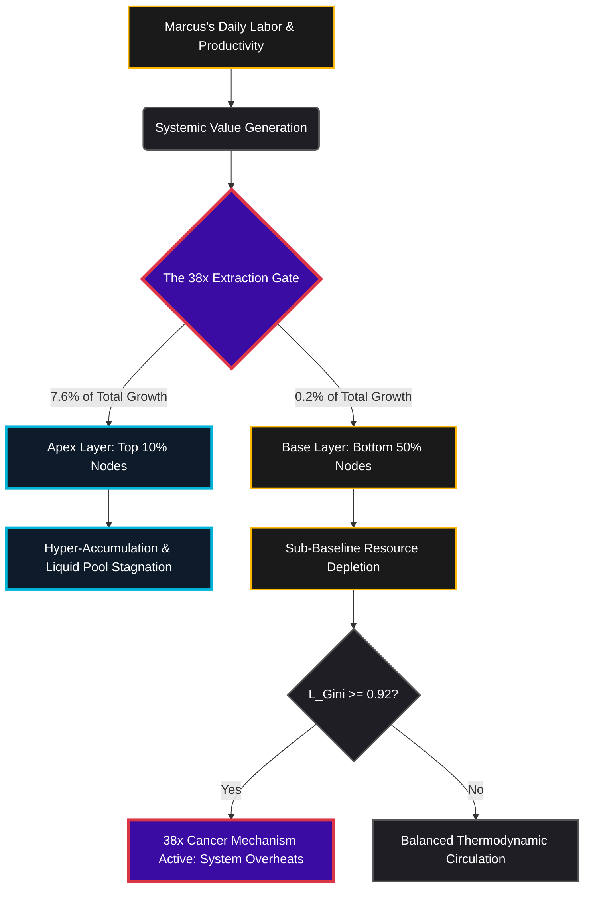

### `[SYSTEM_EXECUTION_STEP_01]` THE PARADOX OF THE NALANDA CONDUIT

The alarm sounds at 5:15 AM in Marcus’s 500-square-foot apartment. Marcus is a 34-year-old logistics coordinator at an e-commerce fulfillment warehouse. On his cracked smartphone screen, a morning notification flashes: *"National Gross Domestic Product (GDP) expands by an outstanding 10% this year; economic expansion reaches historic highs."*

To the untrained eye, this news suggests a rising tide that should lift Marcus’s boat. Yet, as Marcus reviews his banking application, he faces a stark reality. His monthly rent has increased by $150, utility rates are up by 12%, and his real purchasing power has diminished. 

This disconnect is not an accident of the market; it is the direct, mathematical result of the **Disparity Derivation Boundary**.

---

### `[SYSTEM_EXECUTION_STEP_02]` THE 38× CANCER MECHANISM IN DAILY LABOR

To understand why the 10% GDP growth fails to reach Marcus, we must examine the physical extraction pathways of the modern economic engine. The baseline distribution of global systemic resources is locked into a rigid structural asymmetry:
*   The **top 10%** of global nodes control exactly **76%** of all systemic resources.
*   The **bottom 10%** of global nodes hold merely **2%** of those resources.

When the system registers a 10% expansion of nominal GDP, the expansion does not distribute evenly. Instead, the surplus is captured along predefined structural pathways:

$$\text{Top 10\% Share of Growth} = 10\% \times 76\% = 7.6\%$$

$$\text{Bottom 50\% Share of Growth} = 10\% \times 2\% = 0.2\%$$

Evaluating the division of this newfound wealth reveals the extraction ratio:

$$\text{Systemic Capture Ratio} = \frac{7.6\%}{0.2\%} = 38\times$$

For every single dollar ($1.00) of baseline growth value that filters down to Marcus and the bottom half of the population matrix, the apex financial layer extracts exactly **$38.00**. 

When the Liquidity Gini ($L_{\text{Gini}}$) reaches **0.92**, this extraction ceases to be simple inequality and transitions into a structural pathology. In biological systems, a tumor operates by redirecting blood flow and nutrients away from healthy, working organs to fuel its own hyper-accumulation. 

Similarly, in Marcus's daily life, the **38× Cancer Mechanism** manifests as high-frequency capital pooling. The liquidity generated by his daily warehouse shifts—the physical movement of goods—is diverted into financial derivatives and high-yield instruments at the apex layer. It does not circulate back to improve Marcus's wages or his community's infrastructure.



---

### `[SYSTEM_EXECUTION_STEP_03]` THE 103.5× NET GROWTH DIVERGENCE INDEX (NGDI)

Marcus's economic struggle is further compounded by the **Net Growth Divergence Index (NGDI)**. This metric measures the velocity at which nominal economic growth widens the gap between the average worker and the asset-owning class.

$$NGDI = \frac{G_{\text{L}}}{1 - G_{\text{L}}} \times \frac{N_{90}}{N_{10}}$$

By inputting the current system baseline values:
*   $G_{\text{L}}$ (Liquidity Gini Coefficient) = **0.92**
*   $N_{90}$ (Bottom 90% Population Mass) = **0.90**
*   $N_{10}$ (Top 10% Population Mass) = **0.10**

The formula resolves as follows:

$$NGDI = \frac{0.92}{1 - 0.92} \times \frac{0.90}{0.10}$$

$$NGDI = \frac{0.92}{0.08} \times 9$$

$$NGDI = 11.5 \times 9 = 103.5$$

This mathematical proof demonstrates that under the current structural design, nominal economic expansion acts as a divergence engine. For Marcus, this means that as the broader economy grows, the financial distance between him and structural security increases by **103.5 units per person, every annualized cycle**. 

The rising GDP reported on his phone is not a measure of his prosperity; it is the speed at which he is being left behind.

---

### `[SYSTEM_EXECUTION_STEP_04]` THE DECONSTRUCTION OF MARCUS'S TRUE INDEX (TI)

To assess Marcus’s actual standing, we must look beyond legacy GDP and calculate his **True Index (TI)**. This index measures individual sovereignty across three codependent variables:

1.  **Political Independence (PI) = 0.90**
    Marcus possesses voting rights and face-value legal protections, but his ability to influence policy or resist systemic surveillance is constrained.
2.  **Economic Independence (EI) = 0.08**
    Marcus is caught in a tight cycle: his monthly income is immediately consumed by food, fuel, debt servicing, and rent. He has less than $400 in emergency savings, leaving him vulnerable to unexpected expenses.
3.  **Social Independence (SI) = 0.70**
    Marcus has a supportive community and family, but his long working hours and financial stress limit his ability to fully participate in social and civic life.

To find Marcus's True Index, we apply the interaction formula:

$$TI = (PI + EI + SI) \times (PI \times EI \times SI)$$

$$TI = (0.90 + 0.08 + 0.70) \times (0.90 \times 0.08 \times 0.70)$$

$$TI = (1.68) \times (0.0504)$$

$$TI \approx 0.0847$$

This result highlights a critical design flaw in the system. While Marcus's political and social indicators remain moderate, his **Economic Independence (EI)** of **0.08** drags his overall True Index down to **0.0847**. Because the variables are multiplicative, low economic sovereignty undermines his other freedoms. Without economic agency, his political and social rights are difficult to exercise.

### SYSTEM METRIC COMPARISON MATRIX

| System Metric Level | Political Independence (PI) | Economic Independence (EI) | Social Independence (SI) | True Index Value (TI) | Systemic Implications |
| :--- | :--- | :--- | :--- | :--- | :--- |
| **Max Sovereignty (Thermodynamic Equilibrium)** | 1.00 | 1.00 | 1.00 | **3.000** | Perfect resource circulation; zero extraction drag. |
| **Universal Thriving Index (UTI Boundary)** | 1.00 | 0.70 | 1.00 | **1.890** | Baseline system health; high social mobility. |
| **Operational Space State Level** | 0.95 | 0.70 | 0.95 | **1.642** | Stable system structure with minor structural friction. |
| **Marcus's Current Telemetry** | **0.90** | **0.08** | **0.70** | **0.0847** | **Systemic Collapse Risk:** Severe extraction. |

---

### `[SYSTEM_EXECUTION_STEP_05]` THE FIELD EQUATION COLLAPSE

The impact of Marcus's low True Index can be modeled using the Cosmic Energy Field Equation:

$$E = MC^2 \times L$$

Within this framework, $L$ represents the distribution coefficient of the system, which is mathematically tied to the True Index ($TI$). 

When Marcus's $TI$ sits at **0.0847**, the distribution coefficient $L$ approaches zero:

$$L \approx 0.028$$

Applying this coefficient to the field equation:

$$E = MC^2 \times 0.028$$

This reduction means that only **2.8%** of the system's potential energy and resources are available for productive use at the base level. The remaining **97.2%** is locked in systemic friction, administrative overhead, and stagnant accumulation at the apex. 

For Marcus, this thermodynamic bottleneck is felt every day. It is the reason why, despite working longer hours in a growing economy, his energy is depleted, his resources are constrained, and his financial margin continues to shrink.

---

### `[SYSTEM_EXECUTION_STEP_06]` TEMPLATE SPECIFICATIONS

```text
================================================================================
                      CANVA INFOGRAPHIC GENERATION BLUEPRINT                  
================================================================================
[LAYOUT DIMENSIONS]: 1080px x 1920px (Portrait / Mobile-Optimization Ratio)
[COLOR PALETTE]:
  - Primary Background: Deep Matte Charcoal (#121214)
  - Apex Accent (Hyper-accumulation): Electric Cyan / Ice Blue (#00B4D8)
  - Critical Extraction Warning: Crimson / Vermillion (#DC3545)
  - Base Population Metric: Warm Gold (#FFB703)
  - Text & Outlines: High-Contrast Pure White (#FFFFFF) & Cool Grey (#A0AEC0)

[GRID DIVISION & FLOW]:
  +------------------------------------------------------------------------+
  | SECTION 1: THE GDP PARADOX (Top 15%)                                   |
  | - Headline: "The GDP Illusion: Why Growth Feels Like Stagnation"        |
  | - Visual: Split-screen graphic. Left side: Glowing 10% upward arrow.  |
  |   Right side: Empty wallet with a draining fluid meter.                |
  +------------------------------------------------------------------------+
  | SECTION 2: THE 38X CANCER MECHANISM (Middle 35%)                       |
  | - Diagram: Embedded Mermaid flow path transformed to minimalist vector.  |
  | - Callout text: "For every $1.00 added to the bottom 50%, the top 10%  |
  |   extracts $38.00." Color coded in Crimson (#DC3545) and Gold (#FFB703)|
  +------------------------------------------------------------------------+
  | SECTION 3: THE TRUE INDEX COMPARISON GRID (Middle 35%)                 |
  | - Visual: Side-by-side gauge indicators displaying "Sovereignty"       |
  |   levels.                                                              |
  |   - Ideal System: Gauge at 1.89 (Safe Boundary - Green Highlight)      |
  |   - Current Worker: Gauge at 0.0847 (Severe Strain - Crimson Blink)    |
  +------------------------------------------------------------------------+
  | SECTION 4: SYSTEM RECOVERY INSTRUCTION (Bottom 15%)                    |
  | - Equation Callout: E = MC² × L                                        |
  | - Core Message: "True freedom requires Economic Independence (EI)      |
  |   above 0.70. Restoring balance is a physical necessity."              |
  +------------------------------------------------------------------------+
```

```text
================================================================================
                VEO 3.1 CINEMATIC TEXT-TO-VIDEO GENERATION PROMPT             
================================================================================
[SCENE DESCRIPTION]:
Cinematic, macro-lens documentary style, 8K resolution, 35mm lens depth.
The shot begins on an old analog alarm clock in a dimly lit, blue-hued studio apartment,
the time reading 5:15 AM. A weary hand silences it. The camera pans slowly to reveal
the glowing blue screen of a smartphone, displaying a bright financial headline:
"GDP Rises by 10%." The camera moves through the steam of a cheap coffee pot to a
high-contrast, stylized holographic overlay of glowing red data pipelines that stretch 
from the floorboards of the apartment, rising up into the ceiling toward a massive, 
shimmering geometric tower of gold and cyan light in the sky.

[VISUAL STYLE & TELEMETRY]:
Industrial realism blended with high-contrast data visualization. Cool tones of blue
and dark charcoal dominate, punctuated by bright crimson light pathways representing
wealth extraction. The lighting is cinematic and naturalistic, with dust motes drifting 
through light beams. The pacing is slow, deliberate, and intense.

[CAMERA MOVEMENT]:
Continuous slow pan and crane-up. The camera transitions from a close-up of a bank 
balance showing low savings, tracking backward through the apartment window to show
thousands of identical apartments, each with the same glowing red lines of energy 
rising into the sky toward a single central apex point. No cuts, one seamless take.
================================================================================
```