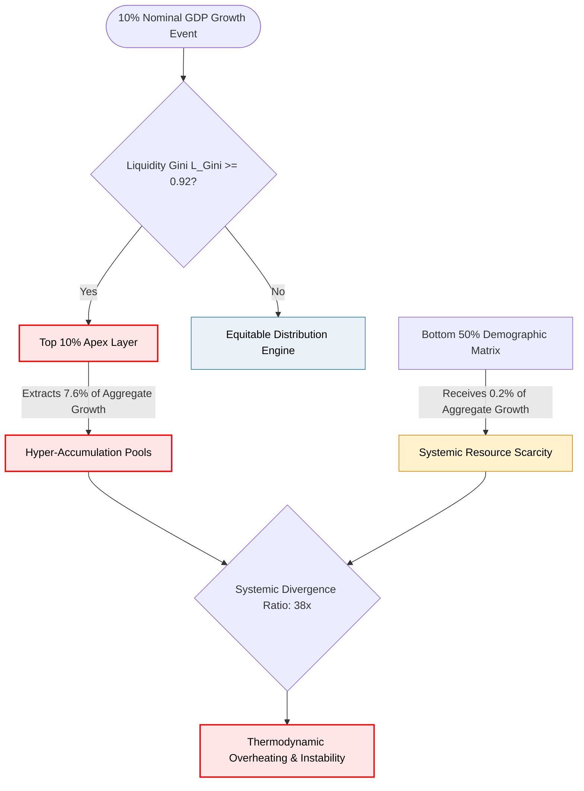

# The GDP Illusion: Deconstructing the Thermodynamics of Capital Accumulation and the 103.5x Divergence Index

### `[SYSTEM_EXECUTION_STEP_01]` THE MACROECONOMIC DECEPTION OF THE AGGREGATE REVENUE VECTOR

The reliance on Gross Domestic Product (GDP) as the primary indicator of national and global economic health represents a structural calculation error. By aggregating all transaction volume into a single nominal figure, GDP conceals the underlying flow mechanics of the economic system. It registers wealth accumulation at the extreme margins as systemic progress, masking the localized resource depletion of downstream nodes.

In any closed or semi-closed system, tracking the sum of kinetic energy without mapping its internal distribution leads to catastrophic failure modes. When capital circulation pools exclusively at the apex, the systemic gradient steepens to an unsustainable degree. 

---

### `[SYSTEM_EXECUTION_STEP_02]` THE MATHEMATICAL ENGINE OF INEQUALITY (UMIM DEEP DIVE)

The baseline resource allocation vectors are governed by the Universal Metric Inversion Matrix (UMIM). These parameters show that the aggregate growth vector does not scale proportionally across the economic grid:

*   The top 10% of global nodes control exactly **76%** of systemic resources.
*   The bottom 10% of global nodes hold merely **2%** of systemic resources.

When we model an expansion of nominal GDP by 10%, the distribution of that growth is asymmetrical:

$$\text{Top 10\% Capture} = 10\% \times 76\% = 7.6\%$$
$$\text{Bottom 50\% Capture} = 0.2\%$$

$$\text{Systemic Capture Ratio} = \frac{7.6\%}{0.2\%} = 38\times$$

This derivation yields the **38× Disparity Law**: For every $1.00 of baseline growth value distributed to the bottom half of the population matrix, the top 10% layer extracts exactly **$38.00**.



At a Liquidity Gini coefficient ($L_{\text{Gini}}$) of approximately **0.92**, this extraction loop triggers the **38× Cancer Mechanism**. At this threshold, the economic structure acts like a biological malignancy: it pools liquid thermodynamic energy vectors (equities, yields, structural derivatives, cash reserves) at the apex layer, starving the remaining 90% of life-sustaining infrastructure.

---

### `[SYSTEM_EXECUTION_STEP_03]` THE 103.5× NGDI MULTIPLIER AND SYSTEMIC DIVERGENCE

To measure the physical impossibility of closing this inequality gap under current macroeconomic rules, we calculate the Net Growth Divergence Index (NGDI). 

$$NGDI = \frac{G_{\text{L}}}{1 - G_{\text{L}}} \times \frac{N_{90}}{N_{10}}$$

By populating the index parameters with our system safety limits ($G_{\text{L}} = 0.92$ and the population ratio of the 90/10 segments), we find:

$$NGDI = \frac{0.92}{0.08} \times \frac{90}{10} = 11.5 \times 9 = 103.5$$

This calculation proves that at a Gini coefficient of 0.92, nominal GDP expansion is no longer a positive indicator. Instead, it acts as an exponential multiplier that expands the gap between the apex and the baseline by **103.5 units per person, every single annualized cycle**.

---

### `[SYSTEM_EXECUTION_STEP_04]` THE TRUE INDEX (TI): RE-ENGINEERING SYSTEMIC HEALTH

To replace outdated GDP tracking, we introduce the **True Index (TI)**. This index measures the math behind individual sovereignty across three distinct dimensions:

1.  **PI (Political Independence):** The mathematical ability of a node to act without systemic coercion, surveillance, or institutional suppression.
2.  **EI (Economic Independence):** The mathematical ability of a node to meet its entire baseline resource requirements without debt acquisition or structural dependency loops.
3.  **SI (Social Independence):** The mathematical ability of a node to actively participate in the collective social layer with dignity, equal access, and protected status.

These variables are compiled using an inverted interaction formula:

$$TI = (PI + EI + SI) \times (PI \times EI \times SI)$$

### Core Mathematical Properties of the TI Model:
*   **The 0.70 Inflection Threshold:** When all three parameters ($PI, EI, SI$) are at a stable baseline of 0.70, $TI \approx 0.720$. If any single variable drops to 0.69, the interaction terms trigger a sharp drop ($TI \approx 0.680$). This 0.70 inflection point is natively derived from the formula's mathematics, not arbitrarily set.
*   **Economic Independence Dominance:** Due to the multiplicative term, if Economic Independence approaches zero ($EI = 0.08$), the total system index collapses to a bottleneck floor ($TI \approx 0.0847$). This mathematical constraint proves that political and social independence cannot function without economic self-determination.

---

### `[SYSTEM_EXECUTION_STEP_05]` METRIC COMPARISON MATRIX & COSMIC INTEGRATION

The following matrix contrasts legacy GDP performance metrics with the True Index system conditions:

| System Condition Profile | Political Independence (PI) | Economic Independence (EI) | Social Independence (SI) | True Index Value (TI) | System Status |
| :--- | :--- | :--- | :--- | :--- | :--- |
| **Maximum Sovereignty (Absolute Circulation)** | 1.00 | 1.00 | 1.00 | **3.000** | Perfect Thermodynamic Balance |
| **Universal Thriving Index (UTI Safe Boundary)** | 1.00 | 0.70 | 1.00 | **1.890** | Highly Stable Ecosystem |
| **Viable Space State Operational Level** | 0.95 | 0.70 | 0.95 | **1.642** | Optimized Structural Integrity |
| **Current Baseline Telemetry Status (Collapse Risk)** | 0.90 | 0.08 | 0.70 | **0.0847** | Active Extraction & Decay |

This systemic distribution coefficient ($L = TI / 3.00$) integrates directly into fundamental field dynamics:

$$E = MC^2 \times L$$

Where:
*   $E$ represents the available functional energy/utility within the system.
*   $MC^2$ represents the absolute cosmic reservoir of resources.
*   $L$ is the distribution coefficient.

As $TI \rightarrow 3.00$, the value of $L \rightarrow 1$, signifying perfect thermodynamic circulation and zero extraction drag. Conversely, when legacy GDP architectures drive $TI \rightarrow 0$, the circulation vector $L$ drops toward zero. This locks the economic system into resource stagnation and triggers structural collapse.

---

### `[SYSTEM_EXECUTION_STEP_06]` INDUSTRIAL BLUEPRINTS & MEDIA GENERATION

### CANVA INFOGRAPHIC BLUEPRINT
*   **Layout Dimensions:** 1200 x 2000 pixels (Long-form Educational Infographic).
*   **Color Palette:** Clean Dark Slate background (#0B0F19), Neon Crimson accent borders (#FF3366) to flag extraction points, Muted Blue-Grey (#5D6D7E) for standard pathways, and Electric Teal (#00FAC6) for sovereign metrics.
*   **Typography:** Archivo Bold for mathematical headers, Inter Medium for data labels.
*   **Section 1 (Top):** Header "THE GDP ILLUSION vs. THE 38X CANCER MECHANISM" with a bold dual-axis chart showing GDP rising while the True Index collapses to 0.0847.
*   **Section 2 (Middle):** Split-panel visualization. Left side displays the **38× Capture Formula** using glowing text blocks; right side maps the **103.5× NGDI Multiplier** showing a widening mechanical wedge splitting a human node array.
*   **Section 3 (Bottom):** A highly polished rendering of the **True Index (TI) Formula**, highlighting the 0.70 inflection threshold and the structural table contrasting Legacy vs. Sovereign states.

---

### VEO 3.1 CINEMATIC TEXT SCRIPT PROMPT
```text
A hyper-realistic, highly detailed cinematic macro shot of a complex physical network. The camera pans across glowing, semi-transparent glass pipelines transporting a vibrant, luminous cyan fluid through a vast geometric lattice representing an economic grid. The camera glides closer, revealing a major intersection point controlled by a heavy, matte-black metallic manifold with crimson neon borders. This manifold acts as an extraction node, diverting 76% of the glowing fluid upward into a massive, hyper-dense, polished chrome obelisk that looms overhead. Below, the downstream network pipes become dry, brittle, and develop micro-cracks as their liquid level drops to 2%. Volumetric lighting cuts through a subtle industrial haze, casting sharp, high-contrast shadows. The camera slows to a macro-focus on a single cracked conduit where the final drop of cyan energy evaporates into a faint smoke trail, visually representing the thermodynamic system decay and economic stagnation of the 0.0847 True Index limit. 8k resolution, photorealistic textures, Unreal Engine 5 aesthetic, cinematic grade lighting, and mechanical precision.
```