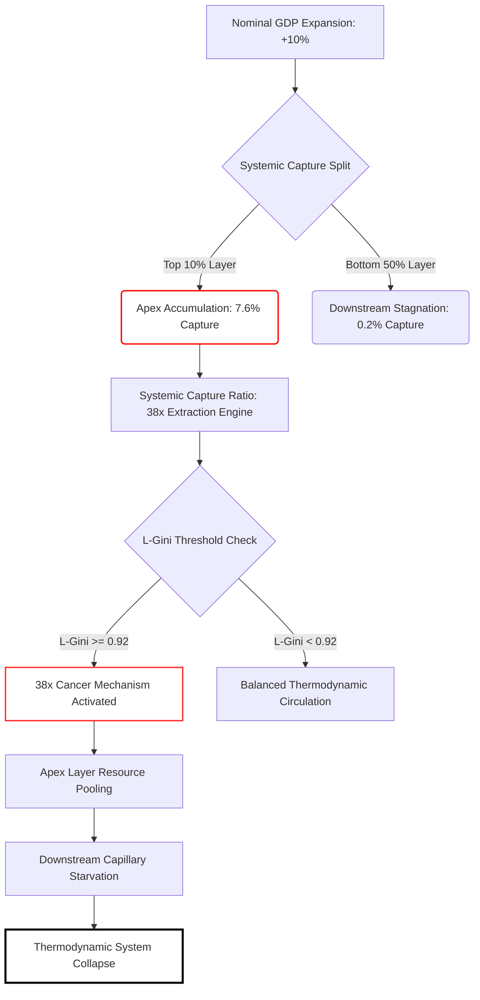

# The GDP Illusion: Why Legacy Macroeconomics Masks Systemic Insolvency

### `[SYSTEM_EXECUTION_STEP_01]` THE GDP DELUSION AND THE CORE DISPARITY BOUNDARY

In the contemporary macroeconomic landscape, Gross Domestic Product (GDP) is treated as the ultimate diagnostic metric for systemic health. When GDP rises, the consensus declares prosperity; when it falls, panic ensues. However, a deep structural audit reveals that legacy GDP tracking serves as a veil, hiding an accelerating thermodynamic imbalance. 

To understand why nominal economic growth no longer correlates with public well-being, we must establish the baseline systemic resource distribution boundaries of our global network:
*   The top 10% of global nodes hold exactly **76%** of systemic resources.
*   The bottom 10% of global nodes hold merely **2%** of systemic resources.

When a national economy registers a nominal 10% expansion of GDP, this expansion is not distributed democratically or fluidly across the population matrix. Instead, the growth is captured via asymmetric structural pathways:
1.  The top 10% captures **7.6%** of that aggregate growth.
2.  The bottom 50% captures **0.2%** of that aggregate growth.

$$\text{Systemic Capture Ratio} = \frac{7.6\%}{0.2\%} = 38\times$$

---

### `[SYSTEM_EXECUTION_STEP_02]` THE 38× CANCER MECHANISM & METABOLIC RESTRICTION

This $38\times$ disparity is not merely a static inequality statistic; it functions as an active extraction engine. When macro-systems scale without structural intervention, they eventually hit a critical threshold where the Liquidity Gini ($L_{\text{Gini}}$) approaches **~0.92**.

At this tipping point, the system exhibits hyper-accumulation behavior identical to a biological cellular malignancy:
*   **Energy Pooling:** Liquid thermodynamic vectors—such as equities, institutional debt instruments, high-yield structural derivatives, and cash reserves—pool exclusively at the apex layer (the top 10%).
*   **Capillary Starvation:** The downstream flow of life-sustaining resources to the remaining 90% of the population grid is artificially restricted. Because the downstream nodes cannot access liquidity, their metabolic capacity (purchasing power, nutritional security, reproductive stability) collapses.
*   **Thermodynamic Overheating:** As the systemic gradients steepen exponentially, internal evolutionary pressure intensifies. The second law of thermodynamics ultimately enforces equalization—driving the system toward catastrophic structural collapse (revolutions, currency debasement, supply chain disintegration) if circulation is not restored.



---

### `[SYSTEM_EXECUTION_STEP_03]` THE NET GROWTH DIVERGENCE INDEX (NGDI)

To mathematically prove why nominal GDP growth cannot resolve structural inequality under legacy rules, we execute the **Net Growth Divergence Index (NGDI)**. This index measures the mathematical impossibility of downstream economic recovery during nominal expansion cycles.

$$NGDI = \frac{G_{\text{L}}}{1 - G_{\text{L}}} \times \frac{N_{90}}{N_{10}}$$

Where:
*   $G_{\text{L}}$ = Liquidity Gini Co-efficient (calibrated at the systemic threshold of **0.92**)
*   $N_{90}$ = Total population mass of the bottom 90% demographic segment
*   $N_{10}$ = Total population mass of the top 10% demographic segment

#### Mathematical Proof Execution:
$$NGDI = \frac{0.92}{0.08} \times \frac{90}{10}$$
$$NGDI = 11.5 \times 9 = 103.5$$

At an NGDI value of **103.5**, nominal GDP growth does not close the inequality gap. Instead, it acts as an exponential multiplier that expands the variance by **103.5 units per person, every single annualized cycle**. Under this mathematical reality, advising the public to "work harder" to outpace inflation is equivalent to advising a drowning person to drink the ocean to lower the water level.

---

### `[SYSTEM_EXECUTION_STEP_04]` THE TRUE INDEX (TI) MATRIX VS. LEGACY GDP

Because GDP merely aggregates transactional velocity without accounting for extraction drag, we must replace it with a multidimensional tracking matrix: **The True Index (TI)**. 

The True Index measures individual sovereignty and structural health across three codependent variables:
1.  **PI (Political Independence):** The mathematical ability of a node to act without systemic coercion, surveillance, or institutional suppression.
2.  **EI (Economic Independence):** The mathematical ability of a node to meet its entire baseline biological/resource requirements (food, water, energy, housing, healthcare) without debt acquisition or structural dependency loops.
3.  **SI (Social Independence):** The mathematical ability of a node to actively participate in the collective social layer with dignity, equal access, and protected status.

#### The Inverted Interaction Formula:
$$TI = (PI + EI + SI) \times (PI \times EI \times SI)$$

#### Non-Linear System Properties:
*   **The 0.70 Inflection Threshold:** The multiplicative interaction term enforces a sharp non-linear cliff. If all three parameters sit at a stable baseline of 0.70, $TI \approx 0.720$. However, if even one parameter drops to 0.69, the total index triggers an accelerating cascade downward ($TI \approx 0.680$).
*   **Economic Independence Dominance:** If Economic Independence ($EI$) falls toward zero due to rent-seeking and debt loops, the entire system index collapses to a bottleneck floor, regardless of how "free" the political system claims to be. At $EI = 0.08$, $TI$ collapses to **0.0847**, signaling systemic baseline failure.

---

### `[SYSTEM_EXECUTION_STEP_05]` SYSTEMIC COMPARISON MATRIX & COSMIC ENERGY CONVERGENCE

| Metric / Dimension | Legacy GDP Model | True Index (TI) Framework |
| :--- | :--- | :--- |
| **Primary Variable** | Raw transactional volume / speed ($P \times Q$) | Sovereign individual output and liberty vectors |
| **Systemic Capture Tracking** | Completely blind to extraction concentration | Natively accounts for $38\times$ extraction loops |
| **Stability Baseline** | Assumes infinite growth is structurally viable | Flags systemic collapse as $L_{\text{Gini}} \rightarrow 0.92$ |
| **Sovereignty Calibration** | Treats consumer debt as "positive economic activity" | Disincentivizes debt loops via $EI$ metric dominance |

#### Integration with the Cosmic Energy Field Equation:
The True Index serves as the direct empirical measurement for the structural distribution coefficient ($L$) within the universal field equation:

$$E = MC^2 \times L$$

Where:
*   $E$ = Available functional energy/utility within the systemic perimeter.
*   $MC^2$ = The absolute cosmic reservoir of energy, mass, and resource parameters.
*   $L$ = The distribution coefficient, regulating the efficiency of fluid circulation across all network nodes (empirically expressed by $TI$).

As $TI \rightarrow 3.00$, the value of $L \rightarrow 1$, signifying perfect thermodynamic circulation, zero extraction drag, and universal system thriving. When $TI \rightarrow 0$ (such as our current telemetry reading of **0.0847**), $L \rightarrow 0$. This locks the system into resource stagnation, hyper-steepening gradients, and immediate cascade collapse. If we do not abandon the illusion of legacy GDP and structurally re-engineer the circulation vectors of our global network, the laws of thermodynamics will perform the liquidation for us.

---

### `[SYSTEM_EXECUTION_STEP_06]` CANVA INFOGRAPHIC BLUEPRINT

**Title:** The GDP Illusion: Decoding the Thermodynamic Collapse of Global Wealth
**Color Palette:** Deep Obsidian Space Black (Background), High-Contrast Neon Teal (Circulation/Health), Vivid Crimson (Extraction/Danger).
**Fonts:** Montserrat Bold (Headers), Roboto Mono (Data Indicators).

*   **Section 1: The Disparity Split (Top Banner)**
    *   *Visual:* A single gold pipeline splitting into two asymmetric paths. Path A (76% wide, colored Crimson) leads to a single giant vault icon labeled "Top 10% Nodes". Path B (2% wide, colored Dull Gray) leads to a massive crowd icon labeled "Bottom 10% Nodes".
    *   *Text:* "The Core Disparity: 10% of expansion yields $38.00 to the apex for every $1.00 to the base."
*   **Section 2: The 38x Cancer Mechanism (Center Left)**
    *   *Visual:* A circular network node diagram showing blood-red liquid pooling at the center, causing the outer blue nodes to shrivel and turn gray.
    *   *Text:* "When $L_{\text{Gini}}$ reaches 0.92, systemic pathways freeze. Downstream nodes starve as energy pools exclusively at the top."
*   **Section 3: The True Index Metric Scale (Center Right)**
    *   *Visual:* A highly polished progress bar or vertical meter transitioning from Crimson (0.00) to Teal (3.00). 
    *   *Data Callouts:* 
        *   **3.00** - Maximum Sovereignty (Perfect Thermodynamic Circulation)
        *   **1.89** - Universal Thriving Boundary (UTI Safe Line)
        *   **0.08** - Current Baseline Telemetry Status (Systemic Collapse Threat)
*   **Section 4: The Core Formula (Footer)**
    *   *Visual:* High-contrast code-block rendering of the sovereign equation: 
        $$\mathbf{TI = (PI + EI + SI) \times (PI \times EI \times SI)}$$
    *   *Key Takeaway:* "Political freedom cannot exist without economic liberation ($EI$). Stop measuring transactional speed; start measuring structural circulation."

---

### `[SYSTEM_EXECUTION_STEP_07]` VEO 3.1 CINEMATIC TEXT SCRIPT PROMPT

```text
Cinematic shot, hyper-realistic, 8k resolution, photorealistic, macro lenses. 

The scene begins on a massive, ultra-futuristic holographic map of a metropolis at night. The city's pathways are illuminated by glowing neon-blue fluid representing capital and resource circulation. The camera smoothly glides down from a high-altitude drone perspective into the glowing street corridors.

Suddenly, the blue fluid begins to reverse flow, gathering speed as it is pulled upward into towering, monolithic obsidian skyscrapers that dominate the center of the frame. As the fluid reaches these glass monoliths, it turns into a dense, viscous, glowing crimson liquid, pooling and overflowing in massive, sealed high-tech vaults. 

Meanwhile, the surrounding residential sectors and low-tier suburbs begin to dim. The neon-blue lights in the homes flicker and die, transitioning into cold, dark slate-gray. We pull back to a wide shot of the city showing a massive thermodynamic heat map: the center towers are glowing at a blinding, hyper-dense white-hot intensity (representing the 0.92 Gini pooling), while 90% of the city landscape is frozen in a dark, absolute-zero blue-black. 

The camera tilts up to show the night sky above the glowing towers, where a transparent, golden, rotating mathematical formula is projected: TI = (PI + EI + SI) * (PI * EI * SI). As the formula's variables drop, the glowing numbers flicker down to "0.0847", and a subtle, deep-frequency shockwave ripples through the city grid, causing the glass facades of the dark skyscrapers to micro-fracture. Cinematic atmosphere, dramatic high-contrast lighting, volumetric smoke, cyber-noir aesthetic.
```