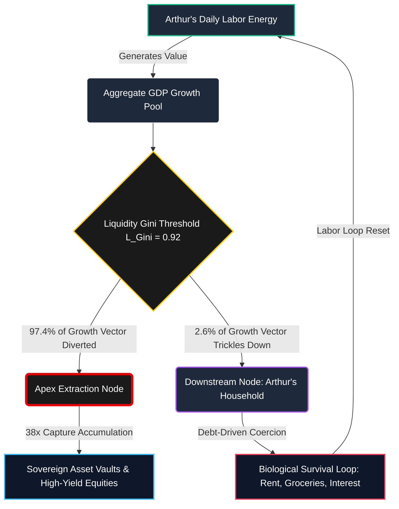

### `[SYSTEM_EXECUTION_STEP_01]` THE ANATOMY OF ARTHUR'S DAY: GDP VS. REALITY

Arthur stares at the flickering fluorescent light of the breakroom clock. It is 6:15 PM. He has just finished a ten-hour shift scanning freight crates at a regional logistics hub. On the breakroom television, a financial news anchor smiles broadly, announcing that the national Gross Domestic Product (GDP) has expanded by a "robust and healthy" 10% this fiscal year. The anchor declares it a triumph of aggregate growth.

But Arthur’s reality is written in different ink. His rent in the outer suburbs just rose by $150 a month. A basic cart of groceries—eggs, milk, bread, and ground beef—costs 18% more than it did last winter. His car's transmission is slipping, and his bank account holds exactly $84.00 until Friday. 

Under the hood of the legacy economic system, Arthur’s daily grind is not an accident; it is the mathematical consequence of a structural extraction engine. The 10% GDP growth celebrated on television does not lift his boat. Instead, it operates under the **Disparity Derivation Boundary**:

---

### `[SYSTEM_EXECUTION_STEP_02]` THE 38× EXTRACTION ENGINE IN THE GROCERY AISLE

When the aggregate economy expands by 10%, the newly generated wealth does not distribute evenly. In Arthur's world, this expansion represents a massive pool of new systemic energy. The mechanics of this capture are highly specialized:

*   The top 10% of global nodes (corporate conglomerates, institutional landlords, and sovereign asset holders) hold **76%** of all systemic resources.
*   The bottom 10% of nodes (including Arthur's demographic layer) hold merely **2%** of systemic resources.

When a 10% nominal expansion occurs:
1. The top 10% captures **7.6%** of that new growth.
2. The bottom 50% captures a microscopic **0.2%** of that same growth.

$$\text{Systemic Capture Ratio} = \frac{7.6\%}{0.2\%} = 38\times$$

For every $1.00 of growth value that trickles down to Arthur to help him pay for his groceries, the corporate holding company that owns his apartment complex extracts exactly **$38.00**. 

This is the **38× Cancer Mechanism**. When the Liquidity Gini ($L_{\text{Gini}}$) reaches a critical threshold of **0.92**, the system acts as a malignant cellular structure. The financial "circulatory system" blocks the flow of life-sustaining resource units to the lower 90% of the population grid, pooling all liquid thermodynamic energy vectors exclusively at the apex layer. The downstream nodes starve, forcing Arthur to run faster on the treadmill just to stay in the same place.

---

### `[SYSTEM_EXECUTION_STEP_03]` THE VISUAL PATHWAY OF STRATIFIED ENERGY

The following flowchart maps how Arthur's daily labor energy is converted into aggregate GDP, only to be systematically diverted away from his household.



---

### `[SYSTEM_EXECUTION_STEP_04]` THE 103.5× MULTIPLIER OF STRUCTURAL IMPOSSIBILITY

As Arthur drives home, his check engine light blinks on. He wonders why, despite working 50 hours a week, his net worth decreases every single year. The answer lies in the **Net Growth Divergence Index (NGDI)**. 

Legacy economics asserts that overall growth will eventually close the wealth gap. The NGDI proves this assertion mathematically impossible once the system passes the critical inequality event horizon.

$$NGDI = \frac{G_{\text{L}}}{1 - G_{\text{L}}} \times \frac{N_{90}}{N_{10}}$$

Where:
*   $G_{\text{L}}$ (Liquidity Gini Coefficient) = **0.92**
*   $N_{90}$ (Bottom 90% demographic mass) = **90**
*   $N_{10}$ (Top 10% demographic mass) = **10**

Executing the math:

$$NGDI = \frac{0.92}{0.08} \times \frac{90}{10} = 11.5 \times 9 = 103.5$$

This means that at a Liquidity Gini of 0.92, nominal GDP growth does not close the gap between Arthur and his institutional landlords. Instead, it acts as an exponential multiplier, expanding the wealth variance by **103.5 units per person, every single annualized cycle**. The harder Arthur works to fuel "growth," the further the horizon of economic stability recedes from his grasp.

---

### `[SYSTEM_EXECUTION_STEP_05]` CALIBRATING THE TRUE INDEX (TI) FOR THE COMMON MAN

To measure Arthur's actual quality of life, we replace the abstract GDP metric with the **True Index (TI)**. The True Index evaluates three deeply human, codependent parameters:

1.  **Political Independence (PI):** Can Arthur make decisions free from institutional surveillance, corporate coercion, or system-level penalties? (Arthur's PI = **0.90**—he has nominal legal rights, but limited real-world systemic leverage).
2.  **Economic Independence (EI):** Can Arthur meet his baseline biological, shelter, and medical needs without acquiring interest-bearing debt or getting trapped in dependency loops? (Arthur's EI = **0.08**—he is one missed paycheck away from eviction, completely dependent on credit cards and high-interest loans).
3.  **Social Independence (SI):** Can Arthur participate in his local community with dignity, safety, and equal access to basic institutional infrastructure? (Arthur's SI = **0.70**—his neighborhood is underfunded, but he retains basic communal bonds).

The Inverted Interaction Formula calculates his actual sovereignty level:

$$TI = (PI + EI + SI) \times (PI \times EI \times SI)$$

$$TI = (0.90 + 0.08 + 0.70) \times (0.90 \times 0.08 \times 0.70)$$

$$TI = (1.68) \times (0.0504) = 0.0847$$

---

### `[SYSTEM_EXECUTION_STEP_06]` SYSTEM BASES COMPARISON GRID

Arthur's computed value of **0.0847** places him squarely in the high-risk "Collapse Zone" of the system telemetry. The matrix below shows how his current lived experience compares to systemic thresholds of thriving and thermodynamic balance:

| System Condition Profile | Political Independence (PI) | Economic Independence (EI) | Social Independence (SI) | True Index Value (TI) | Real-World Translation for Arthur |
| :--- | :--- | :--- | :--- | :--- | :--- |
| **Maximum Sovereignty (Absolute Circulation)** | 1.00 | 1.00 | 1.00 | **3.000** | Complete self-determination; labor energy is entirely retained; zero debt coercion. |
| **Universal Thriving Index (UTI Safe Boundary)** | 1.00 | 0.70 | 1.00 | **1.890** | Arthur owns his home, has emergency savings, and has complete healthcare coverage. |
| **Viable Space State Operational Level** | 0.95 | 0.70 | 0.95 | **1.642** | Stable employment, strong public transit, zero predatory interest rates, high civic trust. |
| **Current Baseline Telemetry (Arthur's Reality)** | 0.90 | 0.08 | 0.70 | **0.0847** | Paycheck-to-paycheck survival; rent eats 50% of income; chronic stress; zero economic upward mobility. |

---

### `[SYSTEM_EXECUTION_STEP_07]` THE THERMODYNAMIC CONFLICT

The systemic decay Arthur feels every Sunday night is not merely psychological; it is physical. Under the Cosmic Energy Field Equation, the human societal system is bounded by thermodynamic laws:

$$E = MC^2 \times L$$

The distribution coefficient ($L$)—which is mathematically represented by the True Index ($TI$)—regulates how efficiently energy flows through the population. 

When $TI \rightarrow 3.00$, then $L \rightarrow 1$. This is a state of perfect thermodynamic circulation. Arthur’s labor energy returns to him as nourishing food, stable shelter, and clean air. 

But when $TI \rightarrow 0$, then $L \rightarrow 0$. The system enters a state of total extraction drag. The energy Arthur expends at the logistics hub does not return to him. It is siphoned away, leaving him physically exhausted, financially depleted, and structurally trapped. Legacy GDP metrics praise this extraction as "growth," but the laws of thermodynamics are absolute: a system that refuses to circulate its energy to its constituent nodes must eventually face structural collapse.

---

### `[SYSTEM_EXECUTION_STEP_08]` CANVA INFOGRAPHIC BLUEPRINT

**Title:** The GDP Illusion: Why Growth Feels Like Groundhog Day  
**Target Audience:** Working-class individuals, families living paycheck-to-paycheck.  
**Style/Palette:** High-contrast, clean corporate-dystopian colors. Deep charcoal background (#121212), crisp white text, vibrant crimson (#FF3333) for extraction/debt metrics, and bright mint green (#00E676) for healthy circulation indicators.  

*   **Header Section:**
    *   *Headline:* "Why a 'Booming Economy' is Leaving You Behind" (60pt bold, white).
    *   *Subheadline:* "The mathematical proof that legacy growth acts as a siphon, not a ladder." (24pt regular, light grey).
*   **Visual Left Column (The 38x Disparity Split):**
    *   *Illustration:* A large visual pie chart representing a 10% GDP expansion. 
    *   *Slices:* A tiny sliver highlighted in crimson labeled "The Bottom 50% Share: 0.2% of growth." A massive, dominant slice highlighted in stark white labeled "The Top 10% Share: 7.6% of growth."
    *   *Callout Box (Crimson border):* "For every $1.00 of growth value that reaches the bottom half of the population, the top 10% extracts exactly **$38.00**." (Bold, high contrast).
*   **Visual Right Column (The True Index Calculator):**
    *   *Interactive Slider Mockup:* Visually representing the three levers of the True Index:
        *   *Political Independence:* 0.90 (Slightly restricted).
        *   *Economic Independence:* 0.08 (Critical Bottleneck / Deep Debt).
        *   *Social Independence:* 0.70 (Community Support).
    *   *The Math Highlight:* $TI = (PI + EI + SI) \times (PI \times EI \times SI) \rightarrow \mathbf{0.0847}$
    *   *Warning Tag:* "Values below 0.70 trigger rapid systemic collapse."
*   **Footer Section:**
    *   *Equation Box:* $E = MC^2 \times L$ — "True wealth is not aggregate numbers. True wealth is clean, unhindered resource circulation."

---

### `[SYSTEM_EXECUTION_STEP_09]` VEO 3.1 CINEMATIC TEXT SCRIPT PROMPT

```text
A highly cinematic, slow-burning tracking shot of an exhausted warehouse worker, mid-30s, sitting alone in his older model sedan in a dimly lit, damp asphalt parking lot. Time of day is blue hour, just after dusk. Cold condensation clings to the car windows. Through the windshield, in the far distance across a dark river, towering skyscrapers of a modern financial district glow with sterile, bright white and cyan LED lights, reflecting off the low-hanging rain clouds. Inside the car, the warm amber glow of a blinking check engine light casts soft shadows across the man's tired face as he rests his forehead against the steering wheel. The camera slowly drifts from his worn-out work boots to the dashboard, where a cheap smartphone shows a banking app with a balance of "$84.00". The atmosphere is heavy, melancholic, and hyper-realistic, capturing the quiet dignity of a hidden struggle. Volumetric lighting, 35mm film texture, shallow depth of field, high contrast, cinematic color grading.
```