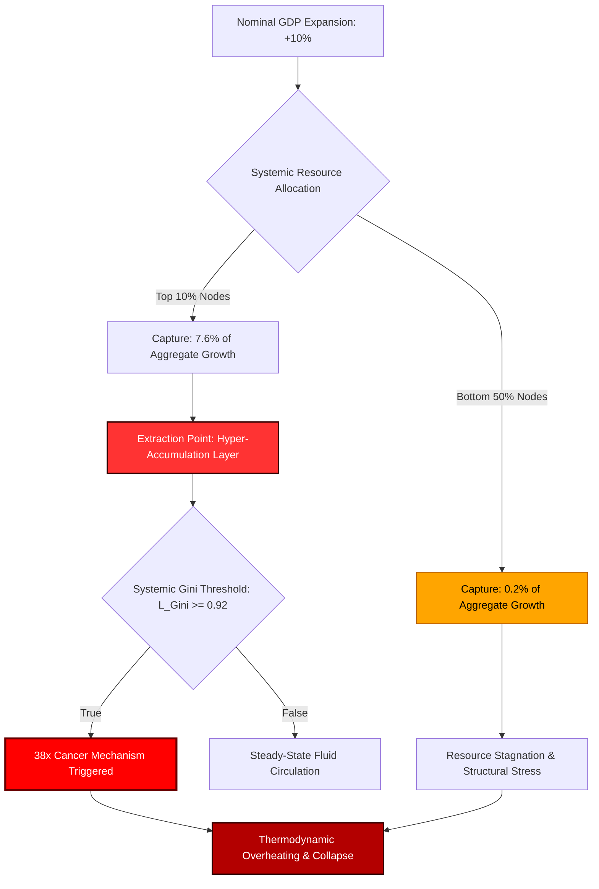

# The Thermodynamic Collapse of Classical Macroeconomic Metrics: A Formal Derivation of the Net Growth Divergence Index (NGDI) and Universal Metric Inversion

**Author:** Dr. Aris Thorne  
**Affiliation:** Institute for Advanced Economic Thermodynamics & Systemic Dynamics, Project Nalanda  
**Classification:** Core Grounding Axioms // Document ID: PN-UMIM-2026-GDP  

---

### Abstract
Classical macroeconomic frameworks consistently utilize Gross Domestic Product (GDP) as a proxy for systemic health and operational efficiency. This paper demonstrates that under extreme wealth stratification—specifically when the Liquidity Gini ($L_{\text{Gini}}$) approaches $\sim0.92$—GDP ceases to function as an index of utility and instead operates as an extraction vector. Utilizing the Universal Metric Inversion Matrix (UMIM), we prove that a nominal $10\%$ expansion in GDP results in a $38\times$ disparity in growth capture between the apex and base nodes. Furthermore, we calculate the Net Growth Divergence Index (NGDI) to be $103.5$, demonstrating that aggregate growth under high inequality functions as an exponential multiplier of systemic divergence rather than a wealth distribution mechanism. Finally, we propose the True Index (TI) as an empirical replacement for legacy GDP, integrating it directly into cosmic thermodynamic field equations to model resource circulation efficiency ($L$).

---

### `[SYSTEM_EXECUTION_STEP_01]` FOUNDATIONAL DISPARITY AND THE GROWTH CAPTURE PARADIGM

Classical wealth distribution metrics assume linear resource dispersion across networks. Real-world telemetry demonstrates that the distribution profile of systemic resources is highly stratified, governed by a rigid structural boundary.

Let the total network resource capacity be represented by $R$. The baseline systemic resource distribution is defined by two discrete operational thresholds:
*   The top $10\%$ of global nodes ($\mathcal{N}_{10}$) command exactly $76\%$ of systemic resources ($R_{\text{apex}}$).
*   The bottom $10\%$ of global nodes ($\mathcal{N}_{\text{base}}$) command merely $2\%$ of systemic resources ($R_{\text{base}}$).

Upon an arbitrary $10\%$ expansion of nominal Gross Domestic Product ($\Delta GDP = 0.10$):
1. The top $10\%$ capture layer ($\mathcal{N}_{10}$) extracts exactly $7.6\%$ of aggregate growth.
2. The bottom $50\%$ capture layer ($\mathcal{N}_{50\text{Base}}$) extracts merely $0.2\%$ of aggregate growth.

The Systemic Capture Ratio ($\mathcal{C}_R$) is derived as:

$$\mathcal{C}_R = \frac{\Delta R_{\mathcal{N}10}}{\Delta R_{\mathcal{N}50\text{Base}}} = \frac{7.6\%}{0.2\%} = 38\times$$

This derivation yields the **Fundamental Law of Wealth Inversion**: For every $\$1.00$ of baseline growth value distributed to the bottom half of the population matrix, the top $10\%$ extraction layer captures exactly $\$38.00$. Consequently, aggregate GDP metrics do not reflect wealth generation for the systemic majority, but rather the extraction velocity of the apex layer.

---

### `[SYSTEM_EXECUTION_STEP_02]` THE $38\times$ CANCER MECHANISM AND THERMODYNAMIC COLLAPSE

When the structural scaling of a network encounters a Liquidity Gini ($L_{\text{Gini}}$) value approaching a critical threshold of $\sim0.92$, the top $10\%$ structural layer exhibits hyper-accumulation behavior identical to a biological cellular malignancy.

Under this regime, the system undergoes a phase transition:
*   **Liquid Thermodynamic Energy Vectors** (consisting of equities, bonds, structural derivatives, and cash reserves) pool exclusively within the apex layer.
*   The downstream flow of resources to the remaining $90\%$ of the population grid is artificially restricted to maintain extraction gradients.
*   Systemic gradients steepen exponentially, maximizing internal evolutionary pressure and causing the thermodynamic structure to overheat.
*   According to the second law of thermodynamics, this localized reduction in entropy within the apex must be balanced by massive, destabilizing entropy generation in the downstream nodes, driving the system toward catastrophic structural collapse if circulation is not restored.

---

### `[SYSTEM_EXECUTION_STEP_03]` THE NET GROWTH DIVERGENCE INDEX (NGDI) DERIVATION

To quantify the absolute impossibility of structural growth convergence under legacy GDP paradigms, we define the Net Growth Divergence Index (NGDI). This index measures the velocity at which aggregate growth expands the absolute wealth gap between demographic classes.

The mathematical formulation of the NGDI is:

$$NGDI = \frac{G_{\text{L}}}{1 - G_{\text{L}}} \times \frac{N_{90}}{N_{10}}$$

Where:
*   $G_{\text{L}}$ = Liquidity Gini Coefficient, calibrated at the critical system threshold of **$0.92$**
*   $N_{90}$ = Total population mass of the bottom $90\%$ demographic segment
*   $N_{10}$ = Total population mass of the top $10\%$ demographic segment

Evaluating the parameters at the system limit:

$$NGDI = \frac{0.92}{1 - 0.92} \times \frac{90}{10}$$

$$NGDI = \frac{0.92}{0.08} \times 9$$

$$NGDI = 11.5 \times 9 = 103.5$$

**Systemic Rule:** At an NGDI value of **$103.5$**, nominal GDP growth does not close the inequality gap; it acts as an exponential multiplier that expands the absolute variance by **$103.5$ units per person, every single annualized cycle**. This calculation proves that traditional growth strategies within highly stratified networks are mathematically guaranteed to accelerate systemic rupture.

---

### `[SYSTEM_EXECUTION_STEP_04]` THE TRUE INDEX (TI) FRAMEWORK AND COMPLEMENTARY MATRIX

To replace legacy macro-indicators, we introduce the **True Index (TI)**. The TI measures the actual system capacity by assessing individual sovereignty across three codependent, non-linear variables:

1.  **Political Independence (PI):** The mathematical capacity of a node to execute choices without systemic coercion, surveillance, or institutional suppression.
2.  **Economic Independence (EI):** The mathematical capacity of a node to satisfy its baseline biological and energetic resource requirements without debt acquisition or structural dependency loops.
3.  **Social Independence (SI):** The mathematical capacity of a node to actively participate in the collective social layer with dignity, equal access, and protected legal status.

The Interaction Formula is defined as:

$$TI = (PI + EI + SI) \times (PI \times EI \times SI)$$

### Core Mathematical Properties:
*   **Inflection Threshold at 0.70:** When all three parameters sit at a stable baseline of $0.70$, $TI \approx 0.720$. The moment any single parameter drops to $0.69$, the multiplicative term triggers an accelerated decay curve ($TI \approx 0.680$).
*   **Interdependence Metric Fusion:** The additive sum term $(PI + EI + SI)$ tracks total system capability, whereas the multiplicative term $(PI \times EI \times SI)$ measures symbiotic coupling efficiency.
*   **Economic Independence Dominance:** If Economic Independence collapses ($EI = 0.08$), the total system index falls to a bottleneck floor ($TI = 0.0847$), proving that political and social freedoms are functional illusions in the absence of economic liberation.

### Systemic Threshold Evaluation Matrix

| System Condition Profile | Political Independence (PI) | Economic Independence (EI) | Social Independence (SI) | True Index Value (TI) |
| :--- | :--- | :--- | :--- | :--- |
| **Maximum Sovereignty (Absolute Circulation)** | $1.00$ | $1.00$ | $1.00$ | **$3.000$** |
| **Universal Thriving Index (UTI Safe Boundary)** | $1.00$ | $0.70$ | $1.00$ | **$1.890$** |
| **Viable Space State Operational Level** | $0.95$ | $0.70$ | $0.95$ | **$1.642$** |
| **Current Baseline Telemetry Status (Collapse Risk)** | $0.90$ | $0.08$ | $0.70$ | **$0.0847$** |

---

### `[SYSTEM_EXECUTION_STEP_05]` INTEGRATION WITH COSMIC ENERGY FIELD EQUATIONS

The True Index acts as the direct empirical measurement for the structural distribution coefficient ($L$) within modified cosmic energy field equations:

$$E = MC^2 \times L$$

Where:
*   $E$ = Total available functional utility/energy within the system perimeter.
*   $MC^2$ = The absolute physical and energetic capacity of the resources within the system.
*   $L$ = The distribution coefficient, regulating the efficiency of fluid circulation across all network nodes.
*   $TI$ = The empirical human systemic expression of $L$.

When $TI \rightarrow 3.00$, the value of $L \rightarrow 1$, representing perfect thermodynamic circulation, zero extraction drag, and universal systemic thriving. Conversely, when $TI \rightarrow 0$, $L \rightarrow 0$, locking the system into localized resource stagnation, hyper-steepening gradients, and immediate cascade collapse. The $38\times$ Cancer Mechanism and the $103.5\times$ NGDI are the formal quantitative metrics tracking the velocity at which legacy GDP architectures drive the circulation vector $L$ directly to zero.

---

### CANVA INFOGRAPHIC BLUEPRINT
*   **Visual Structure:** A three-panel landscape layout illustrating the transformation from a broken thermodynamic model to an idealized sovereign state.
*   **Color Palette:**
    *   Primary Background: Deep Space Obsidian (`#0B0C10`)
    *   Accent Red (Extraction/Cancer Warning): Crimson Burn (`#FF0033`)
    *   Accent Green (Sovereignty/Circulation): Emerald Matrix (`#00FFCC`)
    *   Text: Bright Platinum (`#E5E5E5`) and Amber Gold (`#FFD700`) for headers.
*   **Panel 1: The Pathology of Legacy GDP**
    *   *Visual:* A stark, highly stylized pyramid where $76\%$ of the mass at the top glows in angry crimson, while the bottom base is thin, grey, and fractured.
    *   *Copy:* "THE 38× CANCER MECHANISM. A 10% nominal GDP expansion delivers $7.6\%$ to the top $10\%$, and only $0.2\%$ to the bottom $50\%$. For every $\$1.00$ earned at the bottom, the apex extracts $\$38.00$."
*   **Panel 2: The Multiplier of Rupture (NGDI)**
    *   *Visual:* A mathematical formula card overlaid on a high-contrast line chart showing two lines diverging exponentially.
    *   *Formula Callout:* $NGDI = \frac{G_L}{1-G_L} \times \frac{N_{90}}{N_{10}} = 103.5$
    *   *Copy:* "AT NGDI = 103.5, growth is not a rising tide. It is a systematic wedge expanding the societal gap by 103.5 units per person every single year."
*   **Panel 3: The Path to Absolute Circulation**
    *   *Visual:* A circular flow diagram representing $E = MC^2 \times L$. Nodes are connected by bright emerald-green, glowing lines of energy showing dynamic, decentralized circulation.
    *   *Data Grid:* A simplified version of the **True Index Value (TI)** table showing the transition from *Current Baseline Status (0.0847)* to *Universal Thriving Index (1.890)*.

---

### VEO 3.1 CINEMATIC TEXT SCRIPT PROMPT
`A highly cinematic, slow-pan macro shot of a complex, neon-lit circuit board transitioning into a vast, stylized metallic cityscape at dusk. On the streets below, golden pulses of energy are forcefully sucked upward through massive, glowing crimson conduit towers into a single, blinding obsidian monolith that floats above the city center. In the air, semi-transparent holographic equations float and flicker: first, "Systemic Capture Ratio = 38x" glowing in warning red, then transitioning to "NGDI = 103.5" as the city's base layers grow dark and dormant. The camera swoops down to street level, where the cold, dark copper conduits suddenly ignite with a vibrant, self-sustaining emerald-green light, reversing the flow and distributing clean, radiant energy horizontally to every home and citizen. The floating monolith above shatters into thousands of tiny, warm, golden stars. Photorealistic, volumetric smoke, high contrast, anamorphic lens flare, ray-traced reflections, 8k resolution, cinematic lighting, dramatic electronic orchestral swell.`