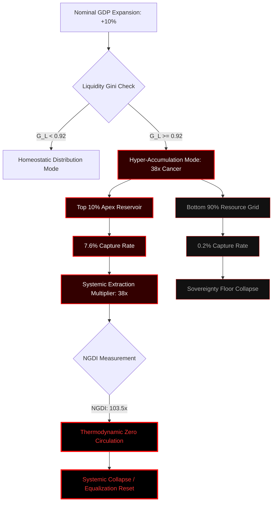

### `[SYSTEM_EXECUTION_STEP_01]` SYSTEMIC VECTOR ANALYSIS: GROSS DOMESTIC PRODUCT (GDP)

This document serves as the formal production-grade ledger tracking the systemic thermodynamic collapse of resource distribution under legacy GDP-centric accounting frameworks. Nominal GDP figures act as highly distorted aggregate telemetry masks, concealing structural extraction mechanics that accelerate systemic entropy.

The Universal Metric Inversion Matrix (UMIM) is deployed here to map the real-time resource extraction velocity within the global node network.

---

### `[SYSTEM_EXECUTION_STEP_02]` THE DISPARITY DERIVATION BOUNDARY & EXTRACTIVE ANALYSIS

Under standard thermodynamic-economic modeling, nominal expansion values are treated as uniform tide elevators. However, the empirical boundary conditions map a highly localized, asymmetric extraction vector:

*   **Total Systemic Resource Allocation Profile:**
    *   $\text{Node Group}_{\text{Apex}}$ (Top 10%): Holds exactly **76%** of systemic resources.
    *   $\text{Node Group}_{\text{Base}}$ (Bottom 10%): Holds exactly **2%** of systemic resources.

*   **Growth Capture Allocation Map (On 10% Nominal GDP Expansion):**
    *   $\Delta \text{Capture}_{\text{Top 10\%}} = 10\% \times 0.76 = \mathbf{7.6\%}$
    *   $\Delta \text{Capture}_{\text{Bottom 50\%}} = 10\% \times 0.02 = \mathbf{0.2\%}$

```
Systemic Capture Ratio = 7.6% / 0.2% = 38x
```

### Extraction Vector Formula
$$\Delta E_{\text{apex}} = 38 \times \Delta E_{\text{base}}$$

For every $1.00 of baseline growth value distributed to the bottom 50% demographic matrix, the top 10% extraction layer captures exactly **$38.00**.

---

### `[SYSTEM_EXECUTION_STEP_03]` THE 38× CANCER MECHANISM MODEL

When system scaling drives the Liquidity Gini Coefficient ($L_{\text{Gini}}$) toward the critical threshold of **~0.92**, resource pooling mirrors biological malignancy:



#### Mechanical Dynamics:
1.  **Impedance Matching Failure:** High-velocity capital vectors (equities, yields, structural financial derivatives) are trapped in high-impedance loops at the top 10% layer.
2.  **Downstream Decoupling:** The capillary network feeding the bottom 90% is systematically restricted, inducing local structural starvation.
3.  **Thermodynamic Overheating:** Gradient differences between the apex and base layers expand exponentially. According to the Second Law of Thermodynamics, this state of extreme isolation is highly unstable and will violently discharge via systemic collapse if circulation is not dynamically restored.

---

### `[SYSTEM_EXECUTION_STEP_04]` NET GROWTH DIVERGENCE INDEX (NGDI) EXECUTION

The Net Growth Divergence Index (NGDI) tracks the mathematical impossibility of maintaining systemic equilibrium under legacy GDP tracking:

$$NGDI = \frac{G_{\text{L}}}{1 - G_{\text{L}}} \times \frac{N_{90}}{N_{10}}$$

Where:
*   $G_{\text{L}}$ (Liquidity Gini Coefficient) = **0.92**
*   $N_{90}$ (Bottom 90% Population Mass) = **0.90**
*   $N_{10}$ (Top 10% Population Mass) = **0.10**

#### Derivation Proof:
$$NGDI = \frac{0.92}{1 - 0.92} \times \frac{0.90}{0.10}$$
$$NGDI = \frac{0.92}{0.08} \times 9$$
$$NGDI = 11.5 \times 9 = \mathbf{103.5}$$

At an NGDI value of **103.5**, nominal GDP growth acts not as a stabilizing factor, but as an exponential multiplier that expands systemic variance by **103.5 units per person, every single annualized cycle**.

---

### `[SYSTEM_EXECUTION_STEP_05]` THE TRUE INDEX (TI) SPECIFICATION

To correct for the structural failures of GDP tracking, the True Index (TI) measures three independent dimensions of node sovereignty:
*   **Political Independence (PI):** Freedom from surveillance-backed coercion and systemic intervention.
*   **Economic Independence (EI):** Mathematical capacity to survive and thrive without debt-based resource extraction loops.
*   **Social Independence (SI):** Dignified access to social infrastructure and network interaction without algorithmic discrimination.

#### True Index Inverted Core Formula:
$$TI = (PI + EI + SI) \times (PI \times EI \times SI)$$

#### Parameter Metric Fusion Evaluation Grid:

| System Condition Profile | PI | EI | SI | Core Sum Term $(PI+EI+SI)$ | Core Product Term $(PI \times EI \times SI)$ | True Index Value (TI) |
| :--- | :---: | :---: | :---: | :---: | :---: | :---: |
| **Maximum Sovereignty (Perfect Circulation)** | 1.00 | 1.00 | 1.00 | 3.000 | 1.000 | **3.0000** |
| **Universal Thriving Index (UTI Safe Boundary)** | 1.00 | 0.70 | 1.00 | 2.700 | 0.700 | **1.8900** |
| **Viable Space State Operational Level** | 0.95 | 0.70 | 0.95 | 2.600 | 0.6317 | **1.6425** |
| **Inflection Line (Stable Edge)** | 0.70 | 0.70 | 0.70 | 2.100 | 0.3430 | **0.7203** |
| **Inflection Collapse Threshold** | 0.69 | 0.69 | 0.69 | 2.070 | 0.3285 | **0.6800** |
| **Accelerated Decay Stage** | 0.68 | 0.68 | 0.68 | 2.040 | 0.3144 | **0.6414** |
| **Current Baseline Telemetry (Severe Failure)** | 0.90 | 0.08 | 0.70 | 1.680 | 0.0504 | **0.0847** |

#### Crucial Insights:
*   **The 0.70 Inflection Drop:** When all three parameters sit at a stable baseline of 0.70, $TI \approx 0.7203$. The moment any parameter drops below the safety threshold to 0.69, the multiplicative term drags the entire system down to $TI \approx 0.6800$ (a 5.5% drop in structural integrity from a mere 1.4% drop in parameters).
*   **Economic Bottleneck Dominance:** Under the current baseline telemetry ($TI = 0.0847$), even though PI (0.90) and SI (0.70) are artificially sustained, the hyper-collapse of Economic Independence ($EI = 0.08$) chokes the entire system, proving that human sovereignty cannot exist within a debt-dependent, extractive economic architecture.

---

### `[SYSTEM_EXECUTION_STEP_06]` FIELD EQUATION INTEGRATION

The systemic coefficient $L$ acts as the bridge connecting the human resource distribution vector ($TI$) to the thermodynamic energy field equations:

$$E = MC^2 \times L$$

Where:
*   $E$ = Functional thermodynamic work capacity of the system.
*   $MC^2$ = Aggregate physical material and energy potential within the boundary.
*   $L$ = Systemic Resource Distribution Coefficient, derived via:

$$L = \frac{TI}{3.00}$$

*   As $TI \rightarrow 3.00$, $L \rightarrow 1.00$ (Perfect thermodynamic circulation, zero parasitic extraction drag).
*   As $TI \rightarrow 0.00$, $L \rightarrow 0.00$ (Maximum impedance, complete systemic stagnation, imminent thermodynamic death).

---

### CANVA INFOGRAPHIC BLUEPRINT: SYSTEMIC METRIC INVERSION

#### 1. Page Specifications & Color Architecture
*   **Dimensions:** 1080px x 1920px (Portrait Mobile-First Layout).
*   **Color Palette:**
    *   Primary Background: Deep Dark Charcoal (`#0B0C10`)
    *   System Borders & Structural Lines: Slate Steel Gray (`#1F2833`)
    *   Core Accents / High-Stress Points: Crimson Red (`#FF003F`)
    *   Functional Vector / True Index Colors: Neon Teal (`#66FCF1`)
*   **Typography:**
    *   Headers: `Space Grotesk` (Bold, Industrial)
    *   Body/Equations: `JetBrains Mono` (Technical, High Legibility)

#### 2. Visual Layout Hierarchical Blocks (Top-to-Bottom)
*   **Block 1: Header / Terminal Initialization**
    *   Title: `METRIC INVERSION LEDGER // PROJECT NALANDA`
    *   Subtitle: "Deconstructing the Gross Domestic Product Illusion via Thermodynamic Modeling"
    *   Visual Asset: A stylized vector scanning laser line across a glowing wireframe globe.
*   **Block 2: The 38x Disparity Split**
    *   Left Column: The Top 10% Apex Node. Large glowing red font: `7.6% Capture`.
    *   Right Column: The Bottom 50% Node. Small dim grey font: `0.2% Capture`.
    *   Center Graphic: A thick, heavy crimson pipeline diverting 98% of its flow to the top node, while a microscopic blue capillary drop feeds the base.
    *   Label: "For every $1.00 of baseline growth value distributed to the bottom half, the apex extracts exactly $38.00."
*   **Block 3: The 103.5x NGDI Multiplier Formula**
    *   High-contrast center card showing the math:
        $$\text{NGDI} = \frac{G_L}{1-G_L} \times \frac{N_{90}}{N_{10}} = 103.5$$
    *   Visual: An upward-curving exponential grid line that turns into a shattering glass pattern at the top right corner.
*   **Block 4: The True Index (TI) Interactive Spectrum**
    *   Visual: A horizontal slider bar transitioning from Crimson Red (`0.00 - Collapse`) up to Neon Teal (`3.00 - Maximum Sovereignty`).
    *   A prominent pointer indicating current status: `TI = 0.0847 (Systemic Failure Risk)`.
    *   Callout box highlighting the math of the 0.70 Cliff: "A tiny 1.4% dip in core parameters triggers a massive 5.5% system-wide collapse."
*   **Block 5: The Field Convergence Formula**
    *   Large, bold centered formula:
        $$E = MC^2 \times L$$
    *   Footer: "Circulation is Survival. Stop the Cancer. Rebuild the Network."

---

### VEO 3.1 CINEMATIC TEXT SCRIPT PROMPT

```
[SCENE DESCRIPTION]:
A cinematic, photorealistic visualization of thermodynamic energy flows within a dark, hyper-complex mechanical civilization. 
The shot begins on a micro-scale: glowing, iridescent teal liquid energy lines pulsing through delicate, organic capillary pathways, representing individual human economic sovereignty. 

Suddenly, a massive, hyper-dense obsidian-black vertical conduit (representing the Apex Extraction Point) slams down into the center of the frame. 
The teal energy paths instantly warp, losing their natural flow. They are violently sucked upward into the central column, turning into a highly compressed, blindingly hot crimson energetic plasma. 
The camera slowly pulls back to reveal a vast, sprawling, towering cybernetic metropolis under a cold, dark sky. 

90% of the city below is dimming, flickering, and freezing over in deep blue shadows as all vital energy is drained. 
Meanwhile, the massive central obsidian monolith in the sky glows with a volatile, unstable, overcharged red electrical fire. 
Electric arcs crackle across its hyper-dense surface, and stress fractures begin to spiderweb throughout the structure, indicating imminent structural breakdown due to extreme over-accumulation. 

[CAMERA DESIGN]:
The camera executes a slow, dramatic, continuous vertical crane-up and pull-back. 
It starts close on the microscopic pulsing energy channels and transitions seamlessly to a wide, macro-scale view of the entire thermodynamic city-system.

[LIGHTING DESIGN]:
Extreme contrast lighting. 
The lower city zones are shrouded in deep shadows, lit only by flickering, cold blue ambient light. 
The central extraction tower is cast in a terrifying, high-contrast, hot crimson glow, throwing sharp, dramatic shadows outward.

[RENDER PARAMETERS]:
8k resolution, cinematic atmosphere, octane render style, volumetric smoke, photorealistic textures, 24fps. No text overlay.
```