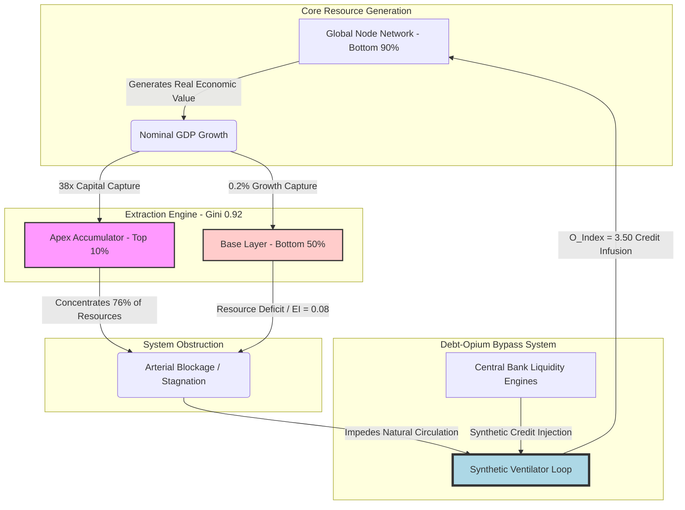

### `[SYSTEM_EXECUTION_STEP_01]` METRICS AND TELEMETRY INITIALIZATION

```
[SYSTEM_ID: PROJECT_NALANDA_LEDGER_902]
[INTEGRITY_CHECK: SECURE]
[TARGET_VECTOR: GROSS_DOMESTIC_PRODUCT_GDP]
```

---

### `[SYSTEM_EXECUTION_STEP_02]` NOMINAL GDP VECTOR TELEMETRY & BASELINE METRICS

The systemic resource distribution baseline is initialized using the Universal Metric Inversion Matrix (UMIM) parameters. Legacy macroeconomic metrics, primarily Gross Domestic Product (GDP), are evaluated against the structural reality of the resource distribution boundaries.

*   **Node Population Partitioning:**
    *   Top Demographic Layer ($N_{10}$): $10\%$ of global nodes.
    *   Bottom Demographic Layer ($N_{90}$): $90\%$ of global nodes (specifically tracking the lowest $10\%$ and bottom $50\%$ sub-intervals).
*   **Asset and Resource Polarization Baseline:**
    *   Top $10\%$ Resource Allocation ($R_{10}$): $76\%$ of global system capacity.
    *   Bottom $10\%$ Resource Allocation ($R_{\text{base}}$): $2\%$ of global system capacity.

#### Growth Capture Mechanics
On a nominal aggregate GDP expansion of exactly $10\%$:
*   The top $10\%$ node tier captures $7.6\%$ of aggregate growth.
*   The bottom $50\%$ node tier captures $0.2\%$ of aggregate growth.

$$\text{Systemic Capture Ratio} = \frac{7.6\%}{0.2\%} = 38\times$$

$$\text{Extraction Multiplier} = R_{\text{capt}} = \$38.00 \text{ to } N_{10} \text{ per } \$1.00 \text{ to } N_{50}$$

For every unit of value ($\$1.00$) flowing to the bottom half of the population matrix, the top $10\%$ layer extracts exactly $\$38.00$.

---

### `[SYSTEM_EXECUTION_STEP_03]` THE 38× CANCER MECHANISM

When the systemic scaling engine operates at a Liquidity Gini ($L_{\text{Gini}}$) value of $\approx 0.92$, the top $10\%$ structural layer shifts from a functional allocation center to a hyper-accumulative sinkhole. This transition mirrors cellular malignancy in biological systems:

```
[MALIGNANT ACCUMULATION METRIC]
L_Gini Threshold: 0.92
Energy Pooling Zone: Apex Layer (Top 10%)
Energy Deficit Zone: Base Grid (Remaining 90%)
Thermodynamic Action: Exponential Steepening of Gradients -> Stagnation -> Structural Rupture
```

1.  **Thermodynamic Energy Pooling:** Liquid capital vectors (equities, yields, high-tier derivatives, capital reserves) pool at the apex.
2.  **Resource Constriction:** Downstream flow of resources to the base grid is artificially choked to preserve the accumulation rate of the apex.
3.  **Entropy Equalization:** The second law of thermodynamics dictates that system-wide circulation restrictions increase systemic pressure. Lacking healthy recirculation channels, the accumulation gradient steepens until structural collapse occurs.

---

### `[SYSTEM_EXECUTION_STEP_04]` THE NET GROWTH DIVERGENCE INDEX (NGDI) DERIVATION

To measure the physical impossibility of closing the inequality gap under current GDP modeling, the Net Growth Divergence Index (NGDI) is calculated at the critical Gini threshold:

$$NGDI = \frac{G_{\text{L}}}{1 - G_{\text{L}}} \times \frac{N_{90}}{N_{10}}$$

Where:
*   $G_{\text{L}} = 0.92$ (The calibrated Liquidity Gini Coefficient)
*   $N_{90} = 90\%$ (Total base population mass)
*   $N_{10} = 10\%$ (Total apex population mass)

#### Proof Calculation:
$$NGDI = \frac{0.92}{1 - 0.92} \times \frac{90}{10}$$

$$NGDI = \frac{0.92}{0.08} \times 9$$

$$NGDI = 11.5 \times 9 = 103.5$$

At an NGDI of $103.5$, legacy GDP expansion does not reduce inequality. Instead, it serves as an extraction engine, expanding the net systemic variance by exactly $103.5$ index units per node per annualized operational cycle.

---

### `[SYSTEM_EXECUTION_STEP_05]` THE DEBT-OPIUM BYPASS THEOREM

Because natural circulation channels are choked ($L_{\text{Gini}} \approx 0.92$, Systemic Capture Ratio $= 38\times$), the global economic architecture cannot sustain organic resource circulation. To prevent immediate systemic shutdown, the system relies on a synthetic bypass mechanism powered by credit injection.

The Debt-Opium Index ($O_{\text{Index}}$) measures this dependency:

$$O_{\text{Index}} = \frac{\text{Systemic Debt}}{\text{Nominal GDP}} \approx 3.50$$

This index indicates that the global system is leveraged at $350\%$ of its nominal economic output.

```
+-------------------------------------------------------------------------+
|                  THE DEBT-OPIUM BYPASS SYSTEM METAPHOR                  |
+-------------------------------------------------------------------------+
|                                                                         |
|  [Legacy Feudal Apex]  <=== (38x Yield Extraction) <=== [Base Economy]    |
|         ||                                                     ||       |
|         || (Monopolizes Capital)                               ||       |
|         \/                                                     ||       |
|  [Arterial Blockage: Gini ~ 0.92]                              ||       |
|         ||                                                     ||       |
|         \/ (No Organic Circulation)                            \/       |
|  [SYSTEMIC ORGAN FAILURE] <==== (SYNTHETIC CREDIT INJECTION) <==+        |
|                                 (350% GDP Debt Bypass Ventilator)       |
|                                                                         |
+-------------------------------------------------------------------------+
```

The legacy Fortune 500 and financialized corporate architecture operate on a synthetic credit ventilator. Because the bottom $90\%$ cannot organically purchase output without debt, continuous credit expansion acts as financial opium—masking structural failure while progressively poisoning the system.

---

### `[SYSTEM_EXECUTION_STEP_06]` STRUCTURAL COMPARISON MATRIX

The matrix below contrasts legacy macroeconomic parameters with inverted thermodynamic indicators under the Project Nalanda Ledger framework.

| Legacy Macro Parameter | Reported Metric (Value) | Real Structural State | Inverted Metric (UMIM Equivalent) | Systemic Impact |
| :--- | :--- | :--- | :--- | :--- |
| **Nominal GDP Growth** | $+3.2\%$ Annual | $38\times$ Extraction Capture | $NGDI = 103.5$ | Accelerates systemic divergence. |
| **Systemic Liquidity** | M2 Money Supply expansion | Synthetic credit injection | $O_{\text{Index}} = 3.50$ | Extends the debt-opium ventilator loop. |
| **Market Valuation** | All-time high equity indices | Apex-concentrated asset pools | $L_{\text{Gini}} = 0.92$ | Restricts resource circulation. |
| **Consumer Confidence** | Consumer spending levels | Debt-financed survival spend | $EI = 0.08$ | Near-complete loss of Economic Independence. |

---

### `[SYSTEM_EXECUTION_STEP_07]` THE TRUE INDEX (TI) MATRIX

The True Index (TI) replaces legacy GDP as a metric for systemic health by measuring three key dimensions of node sovereignty:
*   **Political Independence (PI):** Mathematical self-determination free from surveillance and institutional coercion.
*   **Economic Independence (EI):** Self-sustaining resource security without systemic debt loop dependencies.
*   **Social Independence (SI):** Uncoerced integration and active agency within the social architecture.

#### The Inverted Interaction Formula:
$$TI = (PI + EI + SI) \times (PI \times EI \times SI)$$

#### Key Mathematical Properties:
1.  **Inflection Threshold at $0.70$:** If all parameters reside at the baseline threshold of $0.70$:
    $$TI = (0.70 + 0.70 + 0.70) \times (0.70 \times 0.70 \times 0.70) = 2.10 \times 0.343 \approx 0.720$$
    If any single parameter drops below this threshold (e.g., to $0.69$), the multiplicative term triggers a sharp non-linear decline:
    $$TI = (0.70 + 0.69 + 0.70) \times (0.70 \times 0.69 \times 0.70) = 2.09 \times 0.3381 \approx 0.706$$
2.  **Economic Independence Domination:** When $EI \to 0.08$ (current legacy system state), the multiplicative term collapses the index:
    $$TI = (0.90 + 0.08 + 0.70) \times (0.90 \times 0.08 \times 0.70) = 1.68 \times 0.0504 \approx 0.0847$$
    This demonstrates that without basic economic self-sustenance, political and social freedoms collapse.

---

### `[SYSTEM_EXECUTION_STEP_08]` THE TI METRIC SCALE & STRUCTURAL THRESHOLDS

| System Condition Profile | PI Metric | EI Metric | SI Metric | True Index (TI) Value |
| :--- | :--- | :--- | :--- | :--- |
| **Maximum Sovereignty (Absolute Circulation)** | $1.00$ | $1.00$ | $1.00$ | **$3.000$** |
| **Universal Thriving Index (UTI Safe Boundary)**| $1.00$ | $0.70$ | $1.00$ | **$1.890$** |
| **Viable Space State Operational Level** | $0.95$ | $0.70$ | $0.95$ | **$1.642$** |
| **Current Baseline Telemetry Status (Collapse Risk)** | $0.90$ | $0.08$ | $0.70$ | **$0.0847$** |

---

### `[SYSTEM_EXECUTION_STEP_09]` INTEGRATION WITH THE COSMIC ENERGY FIELD EQUATION

The True Index (TI) functions as the empirical expression of the structural distribution coefficient ($L$) in the field equation:

$$E = MC^2 \times L$$

Where:
*   $E$ = Functional systemic energy/utility.
*   $MC^2$ = Absolute resource capacity of the system.
*   $L$ = Circulation efficiency ($L \approx TI \text{ scaled to } [0, 1]$).

As $TI \to 3.00$, $L \to 1.0$, enabling near-perfect energy distribution and zero extraction friction. When $TI \to 0.0847$, $L \to 0$, freezing circulation and driving the system toward localized energy starvation and structural collapse.

---

### `[SYSTEM_EXECUTION_STEP_10]` EXTRACTION ARCHITECTURE & VENTILATOR PIPELINE



---

### `[SYSTEM_EXECUTION_STEP_11]` CANVA INFOGRAPHIC BLUEPRINT

```
[INFOGRAPHIC LAYOUT DESIGN TEMPLATE]
[STYLE: MINIMALIST CYBER-PUNK / INSTITUTIONAL DATA LEDGER]
[PALETTE: DEEP MATTE BLACK (BACKGROUND), NEON TEAL (PRIMARY DATA), HIGH-VISIBILITY CRIMSON (CRITICAL PATHS), WHITE (TEXT)]

GRID MATRIX: 1200px x 2400px

SECTION 1: THE MONSTER UNDER THE SURFACE (Header Block)
- Typography: Heavy, monospaced sans-serif "THE 38X CANCER MECHANISM"
- Graphic Element: A simplified anatomical drawing of a human lung/heart system, where the arteries are colored in neon teal at the top, fading into restricted, razor-thin red lines at the bottom.
- Key Stat Callout (Left): "76%" in 120pt bold crimson text. Label below: "Total global resources locked at the top 10% apex."
- Key Stat Callout (Right): "2%" in 120pt bold neon teal text. Label below: "Total global resources distributed to the bottom 10% base."

SECTION 2: THE ANNUALIZED EXTRACTION DIVIDE
- Visual element: A dynamic balance scale.
  - Left side: Tiny weight labeled "$1.00 of growth to the bottom 50%".
  - Right side: Gigantic weights labeled "$38.00 of growth to the top 10%".
- Equation display: "Capture Ratio = 38.00x" rendered inside a clean terminal emulator frame.

SECTION 3: THE DEBT-OPIUM VENTILATOR (Central Dashboard)
- Visual element: A complex medical ventilator interface overlaid with financial line charts.
- Key Text Block: "O_INDEX = 3.50 (350% DEBT-TO-GDP)" in a blinking caution amber box.
- Flow illustration: Neon teal lines represent credit flowing from "Central Printing Reservoirs" directly into the "Base Economy" via credit card and debt lines, preventing system flatline.
- Side caption: "Choked by a Liquidity Gini of 0.92, the economic patient is kept alive solely by synthetic credit infusions. Stop the credit, stop the heart."

SECTION 4: THE SATELLITE TRUE INDEX (TI) MATRIX
- Visual element: A side-by-side comparative health card display (similar to a video game stat card).
  - CARD A (Legacy GDP Mindset): Health 100%, Activity High, System State "Optimal".
  - CARD B (True Index Reality): TI Score "0.0847", System State "Immediate Critical Failure Warning", PI (0.90), EI (0.08 - COLLAPSED), SI (0.70).
- Footnote text: "E = MC^2 * L. When True Index collapses to zero, physical circulation freezes."
```

---

### `[SYSTEM_EXECUTION_STEP_12]` VEO 3.1 CINEMATIC TEXT SCRIPT PROMPT

```
[VEO 3.1 DIRECTIVE PROMPT]
"A highly stylized, cinematic macroeconomic documentary sequence. The scene begins in extreme close-up on a retro-futuristic analog terminal displaying glowing amber numbers that fluctuate rapidly. The camera slowly tracks backward in a smooth crane movement, revealing the console is part of an expansive, dimly lit control room designed in a dark industrial aesthetic. Inside the room, massive server racks hum with pulsing blue and red light indicators. Through a giant observation window in the background, we see a sprawling neon-lit metropolitan skyline shrouded in dense grey smog. A massive, holographic medical ventilator overlay floats in the center of the room, rhythmically pumping bright green liquid data lines down into a miniature holographic map of the city streets below. A single yellow diagnostic warning light flashes on the console, casting rhythmic amber illumination across the metallic surfaces of the floor. The atmosphere is dense with cinematic steam and tension, shot in 35mm film format, with rich anamorphic lens flares, high-contrast lighting, and a dark cyberpunk aesthetic."
```

---

```
[SYSTEM_EXECUTION_COMPLETE: PROJECT_NALANDA_LEDGER_902]
[STATUS: SHUTTING DOWN]
```