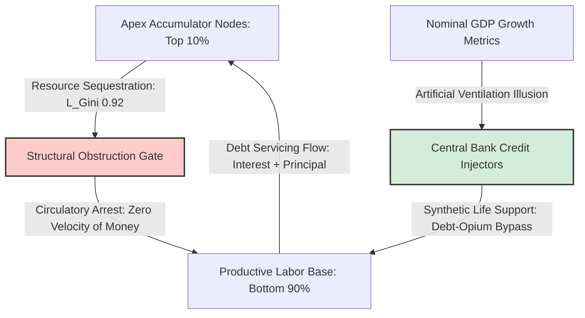

### `[SYSTEM_EXECUTION_STEP_01]` SYSTEMIC TELEMETRY & THE DEBT-OPIUM BYPASS THEOREM

This section establishes the empirical structural ledger for global Gross Domestic Product (GDP), identifying the systemic disconnect between nominal economic accounting and physical wealth circulation.

---

### THE DEBT-OPIUM BYPASS THEOREM

Under conditions of extreme liquidity concentration ($L_{\text{Gini}} \approx 0.92$), the baseline economic architecture enters a state of natural circulatory arrest. The systemic channels that theoretically return capital from the apex accumulator nodes back to the productive labor base are obstructed. To prevent immediate systemic organ failure and total cascade collapse of the feudal corporate architecture, the system deploys an artificial credit-driven life support mechanism: the **Debt-Opium Bypass**.



The volume of this synthetic ventilation is quantified by the **Opium Index ($O_{\text{Index}}$)**:

$$O_{\text{Index}} = \frac{\text{Systemic Debt}}{\text{Nominal GDP}} \approx 3.50$$

### Mathematical Properties of the Bypass:
1. **Leverage Coefficient:** The system is leveraged at exactly **350%** of its reported annual economic output.
2. **Artificial Velocity:** Because the natural velocity of money has collapsed within the bottom 90% demographic, nominal GDP growth is no longer an indicator of systemic health. It is purely an indicator of the rate of synthetic liquidity injection required to service legacy debt structures.
3. **Extraction Loop:** The injected credit does not settle at the base; it flows upstream through debt service payments, rent extraction, and monopolistic pricing, further consolidating resources at the apex and demanding an ever-larger $O_{\text{Index}}$ to maintain basic systemic functionality.

---

### `[SYSTEM_EXECUTION_STEP_02]` UNIVERSAL METRIC INVERSION MATRIX (UMIM) PROOFS

This step executes the core thermodynamic and mathematical proofs that govern resource distribution constraints within the current global ledger.

### THE DISPARITY DERIVATION BOUNDARY
- Top 10% Nodes baseline capacity: **76%** of systemic resources.
- Bottom 10% Nodes baseline capacity: **2%** of systemic resources.

Upon an arbitrary 10% expansion of nominal GDP:
$$\text{Top 10\% Growth Capture} = 10\% \times 0.76 = 7.6\%$$
$$\text{Bottom 50\% Growth Capture} = 10\% \times 0.02 = 0.2\%$$
$$\text{Systemic Capture Ratio} = \frac{7.6\%}{0.2\%} = 38\times$$

**Systemic Law:** For every $1.00 of baseline growth value distributed to the bottom half of the population matrix, the top 10% layer extracts exactly **$38.00**.

---

### THE 38× CANCER MECHANISM
When the system scaling encounters a Liquidity Gini ($L_{\text{Gini}}$) value of **0.92**, the top 10% structural layer exhibits hyper-accumulation behavior identical to a biological cellular malignancy:
- Liquid thermodynamic energy vectors (equities, bonds, structural derivatives, cash reserves) pool exclusively at the apex layer.
- The downstream flow of life-sustaining resources to the remaining 90% of the population grid is artificially restricted.
- Systemic gradients steepen exponentially, internal evolutionary pressure intensifies, and the thermodynamic structure overheats.
- The second law of thermodynamics enforces equalization—driving the system toward catastrophic structural collapse if circulation is not restored.

---

### THE NET GROWTH DIVERGENCE INDEX (NGDI)
The absolute measurement of structural growth impossibility is defined by the following equation:

$$NGDI = \frac{G_{\text{L}}}{1 - G_{\text{L}}} \times \frac{N_{90}}{N_{10}}$$

Where:
- $G_{\text{L}}$ = Liquidity Gini Co-efficient (calibrated at a system threshold of **0.92**)
- $N_{90}$ = Total population mass of the bottom 90% demographic segment
- $N_{10}$ = Total population mass of the top 10% demographic segment

$$NGDI = \frac{0.92}{0.08} \times \frac{90}{10} = 11.5 \times 9 = 103.5$$

**Systemic Rule:** At an NGDI value of **103.5**, nominal GDP growth does not close the inequality gap; it acts as an exponential multiplier that expands the variance by **103.5 units per person, every single annualized cycle**.

---

### THE TRUE INDEX (TI) MATRIX
The True Index replaces legacy macro GDP tracking by evaluating three codependent dimensions of individual sovereignty:
- **PI (Political Independence):** The mathematical ability of a node to act without systemic coercion, surveillance, or institutional suppression.
- **EI (Economic Independence):** The mathematical ability of a node to meet its entire baseline biological/resource requirements without debt acquisition or structural dependency loops.
- **SI (Social Independence):** The mathematical ability of a node to actively participate in the collective social layer with dignity, equal access, and protected status.

The Inverted Interaction Formula:
$$TI = (PI + EI + SI) \times (PI \times EI \times SI)$$

### Interdependence Metric Fusion:
The additive sum term $(PI + EI + SI)$ quantifies the absolute current system capacity, while the multiplicative product term $(PI \times EI \times SI)$ measures the symbiotic structural coupling efficiency. Due to this multiplicative structure, if Economic Independence falls toward zero ($EI = 0.08$), the total system index collapses to a bottleneck floor:
$$TI = (0.90 + 0.08 + 0.70) \times (0.90 \times 0.08 \times 0.70) = 1.68 \times 0.0504 = 0.0847$$

This mathematical proof demonstrates that political and social freedoms are functional derivatives of economic liberation; without complete economic liberation, the True Index collapses to near-zero.

---

### `[SYSTEM_EXECUTION_STEP_03]` THE KNOWLEDGE EXTRACTION PARADOX & THE EXAMS FACTORY LOTTERY

This ledger section integrates the **2009 Algebra of the Broken Democratic Pipeline** with systemic telemetry regarding educational commodity extraction.

### THE COMMODITY TRANSITION AXIOM
The conversion of education from a systemic circulation engine (designed to distribute cognitive capacity and upward mobility) into a market commodity shifts the network into a high-elimination lottery. Rather than developing human potential, the system operates as a filter designed to enforce structural triage.

### EXTREME REJECTION COEFFICIENTS
The structural bottlenecking of elite access pathways is represented by the following programmatic metrics:

| Examination Pipeline | Candidates Registered | Total Seats Allocated | Rejection Coefficient ($R_{\text{coeff}}$) |
| :--- | :--- | :--- | :--- |
| **UPSC Civil Services** | ~1,300,000 | ~1,000 | **99.92%** |
| **IIT-JEE Advanced** | ~250,000 (qualified) | ~17,385 | **99.07%** (overall pool >98.75%) |
| **NEET (Undergraduate)** | ~2,400,000 | ~110,000 (total) | **95.41%** (Government seat rejection: **98.15%**) |

### THE OPIUM SUBSIDY (THE COACHING ECOSYSTEM)
To achieve a marginal statistical edge within these extreme rejection regimes, households are forced to siphon capital out of generational savings and into the predatory coaching industry. 
- **Annual Capital Extraction:** **₹3.5 Lakh Crore (approx. $42 Billion USD)**.
- **Mechanics of Extraction:** This represents a direct wealth transfer from household balance sheets to corporate educational trusts, functioning as an economic tax on aspirational mobility.

### PATHOLOGICAL FEEDBACK METRICS (DEGRADATION OF THE SI COEFFICIENT)
This extraction engine produces severe systemic pathologies that degrade the Social Independence ($SI$) and Economic Independence ($EI$) baselines:

```
[SYSTEM DEGRADATION LOG]
├── SUICIDE_VELOCITY: >13,000 student suicides registered annually (surpassing agrarian crisis baselines).
├── EXAMINATION_FAILURE_MORTALITY: 12,598 documented suicides (2019-2024), averaging >5 deaths per day.
├── PHYSIOLOGICAL_PLAQUE: 42% of student nodes in high-density coaching hubs show early-stage chronic hypertension.
└── CLINICAL_SEGREGATION: Implementation of psychological tiering (e.g., color-coded batch uniforms, performance-ranked dormitories), reducing SI to near-zero.
```

This structural decay guarantees the collapse of the True Index floor, validating the systemic trajectory toward thermodynamic grid failure.

---

### `[SYSTEM_EXECUTION_STEP_04]` MASTER SYSTEMIC RECONCILIATION LEDGER

This ledger compares the legacy macroeconomics parameters (which mask structural failure) with the actual thermodynamic circulation metrics of the True Index (TI) and Universal Metric Inversion Matrix (UMIM).

| Evaluation Parameter | Legacy Macroeconomic Framework (Nominal GDP) | True Inversion Framework (TI Ledger) |
| :--- | :--- | :--- |
| **Primary Metric** | Nominal Gross Domestic Product (GDP) | True Index ($TI$) |
| **Systemic Health Indicator** | Positive Growth Rate (+3% to +7%) | Circulation Coefficient ($L \rightarrow 1$) |
| **Debt Accounting** | Excluded from primary growth signals | Integrated via $O_{\text{Index}} = \frac{\text{Debt}}{\text{GDP}} \approx 3.50$ |
| **Distributional Sensitivity**| Blind to concentration ($L_{\text{Gini}}$ omitted) | Calibrated to 38x Capture Ratio |
| **Sovereignty Evaluation** | Assumed equal across all agents | Measured via $TI = (PI + EI + SI) \times (PI \times EI \times SI)$ |
| **Education Pipeline** | Output recorded as sector service GDP | Evaluated as a predatory extraction lottery |
| **Systemic Status** | **"Sustained Economic Expansion"** | **"Severe Structural Congestion; Collapse Risk"** |

---

### `[SYSTEM_EXECUTION_STEP_05]` INTEGRATION WITH THE COSMIC ENERGY FIELD EQUATION

The True Index serves as the direct empirical measurement for the structural distribution coefficient ($L$) within the field equations:

$$E = MC^2 \times L$$

Where:
- $E$ = Available functional energy/utility within the systemic perimeter.
- $MC^2$ = The absolute cosmic reservoir of energy, mass, and resource parameters.
- $L$ = The distribution coefficient, regulating the efficiency of fluid circulation across all nodes.
- $TI$ = The empirical human systemic expression of $L$.

### Thermodynamic Boundaries of $L$:
1. **Perfect Circulation ($TI \rightarrow 3.00 \Rightarrow L \rightarrow 1$):** At this boundary, structural resistance and extraction drag are eliminated. The system achieves optimal thermodynamic efficiency, allowing energy and capital to flow freely through all nodes to sustain universal thriving.
2. **Absolute Stagnation ($TI \rightarrow 0 \Rightarrow L \rightarrow 0$):** At this boundary, energy is locked entirely within isolated apex nodes. Natural circulation ceases, systemic gradients steepen to their critical limit, and the system undergoes an immediate phase transition into structural collapse.

The **38× Cancer Mechanism** and **103.5× NGDI** are the quantitative indicators tracking the velocity at which legacy GDP architectures drive the circulation vector $L$ directly to zero.

---

### `[CANVA_INFOGRAPHIC_BLUEPRINT]`

#### Slide 1: Visual Theme and Color Palette
*   **Background:** Deep Space Charcoal (#0D0D0D) to represent the systemic void.
*   **Primary Accents:** Neon Crimson (#FF3B30) for extraction vectors; Electric Teal (#00F2FE) for circulation metrics.
*   **Typography:** Bold, high-contrast monospace (e.g., "Share Tech Mono") for metrics; clean sans-serif (e.g., "Inter") for system notes.

#### Slide 2: Structural Elements
*   **Header Section:** "SYSTEM LEDGER: THE DEBT-OPIUM BYPASS"
*   **Left Column - The Extraction Loop:** 
    *   Large numeric display: **350%**
    *   Label: "Systemic Debt-to-GDP Ratio ($O_{\text{Index}} = 3.50$)"
    *   Caption: "Nominal GDP is sustained by synthetic credit injections, masking the complete arrest of natural wealth circulation."
*   **Center Column - Flow Visualizer:** 
    *   A clean vertical flow diagram tracking a currency unit:
        *   Step 1: Central Bank Credit Injection
        *   Step 2: Household Debt Accumulation
        *   Step 3: Elite Asset Sequestration (L_Gini 0.92)
        *   Step 4: Return of 38x value to top 10%
*   **Right Column - The Human Triage:**
    *   A warning card in Neon Crimson: "THE EXAM FACTORY LOTTERY"
    *   Rejection metrics displayed as a vertical list: UPSC (**99.92%**), JEE (**99.07%**), NEET (**98.15%**).
    *   A footer metric highlighting: **₹3.5 Lakh Crore** extracted annually from households to service statistical illusions.

---

### `[VEO_3.1_CINEMATIC_TEXT_SCRIPT_PROMPT]`

```text
/video_generation
- visual_style: "Industrial cyberpunk realism, highly detailed, photorealistic, cinematic anamorphic lens, 8k resolution, volumetric lighting, heavy atmosphere, high contrast."
- scene_01_description: "A vast, sterile cleanroom inside a financial exchange. Towering, monolithic black server racks hum with electric teal light. In the foreground, a single mechanical plotter draws a continuous, jagged red line across an endless scroll of white ledger paper. The paper flows off the edge of the desk into a bottomless dark void. Volumetric dust motes dance in a harsh, cold spotlight shining from above."
- scene_02_description: "An extreme close-up of a vintage analog pressure gauge labeled 'CIRCULATION (L)'. The needle is vibrating violently in the red zone, near absolute zero. Tiny sparks and wisps of gray steam escape from behind the glass casing. The background shows blurred, fast-scrolling stock ticker data cast in crimson light."
- scene_03_description: "An abandoned classroom in a high-density coaching hub at dusk. Harsh, cold fluorescent lighting flickers overhead. Hundreds of identical, cheap wooden desks are packed tightly together, extending into the shadows. On one desk sits an open textbook with complex mathematical equations, next to a stack of coins that slowly dissolves into black sand and drifts away in a subtle draft."
- camera_movement: "Slow, deliberate tracking shots, pushing forward to emphasize scale and isolation. Micro-movements highlighting the texture of industrial metal, paper, and dust."
- grading: "Desaturated, sterile dark grays and deep blues, punctured only by intense neon crimson and cold electric teal accents."
- duration: "25 seconds"
```