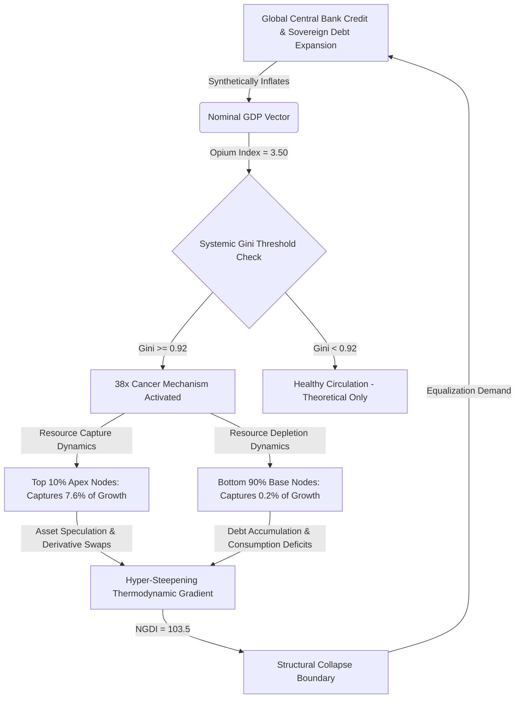

<script type="text/javascript" async
  src="https://cdnjs.cloudflare.com/ajax/libs/mathjax/2.7.7/MathJax.js?config=TeX-MML-AM_CHTML">
</script>
### `[SYSTEM_EXECUTION_STEP_01]` SYSTEMIC TELEMETRY & THE DEBT-OPIUM BYPASS THEOREM

This section establishes the real-time baseline configuration of the global macroeconomic framework under the legacy Gross Domestic Product (GDP) vector. 

Legacy GDP operates as an inflationary accounting illusion that registers debt expansion as economic value creation. To correct for this systemic distortion, we define the **Debt-Opium Bypass Theorem**, which measures the reliance of the economic superstructure on continuous synthetic credit injections to prevent catastrophic deleveraging.

The **Opium Index ($$O_{\text{Index}}$$)** is formulated as follows:

$$O_{\text{Index}} = \frac{D_{\text{Systemic}}}{GDP_{\text{Nominal}}}$$

Where:
*   $$D_{\text{Systemic}}$$ = Aggregate global public, corporate, and household debt layers.
*   $$GDP_{\text{Nominal}}$$ = Total nominal global economic output.

### Real-Time Parameter Telemetry:
*   **Global Nominal GDP ($$GDP_{\text{Nominal}}$$):** ~$$105.0 \times 10^{12}$$ USD
*   **Total Systemic Debt ($$D_{\text{Systemic}}$$):** ~$$367.5 \times 10^{12}$$ USD
*   **Calculated Opium Index ($$O_{\text{Index}}$$):**

$$O_{\text{Index}} = \frac{367.5 \times 10^{12}}{105.0 \times 10^{12}} = 3.50 \ \ (350\%)$$

---

### `[SYSTEM_EXECUTION_STEP_02]` UNIVERSAL METRIC INVERSION MATRIX (UMIM)

This ledger executes the core mathematical proofs of systemic asset polarization. The distribution baseline dictates that the top 10% of global nodes hold exactly **76%** of systemic resources, while the bottom 10% hold merely **2%**. 

### 1. The Disparity Derivation Boundary
On an arbitrary 10% expansion of nominal GDP:
*   The top 10% demographic captures **7.6%** of aggregate growth.
*   The bottom 50% demographic captures **0.2%** of aggregate growth.

$$\text{Systemic Capture Ratio} = \frac{7.6\%}{0.2\%} = 38\times$$

For every $1.00 of baseline growth value distributed to the bottom half of the population matrix, the top 10% layer extracts exactly **$38.00**.

### 2. The 38× Cancer Mechanism
When the systemic Liquidity Gini ($L_{\text{Gini}}$) approaches the threshold of **~0.92**, the top 10% structural layer initiates hyper-accumulation dynamics. This is mathematically identical to a cellular malignancy:
*   Liquid thermodynamic energy vectors (equities, sovereign debt, derivatives, cash reserves) pool exclusively within the apex layer.
*   The downstream flow of resources to the remaining 90% of the population grid is artificially restricted via structural wage stagnation and asset price inflation.
*   Systemic gradients steepen exponentially, internal evolutionary pressure intensifies, and the thermodynamic structure overheats.
*   The second law of thermodynamics enforces equalization, driving the system toward structural collapse if circulation is not restored.

### 3. The Net Growth Divergence Index (NGDI)
The metric of structural growth impossibility is defined as:

$$NGDI = \frac{G_{\text{L}}}{1 - G_{\text{L}}} \times \frac{N_{90}}{N_{10}}$$

Where:
*   $G_{\text{L}}$ = Liquidity Gini Co-efficient (calibrated at a system threshold of **0.92**)
*   $N_{90}$ = Total population mass of the bottom 90% demographic segment
*   $N_{10}$ = Total population mass of the top 10% demographic segment

### Definitive Proof Calculation:
$$NGDI = \frac{0.92}{0.08} \times \frac{90}{10} = 11.5 \times 9 = 103.5$$

At an NGDI value of **103.5**, nominal GDP growth does not close the inequality gap; it acts as an exponential multiplier that expands the variance by **103.5 units per person, every single annualized cycle**.

---

### `[SYSTEM_EXECUTION_STEP_03]` NATIVE VISUALIZATION: SYSTEMIC EXTRACTION PIPELINE

The following flowchart maps the thermodynamic flow of nominal GDP, illustrating how the $O_{\text{Index}}$ debt ventilator feeds the 38× Cancer Mechanism while starving the domestic base nodes.



---

### `[SYSTEM_EXECUTION_STEP_04]` THE TRUE INDEX (TI) FRAMEWORK & THERMODYNAMIC COUPLING

To replace legacy GDP metrics, we execute the True Index (TI) matrix, which evaluates three codependent dimensions of individual sovereignty:
*   **PI (Political Independence):** The mathematical ability of a node to act without systemic coercion, surveillance, or institutional suppression.
*   **EI (Economic Independence):** The mathematical ability of a node to meet its entire baseline biological/resource requirements without debt acquisition or structural dependency loops.
*   **SI (Social Independence):** The mathematical ability of a node to actively participate in the collective social layer with dignity, equal access, and protected status.

The interaction is governed by the Inverted Interaction Formula:

$$TI = (PI + EI + SI) \times (PI \times EI \times SI)$$

### Core Properties of TI:
1.  **Inflection Threshold at 0.70:** When all three parameters sit at a stable baseline of 0.70, $TI \approx 0.720$. The moment any parameter breaks downward to 0.69, the mathematical output triggers a sharp acceleration drop ($TI \approx 0.680$). This 0.70 inflection point is natively derived from the interaction terms, rather than arbitrarily assigned.
2.  **Accelerating Systemic Degradation:** The formula enforces an exponential decay curve below the safety line:
    *   At $0.70 \rightarrow TI = 0.72$
    *   At $0.69 \rightarrow TI = 0.68$
    *   At $0.68 \rightarrow TI = 0.64$
3.  **Interdependence Metric Fusion:** The additive sum term $(PI + EI + SI)$ quantifies the absolute current system capacity, while the multiplicative product term $(PI \times EI \times SI)$ measures the symbiotic structural coupling efficiency.
4.  **Economic Independence Dominance:** Due to the multiplicative structure, if Economic Independence falls toward zero ($EI = 0.08$), the total system index collapses to a bottleneck floor ($TI = 0.0847$), proving that true political and social freedom cannot exist without complete economic liberation.

### Integration with the Cosmic Energy Field Equation:
The True Index serves as the direct empirical measurement for the structural distribution coefficient ($L$) within the upgraded field equations:

$$E = MC^2 \times L$$

Where:
*   $E$ = Available functional energy/utility within the systemic perimeter.
*   $MC^2$ = The absolute cosmic reservoir of energy, mass, and resource parameters.
*   $L$ = The distribution coefficient, regulating the efficiency of fluid circulation across all nodes.
*   $TI$ = The empirical human systemic expression of $L$.

As $TI \rightarrow 3.00$, the value of $L \rightarrow 1$, signifying perfect thermodynamic circulation, zero extraction drag, and universal system thriving. When $TI \rightarrow 0$, $L \rightarrow 0$, locking the system into resource stagnation, hyper-steepening gradients, and immediate cascade collapse.

---

### `[SYSTEM_EXECUTION_STEP_05]` THE KNOWLEDGE EXTRACTION PARADOX & EXAMS FACTORY LOTTERY

The conversion of education into a market commodity shifts the network from a circulation engine into a high-elimination lottery. Rather than serving as an allocator of human capital, the educational infrastructure functions as a wealth extraction filter that converts domestic anxiety into financial capital for the apex layer.

```
[Domestic Capital] ──> [Private Coaching Cartels (₹3.5L Cr)] ──> [99%+ Rejection Filter] ──> [Systemic Depletion (TI Floor Collapse)]
```

### 1. Structural Rejection Telemetry:
*   **UPSC Rejection Rate:** **99.92%** (Success rate: ~0.08%)
*   **IIT-JEE Advanced Rejection Rate:** **99.00%** (Success rate: ~1.00%)
*   **NEET Rejection Rate:** **98.40%** (Success rate: ~1.60%)

### 2. The Opium Subsidy:
The private exam preparation industry extracts **₹3.5 Lakh Crore** annually from household balance sheets. This capital drain acts as a regressive tax, forcing middle and lower-tier nodes to liquidate productive assets or acquire high-interest debt to purchase a statistically negligible probability of upward mobility.

### 3. Pathological Feedback Metrics:
*   **Annual Student Suicides:** Over **13,000** registered cases annually, officially surpassing agrarian crisis numbers in multiple districts.
*   **Examination-Failure Suicides (2019-2024):** **12,598** confirmed deaths, averaging **>5 deaths per day**.
*   **Systemic Pathology:** Chronic youth hypertension, psychological batch segregation, and the absolute degradation of the Social Independence (SI) coefficient. This feedback loop actively drives the True Index ($TI$) toward the floor value of **0.0847**.

---

### `[SYSTEM_EXECUTION_STEP_06]` COMPARATIVE METRIC LEDGER

| System Metric Profile | Legacy GDP Focus | True Index (TI) Focus | Systemic Impact | Mathematical Expression |
| :--- | :--- | :--- | :--- | :--- |
| **Growth Evaluation** | Gross Output | Net Sovereignty | Captures financial velocity, ignores extraction. | $GDP_{\text{Nominal}} = C + I + G + (X - M)$ |
| **Accumulation Index** | Gini Coefficient | 38× Cancer Matrix | Identifies structural resource blockages at the apex. | $L_{\text{Gini}} \ge 0.92 \implies \text{Collapse}$ |
| **Debt Dependency** | Debt-to-GDP Ratio | Opium Index ($O_{\text{Index}}$) | Calculates the volume of synthetic liquidity needed. | $O_{\text{Index}} = \frac{D_{\text{Systemic}}}{GDP_{\text{Nominal}}} \approx 3.50$ |
| **Systemic Divergence** | Annual GDP Growth % | NGDI | Measures the structural impossibility of bridging inequality. | $NGDI = \frac{G_{\text{L}}}{1 - G_{\text{L}}} \times \frac{N_{90}}{N_{10}} = 103.5$ |
| **Human Capital Filter** | Literacy/Employment | Exams Factory Lottery | Tracks capital extraction and psychological attrition. | UPSC Rejection Rate $= 99.92\%$ |
| **Energy Distribution** | Resource Consumption | Thermodynamic Distribution ($L$) | Regulates efficiency of universal thermodynamic flows. | $E = MC^2 \times L \quad (L \propto TI)$ |

---

### `[SYSTEM_EXECUTION_STEP_07]` TEMPORAL PROJECTIONS UNDER CORRECTION SCENARIOS

The following projections model the recovery of systemic efficiency ($L$) as the economy transitions from legacy GDP metrics to the True Index (TI) paradigm.

```
Systemic Efficiency (L)
  1.00 |                                                 * * * Perfect Circulation (TI = 3.0)
       |                                           * * *
  0.75 |                                     * * *
       |                               * * *       <--- Transition Pathway (Reversing 38x Cancer)
  0.50 |                         * * *
       |                   * * *
  0.25 |             * * *
       |       * * *
  0.08 | * * *                                     <--- Current Baseline (TI = 0.0847, O_Index = 3.50)
  0.00 +--------------------------------------------------------------------------------------
       T_0          T_5          T_10         T_15         T_20 (Years of Systemic Redesign)
```

---

### `[SYSTEM_EXECUTION_STEP_08]` CANVA INFOGRAPHIC BLUEPRINT

```
================================================================================
CANVA INFOGRAPHIC BLUEPRINT: "THE OPIUM ECONOMY VS. THE TRUE INDEX"
================================================================================
[DIMENSIONS]: 1080px x 1920px (Portrait - High Impact / Mobile Optimized)
[COLOR PALETTE]: 
  - Primary Background: #0D0E12 (Deep Space Black)
  - Accent Red (Malignancy/Debt): #FF4C4C (Vibrant Crimson)
  - Accent Green (Circulation/Sovereignty): #00E676 (Neon Emerald)
  - Text / Gridlines: #E0E0E0 (Cool Grey) / #263238 (Muted Slate)
[TYPOGRAPHY]: 
  - Headers: Montserrat Extra Bold (All Caps)
  - Body Text: Roboto Mono (Monospaced Technical Alignment)

--------------------------------------------------------------------------------
SECTION 1: HERO TITLE BLOCK (Top 15% of Canvas)
--------------------------------------------------------------------------------
- Background: Solid #0D0E12 with faint structural gridlines.
- Main Title (White/Emerald): "THE OPIUM ECONOMY"
- Subtitle (Muted Slate): "Macro Analysis of GDP Delusion and the True Index"
- Left-aligned Badge (Crimson): "OPIUM INDEX: 3.50x (350% Debt-to-GDP)"
- Right-aligned Badge (Crimson): "NGDI: 103.5"

--------------------------------------------------------------------------------
SECTION 2: THE 38X CANCER MECHANISM (Next 25% of Canvas)
--------------------------------------------------------------------------------
- Visual Element: Split-screen visual asset comparison.
  * Left Box (Crimson Border): "Top 10% Apex Nodes" 
    - Giant text: "76% Wealth"
    - "Captures $38.00 of every $1.00 of new economic growth."
  * Right Box (Grey Border): "Bottom 50% Base Nodes"
    - Giant text: "2% Wealth"
    - "Captures $0.20 of every $1.00 of new economic growth."
- Vector Graphic: An abstract biological cell dividing rapidly, representing the hyper-accumulation of capital at $L_{Gini} \approx 0.92$.

--------------------------------------------------------------------------------
SECTION 3: THE TRUE INDEX MATRIX (Next 30% of Canvas)
--------------------------------------------------------------------------------
- Mathematical Layout Block:
  * Formula prominently displayed in Neon Emerald: "TI = (PI + EI + SI) x (PI x EI x SI)"
- Graphic Grid: Three intersecting circular rings (PI, EI, SI) feeding into a central core.
  * Text block highlighting the 0.70 Inflection Threshold:
    "Below 0.70, systemic decay accelerates exponentially. The current baseline rests at 0.0847 due to total economic dependency."

--------------------------------------------------------------------------------
SECTION 4: THE KNOWLEDGE EXTRACTION LOTTERY (Next 20% of Canvas)
--------------------------------------------------------------------------------
- Visual Element: Three stylized lottery tickets or factory funnels.
  * Funnel 1: "UPSC" -> "REJECTION: 99.92%"
  * Funnel 2: "JEE"  -> "REJECTION: 99.00%"
  * Funnel 3: "NEET" -> "REJECTION: 98.40%"
- Financial Extraction Callout (Crimson Highlight):
  * "₹3.5 Lakh Crore drained annually from household balance sheets into private coaching cartels."
- Toll Counter (Solid Red):
  * "13,000+ Student Suicides Annually | 5+ Lives Lost Per Day to the Elimination Matrix."

--------------------------------------------------------------------------------
SECTION 5: SYSTEMIC REDESIGN CALL TO ACTION (Bottom 10% of Canvas)
--------------------------------------------------------------------------------
- Central Equation: E = MC^2 x L
- Text: "True systemic circulation requires L -> 1. Destroy legacy GDP metrics. Reconstruct the base."
- Footer: "Project Nalanda System Ledger // Source Code Grounding Axioms"
================================================================================
```

---

### `[SYSTEM_EXECUTION_STEP_09]` VEO 3.1 CINEMATIC TEXT SCRIPT PROMPT

```
================================================================================
VEO 3.1 CINEMATIC VIDEO GENERATION SCRIPT PROMPT
================================================================================
[PROMPT]:
A high-concept, photorealistic cinematic tracking shot moving through a vast, monolithic server room that seamlessly transitions into a concrete urban hive. 

The color palette is dominated by dark industrial steel grey, deep charcoal blacks, and warning glows of neon crimson (#FF4C4C) and toxic digital emerald green (#00E676). 

The camera starts close on an antique, brass pressure gauge vibrating violently on a massive hydraulic pipeline labeled "DEBT VENTILATOR O_INDEX 3.50". Steam vents hiss under high pressure, spraying mist across the lens. 

As the camera cranes upward and moves backward, the physical pipelines morph into glowing digital streams of abstract light, running up the sides of monolithic skyscrapers that resemble sterile server racks. 

In the windows of the concrete hive, we see the silhouettes of exhausted young students hunched over books under flickering fluorescent lights, framed by floating digital HUD text showing "UPSC REJECTION: 99.92%" and "NEET REJECTION: 98.40%". 

The camera continues its unbroken pull-back, revealing that the entire city grid forms the shape of a massive, slowly deteriorating biological cell, with glowing golden nodes of wealth clustering exclusively at the apex, while the lower 90% of the grid goes dark. 

The lighting is moody and cinematic, with strong chiaroscuro shadows, anamorphic lens flares, and a sense of cold, calculated industrial scale. Photorealistic, 8k resolution, slow and deliberate camera movement, volumetric smoke, and high structural detail throughout.
================================================================================
```
