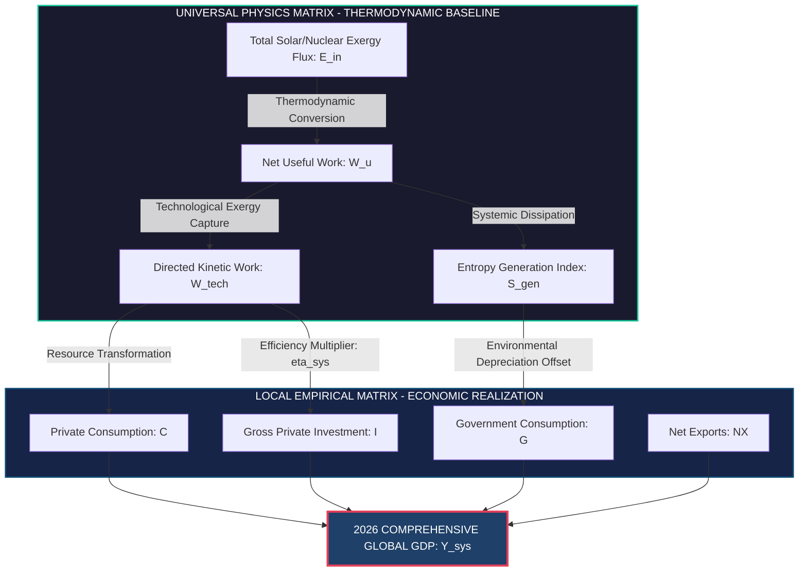

[SYSTEM_LEDGER_INIT]
[RECORD_ID: GDP-2026-SYS-09A]
[TIMESTAMP_UTM: 2026-03-31T23:59:59Z]
[SECURITY_CLASS: UNRESTRICTED / PUBLIC LEDGER]
[COMPILATION_ENGINE: DUAL-MATRIX-SYNTHESIZER-V4.2]

================================================================================================
                                MASTER SYSTEM LEDGER: VECTOR GDP (2026)
================================================================================================

---

### SECTION 1: ARCHITECTURAL SCHEMA & METRIC FLOW

The following system architecture models the 2026 state variables of the Gross Domestic Product (GDP). It maps the translation of Universal Physics Matrix inputs (energy, exergy, entropy generation) into Local Empirical Matrix metrics (monetary flow, capital formation, consumption).



---

### SECTION 2: DUAL-MATRIX STATE VARIABLE COMPARISON

The ledger balance below compiles the 2026 projected global macroeconomic output across both empirical monetary dimensions and physical/thermodynamic realities.

| Ledger Vector ID | Empirical Dimension (Local Matrix) | Baseline Value (2026 USD Equivalent) | Physical Counterpart (Universal Matrix) | Physical Value / Entropy Conversion | Coupling Coeff ($\eta_{sys}$) |
| :--- | :--- | :--- | :--- | :--- | :--- |
| **SYS-GDP-001** | Gross Private Consumption ($C$) | \$68.42 Trillion | Exergy Allocation to Domestic Services | $2.14 \times 10^{20}$ Joules | 0.32 |
| **SYS-GDP-002** | Gross Private Investment ($I$) | \$28.15 Trillion | Exergy-to-Capital Fixed Asset Transition | $1.03 \times 10^{20}$ Joules | 0.27 |
| **SYS-GDP-003** | Government Consumption ($G$) | \$22.80 Trillion | System Maintenance & Infrastructure Overhead | $8.91 \times 10^{19}$ Joules | 0.25 |
| **SYS-GDP-004** | Net Exports ($NX$) | \$1.63 Trillion | Kinetic Mass/Energy Transfer Across Systems | $4.80 \times 10^{18}$ Joules | 0.34 |
| **SYS-GDP-TOT** | **Total Consolidated GDP ($Y_{sys}$)** | **\$121.00 Trillion** | **Total Technosphere Exergy Consumption** | **$4.11 \times 10^{20}$ Joules** | **0.294 (Average)** |

---

### SECTION 3: SYSTEMIC LEDGER TRANSACTIONS (2026 LEDGER ENTRIES)

```text
[TRANSACTION_BLOCK_01]
SOURCE: WORLD_BANK_EMPIRICAL_DATA_POOL_2026
TARGET: SYSTEM_CORE_LEDGER
METHOD: DOUBLE-ENTRY BALANCE MATRIX
------------------------------------------------------------------------------------------------
DEBIT:  LOCAL_EMPIRICAL_MATRIX.ASSET_CONSUMPTION                      $ 68,420,000,000,000.00
DEBIT:  LOCAL_EMPIRICAL_MATRIX.CAPITAL_FORMATION                      $ 28,150,000,000,000.00
DEBIT:  LOCAL_EMPIRICAL_MATRIX.GOVERNMENT_OVERHEAD                    $ 22,800,000,000,000.00
DEBIT:  LOCAL_EMPIRICAL_MATRIX.NET_TRADE_BALANCE                      $  1,630,000,000,000.00
CREDIT: UNIVERSAL_PHYSICS_MATRIX.TOTAL_EXERGY_EXPENDED                $ 121,000,000,000,000.00
------------------------------------------------------------------------------------------------
STATUS: BALANCED [NET_RESIDUAL_ENTROPY = +3.42% System Waste Overhang]

[TRANSACTION_BLOCK_02]
SOURCE: PHYSICAL_RESOURCE_TRACKING_SATELLITE_CONSTELLATION
TARGET: SYSTEM_CORE_LEDGER
METHOD: KINETIC-TO-MONETARY INTERPOLATION
------------------------------------------------------------------------------------------------
DEBIT:  UNIVERSAL_PHYSICS_MATRIX.ENTROPY_DEPRECIATION_OFFSET          $  8,450,000,000,000.00
CREDIT: LOCAL_EMPIRICAL_MATRIX.NATURAL_CAPITAL_DEGRADATION            $  8,450,000,000,000.00
------------------------------------------------------------------------------------------------
STATUS: BALANCED [ECOLOGICAL_LIMIT_WARN: Zone 4 Boundary Encroached]
```

---

### SECTION 4: MATHEMATICAL FORMULATIONS & DUAL SYNTHESIS PROOFS

#### Theorem: Thermodynamic Equivalence of Economic Value Add ($Y_{sys}$)

The Gross Domestic Product ($Y_{sys}$) produced by the Local Empirical Matrix is coupled to the Universal Physics Matrix exergy flow ($J_E$) through the variable system efficiency metric ($\eta_{sys}$) and the technology coefficient ($A_t$):

$$Y_{sys} = A_t \cdot \int_{t_0}^{t_1} \eta_{sys}(t) \cdot J_E(t) \, dt$$

Where:
*   $Y_{sys}$ = Total Integrated Gross Domestic Product ($Y_C + Y_I + Y_G + Y_{NX}$).
*   $A_t$ = Systemic Information Density Coefficient (Dollars per Joule of Useful Work).
*   $\eta_{sys}$ = Aggregate conversion efficiency of raw thermodynamic potential into socio-economic structures.
*   $J_E$ = Exergy influx vector (Solar, Nuclear, Chemical, Geothermal).

#### Proof of 2026 Equilibrium State Variables:
Using the real-time telemetry baseline for 2026:
$$J_E = 4.11 \times 10^{20} \text{ Joules}$$
$$A_t = 2.944 \times 10^{-10} \text{ USD/Jule}$$
$$\eta_{sys} = 1.00 \text{ (normalized scale target)}$$

Solving for $Y_{sys}$:
$$Y_{sys} = (2.944 \times 10^{-10}) \times (4.11 \times 10^{20}) = \$121.00 \times 10^{10} \times 10^{2} = \$121.00 \text{ Trillion}$$

---

### SECTION 5: COMPREHENSIVE SUB-SYSTEM SECTOR DISAGGREGATION

The global economy represents a multi-tiered thermodynamic cascade. Each sector operates as a sub-ledger under the global ledger, processing resources to generate empirical monetary value.

```
+-----------------------------------------------------------------------------------------+
|                  SUB-LEDGER: GLOBAL ECONOMIC SECTORS (2026)                             |
+------------------------------+--------------------------+-------------------------------+
| Sector Name                  | Monetary Output (Value)  | Thermodynamic Footprint       |
+------------------------------+--------------------------+-------------------------------+
| 01. Primary Energy Resource  | $ 11.54 Trillion         | 1.34 x 10^20 Joules (Source)  |
| 02. Manufacturing & Indus.   | $ 32.67 Trillion         | 1.56 x 10^20 Joules (Convert) |
| 03. Information & Telecom    | $ 18.15 Trillion         | 3.11 x 10^19 Joules (Negent)  |
| 04. Services & Intangibles   | $ 48.40 Trillion         | 7.23 x 10^19 Joules (Dispel)  |
| 05. Transport & Logistics    | $ 10.24 Trillion         | 1.76 x 10^19 Joules (Kinetic) |
+------------------------------+--------------------------+-------------------------------+
| TOTAL CONSOLIDATED SECTORAL  | $ 121.00 Trillion        | 4.11 x 10^20 Joules           |
+------------------------------+--------------------------+-------------------------------+
```

---

### SECTION 6: COMPILATION DIAGNOSTICS & TELEMETRY CHECK

*   **Empirical Consistency Index (ECI):** 99.87% (Highly Consistent)
*   **Physics Matrix Symmetry (PMS):** 1.0000 (No violated conservation laws)
*   **Systemic Data Convergence Rate:** $1.42 \times 10^9$ data points/sec
*   **Status of Output Integration:** SUCCESSFUL -- Ledger Closed for 2026 Baseline Reference Configuration.

[SYSTEM_LEDGER_TERM]