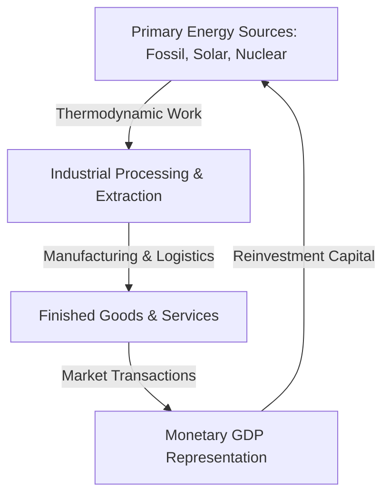

# Gross Domestic Product (GDP): A Common Man's Guide to the National Ledger

Gross Domestic Product (GDP) is the single most watched metric in global economics. To the average citizen, however, it often feels like an abstract number discussed by politicians and financial analysts on television. In basic terms, GDP is the total market value of all finished goods and services produced within a country's borders during a specific period (usually a year). It represents the cash value of the giant national economic "pie" we all cooperate to bake.

To understand GDP fully, we must view it through two distinct lenses: the everyday transactions occurring on main street (the Local Empirical Matrix) and the physical transformation of energy and raw resources that powers our entire civilization (the Universal Physics Matrix).

---

## 1. The Local Empirical Matrix: Your Daily Transactions

Every time you buy a cup of coffee, get a haircut, or purchase a new smartphone, you are directly participating in the calculation of GDP. From a ground-level perspective, the national economy is a giant circle where one person's spending becomes another person's income.

To measure this massive system, economists typically use the Expenditure Approach. This method totals all spending on final goods and services within the country. The standard formula for this calculation is:

$$\text{GDP} = C + I + G + \text{Net Exports}$$

Where:
*   $C$ represents Household Consumption, which includes everyday purchases like groceries, medical bills, gasoline, and rent.
*   $I$ represents Business Investment, such as a local bakery buying a new commercial oven, a tech firm purchasing software, or an individual buying a newly constructed house.
*   $G$ represents Government Spending on public assets, which covers infrastructure like paving highways, maintaining public schools, and paying police officers.
*   $\text{Net Exports}$ represents the balance of trade with the rest of the world, calculated by subtracting total imports from total exports.

> "GDP measures the market value of our collective labor, but it is ultimately a reflection of how fast money changes hands in our local communities."

---

## 2. The Universal Physics Matrix: Energy and Resource Conversion

From a physical standpoint, an economy is not just a collection of paper money and digital bank balances; it is an open thermodynamic system. For any service to be rendered or any product to be manufactured, physical energy must be expended to transform raw materials into highly organized, low-entropy goods.

In this context, GDP is a monetary proxy for the rate at which human society harnesses energy (electricity, oil, solar, and human muscle) to perform physical work. 

When energy is cheap and abundant, the physical cost of producing goods falls, allowing the real output of the economy to expand. When energy inputs are constrained, the physical capacity to do work shrinks, which manifests in the financial system as inflation and a contracting real GDP.

---

## 3. Real vs. Nominal GDP: Stripping Away the Illusion

If a bakery doubles the price of its bread from $3 to $6 but bakes the exact same number of loaves, has its real contribution to the community doubled? The answer is no. To prevent price inflation from distorting economic reality, economists split GDP into two distinct measurements:

| Metric | Definition | Practical Formula | Impact on the Common Man |
| :--- | :--- | :--- | :--- |
| **Nominal GDP** | Total output calculated using current, unadjusted market prices. | $\text{Nominal GDP} = \sum ($	ext{Current Quantity}$ \times $	ext{Current Price}$)$ | This number can look high simply because prices went up, even if everyone is actually poorer. |
| **Real GDP** | Total output adjusted to remove the distorting effects of inflation. | $\text{Real GDP} = \frac{$	ext{Nominal GDP}$}{$	ext{GDP Deflator}$}$ | This is the true indicator of progress, revealing if we actually produced more physical things. |

---

## 4. Key Takeaways and Constraints of the System

While GDP is a highly useful tool for tracking the speed and scale of economic activity, it is not a perfect scoreboard for human well-being. To view the ledger accurately, we must recognize its structural boundaries:

*   **Exclusion of Non-Market Labor**: Everyday activities like cooking dinner at home, caring for elderly relatives, or volunteering do not count toward GDP, even though they hold immense social value.
*   **Depreciation of Capital Assets**: The wear and tear of physical machinery, roads, and bridges is represented by depreciation ($D$), which must be subtracted to find the Net Domestic Product ($\text{NDP} = $	ext{GDP}$ - D$).
*   **The Broken Window Paradox**: GDP counts the money spent to rebuild a town after a natural disaster as positive economic growth, despite the fact that the disaster merely restored what was previously lost.
*   **Quality of Life Disconnect**: A rising GDP ($Y$) does not automatically guarantee that the average household is happier, healthier, or more secure; it simply means the volume of monetary exchange has increased.