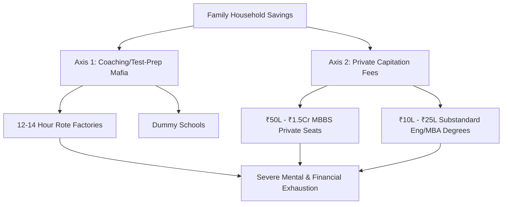

# SYSTEMIC RUIN OF EDUCATION AND COMMODITY EXTRACTION: A CITIZEN’S COMPREHENSIVE LEDGER

---

## 1. THE FOUNDATIONAL COLLAPSE: PRIMARY & SECONDARY DECAY
For the ordinary family, the dream of a better life begins with the local school. However, the foundational pillars of public education have been systematically dismantled, forcing parents into a desperate flight toward private options they can ill afford.

*   **The Reading and Math Deficit (ASER Data):** Over **50% of Grade 5 students** in rural public schools cannot read a simple Grade 2 textbook or solve basic 3-digit division problems. The system promotes children through grades without establishing baseline literacy or numeracy.
*   **The Multigrade Trap:** **66% of Grade I & II public primary classrooms** are forced into multigrade setups. A single, underpaid teacher is tasked with instructing multiple grades simultaneously in the same room.
*   **School Shrinkage & Abandonment:** Over **52% of primary schools** nationwide now have fewer than 60 total enrolled students. This is driven by mass parental flight to low-fee private schools, which promise English-medium instruction but often deliver substandard education.
*   **The Teacher Deficit:** Over **10 Lakh (1 Million+) sanctioned teacher posts** remain vacant across public primary and secondary schools. The state has intentionally starved the system of human resources.

```
+-----------------------------------------------------------------------+
|                      THE PRIMARY SCHOOL DECAY PIPELINE                |
+-----------------------------------------------------------------------+
|  Over 10 Lakh Vacant Teacher Posts                                    |
|              ↓                                                        |
|  66% Multigrade Classrooms (One teacher, multiple grades)             |
|              ↓                                                        |
|  50% of Grade 5 Students unable to read Grade 2 text                  |
|              ↓                                                        |
|  Mass Parental Flight to Low-Fee Private "Degree Mills"               |
+-----------------------------------------------------------------------+
```

---

## 2. THE ELIMINATION MATRIX: HYPER-INFLATION & ARTIFICIAL SCARCITY
If a student survives the broken primary system, they run headfirst into a ruthless, state-sanctioned elimination engine. Higher education is not designed to educate; it is designed to exclude.

### The Central University Gatekeeping (CUET UG)
For general-category students aspiring to enter premier public colleges (such as Delhi University's SRCC, Hindu, Hansraj, or St. Stephen's), the entry barrier is mathematically near-impossible. Cut-offs hover between **98.5% and 99.8% percentile** (780 to 795+ out of 800 marks). This hyper-inflation is caused by a massive capacity bottleneck: premier public seats represent **less than 1.5%** of the 40 Million+ higher education applicants nationwide.

### The Competitive Elimination Table
The following ledger details the scale of rejection faced by youth attempting to secure a future through national examinations:

| Examination | Total Applicants | Available Elite Seats | Rejection Rate | The Lived Reality for Families |
| :--- | :--- | :--- | :--- | :--- |
| **UPSC Civil Services (CSE)** | ~13.0 Lakh | ~1,000 | **99.92%** | Years of youth spent in 10x10 rooms; absolute loss of productive working years. |
| **IIT-JEE Advanced** | ~14.5 Lakh | ~17,500 (IITs) | **98.80%** | Massive loans taken for coaching; extreme psychological breakdown at 16 years old. |
| **NEET-UG (Medical)** | ~24.0 Lakh | ~55,000 (Govt MBBS) | **97.71%** | Desperate struggle against paper leaks and inflated marks; high financial barriers. |
| **CAT (IIM Management)** | ~3.3 Lakh | ~5,500 (IIMs) | **98.34%** | Intense pressure; corporate gatekeeping prioritizing credentials over actual capability. |

---

## 3. THE TRIAD OF EDUCATIONAL EXTORTION
Because public capacity has been intentionally choked, a predatory, multi-billion-dollar private industry has emerged to commodify the anxieties of parents and students.



*   **Axis 1: The Coaching & Test-Prep Mafia:** This industry extracts between **₹1.0 Lakh Crore and ₹3.5 Lakh Crore ($12B–$42B USD)** annually from household savings. To feed this machine, students are pulled from regular schools into "dummy school" arrangements, spending 12 to 14 hours a day in rote-learning factories that strip away critical thinking.
*   **Axis 2: The Private Seat & Capitation Fee Mafia:** For those who miss the razor-thin public cut-offs but have financial means, private medical and engineering colleges charge exorbitant rates. A private/deemed university MBBS seat costs between **₹50 Lakh and ₹1.5+ Crore**. Private engineering or management degrees cost **₹10 Lakh to ₹25 Lakh** for outdated curricula and poor instruction.

---

## 4. THE TOLL ON HUMAN LIFE: PSYCHOLOGICAL WARFARE
This system does not just fail students academically; it breaks them physically and mentally. The pressure to survive this elimination matrix has created a full-blown public health crisis.

*   **Student Suicides (NCRB Data):** The National Crime Records Bureau (NCRB) documents **over 13,000 student suicides annually**. This equates to **over 35 deaths per day**, or **one student suicide every 40 minutes**.
*   **Exam Failure Mortalities:** Over a 5-year tracking window, **12,598 youth deaths** (under 30 years old) were officially registered as directly caused by academic and examination failure.
*   **Batch Toxicity & Segregation:** Coaching hubs employ psychological torture tactics:
    *   **Weekly Public Rank Boards:** Test scores are posted publicly, rank-ordering children.
    *   **Color-Coded Uniforms:** Distinct colors are assigned based on exam performance, visibly marking lower-scoring students.
    *   **"Star vs. Lower Batch" Segregation:** Premier teachers and air-conditioned facilities are reserved for high scorers, while lower-performing batches are relegated to crowded rooms with subpar instruction. This has led to clinical depression, panic disorders, and early-onset hypertension in **40% to 50%** of coaching aspirants.

---

## 5. THE EXAM INTEGRITY & PAPER LEAK SCAM
For the common family, the final blow is the realization that the game itself is rigged. Even if a student sacrifices their mental health and their family exhausts its savings, the examinations are highly compromised.

*   **Scale of Disruption:** Over **70+ major competitive and recruitment exam paper leaks** have been recorded across more than 15 states (including NEET-UG, REET Rajasthan, UP Police Constable, Bihar BPSC, and SSC CGL). This has directly disrupted the lives of **1.5 Crore to 2.0 Crore aspirants**.
*   **Institutional Breakdown:** Dark-channel leaks on messaging apps, inflated top scores (such as the unprecedented 67 perfect 720/720 scores in NEET-UG), and unannounced "grace marks" have eroded public trust in national agencies like the National Testing Agency (NTA).
*   **Enforcement Deficit:** While laws like the *Public Examinations (Prevention of Unfair Means) Act, 2024* exist on paper, they consistently fail to dismantle the deep-seated political, administrative, and coaching-mafia nexuses that profit from these leaks.

---

## 6. THE CATTLE FODDER PARADOX
The state and private institutions point to the massive number of engineering and technical seats as a sign of progress. This is a profound structural illusion.

### The Illusion vs. The Reality
```
[14.90 Lakh Total Engineering Seats]  <--- Surface-level abundance
       |
       +--->  ~52,500 Seats (3.5%) in IITs/NITs/Tier-1 (Actual Industry Quality)
       |
       +--->  ~14.37 Lakh Seats (96.5%) in Degree Mills (No Employable Skills)
```

*   **The Paper Illusion:** There are **14.90 Lakh approved undergraduate engineering seats** compared to **14.50 Lakh JEE registered applicants**—seemingly a 1:1 ratio where everyone gets a seat.
*   **The Quality Rejection Reality:** Only **~52,500 seats (~3.5%)** across IITs, NITs, and Tier-1 colleges offer actual industry-grade training. The remaining **96.5% of seats** act as degree mills.
*   **The Employability Gap:** According to industry benchmarks, **only 3.84%** of engineering graduates possess the software development or algorithmic skills required for a basic tech job. Over **80% to 85%** are completely unemployable in the modern knowledge economy.
*   **The Debt and Gig Economy Trap:** Families sell ancestral land or take high-interest personal loans to pay for these degrees, only for the graduate to end up in low-wage gig work, food delivery, or non-technical call centers. The degree is not an asset; it is a debt-delivery vehicle.

---

## 7. THE DEEP SCIENCE OF OUR RUIN: THE UNIVERSAL LAWS OF DECAY
This crisis is not just a series of administrative failures. It is a systematic violation of the physical and structural laws that govern healthy societies.

### I. The Thermodynamic Law of Cognitive Transmission
Education is the primary mechanism a society uses to fight decay and disorder (entropy). 

$$\frac{dS_{\text{Civilization}}}{dt} \propto \frac{1}{\eta_{\text{Edu}}}$$

Where $S$ is systemic entropy (disorder, poverty, infrastructure decay) and $\eta_{\text{Edu}}$ is the efficiency of educational transmission. When you convert education into an extortionate lottery, the efficiency of information transfer ($\eta_{\text{Edu}}$) drops to near zero. Consequently, systemic entropy ($S$) rises, leading to decaying public infrastructure, poor administration, and a loss of scientific capability.

### II. The Conservation of Cognitive Potential
Genius, creativity, and intelligence are distributed uniformly across the population, regardless of wealth or background. By creating massive financial and geographical barriers, the system locks out **95%+ of the population matrix**. This starves the nation of its best minds, replacing them with a narrow, self-reproducing elite that has been trained in rote memorization rather than actual innovation.

### III. The Class Generator
Access to quality skills is restricted to a tiny fraction of the population (**2% to 5%**). This artificial bottleneck is what generates and sustains the elite class.

$$\text{Restriction of Skills (Cause)} \longrightarrow \text{Concentrated Wealth & Power (Effect)}$$

By keeping the skill floor inaccessible, the system systematically manufactures a massive, low-wage, compliant labor force (**95% to 98% of the population**), driving economic inequality to extreme levels.

### IV. The Sovereignty Triad Dependency
A country's true sovereignty and strength are determined by three interdependent factors:

$$\text{True Independence (TI)} = (\text{PI} + \text{EI} + \text{SI}) \times (\text{PI} \times \text{EI} \times \text{SI})$$

*   **Political Independence (PI):** Collapses when a poorly educated population is easily manipulated by media-driven narratives and division.
*   **Economic Independence (EI):** Collapses when the youth carry massive debt without functional skills, forcing them into low-productivity work.
*   **Social Independence (SI):** Collapses under the weight of mental health crises, hyper-competition, and the loss of social trust.

---

## 8. THE NATIONAL BETRAYAL & YOUTH RESISTANCE
A nation is defined by the cognitive, moral, and productive capacity of its citizens. Converting education into an extractive lottery systematically sabotages the republic's future, locking it into technological dependency and structural weakness.

### Street Telemetry & The Mobilization of the Betrayed
Across the country, the youth are refusing to accept this manufactured failure.

*   **The Street Protests:** In Delhi and major student hubs, student-led movements—including the *Sansad Chalo* march and mass rallies at Jantar Mantar—have mobilized against paper leaks and the NTA.
*   **State Suppression:** The response of the state apparatus has been characterized by barricades, internet suspensions in student areas, lathi-charges, and the preemptive detention of student leaders.
*   **The Moral Demand:** The placards carried by students on the streets clarify the core conflict:

$$\begin{aligned}
\text{"Education is Not a Commodity"} \\
\text{"Empathy Over Empire"} \\
\text{"Free, Fair & Quality Education is a Right of All"}
\end{aligned}$$

This is not a simple demand for exam reform. It is a fundamental struggle for the survival of the youth and the cognitive sovereignty of the nation.
