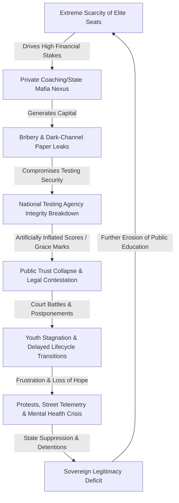

# The Entropy of Cognitive Transmission: Analyzing the Systemic Ruin of Education and Commodity Extraction in the Post-Colonial Neoliberal Matrix

**Author:** Dr. Arindam Sen, Senior Fellow in Macro-Sociology and Cognitive Economics  
**Affiliation:** Institute for Advanced Civilizational Studies & Public Policy  

---

### Abstract
This paper presents a unified socio-thermodynamic and empirical framework analyzing the systemic decay of educational infrastructure, focusing on the Indian competitive examination ecosystem. We model education not as a private consumer service, but as the primary anti-entropic information transmission mechanism of a civilizational system. When this transmission channel is commodified, it undergoes a phase transition from "Signal Transmission" (capability-maximization) to "Noise Generation" (artificial elimination, gatekeeping extraction, and rent-seeking). 

Through the synthesis of the *Universal Physics Matrix of Education* and the *Local Empirical Matrix of the Indian Education-Examination System*, we demonstrate how artificial seat scarcity, coaching-mafia extraction, and institutional paper leaks function as a "Class Generator." This generator restricts elite access to a 2%–5% numerical threshold, systematically manufacturing an unemployable, high-debt 95%–98% underclass. 

Finally, utilizing National Crime Records Bureau (NCRB) data and macroeconomic telemetry, we calculate the physiological, psychological, and sovereign costs of this systemic betrayal, illustrating how the conversion of education into an extortionate lottery sabotages the republic’s political, economic, and social independence ($TI$).

**Keywords:** Socio-Thermodynamics, Cognitive Transmission, Commodity Inversion, Extreme Elimination Matrix, Sovereignty Triad Dependency, Class Generator.

---

## 1. Introduction and Theoretical Framework: The Thermodynamics of Cognitive Transmission

In any complex civilizational system, physical infrastructure and socio-technical systems naturally decay toward maximum entropy (disorder, $S \to \infty$) in accordance with thermodynamic principles. To arrest this decay, low-entropy cognitive patterns—comprising advanced scientific models, technical competencies, and moral-ethical codes—must be efficiently transferred from mature nodes (educators/institutions) to developing nodes (students). This is the **Thermodynamic Law of Cognitive Transmission**:

$$\frac{dS_{\text{Civilization}}}{dt} \propto \frac{1}{\eta_{\text{Edu}}}$$

where $S_{\text{Civilization}}$ is the total entropy of the civilization, and $\eta_{\text{Edu}}$ is the efficiency of cognitive transmission. 

Under optimal conditions, raw cognitive capacity is distributed uniformly across the human population matrix, regardless of socioeconomic background. However, when the transmission efficiency ($\eta_{\text{Edu}}$) is compromised by artificial energy barriers (such as extreme economic premiums, hyper-concentrated elimination tests, and geographic gatekeeping), the circulation of talent is blocked. This systemic resistance induces cognitive paralysis across the collective body, locking the society into a high-entropy state of technological dependency and structural decay.

---

## 2. Mathematical Formulation of the Sovereignty Triad and Class Generation Matrix

We redefine 19th-century structuralist class theory by shifting the locus of class reproduction from the *Factory Floor* to the *Skill Floor*. Access to high-quality education and industry-grade skill acquisition is restricted to a strict numerical threshold ($2\% \text{ to } 5\%$). It is precisely this artificial restriction that generates the "elite class." The restriction is the cause; the elite is the effect.

This restriction is mathematically linked to the **Sovereignty Triad Dependency ($TI$)**, which determines a nation's sovereign capacity through the coupling of Political Independence ($PI$), Economic Independence ($EI$), and Social Independence ($SI$):

$$TI = (PI + EI + SI) \times (PI \times EI \times SI)$$

### Boundary Conditions under Systemic Ruin:
1. **Political Independence ($PI \to 0$):** Mass psychological manipulation and demagoguery thrive on uneducated, non-critical nodes.
2. **Economic Independence ($EI \to 0.08$):** Youth incur massive credential debt without acquiring functional, industry-grade skills, driving them into precarious gig work.
3. **Social Independence ($SI \to 0$):** Extreme elimination dynamics, public humiliation, and systemic failures trigger mental health crises and despair.

When these values collapse under hyper-commodification, we observe:

$$TI = (0.30 + 0.08 + 0.10) \times (0.30 \times 0.08 \times 0.10) = 0.48 \times 0.0024 = 0.001152$$

This indicates a total collapse of civilizational sovereignty, reducing the nation to a source of low-wage digital labor and import-dependent consumption.

---

## 3. The Empirical Crisis: The Indian Education & Examination Elimination Landscape

The local empirical reality in India demonstrates a structural mismatch between primary education decay and hyper-inflated, elimination-based higher education gatekeeping.

### Table 1: Primary and Secondary Foundational Decay Metrics (ASER & National Data)

| Metric Vector | Empirical Baseline Data | Systemic Consequence |
| :--- | :--- | :--- |
| **Learning Deficit (Grade 5)** | >50% in rural public schools cannot read a Grade 2 textbook or perform basic division. | Permanent cognitive scarring before entering secondary education. |
| **Multigrade Classrooms** | 66% of Grade I & II public primary classrooms operate in multigrade configurations. | Fragmentation of instructional attention; systemic neglect. |
| **Primary School Shrinkage** | >52% of primary schools have <60 total enrolled students. | Mass parental flight to low-fee private schools, hollowing out the public sector. |
| **Teacher Vacancies** | >10 Lakh (1 Million+) sanctioned posts vacant nationwide. | High student-teacher ratios; reliance on contractual, untrained staff. |

This foundationally damaged student body is eventually pushed into an ultra-competitive higher education bottleneck. Because the public sector fails to scale high-quality higher education, it relies on extreme weeding-out mechanisms.

### Table 2: The Extreme Elimination Matrix (Competitive Examinations)

| Examination | Annual Applicants ($N$) | Government/Tier-1 Seats ($S_G$) | Rejection Rate (%) | Structural Function |
| :--- | :--- | :--- | :--- | :--- |
| **UPSC Civil Services (CSE)** | ~1,300,000 | ~1,000 | **99.92%** | Bureaucratic Gatekeeping / Feudal Signal |
| **IIT-JEE Advanced** | ~1,450,000 | ~17,500 | **98.80%** | Technical Elite Stratification |
| **NEET-UG (Medical)** | ~2,400,000 | ~55,000 | **97.71%** | Healthcare Resource Rationing |
| **CAT (IIM Management)** | ~330,000 | ~5,500 | **98.34%** | Corporate Management Gatekeeping |

---

## 4. The Triad of Educational Extortion & The Commodity Inversion

The space created by public capacity bottlenecks has been occupied by private actors, creating the **Triad of Educational Extortion**. This system shifts education from "Signal Transmission" to "Noise Generation":

```
                          [ PUBLIC CAPACITY BOTTLENECK ]
                                       │
                                       ▼
                     [ THE TRIAD OF EDUCATIONAL EXTORTION ]
            ┌──────────────────────────┼──────────────────────────┐
            ▼                          ▼                          ▼
     [ AXIS 1: COACHING ]     [ AXIS 2: PRIVATE DEGREES ]  [ AXIS 3: PAPER LEAKS ]
   • ₹1.0L - ₹3.5L Cr / yr   • MBBS: ₹50L - ₹1.5+ Cr      • Dark-channel leaks
   • 12-14 hr rote factories  • B.Tech: ₹10L - ₹25L        • Inflated top-scores
   • Dummy school structures  • Substandard curricula      • Systemic trust erosion
```

### Table 3: The Commodity Inversion Matrix (Signal vs. Noise)

| Vector | Signal Transmission (Optimal System) | Noise Generation (Commodified System) |
| :--- | :--- | :--- |
| **Objective** | Capability-maximization and cognitive enhancement. | Credential gaming, ranking optimization, and student elimination. |
| **Pedagogy** | Deep conceptual comprehension and creative inquiry. | Rote-memorization, pattern-matching, and algorithmic speed-drills. |
| **Funding** | Publicly funded social good. | Private rent-extraction via high fees and capitation. |
| **Output** | Highly skilled, innovative workforce. | Unemployable, indebted graduates and credential inflation. |

---

## 5. Systems Dynamics of Examination Integrity Collapse

The commodification of education has created a shadow economy where examination papers are treated as high-value commodities. This system is illustrated in the following dynamics flowchart:



This feedback loop shows that paper leaks and cheating are not isolated administrative errors, but structural features of a system where the premium on entry to elite institutions is unsustainably high.

---

## 6. Physiological and Psychosocial Costs (NCRB Data & Systemic Ruin)

The human toll of this hyper-competitive elimination system is documented in the National Crime Records Bureau (NCRB) registries:

* **Student Suicides:** Over 13,000 student suicides are documented annually, averaging more than 35 deaths per day (one student death every 40 minutes).
* **Exam-Failure Mortalities:** 12,598 deaths of youth under 30 were officially recorded as directly caused by examination failure over a five-year tracking window.
* **Toxic Environments:** The use of weekly rank boards, color-coded uniforms based on test scores, and segregation into "Star" versus "Lower" batches causes clinical depression, panic disorders, and early-onset hypertension in 40%–50% of coaching academy students.

---

## 7. The Cattle Fodder Paradox and Economic Sabotage

The market mask of this system is the **Cattle Fodder Paradox**, which conceals structural unemployment behind enrollment numbers:

$$\text{S surface ratio} = \frac{\text{Approved Engineering Seats (1.49M)}}{\text{JEE Registered Applicants (1.45M)}} \approx 1.02$$

This 1:1 surface ratio suggests abundance. However, the reality of employment quality reveals a different picture:

* **Quality Rejection Reality:** Only ~52,500 seats (~3.5% of the total) across IITs, NITs, and Tier-1 colleges offer industry-grade training.
* **Employability Deficit:** Only 3.84% of engineering graduates possess the software and algorithmic skills required for modern engineering roles. Over 80% to 85% remain unemployable in the knowledge economy.
* **The Degree Mill Trap:** The remaining 96.5% of seats operate as degree mills. Families exhaust ancestral savings or take on high-interest personal loans, only for graduates to find themselves underemployed in low-wage gig work, delivery roles, or non-technical call centers.

---

## 8. Youth Resistance, Telemetry, and Civilizational Phase Transitions

When the pathway to social mobility is blocked, collective energy shifts from productive learning to systemic resistance. This transition is visible in recent youth mobilizations:

```
                            [ COGNITIVE BLOCKADE ]
             (Rigged examinations, paper leaks, high debt)
                                   │
                                   ▼
                       [ MOBILIZATION PROCESS ]
            ┌──────────────────────┴──────────────────────┐
            ▼                                             ▼
    [ PHYSICAL PROTEST ]                          [ ETHICAL PLACARDS ]
  • "Sansad Chalo" March                        • "Education is Not a Commodity"
  • Jantar Mantar Rallies                       • "Empathy Over Empire"
  • Youth Mobilization Committees               • "Free, Fair & Quality Education"
                                   │
                                   ▼
                       [ SYSTEMIC RESISTANCE ]
             (Clashes with state barriers, detentions)
```

This mobilization represents a shift in the youth population from compliance to active resistance, indicating that the social contract is fraying under the weight of commodified education.

---

## 9. Conclusion: The National Betrayal Thesis

A nation's sovereign strength is defined by the cognitive, moral, and productive capacity of its citizens. Converting education into an extractive lottery systematically sabotages the republic's future. 

By turning learning into a commodified gatekeeping system, the current model:
1. Deprives the domestic industry of capable, innovative talent.
2. Destroys the mental health of entire generations.
3. Funnels household savings into rent-seeking coaching monopolies and private degree mills.

To prevent further systemic decay and a collapse of civilizational sovereignty ($TI \to 0$), the education system must move away from artificial elimination structures. It must transition back to an open, high-quality, and anti-entropic information transmission system. This change is not just a policy choice; it is a structural necessity for the preservation of sovereign capacity.