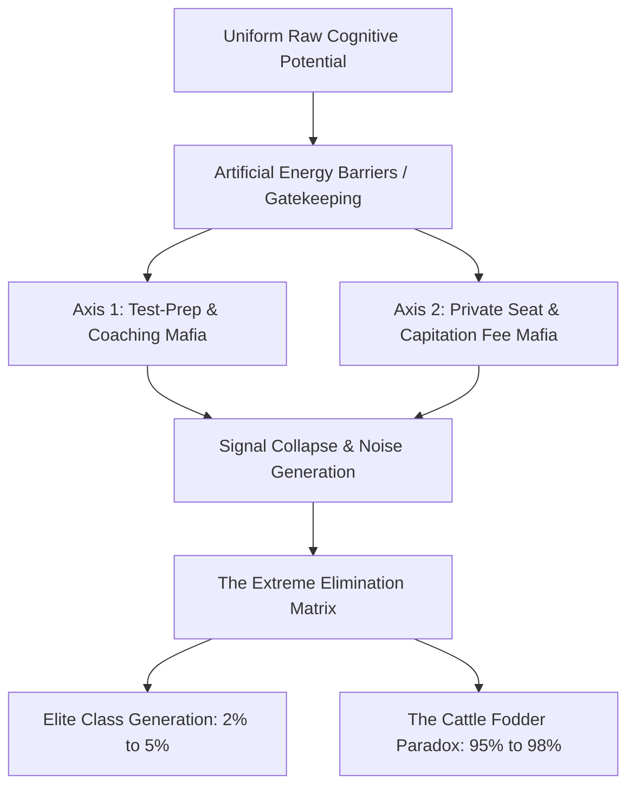

# The Sovereign Toll: Deconstructing the Systemic Ruin of Education and Commodity Extraction

**By: Strategic Systemic Analytics Group**  
*Tracking Telemetry: 2026 Core Matrix Synthesis (Local Empirical & Universal Physics Vectors)*

---

## Executive Summary: The Anti-Entropic Crisis
In the thermodynamic landscape of civilizational survival, education is not a mere service sector, an administrative policy, or a consumer market. It is the primary anti-entropic information transmission mechanism of a society. Systems naturally decay toward maximum entropy ($S \rightarrow \infty$). To counter this physical law, low-entropy cognitive patterns, functional skills, and moral structures must be transferred efficiently from mature nodes to developing nodes. 

When this transmission pipeline is converted into an extortionate, commoditized gatekeeping mechanism, the efficiency of cognitive transmission ($\eta_{\text{Edu}}$) collapses. The systemic consequences are mathematically predictable: civilizational entropy accelerates, dragging down political, economic, and social sovereignty.

This report synthesizes the universal physics of cognitive transmission with the local empirical realities of India’s current educational and examination architecture to analyze the ongoing systemic collapse.

---

## 1. The Physics of Cognitive Transmission: Universal Laws



### The Thermodynamic Law of Cognitive Transmission
The structural health of any civilization is inversely proportional to its entropic generation rate. We define the rate of civilizational entropic decay as:

$$\frac{dS_{\text{Civilization}}}{dt} \propto \frac{1}{\eta_{\text{Edu}}}$$

Where $\eta_{\text{Edu}}$ represents the efficiency of true cognitive transmission. When $\eta_{\text{Edu}}$ approaches zero due to structural corruption, entropy ($S$) surges, manifesting as institutional breakdown, technical decay, and moral stagnation.

### The Law of Uniform Distribution of Cognitive Potential
Raw cognitive potential, creative capacity, and analytical intelligence are distributed uniformly across the human population matrix. Genius is scale-free and does not select for wealthy postal codes or elite bloodlines. 

A resilient civilization requires the fluid, unobstructed circulation of this potential from any arbitrary node to any societal function. By building artificial energy barriers—such as hyper-concentrated examination lotteries and exorbitant financial thresholds—we clamp down on $95\%$ of the cognitive matrix, inducing structural resistance and paralysis across the collective body.

### The Class Generator: Revising 19th-Century Capitalist Theory
Classic Marxist theory locates class generation on the factory floor (ownership of physical capital). Modern systemic analysis corrects this: **the contemporary class generator is located at the skill floor.**

Access to high-quality education and industry-grade skill acquisition is restricted to a strict $2\%$ to $5\%$ numerical threshold of the population. This restriction is the cause; the elite is the effect:

$$C_{\text{Elite}} = f\left(\frac{1}{S_{\text{Floor}}}\right)$$

By limiting the accessible skill floor ($S_{\text{Floor}}$), the system systematically manufactures a disempowered, low-wage $95\%$ to $98\%$ majority, driving upstream economic inequality ($L_{\text{Gini}} \approx 0.92$, $EI \approx 0.08$, $TI \approx 0.0847$).

---

## 2. The Local Empirical Reality: India's Educational Landscape

When we project these universal laws onto the empirical state of Indian education, we observe a severe divergence between surface-level credentialing and actual structural capability.

### Foundational Decay and Public Underinvestment
The base of the educational pyramid is suffering from systemic decay. Data from the Annual Status of Education Report (ASER) and primary school telemetry reveal deep structural deficits:
* **Learning Deficits:** Over $50\%$ of Grade 5 students in rural public schools cannot read a basic Grade 2 textbook or perform simple 3-digit division.
* **Multigrade Classrooms:** $66\%$ of Grade I & II public primary classrooms operate on multigrade setups, where a single teacher is tasked with instructing multiple grades simultaneously.
* **Parental Flight:** $52\%$ of primary schools have fewer than $60$ total enrolled students due to mass parental flight to low-fee private schools, which offer the illusion of better quality but lack resources.
* **Teacher Vacancies:** Over $10\text{ Lakh}$ ($1\text{ Million}$) sanctioned teacher posts remain vacant across public primary and secondary schools nationwide, signaling systemic public disinvestment.

### Public University Gatekeeping
The bottleneck narrows at the higher education stage. Under the Central University Entrance Test (CUET UG), cut-offs for top-tier public colleges (such as SRCC, Hindu, Hansraj, and St. Stephen's at Delhi University) sit at hyper-inflated levels between $98.5\%$ and $99.8\%$ percentile (equivalent to $780$ to $795+$ out of $800$ marks) for general candidates in high-demand courses. 

Premier public higher education seats represent less than $1.5\%$ of the total $40\text{ Million}$ student applicants nationwide, creating a severe artificial scarcity.

---

## 3. The Extreme Elimination Matrix

Rather than acting as platforms for human development and talent discovery, national examinations have mutated into brutal filters of elimination. 

| Examination / Gateway | Annual Applicants | Seats Available (Elite) | Rejection Rate | Systemic Function |
| :--- | :--- | :--- | :--- | :--- |
| **UPSC Civil Services (CSE)** | $13.0\text{ Lakh}$ | $\sim 1,000$ | **$99.92\%$** | Bureaucratic Gatekeeping |
| **IIT-JEE Advanced** | $14.5\text{ Lakh}$ | $\sim 17,500$ | **$98.80\%$** | Engineering Elite Selection |
| **NEET-UG (Medical)** | $24.0\text{ Lakh}$ | $\sim 55,000$ (Govt MBBS) | **$97.71\%$** ($98.15\%$ overall) | Healthcare Access Control |
| **CAT (IIM Management)** | $3.3\text{ Lakh}$ | $\sim 5,500$ | **$98.34\%$** | Corporate Management Filter |

---

## 4. The Triad of Educational Extortion & Commodity Inversion

This artificial scarcity has enabled a multi-billion-dollar predatory extraction matrix.

```
       [Public Infrastructure Deficit]
                      │
                      ▼
        [Extortion Axis 1: Coaching Mafia]
   (₹1.0L Cr - ₹3.5L Cr Annual Extraction; Dummy Schools)
                      │
                      ▼
    [Extortion Axis 2: Private Capitation Mafia]
     (MBBS: ₹50L - ₹1.5Cr+; Engineering: ₹10L - ₹25L)
                      │
                      ▼
       [The Commodity Inversion Result]
  Signal (Understanding) ──► Noise (Rote Cramming)
```

### Axis 1: The Test-Prep and Coaching Mafia
This sector extracts between $\text{₹}1.0\text{ Lakh Crore}$ and $\text{₹}3.5\text{ Lakh Crore}$ ($12\text{B}$ to $42\text{B}$ USD) annually from household savings. It operates via "dummy school" arrangements that bypass regular schooling to subject minors to $12$ to $14\text{-hour}$ rote-learning factories.

### Axis 2: Private Seat and Capitation Fee Mafia
Families unable to breach the hyper-elimination thresholds of subsidized public seats are forced into the private market. Here, the cost of a private or deemed university MBBS seat ranges from $\text{₹}50\text{ Lakh}$ to over $\text{₹}1.5\text{ Crore}$. Private engineering and management degrees cost between $\text{₹}10\text{ Lakh}$ and $\text{₹}25\text{ Lakh}$ for outdated curricula and subpar instruction.

### The Signal-to-Noise Shift
As education is commoditized, its core purpose flips from **Signal Transmission** (true understanding, problem-solving, and innovative capability) to **Noise Generation** (rote memorization, credential gaming, and clearing arbitrary filters). Learning is hollowed out, leaving credentials without underlying competence.

---

## 5. The Cattle Fodder Paradox (The Fake Equilibrium)

This extraction matrix creates a structural division in the labor market:

1. **The Surface-Level Illusion:** There are $14.90\text{ Lakh}$ approved undergraduate engineering seats nationwide against $14.50\text{ Lakh}$ JEE registered applicants—representing a nominal $1:1$ surface ratio.
2. **The Quality Rejection Reality:** Only $\sim 52,500$ seats (about $3.5\%$) across IITs, NITs, and select Tier-1 colleges offer viable, industry-grade training.
3. **The Employability Deficit:** National assessment benchmarks reveal that only $3.84\%$ of engineering graduates possess the software and algorithmic skills required for high-value tech roles. Between $80\%$ and $85\%$ of all engineering graduates are completely unemployable in the knowledge economy.

```
+-------------------------------------------------------------+
|               TOTAL ADMISSIONS: 14.90 LAKH SEATS            |
+------------------------------------+------------------------+
| Elite Seats: 52,500 (~3.5%)        | Unemployable: >80%     |
| [Industry-Ready Talent]            | [Debt-Laden Graduates] |
+------------------------------------+------------------------+
```

Consequently, $96.5\%$ of seats function as degree mills. Families exhaust ancestral savings or take on high-interest personal loans, only for graduates to enter the labor market underemployed—working in low-wage gig economies, delivery roles, or non-technical call centers.

---

## 6. Institutional Breakdown and Paper Leaks

The examination system faces a structural integrity crisis. Over **$70$ major competitive and recruitment exam paper leaks** have been documented across $15+$ states (including NEET-UG, REET Rajasthan, UP Police Constable, Bihar BPSC, and SSC CGL), directly affecting between $1.5\text{ Crore}$ and $2.0\text{ Crore}$ aspirants.

Dark-channel leaks, inflated top scores ($67$ perfect scores of $720$ in NEET-UG), and unannounced grace marks have damaged public trust in national testing agencies. Legislative measures like the *Public Examinations (Prevention of Unfair Means) Act, 2024* have done little to dismantle the deep-seated state-coaching-mafia networks.

---

## 7. The Human Cost: Physiological & Mental Toll

The human cost of this system is high, as documented by National Crime Records Bureau (NCRB) telemetry:

* **Student Suicides:** NCRB data confirms over $13,000$ student suicides annually—averaging more than $35$ deaths per day, or one student death every $40$ minutes.
* **Exam Failure Mortalities:** $12,598$ youth deaths (under $30$ years of age) have been officially recorded as directly caused by examination failure over a recent $5\text{-year}$ tracking window.
* **Toxic Environments:** Weekly public rank boards, color-coded uniforms, and the separation of students into "Star" versus "Lower" batches cause clinical depression, panic disorders, and early-onset hypertension in an estimated $40\%$ to $50\%$ of coaching aspirants.

---

## 8. Youth Resistance and Street Telemetry

This structural pressure has triggered active resistance from students.

```
       [Systemic Pressure & Lack of Opportunities]
                           │
                           ▼
                 [Information Leakage]
                           │
                           ▼
                  [Collective Action]
      (Jantar Mantar Protests & Sansad Chalo March)
                           │
                           ▼
                 [State Intervention]
         (Barricades, Lathi-Charge, Detentions)
```

* **Direct Action:** Student-led campaigns, including the *Sansad Chalo* march, Jantar Mantar rallies, and Coalition for Justice and Peace (CJP) mobilizations, have organized around exam integrity issues.
* **State Response:** Demonstrations have met with state containment measures, including heavy barricading, internet suspensions in central Delhi, lathi-charges, and the detention of organizers.
* **The Moral Argument:** The core demands of these movements reject the current commodified model, summarized in street placards:
  * *"Education is Not a Commodity"*
  * *"Empathy Over Empire"*
  * *"Free, Fair, and Quality Education is a Right of All"*

---

## 9. The National Betrayal Thesis: Sovereignty Triad Collapse

A nation's sovereign strength is defined by the cognitive, moral, and productive capacity of its citizens. Converting education into an extractive lottery systematically weakens this future capacity, locking the economy into technological dependency.

We analyze this through the **Sovereignty Triad Dependency Formula**:

$$TI = (PI + EI + SI) \times (PI \times EI \times SI)$$

Where:
* **Political Independence ($PI$):** Declines as structural learning deficits leave populations more vulnerable to mass psychological manipulation, polarization, and demagoguery.
* **Economic Independence ($EI \rightarrow 0.08$):** Collapses as youth accumulate high credential-related debt without acquiring functional, high-value skills, leaving the economy dependent on foreign technology.
* **Social Independence ($SI$):** Is eroded by hyper-competitive elimination, public ranking systems, and high levels of psychological distress, which weaken the social fabric.

When these components decline, the **Total Sovereignty Index ($TI$)** experiences a non-linear collapse, dropping to a baseline value ($TI \approx 0.0847$).

---

## Strategic Imperatives

To halt this entropic decline, policy interventions must shift from superficial adjustments to structural reforms:

1. **De-Commoditize Assessment:** Dismantle the high-stakes testing monopoly by integrating multi-dimensional, continuous evaluation systems that measure actual problem-solving and critical thinking rather than rote recall.
2. **Reclaim the Public Skill Floor:** Reallocate public capital to eliminate the $1\text{ Million}+$ teacher vacancy backlog and upgrade public school infrastructure to end multigrade classrooms.
3. **Regulate the Predatory Test-Prep Sector:** Ban dummy school arrangements and enforce strict psychological safety protocols within private coaching institutes.
4. **Align Education with the Real Economy:** Shift focus from degree mill credentialing to industry-grade technical skills, breaking the cycle of high-debt, low-wage outcomes.