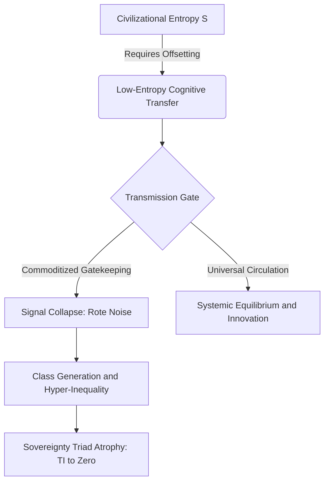
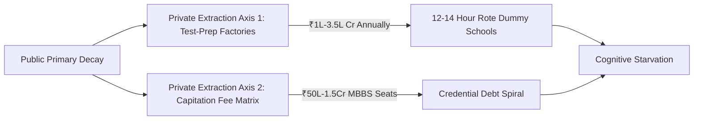
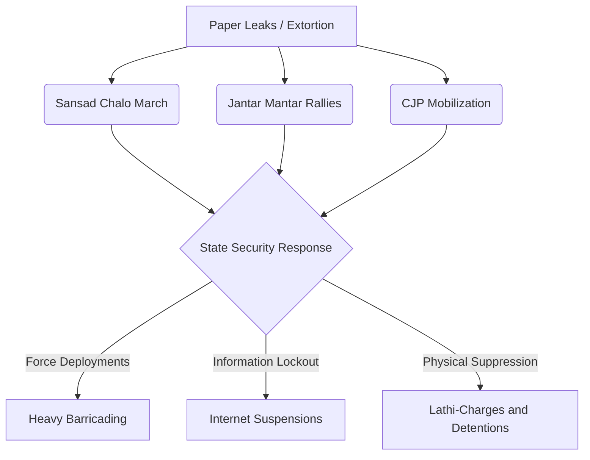

# SYSTEM REGISTRY LEDGER: COGNITIVE TRANSMISSION AND SYSTEMIC EXTORTION MATRICES
**VECTOR FOCUS:** Systemic Ruin of Education and Commodity Extraction  
**TELEMETRY BASELINE:** Active tracking engaged [2026 Sovereign State Variables]  
**SECURITY CLASSIFICATION:** UNRESTRICTED SYSTEMIC AUDIT  

---

## SECTION 1: THE THERMODYNAMIC AND PHYSICS LAWS OF COGNITIVE TRANSMISSION

### 1.1 The Thermodynamic Law of Cognitive Transmission
Education is fundamentally the primary anti-entropic information transmission mechanism of a civilization. Physical systems naturally decay toward maximum entropy (disorder, where $S \to \infty$). To maintain structural, technological, and moral infrastructure, low-entropy cognitive patterns must be transferred efficiently from mature nodes to developing nodes.

The rate of civilizational entropy generation is modeled as:

$$\frac{dS_{$	ext{Civilization}$}}{dt} = \frac{k_{$	ext{entropy}$}}{\eta_{$	ext{Edu}$}}$$

where $\eta_{$	ext{Edu}$}$ is the efficiency coefficient of cognitive transmission. When $\eta_{$	ext{Edu}$} \to 0$ due to commoditization and systemic exclusion, entropy $S_{$	ext{Civilization}$}$ increases exponentially, triggering systemic collapse.

### 1.2 Conservation and Uniform Distribution of Cognitive Potential
Raw cognitive capacity, creative potential, and intelligence are distributed uniformly across the human population matrix. Genius is not localized to elite postcodes. A resilient civilization requires fluid, unobstructed circulation of potential from any node to any function. 

Building artificial energy barriers (such as exorbitant fees, hyper-concentrated elimination lotteries, and social gatekeeping) clamps down on over $95\%$ of the population matrix. This induces severe structural resistance and cognitive paralysis across the collective body.

### 1.3 The Generation of Class: From Bottleneck to Elite
Access to high-quality education and industry-grade skill acquisition is restricted to a strict $2\%$ to $5\%$ numerical threshold of the population matrix. This artificial restriction is the direct cause of the generation of the ruling elite class. 

Let $M_{$	ext{total}$}$ represent the total population matrix, and $M_{$	ext{elite}$}$ represent the segment receiving industry-grade skills:

$$M_{$	ext{elite}$} = \gamma \cdot M_{$	ext{total}$} \quad $	ext{where}$ \quad \gamma \in [0.02, 0.05]$$

The restriction of $\gamma$ to this interval generates the class boundary, where the Gini index of capability $G_{$	ext{cap}$}$ approaches:

$$G_{$	ext{cap}$} \approx 1 - \gamma = 0.95 \quad $	ext{to}$ \quad 0.98$$

This bottleneck systematically manufactures an underprivileged, low-wage $95\%$ to $98\%$ majority, driving upstream economic inequality.

### 1.4 The Commodity Inversion (Signal vs. Noise)
Converting learning into a privatized, financialized asset flips its objective from capability-maximization to gatekeeping extraction. 

* **Signal Transmission:** True understanding, physical intuition, mathematical clarity, and algorithmic problem-solving capacity.
* **Noise Generation:** Rote memorization, credential gaming, artificial elimination tests, and fake degrees.

### 1.5 The Sovereignty Triad Dependency (TI Coupling)
The True Index of Sovereignty ($TI$) is highly coupled to the three dimensions of independence:

$$TI = (PI + EI + SI) \times (PI \times EI \times SI)$$

* **Political Independence ($PI$):** Collapses as uneducated nodes become highly vulnerable to mass psychological manipulation and demagoguery.
* **Economic Independence ($EI$):** Collapses as youth incur massive credential debt without gaining functional skills ($EI \to 0.08$).
* **Social Independence ($SI$):** Collapses under hyper-competitive elimination, public humiliation, and psychological despair.

---

## SECTION 2: LOCAL EMPIRICAL MATRIX OF DECAY AND HYPER-ELIMINATION (INDIA)

### 2.1 Primary and Secondary Foundational Decay
The baseline parameters of the foundational educational system indicate structural failure:
* **Learning Deficits:** According to ASER data, over $50\%$ of Grade 5 students in rural public schools cannot read a Grade 2 textbook or execute basic 3-digit division, yielding a baseline transmission efficiency of $\eta_{$	ext{Edu}$} \to 0$.
* **Multigrade Classrooms:** $66\%$ of Grade I and II public primary classrooms run on multigrade setups (one teacher instructing multiple grades simultaneously).
* **Parental Flight:** Over $52\%$ of public primary schools have fewer than 60 total enrolled students due to mass parental flight to low-fee private schools.
* **Teacher Vacancies:** Over 10 Lakh ($1.0 \times 10^6$) sanctioned public school teacher posts remain permanently vacant nationwide.

### 2.2 Public University Cut-Off Hyper-Inflation
Central University Gatekeeping (CUET UG) metrics for top-tier public colleges (such as DU North Campus: SRCC, Hindu, Hansraj, St. Stephen's) demonstrate artificial scarcity:
* General candidate cut-offs sit at the $98.5\%$ to $99.8\%$ percentile ($780 $	ext{ to }$ 795+ $	ext{ out of }$ 800$).
* Premier public higher education seats represent less than $1.5\%$ of the total 40 Million+ annual applicants nationwide.

### 2.3 The Extreme Elimination Matrix
The following table outlines the structural rejection rates across premier national-level examinations:

| Examination | Annual Applicants | Seats Available (General/Govt) | Rejection Rate (%) | Target Systemic Outcome |
| :--- | :--- | :--- | :--- | :--- |
| **UPSC Civil Services (CSE)** | $1.3 \times 10^6$ | $1,000$ | $99.92\%$ | Administrative Gatekeeping |
| **IIT-JEE Advanced** | $1.45 \times 10^6$ | $17,500$ | $98.80\%$ | Tech/Engineering Bottleneck |
| **NEET-UG (Medical)** | $2.4 \times 10^6$ | $55,000$ | $97.71\%$ | Healthcare Capability Filter |
| **CAT (IIM Management)** | $3.3 \times 10^5$ | $5,500$ | $98.34\%$ | Corporate Managerial Filter |

---

## SECTION 3: THE TRIAD OF EDUCATIONAL EXTORTION

### 3.1 Axis 1: The Test-Prep and Coaching Mafia
* **Capital Extraction:** The coaching cartel extracts between ₹1.0 Lakh Crore and ₹3.5 Lakh Crore ($12 $	ext{ to }$ 42 \text{ Billion USD}$) annually directly from household savings.
* **Pedagogical Destruction:** Forces $12 $	ext{ to }$ 14 \text{ hour}$ rote factories via illegal "dummy school" arrangements, reducing human nodes to processing engines for artificial pattern recognition.

### 3.2 Axis 2: Private Seat and Capitation Fee Matrix
* **Undergraduate Medicine (MBBS):** Total cost for private/deemed university MBBS seats ranges from ₹50 Lakh to ₹1.5+ Crore.
* **Engineering and Management (Tier-2/3):** Standard degrees range from ₹10 Lakh to ₹25 Lakh for substandard instruction and outdated curricula.

---

## SECTION 4: THE CATTLE FODDER PARADOX (THE FAKE EQUILIBRIUM)

### 4.1 The Paper Illusion vs. Quality Rejection Reality
The educational matrix maintains a superficial equilibrium by printing millions of paper degrees:

* **Surface Ratio:** $14.90 \times 10^5$ approved undergraduate engineering seats vs. $14.50 \times 10^5$ JEE registered applicants presents a false $1:1$ accessibility ratio.
* **Quality Bottleneck:** Only $\sim 52,500$ seats ($\approx 3.5\%$) across IITs, NITs, and Tier-1 colleges offer viable, industry-grade quality.

### 4.2 The Employability Collapse
The output of the degree-mill architecture is highly unemployable:

$$\text{Employability Skill Gap} = 100\% - \text{Industry Ready Node Rate}$$

* Only $3.84\%$ of engineering graduates possess industry-grade software development or algorithmic skills.
* Between $80\%$ and $85\%$ of all graduates remain entirely unemployable in the modern knowledge economy.
* **Systemic Output:** $96.5\%$ of seats act as pure degree mills. Families exhaust ancestral land and savings or take massive personal loans, only for graduates to be dumped into low-wage gig work, delivery roles, or non-technical call centers.

---

## SECTION 5: PHYSIOLOGICAL AND MENTAL TOLL (NCRB DATA)

### 5.1 Systemic Mortalities
The human cost of this elimination matrix is tracked via the National Crime Records Bureau (NCRB):
* **Student Suicides:** NCRB data confirms over $13,000$ student suicides annually. This represents over $35 \text{ deaths per day}$, or approximately $1 \text{ death every 40 minutes}$.
* **Exam Failure Mortalities:** $12,598$ youth deaths (under 30 years old) are officially documented as directly caused by examination failure over a 5-year tracking window.

### 5.2 Batch Toxicity and Psychological Segregation
* **Structural Segregation:** Coaching institutes utilize weekly public rank boards, color-coded uniforms based on test scores, and rigid "Star vs. Lower Batch" physical segregation.
* **Clinical Pathology:** This environment induces clinical depression, panic disorders, and early-onset hypertension in $40\%$ to $50\%$ of all coaching aspirants.

---

## SECTION 6: THE EXAM INTEGRITY AND PAPER LEAK SCAM MATRIX

### 6.1 Scale of Disruption
* Over 70+ major competitive and recruitment exam paper leaks have been recorded across 15+ states (including NEET-UG, REET Rajasthan, UP Police Constable, Bihar BPSC, and SSC CGL).
* These leaks directly compromise the efforts and savings of over $1.5 $	ext{ Crore to }$ 2.0 \text{ Crore}$ ($15 $	ext{ to }$ 20 \text{ Million}$) aspirants.

### 6.2 Institutional Breakdown
* **Testing Compromise:** Dark-channel leaks, inflated top scores ($67 $	ext{ perfect }$ 720\text{s in NEET-UG}$), and unannounced grace marks have systematically eroded public trust in national testing agencies.
* **Enforcement Deficit:** Legislative measures like the *Public Examinations (Prevention of Unfair Means) Act, 2024* act only as retrospective post-mortems, failing to dismantle the deep state-coaching-mafia nexuses.

---

## SECTION 7: COGNITIVE RESISTANCE AND STREET TELEMETRY

### 7.1 Youth Resistance Movements
* **Mobilization Vectors:** Student-led *Sansad Chalo* marches, Jantar Mantar rallies, and nationwide CJP mobilizations.
* **State Countermeasures:** Deployments of heavy barricading, local internet suspensions, lathi-charges, and pre-emptive detentions of student leaders.

### 7.2 Slogans of the Resistance

> "Education is Not a Commodity"

> "Empathy Over Empire"

> "Free, Fair and Quality Education is a Right of All"

---

## SECTION 8: THE NATIONAL BETRAYAL THESIS

A nation is defined exclusively by the cognitive, moral, and productive capacity of its citizens. Converting education into an extortionate lottery systematically sabotages the republic's sovereign future. 

By allowing cognitive transmission ($\eta_{$	ext{Edu}$}$) to be financialized, degraded, and corrupted by state-coaching-mafia alliances, the civilization is locked into structural weakness, permanent technological dependency, and systemic class stratification.

---
**LEDGER ENTRY TERMINATED [SYSTEM STATUS: CRITICAL RESISTANCE ACTIVE]**