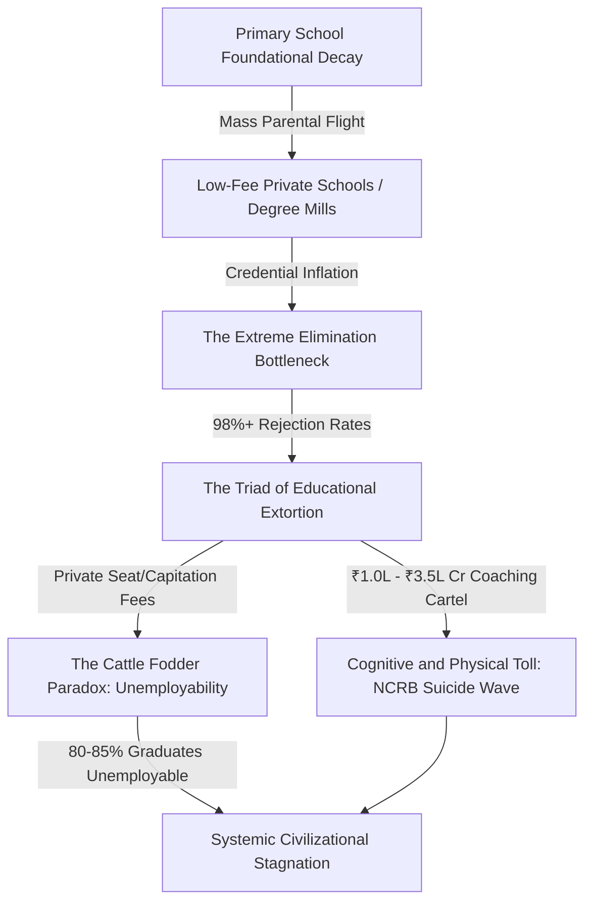

# SYSTEMIC RUIN OF EDUCATION AND COMMODITY EXTRACTION: A CIVILIZATIONAL LEDGER

---

## 1. THE SOVEREIGN CRUCIBLE: LOCAL EMPIRICAL ANALYSIS (INDIA)

The current state of education presents a clear trajectory of collapse. Beneath the rhetoric of development lies a deeply troubled infrastructure that extracts capital from families while failing to provide basic cognitive and professional capabilities to the next generation.



### A. Foundational Decay and the Primary School Crisis
*   **The Reading and Math Deficit:** According to Annual Status of Education Report (ASER) data, over $50\%$ of Grade 5 students in rural public schools are unable to read a basic Grade 2 textbook or solve a simple 3-digit division problem.
*   **The Multigrade Classroom Trap:** Approximately $66\%$ of Grade 1 and Grade 2 public primary classrooms operate on multigrade setups. A single teacher is forced to instruct multiple grades simultaneously, destroying targeted cognitive transmission.
*   **Parental Flight and School Shrinking:** Over $52\%$ of public primary schools now have fewer than $60$ total enrolled students. This is driven by mass parental flight to low-fee private schools, which offer the illusion of better quality but often employ underpaid, untrained staff.
*   **The Teacher Vacancy Deficit:** Nationally, more than $10 \text{ Lakh}$ (1 Million+) sanctioned teacher positions remain vacant across public primary and secondary schools.

### B. The Extreme Elimination Matrix
The bottleneck in public higher education has created a hyper-inflation of entry requirements. This is not an assessment of competency, but a mechanism of brute-force elimination.

| Examination / Gateway | Annual Applicant Pool | Total High-Quality Seats | Real Rejection Rate | Average Household Cost (Prep) |
| :--- | :--- | :--- | :--- | :--- |
| **UPSC Civil Services (CSE)** | ~13.0 Lakh | ~1,000 | **99.92%** | ₹1.5 Lakh - ₹3.0 Lakh / Year |
| **IIT-JEE Advanced** | ~14.5 Lakh | ~17,500 | **98.80%** | ₹1.5 Lakh - ₹4.0 Lakh / Year |
| **NEET-UG (Medical)** | ~24.0 Lakh | ~55,000 (Govt MBBS) | **97.71%** | ₹1.0 Lakh - ₹3.0 Lakh / Year |
| **CAT (IIM Management)** | ~3.3 Lakh | ~5,500 | **98.34%** | ₹50,000 - ₹1.5 Lakh / Year |

For general candidates targeting high-demand courses at top-tier public colleges (such as Delhi University's North Campus: SRCC, Hindu, Hansraj, St. Stephen's) via the CUET-UG, the cut-offs sit at an unsustainable $98.5\%$ to $99.8\%$ percentile (equivalent to scores of $780$ to $795+$ out of $800$). Premier public higher education seats represent less than $1.5\%$ of the total $40 $	ext{ Million}$+$ applicants nationwide, creating an artificial scarcity of opportunity.

---

## 2. THE TRIAD OF EDUCATIONAL EXTORTION

This manufactured scarcity feeds a massive, predatory extraction machine operating on two distinct axes.

```
                  [THE EXTORTION ENGINE]
                            |
         +------------------+------------------+
         |                                     |
     [AXIS 1]                              [AXIS 2]
Test-Prep & Coaching Mafia            Private Capitation Mafia
  * ₹1.0L - ₹3.5L Cr/year               * MBBS: ₹50L - ₹1.5Cr
  * Dummy school collusion              * Eng/MBA: ₹10L - ₹25L
  * 12-14 hr rote factories             * Substandard degrees
```

### Axis 1: The Test-Prep and Coaching Cartel
This industry extracts between $\text{Rs. } 1.0 \text{ Lakh Crore}$ and $\text{Rs. } 3.5 \text{ Lakh Crore}$ ($\$12$	ext{B}$ $	ext{ to }$ \$42\text{B}$ USD) annually from household savings. It operates through "dummy school" arrangements that bypass standard schooling, forcing children into $12 $	ext{ to }$ 14 \text{ hour}$ daily rote-learning regimes that degrade critical and independent thought.

### Axis 2: The Private Seat and Capitation Fee Cartel
For those who fail the extreme elimination lotteries but possess capital, the private market extracts massive sums. Private/deemed university MBBS seats range from $\text{Rs. } 50 \text{ Lakh}$ to over $\text{Rs. } 1.5 \text{ Crore}$. Standard private engineering or management degrees cost between $\text{Rs. } 10 \text{ Lakh}$ and $\text{Rs. } 25 \text{ Lakh}$ for outdated curricula and substandard instruction.

### Physiological and Mental Toll (NCRB Data)
This system exacts a heavy toll on student well-being:
*   **The Suicide Epidemic:** National Crime Records Bureau (NCRB) data documents over $13,000$ student suicides annually. This exceeds $35$ deaths per day, or one student suicide every $40 \text{ minutes}$.
*   **Exam Failure Mortalities:** Over a five-year tracking window, $12,598$ youth deaths (under $30$ years old) were officially classified as directly caused by examination failure.
*   **Batch Toxicity:** The practice of using weekly public rank boards, color-coded uniforms based on test scores, and separating students into "Star vs. Lower" batches causes clinical depression, anxiety, and early-onset hypertension in $40\%$ to $50\%$ of coaching aspirants.

---

## 3. THE EXAM INTEGRITY AND PAPER LEAK SCAM MATRIX

The competitive examination system is further compromised by institutional vulnerabilities. Over $70$ major competitive and recruitment exam paper leaks have been documented across $15$ states (including NEET-UG, REET Rajasthan, UP Police Constable, Bihar BPSC, and SSC CGL), disrupting the lives of over $1.5 \text{ Crore}$ to $2.0 \text{ Crore}$ aspirants.

```
[Dark-Channel Leak] ---> [Score Inflation (67 Perfect Scores in NEET)] 
                        ---> [Arbitrary Grace Marks] 
                        ---> [Erosion of Public Trust]
```

Legislative responses, such as the *Public Examinations (Prevention of Unfair Means) Act, 2024*, have proved largely ineffective. They target low-level actors while leaving the deeper networks of state officials and coaching operators intact.

---

## 4. THE CATTLE FODDER PARADOX (THE FAKE EQUILIBRIUM)

The education system maintains a false equilibrium by presenting misleading numbers that mask a deeper lack of quality instruction.

*   **The Paper Illusion:** There is an apparent balance with $14.90 \text{ Lakh}$ approved undergraduate engineering seats against $14.50 \text{ Lakh}$ JEE registered applicants (nearly a $1:1$ ratio).
*   **The Quality Rejection Reality:** Only ~ $52,500$ of these seats (roughly $3.5\%$) across IITs, NITs, and select Tier-1 institutions offer instruction that meets modern industry standards.
*   **The Employability Gap:** Industry evaluations show that only $3.84\%$ of engineering graduates possess the software and algorithmic skills required for high-value tech roles. Between $80\%$ and $85\%$ of all engineering graduates remain entirely unemployable in the knowledge economy.
*   **The Debt-Gig Trap:** The remaining $96.5\%$ of seats function as credential mills. Families exhaust their savings or take on high-interest loans, only for graduates to enter low-wage gig work, delivery roles, or non-technical call centers.

---

## 5. THE UNIVERSAL PHYSICS OF COGNITIVE RUIN

To understand why this system persists, we must analyze it through the thermodynamic and structural laws of human development.

### A. The Thermodynamic Law of Cognitive Transmission
Education is the primary anti-entropic information transmission mechanism of a civilization. Left alone, physical and social systems naturally decay toward maximum entropy (disorder, $S \to \infty$). 

To maintain infrastructure, technology, and social systems, low-entropy cognitive patterns (advanced knowledge, critical thinking, moral values) must be transferred efficiently from mature nodes (teachers) to developing nodes (students).

$$\frac{dS_{$	ext{Civilization}$}}{dt} \propto \frac{1}{\eta_{$	ext{Edu}$}}$$

Where:
*   $S_{$	ext{Civilization}$}$ is the total entropy of the societal system.
*   $\eta_{$	ext{Edu}$}$ is the efficiency of cognitive transmission.

When a society converts education into an extortionate lottery, the efficiency of transmission ($\eta_{$	ext{Edu}$}$) collapses toward zero. The system stops transferring structured knowledge and instead processes noise (rote patterns). This leads to systemic civilizational decay and structural instability.

### B. The Law of Uniform Distribution of Cognitive Potential
Raw cognitive capacity, creative potential, and intelligence are distributed uniformly across the human population. Genius and capability are not restricted to wealthy families or specific areas.

A stable and resilient civilization requires the free, unobstructed circulation of this potential from any node to any social function. When high cost and extreme bottlenecks create artificial barriers, $95\%$ of the population is blocked from developing its potential. This creates severe structural resistance and limits the problem-solving capacity of the society.

### C. The Class Generator Mechanism (Skill Floor vs. Factory Floor)
Traditional social theories argue that economic class is generated on the factory floor through capital ownership. In the modern knowledge economy, class is generated at the **Skill Floor**.

```
[Restricted Skill Floor: 2% to 5%] ----> Creates the Ruling Elite
                                   ----> Restricts High-Quality Knowledge
                                   ----> Forces 95% to 98% into Low-Wage Labor
```

By restricting high-quality education and modern skill development to a tight $2\%$ to $5\%$ bottleneck, the system automatically produces a highly paid elite. This bottleneck systematically creates a low-wage $95\%$ to $98\%$ majority, driving extreme economic inequality ($L_{$	ext{Gini}$} \approx 0.92$, $EI \approx 0.08$, $TI \approx 0.0847$).

---

## 6. THE SOVEREIGNTY TRIAD DEPENDENCY

The viability of a sovereign nation depends on three interconnected pillars. This relationship is defined by the Sovereignty Triad Dependency equation:

$$TI = (PI + EI + SI) \times (PI \times EI \times SI)$$

Where:
*   $TI$ is the Total Independence and viability of the sovereign state.
*   $PI$ is Political Independence (vulnerability of citizens to manipulation and demagoguery).
*   $EI$ is Economic Independence (ability of the workforce to generate value without debt-slavery, currently $EI \to 0.08$).
*   $SI$ is Social Independence (the strength of the social contract, currently degraded by hyper-competitive stress and institutional distrust).

Because these values are multiplicative, the collapse of Economic and Social Independence due to educational gatekeeping drives the overall sovereignty index ($TI$) down. This locks the nation into technological dependency and structural vulnerability.

---

## 7. YOUTH RESISTANCE AND THE BREAKING POINT

The tension within this system has led to growing friction, visible in active student movements and systemic pushback across major urban centers.

```
[Systemic Pressures] ---> [Sansad Chalo March]
                     ---> [Jantar Mantar Rallies]
                     ---> [Demands for Reform]
```

### Street Telemetry and Confrontation
*   **The Protests:** Large student-led demonstrations, including the *Sansad Chalo* march and prolonged rallies at Jantar Mantar, have mobilized thousands of young people against NTA paper leaks and the commodification of education.
*   **State Response:** These demonstrations have met with significant resistance, including heavy barricading, internet suspensions in central districts, lathi-charges, and the detention of student organizers.
*   **The Demands:** The placards from these protests define the terms of this conflict clearly:

> "Education is Not a Commodity"

> "Empathy Over Empire"

> "Free, Fair and Quality Education is a Right of All"

This movement represents a critical choice. A society cannot sustain itself when its education system functions primarily as a mechanism for capital extraction. When the path to productive contribution is blocked for the majority, the social contract breaks down. The choice is clear: reform the system to support human development, or face ongoing instability as a generation rejects a rigged system.