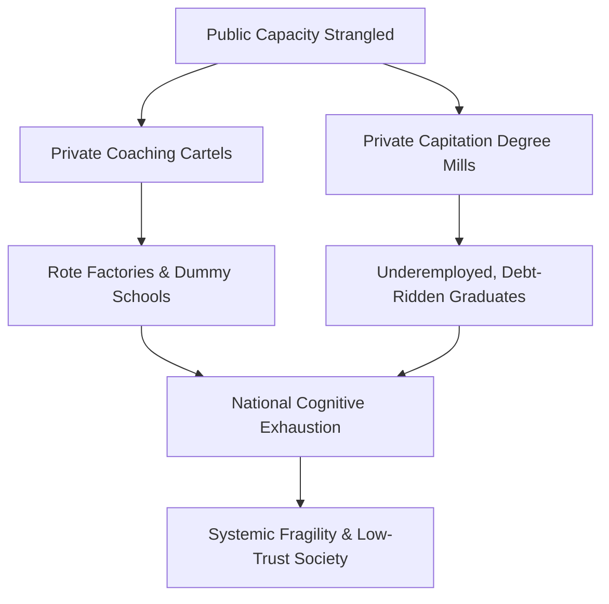

# THE GREAT COGNITIVE LOCKOUT: WHY THE SYSTEMIC RUIN OF EDUCATION AND COMMODITY EXTRACTION IS A CIVILIZATIONAL SECURITY THREAT

In the current global landscape, a nation's ultimate sovereignty is determined not by physical borders or standing armies, but by the cognitive, moral, and productive capacity of its citizens. When a society converts its educational infrastructure into an extractive lottery, it does not merely fail its youth—it systematically sabotages its own sovereign future. 

The empirical reality across developing and emerging economies, most acutely observed in India, reveals a profound structural decay. The synthesis of local empirical data with universal thermodynamic principles demonstrates that our educational systems are transitioning from low-entropy engines of civilizational advancement into high-entropy matrices of economic extraction and cognitive paralysis.

---

## 1. THE THERMODYNAMIC LAW OF COGNITIVE TRANSMISSION

To understand the scale of the current crisis, we must move beyond administrative and economic paradigms. Education is not merely a service sector, a line item in a national budget, or a personal consumer choice.

> "Education is the primary anti-entropic information transmission mechanism of a civilization."

Physical systems naturally decay toward maximum entropy (disorder, represented as $S \to \infty$). To prevent this civilizational decay, low-entropy cognitive patterns—such as scientific literacy, technological capability, and ethical frameworks—must be efficiently transferred from mature nodes (teachers, institutions) to developing nodes (students). 

The rate of civilizational entropy change can be modeled mathematically as:

$$\frac{dS_{$	ext{Civilization}$}}{dt} \propto \frac{1}{\eta_{$	ext{Edu}$}}$$

where $\eta_{$	ext{Edu}$}$ represents the thermodynamic efficiency of the educational transmission channel. When this channel is clogged by artificial energy barriers, systemic corruption, and rote-based bottlenecks, the efficiency $\eta_{$	ext{Edu}$}$ approaches zero, causing civilizational entropy to spike.

### The Law of Conservation of Cognitive Potential
Raw cognitive capacity, creative genius, and intelligence are distributed uniformly across the human population matrix. Genius is not localized to elite postcodes, wealthy lineages, or metropolitan centers. A resilient, competitive civilization requires the fluid, unobstructed circulation of this potential from any node to any functional role. 

By building artificial energy barriers—such as hyper-concentrated elimination exams, exorbitant capital requirements, and geographic gatekeeping—we clamp down on over 95% of the population matrix. This induces high systemic resistance and structural cognitive paralysis across the collective national body.

---

## 2. THE EXTREME ELIMINATION MATRIX

The defining characteristic of the contemporary educational landscape is not "selection," but **extreme elimination**. The premier public higher education institutions represent less than 1.5% of the total 40 Million+ applicants nationwide, creating a severe, artificial bottleneck.

This bottleneck is illustrated by the real-world metrics of major entrance and recruitment exams:

| Exam/System Vector | Approximate Annual Applicants | Sanctioned / Quality Seats | Empirical Rejection Rate |
| :--- | :--- | :--- | :--- |
| **UPSC Civil Services (CSE)** | 1.30 Million | ~1,000 | **99.92%** |
| **NEET-UG (Medical)** | 2.40 Million | ~55,000 (Govt MBBS) | **97.71%** |
| **IIT-JEE Advanced** | 1.45 Million | ~17,500 (IIT Seats) | **98.80%** |
| **CAT (IIM Management)** | 0.33 Million | ~5,500 | **98.34%** |

### The Class Generator: From Bottleneck to Elite
Access to high-quality instruction and industry-grade skill development is strictly limited to a minor numerical threshold ($2\% - 5\%$) of the population. This artificial restriction is the direct cause of class division. 

By bottlenecking the skill floor, the system systematically manufactures an underprivileged, low-wage majority ($95\% - 98\%$), driving upstream economic inequality where the Gini Coefficient ($L_{$	ext{Gini}$}$) approaches extreme imbalances.

---

## 3. THE TRIAD OF EDUCATIONAL EXTORTION AND INTEGRITY COLLAPSE

When public capacity is artificially strangled, a predatory economic ecosystem arises to fill the void. This system operates as a classic extraction cartel.

### The Three Axes of Extraction:
*   **Axis 1: The Test-Prep & Coaching Cartel:** This sector extracts between ₹1.0 Lakh Crore and ₹3.5 Lakh Crore ($12$	ext{ Billion}$ - 42\text{ Billion USD}$) annually from household savings. It forces young minds into 12-to-14-hour rote factories via "dummy school" arrangements, replacing deep cognitive development with optimized test-taking algorithms.
*   **Axis 2: Private Seat & Capitation Fee Extraction:** The cost of private or deemed university MBBS seats ranges from ₹50 Lakh to over ₹1.5 Crore ($180,000\text{ USD}$), while substandard private engineering/management degrees demand ₹10 Lakh to ₹25 Lakh. These institutions offer outdated curricula and poor instruction.
*   **Axis 3: The Exam Integrity and Paper Leak Scam Matrix:** Over 70 major competitive and recruitment exam paper leaks have been recorded across 15+ states (including NEET-UG, REET Rajasthan, and UP Police Constable), directly affecting 1.5 Crore to 2.0 Crore aspirants. Dark-channel leaks, inflated top scores, and sudden grace marks have eroded public trust in national testing agencies.

---

## 4. THE CATTLE FODDER PARADOX (THE FAKE EQUILIBRIUM)

The system maintains a deceptive surface equilibrium. While there are 14.90 Lakh approved undergraduate engineering seats against 14.50 Lakh JEE registered applicants, this seeming 1:1 ratio hides a deeper qualitative deficit:

*   **The Quality Rejection Reality:** Only ~52,500 seats (approximately 3.5%) across IITs, NITs, and select Tier-1 colleges offer viable, industry-grade quality.
*   **The Employability Gap:** Independent employment benchmarks demonstrate that only 3.84% of engineering graduates possess the industry-grade software and algorithmic skills necessary for the modern knowledge economy. Between 80% and 85% of graduates remain entirely unemployable.
*   **The Debt-to-Gig Pipeline:** The remaining 96.5% of seats act as high-cost degree mills. Families exhaust ancestral savings or take on high-interest personal loans, only for graduates to find themselves limited to low-wage gig work, delivery roles, or non-technical call centers.

---

## 5. THE TOLL ON HUMAN CAPITAL

The human cost of this system is quantifiable, severe, and compounding.

*   **Student Suicides (NCRB Data):** National Crime Records Bureau data confirms over 13,000 student suicides annually. This equates to more than 35 deaths per day, or one student death every 40 minutes.
*   **Exam-Failure Mortalities:** Over 12,598 youth deaths (under 30 years old) have been officially documented as directly caused by examination failure over a five-year tracking window.
*   **Systemic Batch Toxicity:** Weekly public rank boards, color-coded uniforms, and the segregation of students into "Star" versus "Lower" batches cause clinical depression, panic disorders, and early-onset hypertension in an estimated 40% to 50% of coaching aspirants.

---

## 6. THE SOVEREIGNTY TRIAD DEPENDENCY

The collapse of educational integrity directly degrades national sovereignty. We can define the Total Independence Index ($TI$) of a state through its interaction with the Sovereignty Triad: Political Independence ($PI$), Economic Independence ($EI$), and Social Independence ($SI$).

$$TI = (PI + EI + SI) \times (PI \times EI \times SI)$$

When the educational system fails:

*   **Political Independence ($PI$)** is weakened as an under-educated, cognitively exhausted populace becomes increasingly vulnerable to polarization, demagoguery, and systemic disinformation.
*   **Economic Independence ($EI$)** drops toward zero as youth incur massive credential-related debt without acquiring functional, wealth-generating, or innovative capabilities.
*   **Social Independence ($SI$)** collapses under the weight of hyper-competitive elimination, public humiliation, and widespread psychological despair, fracturing the core social contract.

---

## 7. THE PATH TO RECONSTRUCTION

To reverse this civilizational decline, we must move beyond incremental, administrative fixes. The crisis demands a fundamental structural overhaul:

> "Free, Fair, and Quality Education is a Right of All."

*   **Establish Cognitive Transparency:** We must replace hyper-concentrated, high-stakes single-day elimination exams with decentralized, multi-stage assessment matrices that measure actual problem-solving, creativity, and adaptive intelligence rather than memorization.
*   **De-Commoditize the Skill Floor:** High-quality technical and professional education must be treated as a public utility rather than an extractive market asset. State-funded capacity must be expanded to match demographic demand, reducing the leverage of private cartels.
*   **Enforce Strict Institutional Accountability:** Implement rigorous, independent audits of national testing agencies, accompanied by strict criminal penalties for paper leaks and institutional corruption.
*   **Incorporate Practical, Industry-Aligned Curricula:** Align secondary and higher education with the requirements of the global knowledge economy, ensuring that vocational and technical training lead directly to sustainable, high-value employment.

If we continue to treat education as a high-stakes lottery, we will continue to harvest its predictable yields: a small, hyper-specialized elite, a vast, underemployed underclass, and a steady decline in our collective problem-solving capacity. True national security begins with reclaiming the cognitive integrity of our youth.