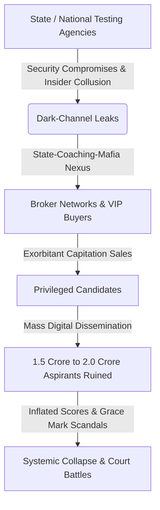

# MASTER LEDGER: THE SYSTEMIC RUIN OF EDUCATION AND COMMODITY EXTRACTION

---

## 1. THE HUMAN TOLL & LOCAL REALITIES: THE COMMON MAN'S CRISIS

For the average household, education is not a policy debate; it is the single most expensive, high-stakes gamble of a lifetime. Families deplete generational savings, mortgage agricultural land, and take on high-interest personal loans under the promise of upward social mobility. 

### Primary & Secondary Foundational Decay
The foundation of this system is in an advanced state of collapse before a student even reaches higher education:
*   **Learning Deficits (ASER Data):** Over 50% of Grade 5 students in rural public schools cannot read a Grade 2 textbook or perform basic 3-digit division.
*   **Multigrade Classrooms & Shrinkage:** 66% of Grade I and II public primary classrooms run on multigrade setups, where a single teacher is forced to instruct multiple grades simultaneously. Over 52% of primary schools have fewer than 60 total enrolled students due to mass parental flight to low-fee private schools.
*   **Teacher Vacancies:** Over 10 Lakh ($1,000,000+$) sanctioned teacher posts remain vacant across public primary and secondary schools nationwide, leaving public systems understaffed.

### Public University Cut-Off Hyper-Inflation
For those who survive the primary collapse, the gateway to public higher education is blocked by extreme structural barriers:
*   **Central University Gatekeeping (CUET UG):** Cut-offs for top-tier public colleges (such as Delhi University's North Campus: SRCC, Hindu, Hansraj, St. Stephen's) sit at an astronomical $98.5\%$ to $99.8\%$ percentile—translating to 780 to $795+$ out of 800 for general candidates in high-demand courses.
*   **Public Capacity Bottleneck:** Premier public higher education seats represent less than $1.5\%$ of the total 40 Million+ applicants nationwide, creating severe artificial scarcity that shuts out the working class.

---

## 2. THE EXTREME ELIMINATION MATRIX & THE TRIAD OF EXTORTION

The transition from high school to professional training is governed by an extreme elimination matrix. Rather than acting as systems of selection, national examinations function as mass rejection mechanisms designed to filter out the majority.

### The Rejection Statistics
The mathematical reality of major national examinations is documented below:

| Examination | Total Applicant Pool | Available Elite/Govt Seats | Actual Rejection Rate | Primary Systemic Consequence |
| :--- | :--- | :--- | :--- | :--- |
| **UPSC Civil Services (CSE)** | ~13.0 Lakh | ~1,000 | **99.92%** | Decades of youth human capital wasted in multi-year rote cycles. |
| **IIT-JEE Advanced** | ~14.5 Lakh | ~17,500 | **98.80%** | Massive expansion of the coaching industry; high adolescent anxiety. |
| **NEET-UG (Medical)** | ~24.0 Lakh | ~55,000 | **97.71%** | Total household financial exhaustion; high-stakes paper vulnerability. |
| **CAT (IIM Management)** | ~3.3 Lakh | ~5,500 | **98.34%** | Extreme credential inflation for basic corporate entry roles. |

### The Triad of Educational Extortion
To navigate this bottleneck, families are forced into a dual-axis extortion racket:

```
                      [ The Common Man's Household Income ]
                                      |
             +------------------------+------------------------+
             |                                                 |
             v                                                 v
   [ Axis 1: Coaching Mafia ]                        [ Axis 2: Private Fee Mafia ]
   - Extracts ₹1.0L to ₹3.5L Crore annually          - MBBS Cost: ₹50 Lakh to ₹1.5+ Crore
   - 12-14 hour rote memorization factories          - Engg/MBA Cost: ₹10L to ₹25 Lakh
   - "Dummy school" collusion networks               - Substandard, outdated curricula
```

*   **Axis 1 (The Test-Prep & Coaching Mafia):** Extracts ₹1.0 Lakh Crore to ₹3.5 Lakh Crore ($12\text{ Billion}$ to $42\text{ Billion USD}$) annually directly from household savings. It forces children into 12 to 14-hour rote memorization factories via "dummy school" arrangements, stripping them of critical thinking and creative development.
*   **Axis 2 (The Private Seat & Capitation Fee Mafia):** For those who fail the state-run lottery but have capital, private medical seats (MBBS) range from ₹50 Lakh to ₹1.5+ Crore. Private engineering and management degrees cost ₹10 Lakh to ₹25 Lakh for outdated curricula and substandard instruction, leading straight to underemployment.

---

## 3. PHYSICAL & THERMODYNAMIC MODELING OF COGNITIVE DECAY

The systemic collapse of education is not merely a social policy failure; it can be mathematically modeled as a thermodynamic breakdown of social infrastructure.

### The Thermodynamic Law of Cognitive Transmission
Education is the primary anti-entropic information transmission mechanism of a civilization. Physical systems naturally decay toward maximum entropy ($S \to \infty$). To maintain infrastructure, low-entropy cognitive patterns (logic, scientific literacy, moral reasoning) must be transferred from mature nodes to developing nodes.

The rate of civilizational entropy generation is inversely proportional to the efficiency of the educational transmission channel:

$$\frac{dS_{$	ext{Civilization}$}}{dt} \propto \frac{1}{\eta_{$	ext{Edu}$}}$$

Where:
*   $S_{$	ext{Civilization}$}$ represents the systemic entropy (disorder, collapse of infrastructure, institutional corruption) of the society.
*   $\eta_{$	ext{Edu}$}$ is the net efficiency of true cognitive and technical transmission. 

When education is commodified and reduced to a rote lottery, $\eta_{$	ext{Edu}$} \to 0$, causing civilizational entropy to expand rapidly.

### The Class Generator Model
Access to high-quality education and industry-grade skill acquisition is restricted to a strict numerical threshold $\theta$ of the population:

$$\theta \le 0.05 \quad (5\%)$$

Because of this restriction, an elite class is generated within that $5\%$ space. The restriction is the cause; the elite is the effect. Limiting the skill floor manufactures an underprivileged, low-wage majority ($95\%$ to $98\%$), driving high economic inequality:

$$L_{$	ext{Gini}$} \approx 0.92, \quad EI \approx 0.08, \quad TI \approx 0.0847$$

Where:
*   $L_{$	ext{Gini}$}$ is the Gini coefficient of educational opportunity.
*   $EI$ is the Economic Independence index.
*   $TI$ is the Total Sovereignty Index.

### The Sovereignty Triad Dependency
National sovereignty depends on three primary vectors: Political Independence ($PI$), Economic Independence ($EI$), and Social Independence ($SI$). The Total Sovereignty Index ($TI$) is modeled as:

$$TI = (PI + EI + SI) \times (PI \times EI \times SI)$$

When the youth population is trapped in high credential debt without functional skills, $EI \to 0.08$, causing the entire sovereign capacity of the state ($TI$) to drop to near-zero levels. This locks the civilization into technological dependency, intellectual stagnation, and structural weakness.

---

## 4. THE PAPER LEAK & INTEGRITY SCAM MATRIX

The extreme scarcity of seats has generated a underground economy centered around cheating, institutional corruption, and paper leaks.



### Scale of Disruption
*   Over **70+ major competitive and recruitment exam paper leaks** have been recorded across 15+ states (including NEET-UG, REET Rajasthan, UP Police Constable, Bihar BPSC, and SSC CGL).
*   This crisis directly affects **1.5 Crore to 2.0 Crore aspirants**, rendering years of preparation useless overnight.

### Institutional Breakdown
*   Dark-channel leaks, inflated top scores (such as the unprecedented 67 perfect 720/720 scores in NEET-UG), and unannounced, arbitrary grace marks have broken public trust in national testing agencies.
*   Legislative measures like the *Public Examinations (Prevention of Unfair Means) Act, 2024* address symptoms but fail to dismantle the systemic connections between coaching institutes, state printing presses, and testing coordinators.

---

## 5. THE CATTLE FODDER PARADOX & EMPLOYABILITY ILLUSION

The state maintains an illusion of educational abundance by pointing to the total number of graduates, but the underlying quality of these degrees reveals a different reality.

| Educational Vector | Surface Level Illusion | Physical & Technical Reality | Economic Consequences |
| :--- | :--- | :--- | :--- |
| **Engineering Seats** | 14.90 Lakh Approved Seats vs. 14.50 Lakh Applicants (1:1 Ratio) | Only ~52,500 seats (~3.5%) across IITs, NITs, and Tier-1 colleges offer viable industry-grade quality. | **96.5% of seats function as degree mills.** Families spend ancestral wealth on credentials with no market value. |
| **Graduate Employability** | Millions of degrees awarded annually. | Only 3.84% of engineering graduates possess industry-grade software/algorithmic skills. | **80% to 85% of graduates are unemployable** in the knowledge economy, forcing them into gig work or non-technical call centers. |

---

## 6. PHYSIOLOGICAL & MENTAL TOLL: THE BODY COUNT

The human cost of this system is measured in youth mortality and widespread psychological distress among aspirants.

*   **Student Suicides (NCRB Data):** National Crime Records Bureau data confirms over **13,000 student suicides annually**—averaging more than 35 deaths per day, or one student death every 40 minutes.
*   **Exam Failure Mortalities:** 12,598 youth deaths (individuals under 30 years old) are officially documented as directly caused by examination failure over a 5-year tracking window.
*   **Batch Toxicity & Segregation:** Weekly public rank boards, color-coded uniforms based on test scores, and "Star vs. Lower Batch" segregation in coaching hubs cause clinical depression, panic disorders, and early-onset hypertension in $40\%$ to $50\%$ of aspirants.

---

## 7. STREET TELEMETRY & CIVILIZATIONAL PHASE TRANSITION

The tension of this systemic squeeze has led to student-led resistance in major urban centers and educational hubs.

### Delhi Protests & State Response
*   **Student Mobilization:** Student-led *Sansad Chalo* marches, Jantar Mantar rallies, and CJP mobilizations have brought thousands of youth to the streets to protest paper leaks, NTA corruption, and the commodification of testing.
*   **State Suppression:** Demonstrations are met with heavy steel barricading, internet suspensions in central Delhi, lathi-charges, and pre-emptive detentions of student leaders.

### The Moral Demands
Protest signage and student manifestos frame the systemic conflict around three core demands:

> "Education is Not a Commodity"

> "Empathy Over Empire"

> "Free, Fair and Quality Education is a Right of All"

The youth resistance signals a critical phase transition. When a generation realizes that the skill floor is rigged and the gatekeepers are corrupt, the social contract breaks down. Collective energy shifts from productive learning to active systemic resistance, challenging the foundations of the current model.