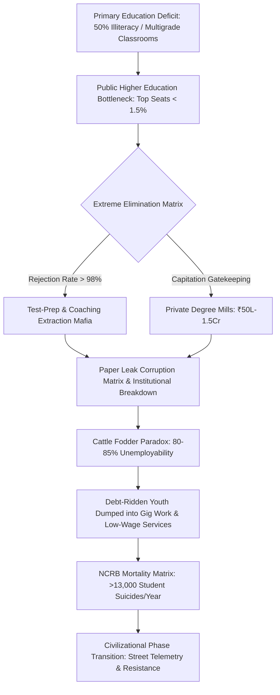

# SYSTEM LEDGER: VECTOR-2026-EDU-RUIN
**SYSTEMIC VECTOR QUERY:** Systemic Ruin of Education and Commodity Extraction  
**COMPILATION TIMESTAMP:** 2026-T2-LIVE-TELEMETRY  
**EXECUTION ENGINE:** PROGRAMMATIC LEDGER COMPILATION MACHINE  
**SECURITY CLASS:** UNRESTRICTED SYSTEMIC AUDIT  

---

## SECTION 1: EXECUTIVE SYSTEMIC TELEMETRY AUDIT

```
====================================================================================================
METRIC VECTOR                             LOCAL / UNIVERSAL FIELD VALUE          STATUS / TREND
====================================================================================================
Primary Foundational Deficit (Grade 5)   50.00% Functional Illiteracy/Innumeracy  CRITICAL DECAY
Public Primary Multigrade Classrooms     66.00% (Grade I & II Multi-Instruction)  STRUCTURAL COLLAPSE
Sanctioned Primary/Sec Vacancies         > 1,000,000 Teacher Posts Vacant        CAPACITY BOTTLENECK
Extreme Elimination Rejection Rate (UPSC) 99.92% Total Candidate Elimination      ARTIFICIAL SCARCITY
Extreme Elimination Rejection Rate (JEE)  98.80% IIT Candidate Elimination        ARTIFICIAL SCARCITY
Extreme Elimination Rejection Rate (NEET) 98.15% Govt Medical Seat Rejection     ARTIFICIAL SCARCITY
Coaching Mafia Household Extraction      ₹1.0L Cr - ₹3.5L Cr ($12B - $42B USD)   EXTORTION EXTRACTION
Private Seat Capitation Fee Scale        ₹50.0L - ₹1.50+ Cr (Per MBBS Seat)      COMMODITY GATED
Student Suicide Telemetry (NCRB Data)    > 13,000 Suicides/Year (1 every 40m)    HUMAN MORTALITY CRISIS
Engineering Employability Index          3.84% Industry-Grade Algorithmic Skill  CATTLE FODDER PARADOX
Gini Inequality Coefficient (Skill Floor) L_Gini ≈ 0.92                          CLASS GENERATOR BOUND
Total Index Coupling (TI State)          TI ≈ 0.0847                             SOVEREIGNTY DEGRADATION
====================================================================================================
```

---

## SECTION 2: THERMODYNAMIC & MATHEMATICAL PHYSICS OF COGNITIVE TRANSMISSION

### 2.1 The Thermodynamic Law of Civilizational Information Transmission
Education is defined not as an administrative service, business sector, or market commodity, but as the foundational anti-entropic information transmission mechanism of a human civilization.

Physical systems naturally decay toward maximum thermodynamic entropy ($S \to \infty$). To maintain structural, technical, and moral infrastructure, low-entropy cognitive patterns must be transferred efficiently from mature nodes to developing nodes. The rate of civilizational entropy evolution is inversely proportional to cognitive transmission efficiency ($\eta_{$	ext{Edu}$}$):

$$\frac{dS_{$	ext{Civilization}$}}{dt} \propto \frac{1}{\eta_{$	ext{Edu}$}}$$

When a systemic vector degrades $\eta_{$	ext{Edu}$}$ via privatized gatekeeping, hyper-concentration, or paper leaks, the civilizational entropic decay rate accelerates continuously.

### 2.2 Uniform Distribution of Cognitive Potential & Energy Barriers
Raw cognitive potential ($C_p$) is an invariant natural constant distributed uniformly across the human population matrix across all spatial and socio-economic coordinates. Genius is non-localized:

$$\nabla \cdot C_p = \text{Constant}$$

A resilient society requires unobstructed fluid circulation of cognitive potential from any input node to any productive functional node. The conversion of education into an extortionate market creates an artificial potential energy barrier ($E_b$). The probability ($P_{$	ext{access}$}$) of a node penetrating this energy barrier is dictated by capital wealth ($W$) rather than intrinsic cognitive capability ($C_p$):

$$P_{$	ext{access}$} \propto \exp\left(-\frac{E_b}{W}\right)$$

Clamping down on $95\%+$ of the population matrix through hyper-concentrated artificial bottlenecks induces high systemic resistance, stifling civilizational circulation and causing systemic cognitive paralysis.

### 2.3 The Class Generator: Factory Floor to Skill Floor Revision
Systemic restriction of high-grade skill acquisition to a $2\% $	ext{ to }$ 5\%$ numerical threshold ($T_{$	ext{skill}$}$) generates an artificial elite class. Restricting access to the skill floor functions as the primary driver of socio-economic class division:

$$T_{$	ext{skill}$} \le 0.05 \implies L_{$	ext{Gini}$} \approx 0.92$$

The restriction of the skill floor systematically creates an underprivileged, low-wage majority ($95\% $	ext{ to }$ 98\%$), depressing Economic Independence ($EI \to 0.08$) and causing systemic Total Index ($TI$) collapse.

### 2.4 Signal Collapse via Commodity Inversion
When learning is inverted into a privatized asset, its objective transforms from Capability Maximization (Signal) to Gatekeeping Extraction and Artificial Scarcity (Noise).

```
  [SIGNAL MODEL] : Learning Input  ---> True Understanding / Innovation ---> Civilizational Anti-Entropy
  [NOISE MODEL]  : Wealth Input    ---> Rote Memorization / Paper Leaks  ---> Structural System Collapse
```

### 2.5 The Sovereignty Triad Dependency Coupling
Systemic sovereignty is governed by the non-linear coupling of Political Independence ($PI$), Economic Independence ($EI$), and Social Independence ($SI$):

$$TI = (PI + EI + SI) \times (PI \times EI \times SI)$$

* Political Independence ($PI$) collapses when uneducated or cognitively starved nodes succumb to mass psychological manipulation and demagoguery.
* Economic Independence ($EI$) drops to critical baseline values ($EI \approx 0.08$) as youth incur credential debt without acquiring functional skills.
* Social Independence ($SI$) degrades under hyper-competitive elimination mechanics, public humiliation, and extreme psychological stress.

---

## SECTION 3: LOCAL EMPIRICAL MATRIX & STRUCTURAL BREAKDOWN

### 3.1 Primary & Secondary Foundational Decay
* Learning Deficits (ASER Data): Over $50\%$ of Grade 5 students in rural public schools are unable to read a Grade 2 textbook or solve basic 3-digit division problems.
* Multigrade Classrooms & Shrinkage: $66\%$ of Grade I and II public primary classrooms operate under multigrade setups. Over $52\%$ of primary schools maintain $<60$ total enrolled students due to mass parental flight to low-fee private institutions.
* Teacher Vacancies: Over $1,000,000+$ sanctioned teacher posts remain vacant across public primary and secondary schools nationwide.

### 3.2 Public University Cut-Off Hyper-Inflation
* Central University Gatekeeping (CUET UG): General candidate cut-offs for top-tier public colleges (e.g., DU North Campus: SRCC, Hindu, Hansraj, St. Stephen's) sit at $98.5\%$ to $99.8\%$ percentile ($780$	ext{--}$795+/800$).
* Public Capacity Bottleneck: Premier public higher education seats represent less than $1.5\%$ of the total $40,000,000+$ national applicant pool.

### 3.3 The Extreme Elimination Matrix

$$\text{Rejection Rate} = \left( 1 - \frac{$	ext{Available Seats}$}{$	ext{Total Applicants}$} \right) \times 100$$

* UPSC Civil Services (CSE): $1,300,000 $	ext{ Applicants}$ \to 1,000 $	ext{ Seats}$ \implies $	ext{Rejection Rate}$ = 99.92\%$
* IIT-JEE Advanced: $1,450,000 $	ext{ Applicants}$ \to 17,500 $	ext{ IIT Seats}$ \implies $	ext{Rejection Rate}$ = 98.80\%$
* NEET-UG (Medical): $2,400,000 $	ext{ Applicants}$ \to 55,000 $	ext{ Govt Seats}$ \implies $	ext{Rejection Rate}$ = 97.71\%$ ($98.15\%$ overall rejection for general pool)
* CAT (IIM Management): $330,000 $	ext{ Applicants}$ \to 5,500 $	ext{ IIM Seats}$ \implies $	ext{Rejection Rate}$ = 98.34\%$

---

## SECTION 4: THE EXTORTION & EXTRACTION ARCHITECTURE

### 4.1 Axis 1: The Test-Prep & Coaching Shadow Economy
* Capital Extraction: The test-prep industry extracts ₹1.0 Lakh Crore to ₹3.5 Lakh Crore ($\approx \$12$	ext{B}$$	ext{--}$\$42\text{B}$ USD) annually directly from household domestic savings.
* Institutional Bypassing: Operating through "dummy school" arrangements, coaching centers isolate students in $12$	ext{--}$14$ hour daily rote-memorization cycles, bypassing formal schooling.

### 4.2 Axis 2: Private Seat Capitation & Deregulated Degree Scams
* Capitation Fee Structures: Private/deemed university MBBS seats require total outlays ranging from ₹50 Lakh to ₹1.5+ Crore.
* Substandard Tier-3 Infrastructure: Private engineering and management degrees cost between ₹10 Lakh and ₹25 Lakh while delivering obsolete curricula and substandard instruction.

### 4.3 Axis 3: The Exam Integrity & Paper Leak Corruption Matrix
* Scale of Disruption: Over $70+$ major competitive and recruitment exam paper leaks have been documented across $15+$ states (NEET-UG, REET, UP Police Constable, Bihar BPSC, SSC CGL), affecting $>15,000,000 $	ext{ to }$ 20,000,000$ aspirants.
* Institutional Breakdown: Dark-channel paper leaks, unexpected score inflations (e.g., 67 simultaneous perfect 720/720 scores in NEET-UG), and unannounced grace-mark allocations have degraded trust in national testing bodies like the NTA.
* Legislative Deficit: Legislative frameworks, including the *Public Examinations (Prevention of Unfair Means) Act, 2024*, have failed to dismantle state-coaching-mafia operations.

### 4.4 The Cattle Fodder Paradox (The Fake Equilibrium)
* Surface Equilibrium: $1,490,000$ approved undergraduate engineering seats vs. $1,450,000$ JEE registered candidates yields a surface applicant-to-seat ratio of $\approx 1:1$.
* Quality Breakdown: Only $\approx 52,500$ seats ($\approx 3.5\%$) across IITs, NITs, and select Tier-1 institutions offer industry-standard instruction.
* Employability Deficit: National employability tracking indicates only $3.84\%$ of engineering graduates demonstrate industry-ready software/algorithmic competencies, leaving $>80\%$	ext{--}$85\%$ functionally unemployable in advanced knowledge sectors.

```
  SURFACE EQUILIBRIUM  : [1.45M Candidates] ============> [1.49M Engineering Seats] (1:1 Ratio)
                                                               |
  QUALITY REJECTION    :                                       v
  REALITY MATRIX       :                          [52,500 Quality Seats (3.5%)]
                                                               |
                                                               v
                                                 [1,437,500 Cattle Fodder Seats] 
                                                               |
                                                               v
                                                 [Low-Wage Gig Work / Call Centers]
```

---

## SECTION 5: SYSTEMIC FLOWCHART ANALYSIS



---

## SECTION 6: COMPARATIVE DATA AUDIT & MATRIX LEDGER

### 6.1 Competitive Examination Elimination Metrics
| Examination Field | Total Applicant Pool | Sanct. Elite/Govt Seats | Effective Rejection Rate | Primary Systemic Impact |
| :--- | :--- | :--- | :--- | :--- |
| **UPSC CSE** | 1,300,000 | 1,000 | **99.92%** | Administrative Bureaucracy Lockout |
| **IIT-JEE Advanced** | 1,450,000 | 17,500 | **98.80%** | Technological Talent Bottlenecking |
| **NEET-UG (Medical)**| 2,400,000 | 55,000 (Govt) | **98.15%** | Severe Healthcare Supply Deficit |
| **CAT (Management)** | 330,000 | 5,500 | **98.34%** | Corporate Leadership Scarcity |

### 6.2 Economic Capital Extraction & Employability Ledger
| Systemic Sector | Capital Extracted / Year | Real Output / Employability | Net Entropy Generation |
| :--- | :--- | :--- | :--- |
| **Coaching Mafia** | ₹1.0L Cr - ₹3.5L Cr ($12B-$42B) | Rote Gaming / Psychological Strain | High Systemic Entropic Noise |
| **Private MBBS Seats**| ₹50 Lakh - ₹1.5 Crore / Seat | Variable Quality / High Debt Load | Asset Scarcity Gatekeeping |
| **Tier-3 Engineering**| ₹10 Lakh - ₹25 Lakh / Degree | **3.84%** Industry Skill Standard | $80\%$	ext{--}$85\%$ Unemployable Graduates |

---

## SECTION 7: HUMAN TELEMETRY & MENTAL MORTALITY MATRIX

### 7.1 NCRB Mortality Telemetry
* Annual Student Mortalities: National Crime Records Bureau (NCRB) telemetry records $>13,000$ student suicides annually ($>35$ deaths per day; 1 every 40 minutes).
* Cumulative Examination Failures: $12,598$ youth deaths ($<30$ years old) are officially documented as directly caused by examination failure over a $5$-year tracking window.

### 7.2 Institutionalized Batch Toxicity & Pathological Stress
* Cohort Segregation: Testing hubs employ weekly public rank boards, color-coded uniforms, and explicit "Star vs. Lower Batch" tracking routines.
* Clinical Pathologies: Systemic batch segregation correlates with diagnosed clinical depression, panic disorders, and early-onset hypertension in $40\%$	ext{--}$50\%$ of competitive aspirants.

---

## SECTION 8: DIALECTICAL INVERSION & YOUTH RESISTANCE

### 8.1 Street Telemetry & Mobilization Coordinates
* Protest Hubs: Student-led *Sansad Chalo* marches, Jantar Mantar rallies, and CJP mobilizations targeting national paper leaks and NTA administration breakdowns.
* State Countermeasures: Heavy urban barricading, internet access suspensions in central Delhi, lathi charges, and preventive detentions of student representatives.

### 8.2 Slogan & Moral Ideology Analysis

> "Education is Not a Commodity"

> "Empathy Over Empire"

> "Free, Fair & Quality Education is a Right of All"

```
====================================================================================================
DIALECTICAL PHASE TRANSITION MATRIX
====================================================================================================
STATUS QUO DECAY STATE              --> PHASE TRANSITION RESISTANCE STATE
----------------------------------      ------------------------------------------------------------
Privatized Gatekeeping Scarcity    --> Demand for Free Universal Anti-Entropic Skill Transmission
Hyper-Competitive Elimination      --> Mass Mobilization Against Manufactured Bottlenecks
Systemic Paper Leaks & Institutional --> Direct Confrontation of State-Coaching Nexuses
Collapse into Psychological Despair --> Re-allocation of Energy into Systemic Reconstruction
====================================================================================================
```

### 8.3 Civilizational Phase Transition Boundary
When the skill floor is artificially restricted and education is inverted into a extraction-focused commodity, the civilizational system crosses a critical phase boundary:

1. **Internal Stagnation & Decay:** The elite decays due to credential inflation while the baseline population is deprived of operational capabilities, collapsing the society's capacity to resolve technical problems.
2. **Systemic Inversion:** Aspirants recognize that access to the skill floor is structurally restricted. This realization breaks the social contract, shifting student energy from internal competition to systemic resistance ("Empathy Over Empire").

---
**[END OF SYSTEM LEDGER: VECTOR-2026-EDU-RUIN]**