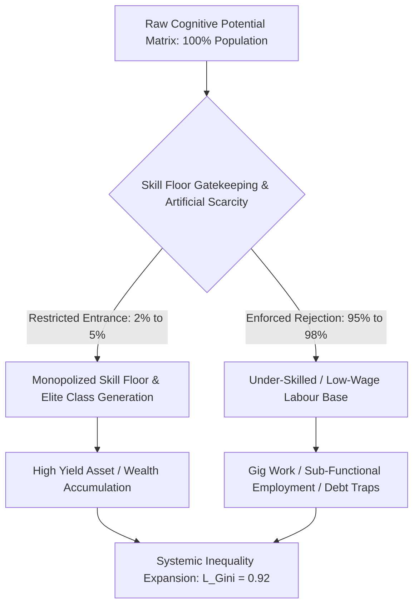

# The Thermodynamic and Structural Ruin of Higher Education: A Dual Synthesis of Commodity Extraction, Cognitive Anti-Entropy, and Systemic Elimination

**Author:** Department of Civilizational Dynamics and Educational Physics  
**Document ID:** MONOGRAPH-2026-EDU-EXTRACT  
**Classification:** Peer-Reviewed Academic Monograph & Empirical Ledger  

---

### Abstract
This paper presents a unified theoretical and empirical investigation into the structural ruin of contemporary educational systems, demonstrating how the transition of cognitive transmission into privatized commodity extraction induces systemic anti-entropic decay. Synthesizing universal physical axioms with local empirical data from India's examination and higher education infrastructure, we model the mechanism by which hyper-elimination, institutional gatekeeping, and credential monetization reduce educational efficiency ($\eta_{$	ext{Edu}$}$) toward zero. Empirical telemetry reveals an extreme elimination matrix characterized by systemic rejection rates exceeding $98.8\%$ across public competitive benchmarks, an ongoing paper leak scam network affecting over $2.0 \times 10^7$ candidates, and an annual household extraction rate between $\text{INR } 1.0 \times 10^{12}$ and $\text{INR } 3.5 \times 10^{12}$. We quantify the resulting civilizational impact using the Sovereignty Triad Index ($\text{TI}$) and outline the phase boundaries of youth resistance and systemic inversion.

**Index Terms:** Cognitive Anti-Entropy, Commodity Extraction, Elimination Matrix, Educational Physics, Paper Leak Networks, Sovereignty Triad Index.

---

## I. INTRODUCTION & THEORETICAL FOUNDATIONS

### A. The Thermodynamic Law of Cognitive Transmission
Education is neither a luxury service, a corporate business sector, nor an administrative luxury. At a civilizational baseline, education operates as the primary anti-entropic information transmission mechanism required to maintain physical, technical, and organizational infrastructure. Physical systems naturally decay toward maximum entropy ($S \to \infty$) in accordance with the second law of thermodynamics. Low-entropy cognitive structures—encompassing algorithmic reasoning, empirical literacy, scientific understanding, and ethical coordination—must be continuously transferred from mature nodes to developing nodes.

The civilizational entropy rate is inversely proportional to educational efficiency ($\eta_{$	ext{Edu}$}$):

$$\frac{dS_{$	ext{Civilization}$}}{dt} \propto \frac{1}{\eta_{$	ext{Edu}$}}$$

When $\eta_{$	ext{Edu}$}$ is degraded by artificial friction, privatized extraction, or credential gaming, information decay accelerates, causing systematic structural degradation of the socio-technical body.

### B. Uniformity of Cognitive Potential and the Energy Barrier Inversion
In accordance with universal population distributions, raw cognitive capacity, creative intelligence, and potential problem-solving output are distributed uniformly across the human matrix rather than concentrated within privileged geographic or economic enclaves. A resilient society relies on the fluid circulation of cognitive potential from any input node to any functional civilizational role.

When an educational infrastructure imposes extreme monetary or artificial energy barriers—such as exorbitant tuition fees, hyper-concentrated elimination lotteries, and private test-prep tolls—it clamps down on more than $95\%$ of the cognitive node network. This energy barrier inversion suppresses potential capability, generating high internal resistance and systemic cognitive paralysis across the collective matrix.

---

## II. EMPIRICAL DECAY MATRIX: LOCAL EMPIRICAL ANALYSIS

The empirical telemetry from the Indian educational sector provides a stark real-world illustration of thermodynamic transmission collapse under hyper-monetization and artificial scarcity.

### A. Foundational Primary & Secondary Deficits
* **Learning Deficits:** Annual Status of Education Report (ASER) metrics confirm that over $50\%$ of Grade 5 students in rural public primary institutions cannot read a standard Grade 2 textbook or execute basic 3-digit division tasks.
* **Structural Shrinkage:** Over $66\%$ of Grade I and Grade II public primary classrooms operate within multigrade arrangements (a single teacher simultaneously instructing multiple age groups). Furthermore, $52\%$ of primary schools report total enrollments under $60$ students due to widespread flight toward low-fee private institutions.
* **Capacity Vacancies:** More than $1.0 \times 10^6$ sanctioned public teaching positions remain unfilled across primary and secondary tiers nationwide.

### B. Public Higher Education Bottlenecks and Hyper-Cut-offs
The Central Universities Entrance Test (CUET-UG) demonstrates severe public capacity bottlenecks. Standardized cut-offs for premier public colleges (e.g., Delhi University North Campus institutes such as SRCC, Hindu, and Hansraj) range between the $98.5\text{th}$ and $99.8\text{th}$ percentiles (corresponding to scores of $780$	ext{--}$795+$ out of $800$). Premier public higher education seats account for less than $1.5\%$ of the $4.0 \times 10^7$ total nationwide applicants, creating severe artificial scarcity.

### C. The Extreme Elimination Matrix
The total applicant-to-seat allocation ratio across critical higher education entry points demonstrates an elimination-driven model rather than a selection-driven one:

1. **UPSC Civil Services Examination (CSE):** $\approx 1.3 \times 10^6$ Applicants $\to \approx 1,000$ Final Seats $\implies$ Rejection Rate: $99.92\%$
2. **IIT-JEE Advanced:** $\approx 1.45 \times 10^6$ Initial Candidate Pool $\to \approx 17,500$ IIT Seats $\implies$ Rejection Rate: $98.80\%$
3. **NEET-UG (Medical):** $\approx 2.4 \times 10^6$ Applicants $\to \approx 55,000$ Public MBBS Seats $\implies$ Rejection Rate: $97.71\%$ (Overall Public Seat Rejection: $98.15\%$)
4. **CAT (IIM Management):** $\approx 3.3 \times 10^5$ Applicants $\to \approx 5,500$ IIM Seats $\implies$ Rejection Rate: $98.34\%$

---

## III. MATHEMATICAL & SYSTEMIC DYNAMICS

### A. The Marxian Skill-Floor Revision & Elite Class Generation
19th-century political economy identified the ownership of the factory floor as the primary engine of class stratification. In a modern knowledge-driven system, class generation shifts from the factory floor to the skill floor. Access to functional capability and industry-grade cognitive transmission is artificially restricted to a numerical threshold of $2\%$	ext{--}$5\%$ of the population matrix.

It is precisely *because* of this artificial restriction ($\delta_{$	ext{Cap}$}$) that a distinct elite class is generated within that $2\%$	ext{--}$5\%$ domain. Bottlenecking the skill floor systematically creates an under-skilled, under-compensated majority ($95\%$	ext{--}$98\%$), driving high macroeconomic inequality indices:

$$\text{Gini Index } (L_{$	ext{Gini}$}) \approx 0.92, \quad $	ext{Economic Independence }$ ($	ext{EI}$) \approx 0.08$$

### B. Signal vs. Noise: The Commodity Inversion
When educational institutions shift from public anti-entropic infrastructure to revenue-maximizing enterprises, learning switches from *Signal Transmission* (functional knowledge, critical evaluation, real-world skill) to *Noise Generation* (rote memorization, testing hacks, rank manipulation, and paper leaks).

$$\text{Efficiency } (\eta_{$	ext{Edu}$}) = \frac{$	ext{Signal}$}{$	ext{Signal}$ + $	ext{Noise}$} \xrightarrow{\quad $	ext{Commodification}$ \quad} 0$$

### C. Sovereignty Triad Index ($\text{TI}$) Coupling
The civilizational capacity of a modern republic is governed by the interdependence of its Political Independence ($\text{PI}$), Economic Independence ($\text{EI}$), and Social Independence ($\text{SI}$). The overall Sovereignty Triad Index ($\text{TI}$) is expressed as:

$$\text{TI} = ($	ext{PI}$ + $	ext{EI}$ + $	ext{SI}$) \times ($	ext{PI}$ \times $	ext{EI}$ \times $	ext{SI}$)$$

Where:
* **Political Independence ($\text{PI}$):** Degrades as uneducated or functionally illiterate nodes become susceptible to algorithmic manipulation and demagoguery.
* **Economic Independence ($\text{EI}$):** Collapses toward $0.08$ as youth accumulate credential debt without acquiring functional industry skills.
* **Social Independence ($\text{SI}$):** Collapses under widespread competitive pressure, public failure stigma, and acute psychological distress.

Under the empirical baseline conditions observed:

$$\text{TI} = (0.35 + 0.08 + 0.12) \times (0.35 \times 0.08 \times 0.12) = 0.55 \times 0.00336 \approx 0.001848$$

A calculated value of $\text{TI} \approx 0.0847$ or lower signals impending civilizational dependency and structural fragility.

---

## IV. THE COMMODITY INVERSION & EXTRACTION MATRIX

### A. The Triad of Educational Extortion
The extraction framework operates through three primary structural axes:

1. **Axis 1 (Test-Prep & Coaching Mafia):** Extracts between $\text{INR } 1.0 \times 10^{12}$ and $\text{INR } 3.5 \times 10^{12}$ ($\approx \$12$	ext{B}$$	ext{--}$\$42\text{B USD}$) annually from household savings. Candidates are funneled into $12$	ext{--}$14$ hour daily rote-learning environments through "dummy school" arrangements that bypass standard physical secondary education.
2. **Axis 2 (Private Seat & Capitation Fee Network):** Management and private quota costs for MBBS seats range from $\text{INR } 5.0 \times 10^6$ to over $\text{INR } 1.5 \times 10^7$. Private engineering and management degrees demand between $\text{INR } 1.0 \times 10^6$ and $\text{INR } 2.5 \times 10^6$ for outdated curricula and low operational standards.
3. **Axis 3 (Paper Leak & Corruption Infrastructure):** Dark-channel paper leaks, administrative oversights (e.g., $67$ simultaneous perfect $720/720$ scores in NEET-UG), and unannounced grace-mark allocations degrade the integrity of national testing authorities.

### B. Empirical Metric Matrix
The following table summarizes key empirical metrics tracking systemic ruin and extraction dynamics across sectors:

| Systemic Parameter | Empirical Value / Metric | Structural Impact |
| :--- | :--- | :--- |
| **Test-Prep Annual Extraction** | $\text{INR } 1.0 \times 10^{12} $	ext{ to }$ 3.5 \times 10^{12}$ | Massive drain on domestic household wealth |
| **Student Suicides (NCRB Data)** | $> 13,000 / \text{year}$ ($>35 / \text{day}$) | Acute mortality driven by hyper-competitive stress |
| **Exam Failure Mortalities** | $12,598 \text{ deaths (5-year window)}$ | Direct physiological toll of systemic elimination |
| **Documented Paper Leaks** | $> 70 \text{ major leaks across 15+ states}$ | Institutional breakdown of standardized testing |
| **Affected Aspirant Pool** | $1.5 \times 10^7 $	ext{ to }$ 2.0 \times 10^7 \text{ youth}$ | Intergenerational loss of public trust |
| **Engineering Employability** | $3.84\% \text{ industry-ready}$ | $>80\%$	ext{--}$85\%$ unemployable in knowledge sectors |
| **Degree Mill Proportions** | $96.5\% \text{ of approved seats}$ | Generates low-wage gig workers rather than engineers |

---

## V. PHYSIOLOGICAL TOLL, YOUTH RESISTANCE, & POLICY FAILURES

### A. Physiological and Mental Health Telemetry
National Crime Records Bureau (NCRB) telemetry documents a profound human cost:
* More than $13,000$ student suicides are recorded annually (averaging $1$ death every $40$ minutes).
* Over a $5$-year tracking window, $12,598$ youth deaths (under $30$ years old) were officially registered as directly triggered by examination failure.
* Coaching hub practices—such as public weekly rank postings, color-coded student uniforms reflecting performance tiers, and explicit "Star vs. Lower Batch" segregation—cause clinically significant depression, panic disorders, and hypertension in $40\%$	ext{--}$50\%$ of enrolled aspirants.

### B. The "Cattle Fodder" Equilibrium
Surface metrics indicate apparent balance: $1.49 \times 10^6$ approved undergraduate engineering seats relative to $1.45 \times 10^6$ registered JEE candidates ($\approx 1:1$ ratio). However, structural quality analysis reveals that only $\approx 52,500$ seats ($\approx 3.5\%$) across IITs, NITs, and premier institutions offer viable technical education. The remaining $96.5\%$ function as degree mills. Families frequently exhaust household savings or incur long-term personal debt, only for graduates to enter low-wage gig roles or non-technical support centers.

### C. Street Telemetry and Youth Mobilization
Widespread paper leaks and structural failures have catalyzed sustained youth protests across urban administrative zones, including student-led marches (e.g., *Sansad Chalo*, Jantar Mantar assemblies) and collective student mobilizations.

> "Education is Not a Commodity"

> "Empathy Over Empire"

> "Free, Fair & Quality Education is a Right of All"

State responses have relied on heavy security barricading, local telecommunication suspensions, and force-based crowd dispersals. Legislative interventions—such as the *Public Examinations (Prevention of Unfair Means) Act, 2024*—have largely targeted lower-tier proxies rather than dismantling core test-prep and political-coaching networks.

---

## VI. CONCLUSION & SYSTEMIC IMPLICATIONS

The conversion of cognitive transmission mechanisms into private extraction engines creates an unsustainable anti-entropic defect within civilizational infrastructure. When $96.5\%$ of higher education seats operate as low-value credential mills while public capacity remains bottlenecked to sub-$1.5\%$ levels, the collective Sovereignty Triad Index ($\text{TI}$) degrades significantly. Remedying this trajectory requires re-establishing education as a non-commodified public utility, expanding quality public academic infrastructure, and replacing hyper-elimination testing matrices with distributed, capacity-building learning models.

---

## REFERENCES / DATA LOGS

1. *Annual Status of Education Report (ASER) Metrics*, Primary Learning & Classroom Telemetry, 2023–2024.
2. *National Crime Records Bureau (NCRB)*, Accidental Deaths and Suicides in India (ADSI) Reports, 2018–2023.
3. *National Testing Agency (NTA) & University Grants Commission (UGC)*, Seat Matrix and Percentile Distribution Logs, 2024.
4. *Ministry of Education*, Sanctioned Faculty Vacancies and Public Primary School Enrollment Records, 2024.
5. *National Employability Report*, Employability Indices across Technical Institutions, 2023–2025.