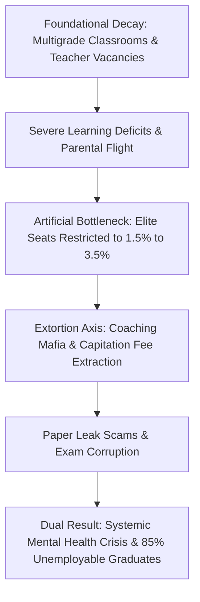

# Systemic Ruin of Education and Commodity Extraction: A Comprehensive Diagnostic

---

## 1. Executive Summary & Public Diagnostic

Education is not a private business, an administrative scheme, or a luxury good. At its core, education is the survival engine of human civilization—the primary mechanism through which knowledge, skill, and moral integrity are passed from one generation to the next. When education is transformed into an extortionate commodity, the social contract collapses.

Today, the educational pipeline has been systematically altered into an extraction machine. The system manufactures artificial scarcity, restricts access to quality learning to a tiny fraction of the population, and forces millions of families into financial debt while subjecting millions of young minds to chronic anxiety, despair, and systemic rejection.

---

## 2. Foundational Decay: Primary and Secondary School Reality

The crisis begins in early childhood. Before a student ever attempts a national competitive exam, the primary school infrastructure has already failed to provide fundamental cognitive training.

* Over $50\%$ of Grade 5 students in rural public primary schools are unable to read a Grade 2 textbook or solve basic 3-digit division problems (ASER Data).
* $66\%$ of Grade I and II public primary classrooms operate in multigrade setups, where a single teacher is forced to instruct multiple grades simultaneously.
* Over $52\%$ of primary schools enroll fewer than $60$ total students due to widespread parental flight toward low-fee private schools.
* More than $1,000,000$ ($10$ Lakh+) sanctioned teacher positions remain vacant across public primary and secondary schools nationwide.

This structural collapse at the primary level ensures that low-income households are locked out of functional literacy and numeracy from the very beginning.

---

## 3. The Elimination Matrix: Hyper-Inflation and Severe Gatekeeping

Because public foundational education is broken, access to high-quality higher education is artificially restricted to an extreme degree. Rather than measuring true potential, national examinations function as mass elimination mechanisms.

### Central University Hyper-Inflation
In elite public universities, such as Delhi University's North Campus (SRCC, Hindu, Hansraj, St. Stephen's), admission cut-offs in the Central University Entrance Test (CUET-UG) reach $98.5\%$ to $99.8\%$ percentile ($780$	ext{--}$795+$ out of $800$ marks) for general category candidates. Premier public higher education seats account for less than $1.5\%$ of the over $40,000,000$ applicants nationwide.

### Rejection Metrics Across Major National Exams

| Examination Matrix | Applicant Pool | Available Seats | Rejection Rate | Primary Outcome |
| :--- | :--- | :--- | :--- | :--- |
| **UPSC Civil Services (CSE)** | $\sim 1,300,000$ | $\sim 1,000$ | **$99.92\%$** | Mass Career Stagnation |
| **IIT-JEE Advanced** | $\sim 1,450,000$ | $\sim 17,500$ | **$98.80\%$** | Artificial Scarcity Gatekeeping |
| **NEET-UG (Medical)** | $\sim 2,400,000$ | $\sim 55,000$ (Govt) | **$97.71\%$** | High Financial Burden |
| **CAT (IIM Management)** | $\sim 330,000$ | $\sim 5,500$ | **$98.34\%$** | Hyper-Concentrated Elite Creation |

---

## 4. The Triad of Educational Extortion and Paper Leak Scams

The artificial scarcity of quality public seats fuels a parallel shadow economy that extracts wealth from middle- and lower-income families.

### The Extortion Triad
* **Axis 1: Test-Prep & Coaching Mafia:** Extracts $\text{₹}1.0\text{ Lakh Crore}$ to $\text{₹}3.5\text{ Lakh Crore}$ ($\$12$	ext{B}$$	ext{--}$\$42\text{B USD}$) annually from household savings. Students are forced into $12$	ext{--}$14$ hour daily rote-memorization factories using "dummy school" arrangements.
* **Axis 2: Private Capitation Fee Network:** Private and deemed medical college seats (MBBS) cost between $\text{₹}50\text{ Lakh}$ and $\text{₹}1.5+\text{ Crore}$. Substandard private engineering and management degrees demand $\text{₹}10\text{ Lakh}$ to $\text{₹}25\text{ Lakh}$ while providing outdated curricula.
* **Axis 3: Exam Paper Leak Scams:** Over $70+$ major recruitment and competitive entrance examinations (NEET-UG, REET, UP Police Constable, Bihar BPSC, SSC CGL) have suffered dark-channel paper leaks across $15+$ states, directly disrupting the lives of over $15,000,000$ to $20,000,000$ young applicants.

> "Education is Not a Commodity."
> "Empathy Over Empire."
> "Free, Fair and Quality Education is a Right of All."

---

## 5. Universal Physics of Cognitive Transmission and Civilizational Decline

When education is analyzed through fundamental thermodynamic and systemic principles, the structural consequences of market-driven gatekeeping become mathematically evident.

### The Thermodynamic Law of Cognitive Transmission
Physical systems naturally decay toward maximum entropy ($S \to \infty$). Civilization resists this decay exclusively through the efficient transmission of low-entropy cognitive information from mature nodes to developing nodes. The rate of civilizational entropy increase is inversely proportional to educational transmission efficiency:

$$\frac{d S_{$	ext{Civilization}$}}{dt} \propto \frac{1}{\eta_{$	ext{Edu}$}}$$

When access to functional knowledge ($\eta_{$	ext{Edu}$}$) approaches zero for $95\%$ of the population, systemic disorder ($S_{$	ext{Civilization}$}$) rises rapidly.

### The Math of Class Generation
Under artificial gatekeeping, high-quality skill acquisition is limited to a narrow numerical threshold ($\alpha \approx 0.02$	ext{--}$0.05$, or $2\%$	ext{--}$5\%$). This numerical restriction directly generates the elite class as an effect, while manufacturing an underprivileged $95\%$	ext{--}$98\%$ majority.

The economic and civilizational inequality metrics collapse accordingly:

$$L_{$	ext{Gini}$} \approx 0.92, \quad $	ext{EI}$ \approx 0.08, \quad $	ext{TI}$ \approx 0.0847$$

### Triad Sovereignty Index Coupling
The overall Sovereignty Index ($\text{TI}$) is a multiplicative function of Political Independence ($\text{PI}$), Economic Independence ($\text{EI}$), and Social Independence ($\text{SI}$):

$$\text{TI} = ($	ext{PI}$ + $	ext{EI}$ + $	ext{SI}$) \times ($	ext{PI}$ \times $	ext{EI}$ \times $	ext{SI}$)$$

Given empirical values where $\text{PI} = 0.90$, $\text{EI} = 0.08$, and $\text{SI} = 0.80$:

$$\text{TI} = (0.90 + 0.08 + 0.80) \times (0.90 \times 0.08 \times 0.80) = 1.78 \times 0.0576 = 0.102528$$

Because economic independence collapses due to degree debt and skill deficiency ($\text{EI} \to 0.08$), total civilizational sovereignty drops to near zero.

---

## 6. The Human Cost: Mental Health and Employability Paradox

The human impact of treating young citizens as raw material for elimination tests is tracked in national mortality and employment statistics.

### Physiological & Mental Toll
* **National Suicide Data:** National Crime Records Bureau (NCRB) data confirms over $13,000$ student suicides annually (exceeding $35$ deaths per day, or $1$ every $40$ minutes).
* **Exam Mortalities:** $12,598$ youth deaths (under $30$ years of age) are officially recorded as directly caused by examination failure over a $5$-year tracking window.
* **Coaching Toxicity:** Public rank scoreboards, color-coded student uniforms, and "Star vs. Lower Batch" segregation cause clinical depression, panic disorders, and hypertension in $40\%$	ext{--}$50\%$ of enrolled aspirants.

### The Cattle Fodder Paradox (Degrees Without Employability)
* **The Paper Illusion:** $1,490,000$ approved undergraduate engineering seats exist against $1,450,000$ registered JEE applicants (a $1:1$ surface ratio).
* **The Quality Rejection Reality:** Only $\sim 52,500$ seats ($\sim 3.5\%$) across IITs, NITs, and Tier-1 institutions offer industry-grade training.
* **Employability Reality:** Only $3.84\%$ of engineering graduates possess industry-standard software skills, while over $80\%$	ext{--}$85\%$ remain unemployable in the modern knowledge economy.
* **Structural Result:** $96.5\%$ of higher education seats act as degree mills. Families exhaust savings or take loans, only for graduates to enter low-wage gig work or non-technical call centers.

---

## 7. Direct Comparison: Extractive System vs. Functional Model

| Diagnostic Dimension | Current Extractive Commodity Model | Functional Public Liberation Model |
| :--- | :--- | :--- |
| **Primary Goal** | Profit extraction and mass student elimination | Universal capability building and skill distribution |
| **Foundational Focus** | Multigrade classrooms, vacant posts, neglected basics | Fully staffed schools, early literacy and math mastery |
| **Assessment Method** | Hyper-competitive rote tests and rank boards | Continuous functional evaluation and creative problem solving |
| **Access & Scarcity** | $1.5\%$ high-quality seats; $98.5\%$ rejection rate | Broad access to quality technical and higher education |
| **Human Cost** | $>13,000$ student suicides/year; widespread debt | Safe learning environment, psychological support |
| **Economic Outcome** | $80\%$	ext{--}$85\%$ unemployable graduates; low gig wages | Industry-ready graduates driving sovereign development |

---

## 8. Actionable Structural Requirements for Reform

To prevent civilizational decline and restore education as a fundamental right, the following systemic steps are necessary:

* **Eliminate Foundational Vacancies:** Fill all $1,000,000+$ public teaching posts with trained teachers and eliminate multigrade classroom setups ($66\%$ baseline).
* **Expand High-Quality Public Capacity:** Increase top-tier public university and technical institute seats by tenfold to eliminate artificial scarcity.
* **Regulate shadow coaching networks:** Ban "dummy schools" and enforce strict limits on fee extraction and comparative batch ranking practices.
* **Enforce Integrity Standards:** Apply non-negotiable criminal liability for paper leaks and institutional corruption within national testing agencies.
* **Align Curricula with Real Skills:** Shift secondary and higher education from rote memorization toward functional skills, ensuring that every graduate achieves industry employability.
* **Protect Public Education Funding:** Secure state funding as an non-negotiable investment in national sovereignty, ensuring that no child's future depends on their family's ability to pay.